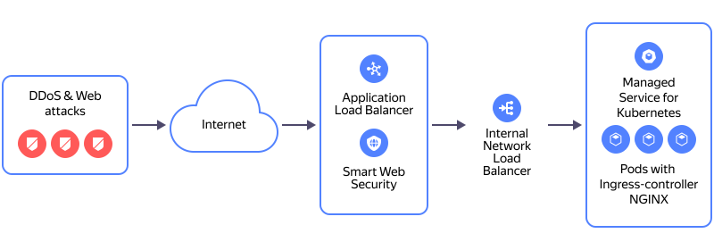

# Migrating services from an external NLB to L7 ALB with an internal NLB as a target

[{{ network-load-balancer-full-name }}](../../network-load-balancer/) can distribute traffic across your load balancer pods deployed in a [{{ managed-k8s-full-name }}](../../managed-kubernetes/) cluster. If [{{ alb-full-name }}](../../application-load-balancer/) does not support your load balancer configuration, you can add an [internal network load balancer](../../network-load-balancer/concepts/nlb-types.md) for distributing traffic to your load balancer pods and associate the internal network load balancer as a target for the L7 {{ alb-name }} with a [{{ sws-full-name }}](../../smartwebsecurity/) security profile.

In this tutorial, we describe the scenario where you create an internal network load balancer to distribute traffic across the [NGINX Ingress controller](../../managed-kubernetes/operations/applications/ingress-nginx.md) pods deployed in a {{ managed-k8s-name }} cluster and specify the internal network load balancer’s IP address in the L7 load balancer target group.

Operating diagram of an L7 load balancer with the {{ sws-name }} security profile:

You can create a service migration infrastructure using the following tools:
