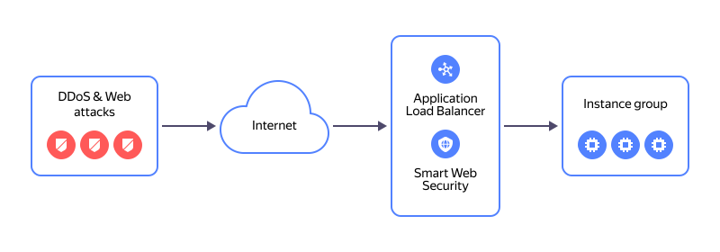

# Migrating services from an NLB with an instance group as a target to L7 ALB

In this tutorial, you will learn how to integrate a [{{ network-load-balancer-full-name }}](../../network-load-balancer/) with an instance group. This instance group tracks the number of VMs in the group and changes the composition of the load balancer's target group as needed. An instance group can be integrated with only one of the load balancers: either a network load balancer or an L7 [{{ alb-full-name }}](../../application-load-balancer/). Therefore, when migrating, you need to update the instance group to use the L7 load balancer's target group rather than the network load balancer's one.

Here is how an L7 load balancer with a [{{ sws-full-name }}](../../smartwebsecurity/) profile works:

You can create a service migration infrastructure using the following tools:
