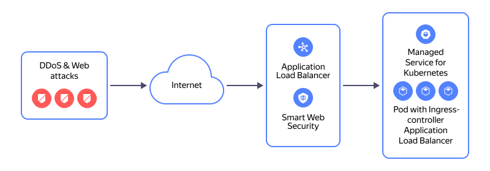

# Migrating services from an NLB with a {{ managed-k8s-full-name }} cluster as a target to an L7 ALB

You [can use](../../network-load-balancer/concepts/scenarios.md#nlb-mk8s) a [{{ network-load-balancer-full-name }}](../../network-load-balancer/) as part of services within a [{{ managed-k8s-full-name }}](../../managed-kubernetes/) cluster. The cluster itself creates network load balancer objects according to the manifests provided and monitors the load balancer's target group consisting of the VMs from that cluster's node groups.

One of the options for a network load balancer in a {{ managed-k8s-name }} cluster is to use it as part of an [NGINX Ingress controller](../../managed-kubernetes/operations/applications/ingress-nginx.md).

This tutorial covers the migration from a network load balancer to an L7 [{{ alb-full-name }}](../../application-load-balancer/) created by an [{{ alb-name }} Ingress controller](../../application-load-balancer/tools/k8s-ingress-controller/index.md), with a [{{ sws-full-name }}](../../smartwebsecurity/) security profile enabled.

Operating diagram of an L7 load balancer with the {{ sws-name }} security profile:

You can create a service migration infrastructure using the following tools:
