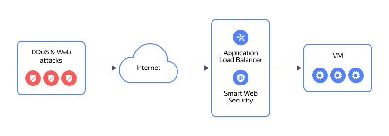

# Migrating services from an NLB with VMs as targets to L7 ALB

In this tutorial, a [{{ network-load-balancer-full-name }}](../../network-load-balancer/) will distribute inbound traffic across the VMs in its target groups.

Here is how an L7 [{{ alb-full-name }}](../../application-load-balancer/) with a [{{ sws-full-name }}](../../smartwebsecurity/) profile works:

You can create a service migration infrastructure using the following tools:
