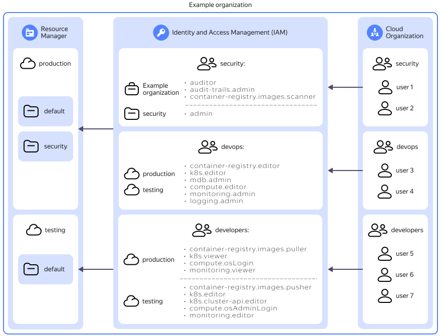

# Access control for user groups with different roles in {{ org-full-name }}

This guide describes an example solution of working with [user groups](../../organization/concepts/groups.md) to [control access](../../iam/concepts/access-control/index.md) to resources in a [{{ org-full-name }} organization](../../overview/roles-and-resources.md).

## Solution overview {#solution-overview}

In this tutorial, you will create a test organization with two [clouds](../../resource-manager/concepts/resources-hierarchy.md#cloud), `production` and `testing`, together with the respective development environments. Three user groups created in the organization will use these clouds: a group of information security engineers (`security`), a group of DevOps engineers (`devops`), and a group of developers (`developers`).

To each user group, you will assign its own set of [roles](../../iam/concepts/access-control/roles.md) based on the tasks users in these groups perform. For example, information security engineers will have permissions to get information about all resources, set up collection and storage of any resource [audit logs](../../audit-trails/concepts/trail.md), and configure and scan [Docker images](../../container-registry/concepts/docker-image.md) in [registries](../../container-registry/concepts/registry.md) created in {{ container-registry-full-name }}. These permissions will apply to the entire organization. 

Additionally, in the production environment, you will create a separate `security` [folder](../../resource-manager/concepts/resources-hierarchy.md#folder) for the group of information security engineers. They will have administrator privileges in this folder to manage any of its resources and control access to them.

The group of DevOps engineers will have permissions to manage registries from {{ container-registry-name }}, {{ managed-k8s-full-name }} [clusters](../../managed-kubernetes/concepts/index.md#kubernetes-cluster), managed database clusters, [VMs](../../compute/concepts/vm.md), and [{{ monitoring-full-name }}](../../monitoring/index.yaml) resources. They will also be able to manage {{ cloud-logging-full-name }} [log groups](../../logging/concepts/log-group.md) and access to them.

The group of developers will get the following access permissions:
* In the production environment, to download Docker images from registries in {{ container-registry-name }}, view information about {{ k8s }} clusters, connect to {{ compute-name }} VMs via [{{ oslogin }}](../../organization/concepts/os-login.md), and view information about {{ monitoring-name }} resources and [metrics](../../monitoring/concepts/data-model.md#metric).
* In the testing environment, to download and upload Docker images to registries in {{ container-registry-name }}, manage {{ k8s }} clusters, connect to {{ compute-name }} VMs via [{{ oslogin }}](../../organization/concepts/os-login.md) as superusers, and manage {{ monitoring-name }} resources. 

To configure access control for organization's resources with the help of user groups:

1. [Prepare {{ yandex-cloud }}](#before-begin).
1. [Create an organization](#create-organization).
1. [Create clouds](#create-clouds).
1. [Create a folder for the group of information security engineers](#create-folder).
1. [Create user groups](#create-user-groups).
1. [Configure access permissions](#setup-access-permissions).
1. [Add users and split them into groups](#add-users).
1. [Create a production infrastructure](#move-on).

If you no longer need the test organization you created, [delete](#clear-out) it.

## Prepare {{ yandex-cloud }} {#before-begin}

Sign up for {{ yandex-cloud }} and create a [billing account](../../billing/concepts/billing-account.md):

1. Go to the [management console]({{ link-console-main }}) and log in to {{ yandex-cloud }} or create a new account.
1. On the [**{{ ui-key.yacloud_billing.billing.label_service }}**]({{ link-console-billing }}) page, make sure you have a billing account linked and its [status](../../billing/concepts/billing-account-statuses.md) is `ACTIVE` or `TRIAL_ACTIVE`. If you do not have a billing account yet, [create one](../../billing/quickstart/index.md).

## Create an organization {#create-organization}

[_Organization_](../../overview/roles-and-resources.md) is a workspace that combines different types of {{ yandex-cloud }} resources and users. Any Yandex user can create an organization in {{ org-full-name }}.

To create an organization, follow these steps:

1. [Go]({{ link-org-cloud-center }}) to {{ org-full-name }}.

    Your next steps will depend on whether you are a member of an exsiting {{ org-full-name }}.
1. Create an organization:

    

    - If you are not a member of any organization

      If you are currently not a member of any {{ org-full-name }}, when you open the link, you will see a form for creating a new organization:

      1. Enter your organization name, e.g., `Example organization`.
      1. Click **{{ ui-key.yacloud_components.organization.action.create }}**.

    - If you are a member of an organization

      If you are currently a member of a {{ org-full-name }}, when you open the link, you will see the [{{ org-full-name }}]({{ link-org-cloud-center }}) interface in {{ cloud-center }}.

      To complete this guide, let’s create a new organization so as not to interfere with the existing organizations’ infrastructure:

      1. In the top-left corner, next to the current organization name, click  and select  **{{ ui-key.yacloud_components.organization.action.create-organization }}**.
      1. In the window that opens, enter a name for the organization: `Example organization`.
      1. Click **{{ ui-key.yacloud_components.organization.action.create }}**.

    

Once the organization is created, you become its [owner](../../organization/security/index.md#organization-manager-organizations-owner) and can manage its settings.

## Create clouds {#create-clouds}

In your new organization, create two [clouds](../../resource-manager/concepts/resources-hierarchy.md#cloud), `testing` and `production`, to host the infrastructure of the independent testing and production environments.

1. Create two clouds in your `Example organization`:

    

    - Management console {#console}

      1. Go to the [management console]({{ link-console-main }}) and click your account picture in the left-hand panel.
      1. Select `Example organization`. This opens a window with the form for creating your first cloud:

          1. Make sure you selected `Example organization` in the **{{ ui-key.yacloud.page.welcome.field_organization }}** field.
          1. In the **{{ ui-key.yacloud.page.welcome.field_cloud-name }}** field, specify `testing`.
          1. Click **{{ ui-key.yacloud.page.welcome.button_create }}**.

          As a result, `Example organization` will have its first cloud named `testing`, and the browser will open the `default` folder created in this new cloud.
      1. On the left side of the screen, in the line with `Example organization`, click  and select  **{{ ui-key.yacloud.iam.cloud.label_create_cloud }}**. In the window that opens:

          1. In the **{{ ui-key.yacloud.common.name }}** field, specify `production`.
          1. Click **{{ ui-key.yacloud.common.create }}**.

          This will create the second cloud named `production` in your `Example organization`.

    

1. Make sure the clouds are linked to a [billing account](../../billing/concepts/billing-account.md):

    

    - {{ cloud-center }} interface {#cloud-center}

      1. 
      1. Select your billing account.
      1. Make sure you can see both clouds, `production` and `testing`, under **{{ ui-key.yacloud_billing.billing.account.dashboard-resources.title_section-billable }}** on the account information page.
      1. If either of the clouds is missing, link them:

          1. Under **{{ ui-key.yacloud_billing.billing.account.dashboard-resources.title_section-billable }}**, click  **{{ ui-key.yacloud_billing.billing.account.dashboard-resources.button_bind-cloud }}**.
          1. In the window that opens, select the cloud to link and click **{{ ui-key.yacloud_billing.billing.accounts.button_bind }}**.

    

## Create a folder for the group of information security engineers {#create-folder}

Create a separate folder named `security` for the group of information security engineers in the `production` cloud.



- Management console {#console}

  1. In the [management console]({{ link-console-main }}), select the `production` cloud from the list of organizations, clouds, and folders on the left of the screen.
  1. In the line with the `production` cloud name, click  and select  **{{ ui-key.yacloud.component.console-dashboard.button_action-create-folder }}**. In the window that opens:

      1. In the **{{ ui-key.yacloud.iam.cloud.folders-create.field_name }}** field, enter the folder name, `security`.
      1. (Optional) In the **{{ ui-key.yacloud_org.iam.cloud.folders-create.field_description }}** field, enter a description for the created folder.
      1. In the **{{ ui-key.yacloud.iam.cloud.folders-create.field_optionally }}** field, disable the **{{ ui-key.yacloud.iam.cloud.folders-create.field_default-net }}** option. You will be able to create a [cloud network](../../vpc/operations/network-create.md) with the parameters you need later, at any point when creating the infrastructure.
      1. Click **{{ ui-key.yacloud_org.iam.cloud.folders-create.button_create }}**. 



## Create user groups {#create-user-groups}

Create three [user groups](../../organization/concepts/groups.md): `security` for information security engineers, `devops` for DevOps engineers, and `developers` for developers.



- {{ cloud-center }} interface {#cloud-center}

  1. Log in to [{{ org-full-name }}]({{ link-org-cloud-center }}).
  1. In the left-hand panel, select  **{{ ui-key.yacloud_org.pages.groups }}**.
  1. In the top-right corner, click  **{{ ui-key.yacloud_org.entity.group.action_create }}** and in the window that opens:

      1. Enter a name for the group: `security`.
      1. (Optional) Enter the group description.
      1. Click **{{ ui-key.yacloud_org.groups.action_create-group }}**.
  1. Similarly, create the other two user groups, `devops` and `developers`.



## Configure access permissions {#setup-access-permissions}

In this tutorial, you will assign multiple [roles](../../iam/concepts/access-control/roles.md) to the user groups based on the activity profiles of the employees in these groups.



All users in a user group will automatically [inherit](../../resource-manager/concepts/resources-hierarchy.md#access-rights-inheritance) the roles assigned to the group. Moreover, you can assign roles to each user individually, even if they belong to a user group.



### Assign roles to the group of information security engineers {#assign-security-roles}

Users from the group of information security engineers (`security`) will need permissions to do the following:

* Get information about all resources in all organization clouds (`auditor` [role](../../iam/roles-reference.md#auditor) for the organization).
* Configue collection and storage of [audit logs](../../audit-trails/concepts/trail.md) for all resources in all the organization’s clouds (`audit-trails.admin` [role](../../audit-trails/security/index.md#at-admin) for the organization).
* Configure and scan [Docker images](../../container-registry/concepts/docker-image.md) in the {{ container-registry-full-name }} [registries](../../container-registry/concepts/registry.md) of all the organization’s clouds (`container-registry.images.scanner` [role](../../container-registry/security/index.md#container-registry-images-scanner) for the organization).
* Manage all resources and access to them in the dedicated `security` folder of the `production` cloud (`admin` [role](../../iam/roles-reference.md#admin) for the folder).

To grant the required access permissions to the `security` user group:

1. Assign roles for an organization:

    

    - {{ cloud-center }} interface {#cloud-center}

      1. Log in to [{{ org-full-name }}]({{ link-org-cloud-center }}) using an administrator or organization owner account.
      1. In the left-hand panel, select  **{{ ui-key.yacloud_org.pages.acl }}**.
      1. At the top right, click **{{ ui-key.yacloud_org.entity.user.action.acl }}**.
      1. Go to the **{{ ui-key.yacloud_org.pages.groups }}** tab and select the `security` [group](../../organization/concepts/groups.md).
      1. Click  **{{ ui-key.yacloud_components.acl.action.add-role }}**, enter and select the `auditor` [role](../../iam/concepts/access-control/roles.md) in the search bar.
      1. Repeat the previous step to add the `audit-trails.admin` and `container-registry.images.scanner` roles.
      1. Click **{{ ui-key.yacloud.common.save }}**.

    

1. Assign the `admin` role for the `security` folder:

    

    - Management console {#console}

      1. In the [management console]({{ link-console-main }}), select the `security` folder in the `production` cloud.
      1. At the top of the screen, go to the **{{ ui-key.yacloud.common.resource-acl.label_access-bindings }}** tab and click **{{ ui-key.yacloud.common.resource-acl.button_configure-access }}**. In the window that opens:

          1. Go to the **{{ ui-key.yacloud_org.pages.groups }}** tab and select the `security` group.
          1. Click  **{{ ui-key.yacloud_components.acl.action.add-role }}**, enter and select the `admin` role in the search bar.
          1. Click **{{ ui-key.yacloud.common.save }}**.

    

### Assign roles to the group of DevOps engineers {#assign-devops-roles}

Users from the group of DevOps engineers (`devops`) will need to be able to do the following in both clouds:

* Manage registries in {{ container-registry-name }} (`container-registry.editor` [role](../../container-registry/security/index.md#container-registry.editor) for both clouds).
* Manage {{ managed-k8s-full-name }} [clusters](../../managed-kubernetes/concepts/index.md#kubernetes-cluster) (`k8s.editor` [role](../../managed-kubernetes/security/index.md#k8s-editor) for both clouds).
* Manage database clusters (`mdb.admin` [role](../../iam/roles-reference.md#mdb-admin) for both clouds).
* Manage {{ compute-full-name }} [VMs](../../compute/concepts/vm.md) (`compute.editor` [role](../../compute/security/index.md#compute-editor) for both clouds).
* Manage [{{ monitoring-full-name }}](../../monitoring/index.yaml) resources (`monitoring.admin` [role](../../monitoring/security/index.md#monitoring-admin) for both clouds).
* Manage {{ cloud-logging-full-name }} [log groups](../../logging/concepts/log-group.md) and access to them (`logging.admin` [role](../../logging/security/index.md#logging-admin) for both clouds).

Assign roles for the clouds to the `devops` user group:



- Management console {#console}

  1. In the [management console]({{ link-console-main }}), select the `production` cloud.
  1. At the top of the screen, go to the **{{ ui-key.yacloud.common.resource-acl.label_access-bindings }}** tab and click **{{ ui-key.yacloud.common.resource-acl.button_configure-access }}**. In the window that opens:

      1. Go to the **{{ ui-key.yacloud_org.pages.groups }}** tab and select the `devops` group.
      1. Click  **{{ ui-key.yacloud_components.acl.action.add-role }}**, find and select the `container-registry.editor`, `k8s.editor`, `mdb.admin`, `compute.editor`, `monitoring.admin`, and `logging.admin` roles.
      1. Click **{{ ui-key.yacloud.common.save }}**.
  1. In the same way, assign the same roles for the `testing` cloud to the `devops` user group.



### Assign roles to the group of developers {#assign-developer-roles}

Users from the group of developers (`developers`) will need permissions to do the following:

* Download Docker images from registries in {{ container-registry-name }} in the production environment (`container-registry.images.puller` [role](../../container-registry/security/index.md#container-registry-images-puller) for the `production` cloud).
* Download and upload Docker images to registries in {{ container-registry-name }} in the testing environment (`container-registry.images.pusher` [role](../../container-registry/security/index.md#container-registry-images-pusher) for the `testing` cloud).
* View information about {{ k8s }} clusters in the testing environment (`k8s.viewer` [role](../../managed-kubernetes/security/index.md#k8s-viewer) for the `production` cloud).
* Manage {{ k8s }} clusters in the testing environment (`k8s.editor` [role](../../managed-kubernetes/security/index.md#k8s-editor) and `k8s.cluster-api.editor` [role](../../managed-kubernetes/security/index.md#k8s-cluster-api-editor) for the `testing` cloud).
* Connect to {{ compute-name }} VMs via [{{ oslogin }}](../../organization/concepts/os-login.md) in the production environment (`compute.osLogin` [role](../../compute/security/index.md#compute-oslogin) for the `production` cloud).
* Connect to {{ compute-name }} VMs via {{ oslogin }} as superusers in the testing environment (`compute.osAdminLogin` [role](../../compute/security/index.md#compute-osadminlogin) for the `testing` cloud).
* View information about {{ monitoring-name }} resources and [metrics](../../monitoring/concepts/data-model.md#metric) in production environment (`monitoring.viewer` [role](../../monitoring/security/index.md#monitoring-viewer) for the `production` cloud).
* Manage {{ monitoring-name }} resources in the testing environment (`monitoring.editor` [role](../../monitoring/security/index.md#monitoring-editor) for the `testing` cloud).

Assign roles for the clouds to the `developers` user group:



- Management console {#console}

  1. In the [management console]({{ link-console-main }}), select the `production` cloud.
  1. At the top of the screen, go to the **{{ ui-key.yacloud.common.resource-acl.label_access-bindings }}** tab and click **{{ ui-key.yacloud.common.resource-acl.button_configure-access }}**. In the window that opens:

      1. Go to the **{{ ui-key.yacloud_org.pages.groups }}** tab and select the `developers` group.
      1. Click  **{{ ui-key.yacloud_components.acl.action.add-role }}**, find and select the `container-registry.images.puller`, `k8s.viewer`, `compute.osLogin`, and `monitoring.viewer` roles.
      1. Click **{{ ui-key.yacloud.common.save }}**.
  1. In the same way, assign the `developers` user group the `container-registry.images.pusher`, `k8s.editor`, `k8s.cluster-api.editor`, `compute.osAdminLogin`, and `monitoring.editor` roles for the `testing` cloud.



## Add users and split them into groups {#add-users}

To enable your employees to use {{ yandex-cloud }} resources, add them to the {{ org-full-name }} you created. Then distribute the employees among the previously created user groups.

1. Invite users to an organization:

    

    - {{ cloud-center }} interface {#cloud-center}

      1. Go to [{{ org-full-name }}]({{ link-org-cloud-center }}).
      1. In the left-hand panel, select  **{{ ui-key.yacloud_org.pages.users }}**.
      1. In the top-right corner, click **{{ ui-key.yacloud_org.page.users.action.invite-users }}**.
      1. Enter the email addresses of the users you want to invite to the organization, separated by commas.

          
      1. Click **{{ ui-key.yacloud_components.organization.action_send-invitation }}**.

    

    Once the users accept the invitation by clicking the invitation link in the email, they will become [organization members](../../organization/concepts/membership.md) and will be listed in the [**{{ ui-key.yacloud_org.pages.users }}** section]({{ link-org-cloud-center }}/users) in your organization.

    

    To access the services enabled for the organization, the users you invited simply need to log in to their Yandex account.

    

1. Distribute users you added among the previously created groups:

    

    - {{ cloud-center }} interface {#cloud-center}

      1. Log in to [{{ org-full-name }}]({{ link-org-cloud-center }}).
      1. In the left-hand panel, select  **{{ ui-key.yacloud_org.pages.groups }}** and click the row with the name of the [group](../../organization/concepts/groups.md) you need.
      1. Navigate to the **{{ ui-key.yacloud_org.entity.group.title_tab-members }}** tab.
      1. Click **{{ ui-key.yacloud_org.entity.group.action_add-member }}**. In the window that opens:

          1. Select the users. You may want to use the search feature.
          1. Click **{{ ui-key.yacloud_org.component.subject-select-dialog.action_apply }}**.

    

    Distribute all users among the previously created groups based on their tasks.

    

    A user may belong to multiple groups at the same time.

    

## Create a production infrastructure {#move-on}

You have configured basic access permissions in your test organization. Now you can create different resources in your organization clouds: [VMs](../../compute/operations/vm-create/create-linux-vm.md), {{ managed-k8s-full-name }} [clusters](../../managed-kubernetes/quickstart.md#kubernetes-cluster-create), {{ container-registry-full-name }} [registries](../../container-registry/operations/registry/registry-create.md), {{ kms-short-name }} [encryption keys](../../kms/operations/key.md#create), {{ lockbox-short-name }} [secrets](../../lockbox/operations/secret-create.md), etc.



Note that VMs, clusters, registries, key, secrets, and many other resources created in folders are charged. You can learn more about the cost of cloud resources in the [respective service pricing reference](../../billing/pricing.md#billable).



Access permissions to the created resources will be granted to users based on the access permissions settings of the relevant user group.

We recommend managing your infrastructure under [service accounts](../../iam/concepts/users/service-accounts.md) which you can use to authenticate applications. Service accounts are created in folders. You can also add service accounts to user groups.

If you need to, you can assign additional roles to individual users or service accounts for an entire organization or individual clouds, folders, or resources [at any time](../../iam/operations/roles/grant.md).

## How to delete the resources you created {#clear-out}

If you no longer need the created test organization, [delete](../../organization/operations/delete-org.md) it.

You do not have to pay for organizations, clouds, folders, and users. However, you may be charged for other resources created within folders.

In addition to that, the infrastructure you create in this tutorial consumes [quotas](../../billing/concepts/limits.md) in {{ billing-name }} and some other services. Therefore, we recommend deleting an organization you do not use.

You can also delete [clouds](../../resource-manager/operations/cloud/delete.md), [folders](../../resource-manager/operations/folder/delete.md), [user groups](../../organization/operations/delete-group.md), [service accounts](../../iam/operations/sa/delete.md), or [remove](../../organization/operations/edit-account.md#remove-user) users form an organization.

#### See also {#see-also}

* {{ at-full-name }}:
    * [{#T}](../../audit-trails/operations/create-trail.md)
* {{ billing-name }}:
    * [Creating a billing account](../../billing/operations/create-new-account.md)
    * [Assigning access permissions for a billing account](../../billing/security/index.md#set-role)
* {{ cloud-logging-full-name }}:
    * [Creating a log group](../../logging/operations/create-group.md)
    * [Assigning access permissions for a log group](../../logging/operations/access-rights.md)
* {{ org-full-name }}:
    * [{#T}](../../organization/operations/index.md)
* {{ compute-full-name }}:
    * [{#T}](../../compute/operations/index.md#vm-create)
    * [Assigning access permissions for a VM](../../logging/operations/access-rights.md)
* {{ container-registry-full-name }}:
    * [Creating a registry](../../container-registry/operations/registry/registry-create.md)
    * [Assigning access permissions for a registry](../../container-registry/operations/roles/grant.md)
* {{ iam-full-name }}:
    * [{#T}](../../iam/operations/sa/create.md)
    * [Assigning service account access permissions](../../iam/operations/sa/set-access-bindings.md)
* {{ kms-full-name }}:
    * [Creating a symmetric encryption key](../../kms/operations/key.md#create)
    * [{#T}](../../kms/operations/key-access.md)
* {{ lockbox-full-name }}:
    * [Creating a secret](../../lockbox/operations/secret-create.md)
    * [Assigning access permissions for a secret](../../lockbox/operations/secret-access.md)
* {{ managed-k8s-full-name }}:
    * [{#T}](../../managed-kubernetes/operations/kubernetes-cluster/kubernetes-cluster-create.md)
* {{ mpg-full-name }}:
    * [{#T}](../../managed-postgresql/operations/cluster-create.md)
* {{ monitoring-full-name }}:
    * [{#T}](../../monitoring/operations/dashboard/create.md)
