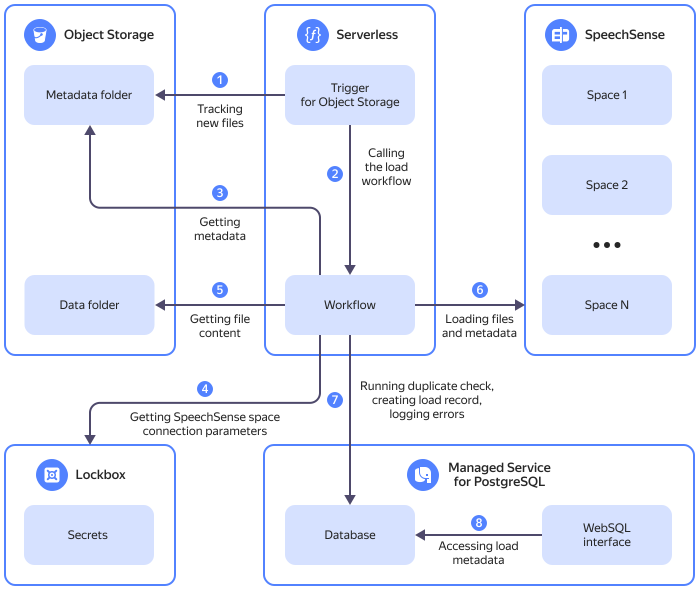

# Automatic data upload to {{ speechsense-full-name }} using {{ sw-full-name }}





You can configure automatic loading of dialog files and their metadata from the {{ objstorage-name }} bucket to [{{ speechsense-name }} space](../../speechsense/concepts/resources-hierarchy.md#space). Supported formats are:

  * `MP3`, `WAV`, and `OggOpus`: For audio files.
  * `JSON`: For chat conversations.



On the diagram:

1. [Trigger](../../functions/concepts/trigger/os-trigger.md) for {{ objstorage-name }} monitors for new JSON files with metadata as may appear in the selected [bucket](../../storage/concepts/bucket.md) directory or any of its subdirectories.
1. When new files appear in the directory, the trigger calls the `workflow-call` [function](../../functions/concepts/function.md), which starts the [{{ sw-name }} workflow](../../serverless-integrations/concepts/workflows/workflow.md).
1. The workflow retrieves the contents of JSON metadata files and checks their syntax using the `verify-file` function.
1. The workflow gets the {{ speechsense-name }} connection parameters from the relevant [{{ lockbox-name }} secret](../../lockbox/concepts/secret.md).
1. The path to the audio or text file and its metadata are provided to the `speechsense-upload` upload function.
1. `speechsense-upload` uploads the files and their metadata into the {{ speechsense-name }} space.
1. At runtime, the workflow accesses the database with metadata:
    1. Logging syntax errors in metadata files.
    1. Logging entry syntax errors in metadata files.
    1. Checking for duplicates: before calling the `speechsense-upload` function, the workflow checks whether a file has already been loaded into the {{ speechsense-name }} space.
    1. Logging the `speechsense-upload` function errors.
    1. Logging the file metadata and unique identifier in {{ speechsense-name }} space once the file is successfully uploaded.
1. {{ websql-name }} provides access to the metadata DB. One database user is used for browsing, and another one for uploading files.

You can set up automatic data upload for several [{{ speechsense-name }} connections](../../speechsense/concepts/resources-hierarchy.md#connection) at once.

To automate uploading data to {{ speechsense-name }}, follow these steps:

1. [Get your cloud ready](#before-you-begin).
1. [Create an infrastructure for uploading files](#infra).
1. [Create a {{ lockbox-name }} secret](#create-secret).
1. [Create a {{ mpg-name }} cluster data model](#create-table).
1. [In the {{ objstorage-name }} bucket, create directories to store files and their metadata](#create-folder).
1. [Prepare the metadata](#prepare-metadata).
1. [Upload the files to the {{ objstorage-name }} bucket](#upload-files).
1. [Check the result](#check-result).

If you no longer need the resources you created, [delete them](#clear-out).


## Get your cloud ready {#before-you-begin}



### Required paid resources {#paid-resources}

The cost of resources includes:

* Fee for bucket data storage and data operations (see [{{ objstorage-full-name }} pricing](../../storage/pricing.md)).
* Cluster usage fee (see [{{ mpg-full-name }} pricing](../../managed-postgresql/pricing.md)).
* Fee for invoking functions (see [{{ sf-full-name }} pricing](../../functions/pricing.md)).
* Fee for storing the secret and requests to the secret (see [{{ lockbox-full-name }} pricing](../../lockbox/pricing.md)).

### Create service accounts {#create-sa}

Create two service accounts:

  * `deploy-sa`: This one will be used for creating the infrastructure.

  * `speechsense-sa`: This one will be used for invoking functions and starting the workflow.



- Management console {#console}

  1. In the [management console]({{ link-console-main }}), select the appropriate folder.
  1. From the list of services, select **{{ ui-key.yacloud.iam.folder.dashboard.label_iam }}**.
  1. Click **{{ ui-key.yacloud.iam.folder.service-accounts.button_add }}**.
  1. Enter a name for the [service account](../../iam/concepts/users/service-accounts.md): `deploy-sa`.
  1. Click  **{{ ui-key.yacloud.iam.folder.service-account.label_add-role }}** and select the following roles: [functions.admin](../../functions/security/index.md#functions-admin), [storage.editor](../../storage/security/index.md#storage-editor), [iam.editor](../../iam/roles-reference.md#iam-editor), [mdb.admin](../../iam/roles-reference.md#mdb-admin), and `serverless.workflows.admin`.
  1. Click **{{ ui-key.yacloud.iam.folder.service-account.popup-robot_button_add }}**.
  1. Repeat the above steps and create a service account named `speechsense-sa` with the following roles: [storage.viewer](../../storage/security/index.md#storage-viewer), [functions.functionInvoker](../../functions/security/index.md#functions-functionInvoker), [functions.mdbProxiesUser](../../functions/security/index.md#functions-mdbProxiesUser), [lockbox.payloadViewer](../../lockbox/security/index.md#lockbox-payloadviewer), and `serverless.workflows.executor`.

- {{ yandex-cloud }} CLI {#cli}

  

  

  1. Create a service account named `deploy-sa`:

      ```bash
      yc iam service-account create deploy-sa
      ```

      Result:

      ```
      id: nfersamh4sjq********
      folder_id: b1gc1t4cb638********
      created_at: "2023-09-21T10:36:29.726397755Z"
      name: deploy-sa
      ```

      Save the `id` of the `deploy-sa` service account and the folder where you created it (`folder_id`).

      For more information about the `yc iam service-account create` command, see the [CLI reference](../../cli/cli-ref/iam/cli-ref/service-account/create.md).

  1. Assign the [functions.admin](../../functions/security/index.md#functions-admin), [storage.editor](../../storage/security/index.md#storage-editor), [iam.editor](../../iam/roles-reference.md#iam-editor), [mdb.admin](../../iam/roles-reference.md#mdb-admin), and `serverless.workflows.admin` roles for the folder to the `deploy-sa` service account by specifying the folder and service account IDs you previously saved:

      ```bash
      yc resource-manager folder add-access-binding <folder_ID> \
        --role <role> \
        --subject serviceAccount:<service_account_ID>
      ```

      The command only accepts one role at a time.

      For more information about the `yc resource-manager folder add-access-binding` command, see the [CLI reference](../../cli/cli-ref/resource-manager/cli-ref/folder/add-access-binding.md).

      If you will be creating a {{ lockbox-name }} secret through the {{ yandex-cloud }} CLI under the `deploy-sa` service account, also assign the [lockbox.editor](../../lockbox/security/index.md#lockbox-editor) role to that account.

  1. Repeat the above steps and create a service account named `speechsense-sa` with the following roles: [storage.viewer](../../storage/security/index.md#storage-viewer), [functions.functionInvoker](../../functions/security/index.md#functions-functionInvoker), [functions.mdbProxiesUser](../../functions/security/index.md#functions-mdbProxiesUser), [lockbox.payloadViewer](../../lockbox/security/index.md#lockbox-payloadviewer), and `serverless.workflows.executor`.

- API {#api}

  To create a service account, use the [create](../../iam/api-ref/ServiceAccount/create.md) method for the [ServiceAccount](../../iam/api-ref/ServiceAccount/index.md) resource or the [ServiceAccountService.Create](../../iam/api-ref/grpc/ServiceAccount/create.md) gRPC API call.

  To assign the [functions.admin](../../functions/security/index.md#functions-admin), [storage.editor](../../storage/security/index.md#storage-editor), [iam.editor](../../iam/roles-reference.md#iam-editor), [mdb.admin](../../iam/roles-reference.md#mdb-admin), and `serverless.workflows.admin` roles to the `deploy-sa` service account, use the [setAccessBindings](../../iam/api-ref/ServiceAccount/setAccessBindings.md) method for the [ServiceAccount](../../iam/api-ref/ServiceAccount/index.md) resource or the [ServiceAccountService.SetAccessBindings](../../iam/api-ref/grpc/ServiceAccount/setAccessBindings.md) gRPC API call.

  In the same way, assign the following roles to the `speechsense-sa` service account: [storage.viewer](../../storage/security/index.md#storage-viewer), [functions.functionInvoker](../../functions/security/index.md#functions-functionInvoker), [functions.mdbProxiesUser](../../functions/security/index.md#functions-mdbProxiesUser), [lockbox.payloadViewer](../../lockbox/security/index.md#lockbox-payloadviewer), and `serverless.workflows.executor`.



### Create an API key for the service account {#create-key}

Create an API key for the `speechsense-sa` service account.



- Management console {#console}

  1. In the [management console]({{ link-console-main }}), select the folder with the service account.
  1. In the list of services, select **{{ ui-key.yacloud.iam.folder.dashboard.label_iam }}**.
  1. In the left-hand panel, select  **{{ ui-key.yacloud.iam.label_service-accounts }}**.
  1. Select the `speechsense-sa` service account.
  1. In the top panel, click  **{{ ui-key.yacloud.iam.folder.service-account.overview.button_create-key-popup }}** and select **{{ ui-key.yacloud.iam.folder.service-account.overview.button_create_api_key }}**.
  1. Click **{{ ui-key.yacloud.iam.folder.service-account.overview.popup-key_button_create }}**.
  1. Save the ID and secret key.

      

      After you close this dialog, the key value will not be shown again.

      

- {{ yandex-cloud }} CLI {#cli}

  Create an API key for the `speechsense-sa` service account and save the response to the `api_key.yaml` file:

  ```bash
  yc iam api-key create \
    --service-account-name speechsense-sa \
    > api_key.yaml
  ```

  As a result, you will get the `api_key.yaml` file with the API key value in the `secret` field:

  ```yaml
  api_key:
    id: ajeke74kbp5b********
    service_account_id: ajepg0mjt06s********
    created_at: "2019-04-09T08:41:27Z"
  secret: AQVN1HHJReSrfo9jU3aopsXrJyfq_UHs********
  ```

- API {#api}

  Create an API key using the [create](../../iam/api-ref/ApiKey/create.md) REST API method for the [ApiKey](../../iam/api-ref/ApiKey/index.md) resource:

  ```bash
  export SERVICEACCOUNT_ID=<service_account_ID>
  export IAM_TOKEN=<token>
  curl \
    --request POST \
    --header "Content-Type: application/json" \
    --header "Authorization: Bearer $IAM_TOKEN" \
    --data "{ \"serviceAccountId\": \"$SERVICEACCOUNT_ID\" }" \
    https://iam.{{ api-host }}/iam/v1/apiKeys
  ```

  Where:

  * `SERVICEACCOUNT_ID`: Service account [ID](../../iam/operations/sa/get-id.md).
  * `IAM_TOKEN`: [IAM token](../../iam/concepts/authorization/iam-token.md)

  You can also create an API key using the [ApiKeyService.Create](../../iam/api-ref/grpc/ApiKey/create.md) gRPC API call.



### Create a space {#create-space}



- {{ speechsense-name }} UI {#speechsense}

  1. Open the {{ speechsense-name }} [home page]({{ link-speechsense-main }}).
  1. Click **{{ ui-key.yc-ui-talkanalytics.spaces.create-space }}**.
  1. Enter a name for the space.
  1. Click **{{ ui-key.yc-ui-talkanalytics.common.create }}**.



### Add the service account to the space {#add-sa-to-space}

Add the `speechsense-sa` service account to the {{ speechsense-name }} space.



- {{ speechsense-name }} UI {#speechsense}

  1. Open the {{ speechsense-name }} [home page]({{ link-speechsense-main }}).
  1. Go to your [new space](#create-space).
  1. Click  **{{ ui-key.yc-ui-talkanalytics.projects.add-participant }}** →  **{{ ui-key.yc-ui-talkanalytics.team.add-from-organization-key-value }}**.
  1. Copy the ID of the `speechsense-sa` service account you [created earlier](#create-sa) and paste it to the search bar.
  1. Select the `speechsense-sa` service account and specify the [{{ roles-speechsense-data-editor }}](../../speechsense/security/index.md#speechsense-data-editor) role. This role will allow `speechsense-sa` to upload data to {{ speechsense-name }}.
  1. Click **{{ ui-key.yc-ui-talkanalytics.common.add }}**.



### Create a connection {#create-connection}

Depending on the type of files to be uploaded to {{ speechsense-name }}, create a connection for an audio or chat.

#### Create a connection for an audio {#create-audio-connection}



- {{ speechsense-name }} UI {#speechsense}

  1. Open the {{ speechsense-name }} [home page]({{ link-speechsense-main }}).
  1. Go to the space of your choice.
  1. In the top-right corner, click **{{ ui-key.yc-ui-talkanalytics.common.more }}** →  **{{ ui-key.yc-ui-talkanalytics.connections.create-connection-key-value }}**.
  1. Enter the connection name.
  1. Select the **{{ ui-key.yc-ui-talkanalytics.connections.type.two-channel-key-value }}** data type.
  1. Under **{{ ui-key.yc-ui-talkanalytics.dialogs.operator }}**, **{{ ui-key.yc-ui-talkanalytics.dialogs.client }}**:

      1. Specify the channels with the agent's voice and customer's voice.
      1. Specify agent and customer keys from the metadata file. This file contains the call information collected from CRM systems, PBXs, or other sources.

        By default, connections include keys with the name and ID of the agent and the customer. In the **{{ ui-key.yc-ui-talkanalytics.connections.column.name }}** field, enter the name the key will have in {{ speechsense-name }}.

        To specify additional metadata for the agent and the customer, click **{{ ui-key.yc-ui-talkanalytics.connections.add-key }}**.

  1. Under **{{ ui-key.yc-ui-talkanalytics.connections.fields.metadata }}**, provide the keys from the metadata file that are not related to the agent or the customer.

      By default, connections include keys with the date, direction, and language of the call. In the **{{ ui-key.yc-ui-talkanalytics.connections.column.name }}** field, enter the name the key will have in {{ speechsense-name }}.

      To specify additional metadata, click **{{ ui-key.yc-ui-talkanalytics.connections.add-key }}**.

  1. Click **{{ ui-key.yc-ui-talkanalytics.connections.create-connection-key-value }}**.



#### Create a connection for a chat {#create-chat-connection}



- {{ speechsense-name }} UI {#speechsense}

  1. Open the {{ speechsense-name }} [home page]({{ link-speechsense-main }}).
  1. Go to the space of your choice.
  1. In the top-right corner, click **{{ ui-key.yc-ui-talkanalytics.common.more }}** →  **{{ ui-key.yc-ui-talkanalytics.connections.create-connection-key-value }}**.
  1. Enter the connection name.
  1. Select the **{{ ui-key.yc-ui-talkanalytics.connections.type.chat-key-value }}** data type.
  1. Under **{{ ui-key.yc-ui-talkanalytics.dialogs.operator }}**, **{{ ui-key.yc-ui-talkanalytics.dialogs.client }}**, **{{ ui-key.yc-ui-talkanalytics.dialogs.bot }}**, specify the keys from the metadata file. This file contains the dialog information collected from chats, CRM systems, or other sources.

      By default, connections include keys with agent's, customer's, and bot's names and IDs. In the **{{ ui-key.yc-ui-talkanalytics.connections.column.name }}** field, enter the name the key will have in {{ speechsense-name }}.

      To specify additional agent, customer, and bot metadata, click **{{ ui-key.yc-ui-talkanalytics.connections.add-key }}**.

  1. Under **{{ ui-key.yc-ui-talkanalytics.connections.fields.metadata }}**, provide the keys from the metadata file that are not related to the agent, customer, and bot.

      By default, keys with date, direction, and dialog language are added to the connection. In the **{{ ui-key.yc-ui-talkanalytics.connections.column.name }}** field, enter the name the key will have in {{ speechsense-name }}.

      To specify additional metadata, click **{{ ui-key.yc-ui-talkanalytics.connections.add-key }}**.

  1. Click **{{ ui-key.yc-ui-talkanalytics.connections.create-connection-key-value }}**.



### Create a project {#create-project}



- {{ speechsense-name }} UI {#speechsense}

  1. Open the {{ speechsense-name }} [home page]({{ link-speechsense-main }}).
  1. Go to the space of your choice.
  1. Click  **{{ ui-key.yc-ui-talkanalytics.projects.create-project }}**.
  1. Enter a name for your project.
  1. Under **{{ ui-key.yc-ui-talkanalytics.connections.connection }}**, click **{{ ui-key.yc-ui-talkanalytics.projects.add-connection }}** and select the connection you [created earlier](#create-connection).
  1. Click **{{ ui-key.yc-ui-talkanalytics.projects.create-project }}**.



## Create your infrastructure {#infra}

1. Clone the [yc-serverless-speechsense-workflows](https://github.com/yandex-cloud-examples/yc-serverless-speechsense-workflows) repository:

    ```bash
    git clone https://github.com/yandex-cloud-examples/yc-serverless-speechsense-workflows.git
    ```

    The repository contains a script that will create in the cloud the infrastructure needed to upload files to {{ speechsense-name }}:

      * {{ objstorage-name }} bucket.
      * {{ mpg-name }} cluster.
      * {{ sf-name }} functions.
      * Trigger to invoke the {{ sf-name }} function.
      * {{ sw-name }} workflow.
      * Connections to a {{ mpg-name }} cluster database.

1. For the script to run successfully, configure the {{ yandex-cloud }} CLI authentication under the `deploy-sa` service account:

    

    - {{ yandex-cloud }} CLI {#cli}

      1. Create an [authorized key](../../iam/concepts/authorization/key.md) for the `deploy-sa` service account and save that key to the file:
      
          ```bash
          yc iam key create --output <key_file_path> --service-account-name deploy-sa
          ```
      
          Where `--output` is the path to the file for saving the authorized key in JSON format.

          Result:
      
          ```bash
          id: aje4lue48687********
          service_account_id: ajeb9l33h6m********
          created_at: "2024-08-01T11:58:52.313177213Z"
          key_algorithm: RSA_2048
          ```
      
          For more information about the `yc iam key create` command, see the [CLI reference](../../cli/cli-ref/iam/cli-ref/service-account/create.md).

       1. Create a profile to execute operations under the `deploy-sa` service account:

          ```bash
          yc config profile create <profile_name>
          ```

       1. Specify the `deploy-sa` service account’s authorized key in the profile configuration:

          ```bash
          yc config set service-account-key <key_file_path>
          ```

    

1. Navigate to the repository directory and run the script:

    

    - Bash {#bash}

        ```bash
        cd deploy && bash deploy.sh
        ```

    

    In the command line, enter the [folder ID](../../resource-manager/operations/folder/get-id.md), `speechsense-sa` as the name of the service account that will call functions and run the workflow, and [bucket name](../../storage/concepts/bucket.md#naming).

    The script execution time is about 10-15 minutes.

## Create a secret {#create-secret}



- Management console {#console}

  1. In the [management console]({{ link-console-main }}), select the folder where you want to create a secret.
  1. From the list of services, select **{{ ui-key.yacloud.iam.folder.dashboard.label_lockbox }}**.
  1. Click **{{ ui-key.yacloud.lockbox.button_create-secret }}**.
  1. In the **{{ ui-key.yacloud.common.name }}** field, specify the secret name: `speechsense-secret`.

  1. Under **{{ ui-key.yacloud.lockbox.forms.title_secret-data-section }}**:

        1. Select the **{{ ui-key.yacloud.lockbox.forms.title_secret-type-custom }}** secret type.
        
        1. Add the service account's API key:

            * In the **{{ ui-key.yacloud.lockbox.forms.label_key }}** field, specify: `speechsense_api_key`.
            * In the **{{ ui-key.yacloud.lockbox.forms.label_value }}** field, specify the value of the `speechsense-sa` service account's API key you [created earlier](#create-key).

        1. Click **{{ ui-key.yacloud.lockbox.forms.button_add-pair }}** and add the {{ speechsense-name }} connection ID:

            * In the **{{ ui-key.yacloud.lockbox.forms.label_key }}** field, specify: `speechsense_connection_id`.
            * In the **{{ ui-key.yacloud.lockbox.forms.label_value }}** field, specify the ID of the connection you [created earlier](#create-connection).

        1. Click **{{ ui-key.yacloud.lockbox.forms.button_add-pair }}** and add the format for the dialog files that will be uploaded to {{ speechsense-name }}:

            * In the **{{ ui-key.yacloud.lockbox.forms.label_key }}** field, specify: `speechsense_file_format`.
            * In the **{{ ui-key.yacloud.lockbox.forms.label_value }}** field, specify the file format. Acceptable values: `mp3`, `wav`, `ogg`, and `text`.

  1. Click **{{ ui-key.yacloud.common.create }}**.

- {{ yandex-cloud }} CLI {#cli}

  To create a secret, run this command:

  ```bash
  yc lockbox secret create --name speechsense-secret \
    --payload "[{'key': 'speechsense_api_key', 'text_value': '<API_key>'},{'key': 'speechsense_connection_id', 'text_value': '<connection_ID>'}, {'key': 'speechsense_file_format', 'text_value': '<file_format>'}]"
  ```

  Result:

  ```text
  id: e6q2ad0j9b55********
  folder_id: b1gktjk2rg49********
  created_at: "2021-11-08T19:23:00.383Z"
  name: speechsense-secret
  status: ACTIVE
  current_version:
    id: g6q4fn3b6okj********
    secret_id: e6e2ei4u9b55********
    created_at: "2023-03-21T19:23:00.383Z"
    status: ACTIVE
    payload_entry_keys:
      - speechsense_api_key
      - speechsense_connection_id
      - speechsense_file_format
  ```

- API {#api}

  To create a secret, use the [create](../../lockbox/api-ref/Secret/create.md) REST API method for the [Secret](../../lockbox/api-ref/Secret/index.md) resource or the [SecretService.Create](../../lockbox/api-ref/grpc/Secret/create.md) gRPC API call.




## Create a data model {#create-table}

1. Open the `pg_metadata.sql` file in the repository directory.

1. Under the section for inserting data into the `public.source_system` table, specify the values of the parameters:

    ```sql
    insert into public.source_system(source_system_id, lockbox_secret_id, source_system_desc)
    values ('<origin_ID>', '<secret_ID>', '<source_description>');
    ```

    Where:

    * `source_system_id`: Data source ID to use in metadata. Specify any unique string value, e.g., `000001`.
    * `lockbox_secret_id`: ID of the {{ lockbox-name }} secret you [created earlier](#create-secret), e.g., `e6qigo0vbci2********`.
    * `source_system_desc`: Data source description. For example: `Uploading telephony data`.

1. Copy the `pg_metadata.sql` file contents and run the resulting query with {{ websql-name }}.

    

    - Management console {#console}

        1. Navigate to the folder dashboard and select **{{ ui-key.yacloud.iam.folder.dashboard.label_managed-postgresql }}**.
        1. Click the name of the cluster you [created earlier](#infra). By default, it is `speechsense-upload-metadata`.
        1. Select the **{{ ui-key.yacloud.postgresql.cluster.switch_explore-websql }}** tab.
        1. Click the connection name that ends with `-uploader`.
        1. On the {{ websql-name }} home page, click the database name: `uploader`.
        1. Paste the query to the editor and click **Run**.

    

## Create directories to store files and their metadata {#create-folder}

In the {{ objstorage-name }} bucket you [created earlier](#infra), create two directories as follows:

  * `client_data`: For dialog files.
  * `client_metadata`: For metadata files.

Make sure the directories are not nested one inside the other.



- Management console {#console}

  To create a directory:

    1. In the [management console]({{ link-console-main }}), select the folder the bucket is in.
    1. In the list of services, select **{{ ui-key.yacloud.iam.folder.dashboard.label_storage }}**.
    1. Select the bucket you need.
    1. Click **{{ ui-key.yacloud.storage.bucket.button_create }}** and specify the directory name.
    1. Click **{{ ui-key.yacloud.storage.bucket.popup-create-folder_button_create }}**.

- {{ yandex-cloud }} CLI {#cli}

  To create a directory, run this command:

    ```bash
    yc storage s3api put-object \
      --bucket <bucket_name> \
      --key <directory_name>/
    ```

  Result:

    ```bash
    etag: '"d41d8cd98f00b204e9800998********"'
    request_id: ba96231*********
    ```

- AWS CLI {#aws-cli}

  If you do not have the AWS CLI yet, [install and configure it](../../storage/tools/aws-cli.md).

  To create a directory, run this command:

    ```bash
    aws s3api put-object \
      --endpoint-url=https://{{ s3-storage-host }} \
      --bucket <bucket_name>
      --key <directory_name>/
    ```

  Result:

    ```bash
    {
    "ETag": "\"d41d8cd98f00b204e9800998********\""
    }
    ```

- API {#api}

  To create a directory, use the [upload](../../storage/s3/api-ref/object/upload.md) S3 API method.




## Prepare the metadata {#prepare-metadata}







To upload a file to {{ speechsense-name }}, first prepare the file metadata in `JSON` format. For example:

```json
{
  "source_system_id": "000001",
  "bucket_folder": "bucket://client_data",
  "metadata": [
    {
      "id": "my_audio.ogg",
      "operator_id": "42",
      "operator_name": "James Doe",
      "client_id": "327142",
      "client_name": "Jane Smith",
      "date": "2024-08-30T19:32:11Z",
      "direction_outgoing": "0",
      "language": "RU",
      "file_name": "my_audio.ogg"
    }
  ]
}
```

Where:

  * Parameters the `speechsense-upload` function uses to upload files:

    * `source_system_id`: Data source ID as specified in the [`public.source_system` table](#create-table).

    * `bucket_folder`: Path to the directory you [created earlier](#create-folder) for audio or text files.

    * `file_name`: Name of the file to upload.

  * Parameters that have to be be provided to {{ speechsense-name }}:
  
    * `id`: File ID, unique across the {{ speechsense-name }} space.

    * `operator_id`: Agent ID.

    * `operator_name`: Agent name.

    * `client_id`: Customer ID. 

    * `client_name`: Customer name.

    * `date`: Call date and time, in `YYYY-MM-DDTHH:MM:SSZ` format.

    * `direction_outgoing`: Call direction, `0` for outgoing call, `1` for incoming call.

    * `language`: Dialog language, `RU` for the Russian language.

  * Additional parameters for analytics in {{ speechsense-name }}:

      * `cpn_region_id`: Region ID.

      * `cpn_region_name`: Region name.

      Here, `cpn_region_id` and `cpn_region_name` are used as examples only. Additional parameters may vary.

Metadata can contain a single entry or an array of entries. 



Do not transmit more than 100 records at the same time: this may lead to a data loss because the {{ sf-name }} function has an execution timeout.

If there are more than 100 files to upload, split their metadata into separate JSON files of 100 entries each.




## Upload your files {#upload-files}

Import the dialog files into the `client_data` directory and the JSON metadata files, into the `client_metadata` directory.



Do not import any dialog files into the `client_metadata` directory or its subdirectories. New files appearing in the directory will start the workflow, but the dialog files will not pass the syntax check that the metadata files do, so the workflow will fail.



If there are more than 1,000 files, do not use the management console for uploading.



- Management console {#console}

  To upload your files:

    1. In the [management console]({{ link-console-main }}), select **{{ ui-key.yacloud.iam.folder.dashboard.label_storage }}** from the list of services and go to the bucket you want to upload your files to.
    1. In the left-hand panel, select  **{{ ui-key.yacloud.storage.bucket.switch_files }}**.
    1. Click the directory name to go to that directory.
    1. Within the directory you need, click  **{{ ui-key.yacloud.storage.bucket.button_upload }}** on the top panel.
    1. In the window that opens, select the files and click **Open**.
    1. The management console will display all the files you selected for uploading and prompt you to select a [storage class](../../storage/concepts/storage-class.md) for each of them. The [bucket configuration](../../storage/concepts/bucket.md#bucket-settings) determines the default storage class.
    1. Click **{{ ui-key.yacloud.storage.button_upload }}**.
    1. Refresh the page.

    In the management console, the information about the number of objects and storage space used in the bucket is updated with a few minutes' delay. 

- {{ yandex-cloud }} CLI {#cli}

  To upload a file to a directory, run this command:

    ```bash
    yc storage s3api put-object \
      --body <path_to_file_to_upload> \
      --bucket <bucket_name> \
      --key <directory_name>/<file_name>
    ```

    Where:

    * `--body`: Path to the file you need to upload.
    * `--bucket`: Bucket name.
    * `--key`: Path to the file in the directory.

  Result:

    ```bash
    etag: '"d41d8cd98f00b204e980099********"'
    request_id: 3f2705f********
    ```

- AWS CLI {#aws-cli}

  To upload a single file, run this command:

    ```bash
    aws --endpoint-url=https://{{ s3-storage-host }}/ \
      s3 cp <path_to_file_to_upload> s3://<bucket_name>/<directory_name>/<file_name>
    ```

  To upload all files from a local directory with its nested directories, use the following command:
   
    ```bash
    aws --endpoint-url=https://{{ s3-storage-host }}/ \
      s3 cp --recursive <path_to_directory_with_files_to_upload>/ s3://<bucket_name>/<directory_name>/
    ```

  Result:

    ```bash
    upload: <file_name> to <path_to_file_in_bucket>
    ```

- API {#api}

  To upload a file, use the [upload](../../storage/s3/api-ref/object/upload.md) S3 API method.





To process your audio recordings faster, use `OggOpus` files. To convert files in other formats to `OggOpus`, use the [FFmpeg](https://www.ffmpeg.org) or [SoX](https://sourceforge.net/projects/sox/) utilities.



## Check the result {#check-result}

To check on the workflow:



- Management console {#console}

  1. In the [management console]({{ link-console-main }}), select **{{ ui-key.yacloud.iam.folder.dashboard.label_serverless-integrations }}** from the list of services.
  1. In the left-hand panel, select  **{{ ui-key.yacloud.serverless-workflows.label_service }}**.
  1. Click the workflow name. By default, it is `wf-speechsense-upload`.
  1. Navigate to the **{{ ui-key.yacloud.serverless-workflows.label_workflow-executions }}** tab.
  1. Make sure the workflow status is `Complete`.



To check that the files were successfully uploaded into {{ speechsense-name }}:



- Management console {#console}

  1. Open the [{{ websql-name }}](https://websql.yandex.cloud) home page.
  1. Under  **Connections**, select the `speechsense-upload-metadata` connection and the `uploader` database.
  1. Select the `public` schema.
  1. In the **Tables** group, select a table:

      * `talk`: To view metadata uploaded into {{ speechsense-name }}. If a dialog file is uploaded, its metadata must include the `talk_id` ID.
      * `errors`: To view errors if files could not be uploaded.



## Delete resources {#clear-out}

Some resources are not free of charge. Delete the resources you no longer need to avoid paying for them.

1. [Delete](../../storage/operations/buckets/delete.md) objects from the {{ objstorage-name }} bucket and the bucket itself.
1. [Delete](../../managed-postgresql/operations/cluster-delete.md) the {{ mpg-name }} cluster.
1. [Delete](../../functions/operations/trigger/trigger-delete.md) the trigger invoking the function in {{ sf-name }}.
1. [Delete](../../functions/operations/function/function-delete.md) the {{ sf-name }} functions.
1. Delete the connection to the {{ mpg-name }} cluster database:

    1. In the [management console]({{ link-console-main }}), go to the folder you want to delete the connection in.
    1. Select **{{ ui-key.yacloud.iam.folder.dashboard.label_serverless-functions }}**.
    1. In the left-hand panel, select  **{{ ui-key.yacloud.serverless-functions.switch_list-mdb-proxy }}**.
    1. In the `speechsense-upload-metadata-connection` connection row, click  and select  **{{ ui-key.yacloud.common.delete }}**.
    1. In the window that opens, click **{{ ui-key.yacloud.common.delete }}**.

1. Delete the {{ sw-name }} workflow:

    1. In the [management console]({{ link-console-main }}), go to the folder you want to delete the workflow in.
    1. Select **{{ ui-key.yacloud.iam.folder.dashboard.label_serverless-integrations }}**.
    1. In the left-hand panel, select  **{{ ui-key.yacloud.serverless-workflows.label_service }}**.
    1. Click  next to `wf-speechsense-upload` and select  **{{ ui-key.yacloud.common.delete }}**.
    1. In the window that opens, click **{{ ui-key.yacloud.common.delete }}**.