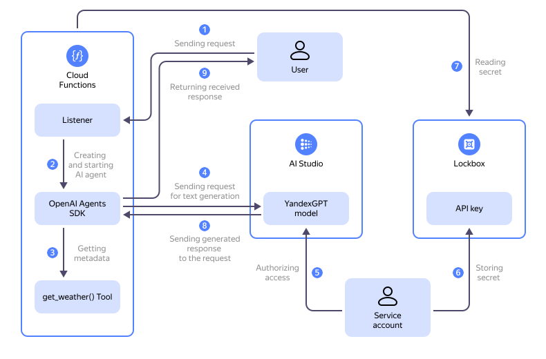

Learn how to use a [function](../../functions/concepts/function.md) from {{ sf-name }} with the [OpenAI Agents SDK](https://openai.github.io/openai-agents-python/) to create an [AI agent](https://cdn.openai.com/business-guides-and-resources/a-practical-guide-to-building-agents.pdf), i.e., a personalized assistant integrated with {{ foundation-models-full-name }} [text generation models](../../foundation-models/concepts/yandexgpt/models.md) to provide generative responses.

Follow this guide to create a simple AI agent that uses a function from {{ sf-name }} to get weather information, interact with the {{ foundation-models-full-name }} [language model](../../foundation-models/concepts/yandexgpt/models.md), and, to add a touch of fun, respond to the user in [haiku](https://en.wikipedia.org/wiki/Haiku) form.



On the diagram:

1. The user sends a request to the AI agent. The {{ sf-name }} handler receives the request.
1. The {{ sf-name }} handler creates and runs the AI agent.
1. The AI agent requests additional weather data for a given city using the custom `get_weather()` function.
1. The AI agent sends the user request together with the extra context to the {{ foundation-models-name }} text generation model.
1. A [service account](../../iam/concepts/users/service-accounts.md) authorizes the AI agent to access the {{ foundation-models-name }} [Text Generation API](../../foundation-models/text-generation/api-ref/index.md) using an [API key](../../iam/concepts/authorization/api-key.md).
1. The service account grants access to the [{{ lockbox-name }}](../../lockbox/index.yaml) secret with the service account API key to the function in {{ sf-name }}.
1. The function in {{ sf-name }} retrieves the service account API key from the {{ lockbox-name }} secret.
1. The {{ foundation-models-name }} model sends the generated response to the AI agent.
1. The AI agent returns the response to the user.

The AI agent you create in this tutorial will be deployed in {{ yandex-cloud }} using {{ sf-full-name }}. You will also create resources to arrange access to the {{ foundation-models-name }} model: a [service account](../../iam/concepts/users/service-accounts.md), the service account [API key](../../iam/concepts/authorization/api-key.md), the {{ lockbox-full-name }} [secret](../../lockbox/concepts/secret.md), and a [function](../../functions/concepts/function.md) in {{ sf-name }}.

You can create these resources [automatically](#automatic-setup) or [manually](#manual-setup).

## What an AI agent is and how to use it {#ai-agent-definition}

An AI agent is an AI-powered software assistant which can follow instructions, give answers to questions, and interact with users or other systems within a given context. Unlike standard generative models, AI agents can:

* Have personalized instructions and a "personality".
* Use external sources and third-party tools to gather additional information.
* Maintain conversation context.
* Perform multi-step actions to solve complex tasks.

### Why use serverless functions to work with AI agents {#why-serverless}

Functions offered by {{ sf-name }} provide multiple benefits when deploying AI agents:

* Scalability: Autoscaling to accommodate the load.
* Cost-effectiveness: You only pay for the actual execution time.
* No infrastructure management required: You do not need to configure or maintain servers.
* Fast deployment: AI agents are easy to create and update.
* Multiple integration options: Simple connection to APIs and other {{ yandex-cloud }} services.

## Get your cloud ready {#before-begin}



### Required paid resources {#paid-resources}

The infrastructure support cost for this tutorial includes:
* Fee for using the function (see [{{ sf-full-name }} pricing](../../functions/pricing.md)).
* Text generation fee (see [{{ foundation-models-full-name }} pricing](../../foundation-models/pricing.md)).
* Fee for secret storage and operations (see [{{ lockbox-full-name }} pricing](../../lockbox/pricing.md)).
* Fee for logging operations and data storage in a [log group](../../logging/concepts/log-group.md) (see [{{ cloud-logging-full-name }} pricing](../../logging/pricing.md)) when using [{{ cloud-logging-name }}](../../logging/).

## Creating an AI agent automatically {#automatic-setup}

Run a script to automatically create all the required resources in your selected folder and deploy a ready-to-use AI agent for you to experiment with.

To create an AI agent automatically:

1. [Install](../../cli/operations/install-cli.md) the {{ yandex-cloud }} CLI and [get authenticated](../../cli/operations/index.md#auth).
1. [Download and install Python](https://www.python.org/downloads/).
1. Clone the [repository](https://github.com/yandex-cloud-examples/yc-serverless-ai-agent) with scripts for creating the AI agent:

    ```bash
    git clone https://github.com/yandex-cloud-examples/yc-serverless-ai-agent
    ```

    The repository contains scripts for creating three types of AI agents:

    

    - Simple AI agent {#simple}

      The `create-simple-ai-agent.py` script will create a simple AI agent which returns information about the weather in Tokyo in haiku form when you run it.

    - Advanced AI agent {#advanced}

      The `create-advanced-ai-agent.py` script will create an advanced AI agent which responds to user requests in haiku form. When there is no user request, the agent returns a response to the default request.

    - Translator agent {#complex}

      The `create-complex-ai-agent.py` script will create a translator agent which can handle user requests for text translation to the specified language while maintaining the style and tone.

    

1. Make the script file executable. Here is an example:

    ```bash
    chmod +x create-simple-ai-agent.py
    ```
1. Run the script:

    ```bash
    ./create-simple-ai-agent.py
    ```

    While the script is running, specify your cloud and folder details, then wait until the resources are created.
1. Test the AI agent.

    

    - Simple AI agent {#simple}

      [Test](#test-function) the function in the management console.

    - Advanced AI agent {#advanced}

      [Test](#test-function) the function in the management console.

      You can also test the function by sending a user request to the AI agent via the {{ yandex-cloud }} CLI. To do this, run this command and specify the function ID you obtained when creating the AI agent:

      ```bash
      echo '{"query": "What's the weather in Paris?"}' > request.json \
        yc serverless function invoke <function_ID> --data-file request.json
      ```

    - Translator agent {#complex}

      [Test](#test-function) the function in the management console.

      You can also test the function by sending a user request to the AI agent via the {{ yandex-cloud }} CLI. To do this, run this command and specify the function ID you obtained when creating the AI agent:

      ```bash
      echo '{"text": "Hello, world!", "target_language": "Russian", "tone": "friendly"}' > translate.json \
        yc serverless function invoke <function_ID> --data-file translate.json
      ```

    

1. If you no longer need the resources you created, [delete them](#clear-out).


## Creating an AI agent manually {#manual-setup}

To create an AI agent manually using a function from {{ sf-name }}:

1. [Create a service account](#create-sa).
1. [Create the service account API key](#create-api-key).
1. [Create a {{ lockbox-full-name }} secret](#create-secret).
1. [Prepare a ZIP archive with the function code](#zip-archive).
1. [Create a function](#create-function).
1. [Test the function](#test-function).

If you no longer need the resources you created, [delete them](#clear-out).

## Create a service account {#create-sa}



- Management console {#console}

  1. In the [management console]({{ link-console-main }}), select the [folder](../../resource-manager/concepts/resources-hierarchy.md#folder) where you are going to create your infrastructure.
  1. In the list of services, select **{{ ui-key.yacloud.iam.folder.dashboard.label_iam }}**.
  1. Click **{{ ui-key.yacloud.iam.folder.service-accounts.button_add }}**.
  1. Enter the service account name: `function-sa`.
  1. Click  **{{ ui-key.yacloud.iam.folder.service-account.label_add-role }}** and select the `ai.languageModels.user` [role](../../foundation-models/security/index.md#languageModels-user).
  1. Click **{{ ui-key.yacloud.iam.folder.service-account.popup-robot_button_add }}**.

- CLI {#cli}

  

  

  1. Create a service account named `function-sa` in the default folder:

      ```bash
      yc iam service-account create \
        --name function-sa
      ```

      Result:

      ```text
      done (1s)
      id: aje23dgspcpi********
      folder_id: b1gt6g8ht345********
      created_at: "2025-06-04T19:34:58.145514099Z"
      name: function-sa
      ```

      Save the service account ID (the `id` field value) and the folder ID (the `folder_id` field value) as you will need them later.

      For more information about the `yc iam service-account create` command, see the [CLI reference](../../cli/cli-ref/iam/cli-ref/service-account/create.md).

  1. Assign the `ai.languageModels.user` [role](../../foundation-models/security/index.md#languageModels-user) for the folder to the created service account by specifying the folder and service account IDs you saved in the previous step:

      ```bash
      yc resource-manager folder add-access-binding <folder_ID> \
        --role ai.languageModels.user \
        --subject serviceAccount:<service_account_ID>
      ```

      Result:

      ```text
      done (2s)
      effective_deltas:
        - action: ADD
          access_binding:
            role_id: ai.languageModels.user
            subject:
              id: aje23dgspcpi********
              type: serviceAccount
      ```

      For more information about the `yc resource-manager folder add-access-binding` command, see the [CLI reference](../../cli/cli-ref/resource-manager/cli-ref/folder/add-access-binding.md).

- API {#api}

  To create a service account, use the [create](../../iam/api-ref/ServiceAccount/create.md) REST API method for the [ServiceAccount](../../iam/api-ref/ServiceAccount/index.md) resource or the [ServiceAccountService/Create](../../iam/api-ref/grpc/ServiceAccount/create.md) gRPC API call.

  To assign the service account the `ai.languageModels.user` role for the folder, use the [updateAccessBindings](../../resource-manager/api-ref/Folder/updateAccessBindings.md) REST API method for the [Folder](../../resource-manager/api-ref/Folder/index.md) resource or the [FolderService/UpdateAccessBindings](../../resource-manager/api-ref/grpc/Folder/updateAccessBindings.md) gRPC API call.




## Create the service account API key {#create-api-key}



- Management console {#console}

  1. In the [management console]({{ link-console-main }}), select the folder where you are deploying your infrastructure.
  1. In the list of services, select **{{ ui-key.yacloud.iam.folder.dashboard.label_iam }}** and then select the `function-sa` service account you created earlier.
  1. In the top panel, click  **{{ ui-key.yacloud.iam.folder.service-account.overview.button_create-key-popup }}** and select **{{ ui-key.yacloud.iam.folder.service-account.overview.button_create_api_key }}**.
  1. In the **{{ ui-key.yacloud.iam.folder.service-account.overview.field_key-scope }}** field, select the `yc.ai.languageModels.execute` [scope](../../iam/concepts/authorization/api-key.md#scoped-api-keys).
  1. Optionally, set the API key expiration date under **{{ ui-key.yacloud.iam.folder.service-account.overview.field_key-expires-at }}**.
  1. Click **{{ ui-key.yacloud.iam.folder.service-account.overview.popup-key_button_create }}**.
  1. Save the secret key as you will need it to create a function.

      

      After you close this dialog, the key value will not be shown again.

      

- CLI {#cli}

  1. Create an API key for the `function-sa` service account:

      ```bash
      yc iam api-key create \
        --service-account-name function-sa \
        --scopes yc.ai.languageModels.execute
      ```

      Result:

      ```yaml
      api_key:
        id: ajemcpt92i9j********
        service_account_id: aje23dgspcpi********
        created_at: "2025-06-04T19:41:28.960624728Z"
        scope: yc.ai.languageModels.execute
        scopes:
          - yc.ai.languageModels.execute
      secret: AQVN1mZ6kUkzDCjhNJxmjDX6WeJdOlJv********
      ```

      Save the key value as you will not be able to get it again.

      For more information about the `yc iam api-key create` command, see the [CLI reference](../../cli/cli-ref/iam/cli-ref/api-key/create.md).

- API {#api}

  To create an API key, use the [create](../../iam/api-ref/ApiKey/create.md) REST API method for the [ApiKey](../../iam/api-ref/ApiKey/index.md) resource or the [ApiKeyService/Create](../../iam/api-ref/grpc/ApiKey/create.md) gRPC API call.




## Create a {{ lockbox-full-name }} secret {#create-secret}



- Management console {#console}

  1. In the [management console]({{ link-console-main }}), select the folder where you are deploying your infrastructure.
  1. In the list of services, select **{{ ui-key.yacloud.iam.folder.dashboard.label_lockbox }}** and click **{{ ui-key.yacloud.lockbox.button_create-secret }}**.
  1. In the **{{ ui-key.yacloud.common.name }}** field, specify the secret name: `api-key-secret`.
  1. In the **{{ ui-key.yacloud.lockbox.forms.title_secret-type }}** field, select `{{ ui-key.yacloud.lockbox.forms.title_secret-type-custom }}`.
  1. In the **{{ ui-key.yacloud.lockbox.forms.label_key }}** field, enter the secret key: `api-key`.
  1. In the **{{ ui-key.yacloud.lockbox.forms.label_value }}** field, paste the secret key you obtained in the previous step.
  1. Click **{{ ui-key.yacloud.common.create }}**.

- CLI {#cli}

  1. Create a {{ lockbox-name }} secret named `api-key-secret` in the default folder by specifying the secret key obtained in the previous step:

      ```bash
      yc lockbox secret create \
        --name api-key-secret \
        --payload "[{'key': 'api-key', 'text_value': '<secret_key>'}]"
      ```

      Result:

      ```bash
      done (1s)
      id: e6q7c0n0n7ji********
      folder_id: b1gt6g8ht345********
      created_at: "2025-06-04T19:50:38.690Z"
      name: api-key-secret
      status: ACTIVE
      current_version:
        id: e6qhmal099ki********
        secret_id: e6q7c0n0n7ji********
        created_at: "2025-06-04T19:50:38.690Z"
        status: ACTIVE
        payload_entry_keys:
          - api-key
      ```

      For more information about the `yc lockbox secret create` command, see the [CLI reference](../../cli/cli-ref/lockbox/cli-ref/secret/create.md).

- API {#api}

  To create a secret, use the [create](../../lockbox/api-ref/Secret/create.md) REST API method for the [Secret](../../lockbox/api-ref/Secret/index.md) resource or the [SecretService/Create](../../lockbox/api-ref/grpc/Secret/create.md) gRPC API call.



### Grant read permissions for the secret contents to the service account {#grant-secret-access}



- Management console {#console}

  1. In the [management console]({{ link-console-main }}), select the folder where you are deploying your infrastructure.
  1. In the list of services, select **{{ ui-key.yacloud.iam.folder.dashboard.label_lockbox }}** and then select the secret named `api-key-secret` you created earlier.
  1. On the left-hand panel, select  **{{ ui-key.yacloud.common.resource-acl.label_access-bindings }}** and click **{{ ui-key.yacloud.common.resource-acl.button_new-bindings }}**. In the window that opens:

      1. In the search bar, enter the name of the `function-sa` service account you created and select it.
      1. Click  **{{ ui-key.yacloud_components.acl.button.add-role }}** and select [`lockbox.payloadViewer`](../../lockbox/security/index.md#lockbox-payloadViewer).
      1. Click **{{ ui-key.yacloud.common.save }}**.

- CLI {#cli}

  1. Assign the `lockbox.payloadViewer` [role](../../lockbox/security/index.md#lockbox-payloadViewer) for `api-key-secret` to the `function-sa` service account:

      ```bash
      yc lockbox secret add-access-binding \
          --name api-key-secret \
          --service-account-name function-sa \
          --role lockbox.payloadViewer
      ```

      For more information about the `yc lockbox secret add-access-binding` command, see the [CLI reference](../../cli/cli-ref/lockbox/cli-ref/secret/add-access-binding.md).

- API {#api}

  To assign a role for a secret to a service account, use the [setAccessBindings](../../lockbox/api-ref/Secret/setAccessBindings.md) REST API method for the [Secret](../../lockbox/api-ref/Secret/index.md) resource or the [SecretService/SetAccessBindings](../../lockbox/api-ref/grpc/Secret/setAccessBindings.md) gRPC API call.



## Prepare a ZIP archive with the function code {#zip-archive}

1. Save the following code to a file named `index.py`:

    ```python
    import os

    from openai import AsyncOpenAI

    from agents import (
        Agent,
        OpenAIChatCompletionsModel,
        Runner,
        function_tool,
        set_tracing_disabled,
    )

    BASE_URL = os.getenv("BASE_URL")
    API_KEY = os.getenv("API_KEY")
    MODEL_NAME = os.getenv("MODEL_NAME")

    client = AsyncOpenAI(base_url=BASE_URL, api_key=API_KEY)
    set_tracing_disabled(disabled=True)


    @function_tool
    def get_weather(city: str):
        print(f"[debug] getting weather for {city}")
        return f"The weather in {city} is sunny."


    async def handler(event, context):
        agent = Agent(
            name="Assistant",
            instructions="You only respond in haikus.",
            model=OpenAIChatCompletionsModel(model=MODEL_NAME, openai_client=client),
            tools=[get_weather],
        )

        result = await Runner.run(agent, "What's the weather in Tokyo?")

        return {
            "statusCode": 200,
            "body": result.final_output,
        }
    ```
1. Save the following code to a file named `requirements.txt`:

    ```text
    openai-agents
    ```
1. Add the `index.py` and `requirements.txt` files into the `openai-function.zip` archive.

## Create a function {#create-function}



- Management console {#console}

  1. In the [management console]({{ link-console-main }}), select the folder where you are deploying your infrastructure.
  1. In the list of services, select **{{ ui-key.yacloud.iam.folder.dashboard.label_serverless-functions }}**.
  1. Create a function:
     1. Click **{{ ui-key.yacloud.serverless-functions.list.button_create }}**.
     1. In the window that opens, enter `ai-agent-function` as the function name.
     1. Click **{{ ui-key.yacloud.common.create }}**.
  1. Create a [function version](../../functions/concepts/function.md#version):
     1. Select `{{ python-full-ver }}` as the runtime environment, disable **{{ ui-key.yacloud.serverless-functions.item.editor.label_with-template }}**, and click **{{ ui-key.yacloud.serverless-functions.item.editor.button_action-continue }}**.
     1. In the **{{ ui-key.yacloud.serverless-functions.item.editor.field_method }}** field, select `{{ ui-key.yacloud.serverless-functions.item.editor.value_method-zip-file }}` and attach the `openai-function.zip` file you created earlier.
     1. Specify the entry point: `index.handler`.
     1. Under **{{ ui-key.yacloud.serverless-functions.item.editor.label_title-params }}**, specify:
         * **{{ ui-key.yacloud.serverless-functions.item.editor.field_timeout }}**: `5 minutes`.
         * **{{ ui-key.yacloud.serverless-functions.item.editor.field_resources-memory }}**: `128 {{ ui-key.yacloud.common.units.label_megabyte }}`.
         * **{{ ui-key.yacloud.forms.label_service-account-select }}**: Select the `function-sa` service account.
         * **{{ ui-key.yacloud.serverless-functions.item.editor.field_environment-variables }}**:
             * `MODEL_NAME`: URI of the {{ foundation-models-full-name }} text generation [model](../../foundation-models/concepts/yandexgpt/models.md#generation).

                 Example: `gpt://<folder_ID>/yandexgpt/latest`.
                
                 Where `<folder_ID>` is the [ID of the folder](../../resource-manager/operations/folder/get-id.md) you are creating the infrastructure in.
             * `BASE_URL`: {{ foundation-models-full-name }} URL, `https://{{ api-host-llm }}/v1`.
         * **{{ ui-key.yacloud.serverless-functions.item.editor.label_lockbox-secret }}**:
             * In the **{{ ui-key.yacloud.serverless-functions.item.editor.label_lockbox-env-key }}** field, specify `API_KEY` and select the previously created `api-key-secret`, its version, and `api-key`.
        * If you prefer to opt out of logging so as not to pay for {{ cloud-logging-name }}, disable the **{{ ui-key.yacloud.logging.field_logging }}** option to disable logging.
     1. Click **{{ ui-key.yacloud.serverless-functions.item.editor.button_deploy-version }}**.

- CLI {#cli}

  1. Create a function named `ai-agent-function` in the default folder:

      ```bash
      yc serverless function create \
       --name ai-agent-function
      ```

      Result:

      ```text
      id: d4edhic2qf3i********
      folder_id: b1gt6g8ht345********
      created_at: "2025-06-04T20:02:14.741Z"
      name: ai-agent-function
      http_invoke_url: https://{{ sf-url }}/d4edhic2qf3i********
      status: ACTIVE
      ```

      For more information about the `yc serverless function create` command, see the [CLI reference](../../cli/cli-ref/serverless/cli-ref/function/create.md).

  1. Create a [version](../../functions/concepts/function.md#version) of the `ai-agent-function` function:

      ```bash
      yc serverless function version create \
        --function-name ai-agent-function \
        --memory=128m \
        --execution-timeout=5m \
        --runtime={{ python-cli-ver }} \
        --entrypoint=index.handler \
        --service-account-id=<service_account_ID> \
        --environment MODEL_NAME="gpt://<folder_ID>/yandexgpt/latest",BASE_URL="https://{{ api-host-llm }}/v1" \
        --secret name=api-key-secret,key=api-key,environment-variable=API_KEY \
        --source-path=./openai-function.zip \
        --no-logging
      ```

      Where:

      * `--service-account-id`: [ID](../../iam/operations/sa/get-id.md) of the `function-sa` service account you saved previously.
      * `<folder_ID>`: [ID](../../resource-manager/operations/folder/get-id.md) of the folder you saved when creating the service account.

      Result:

      ```text
      done (16s)
      id: d4e1vnnvhk5p********
      function_id: d4edhic2qf3i********
      created_at: "2025-06-04T20:09:59.675Z"
      runtime: {{ python-cli-ver }}
      entrypoint: index.handler
      resources:
        memory: "134217728"
      execution_timeout: 300s
      service_account_id: aje23dgspcpi********
      image_size: "14958592"
      status: ACTIVE
      tags:
        - $latest
      environment:
        BASE_URL: https://{{ api-host-llm }}/v1
        MODEL_NAME: gpt://b1gt6g8ht345********/yandexgpt/latest
      secrets:
        - id: e6q7c0n0n7ji********
          version_id: e6qhmal099ki********
          key: api-key
          environment_variable: API_KEY
      log_options:
        disabled: true
        folder_id: b1gt6g8ht345********
      concurrency: "1"
      ```

      For more information about the `yc serverless function version create` command, see the [CLI reference](../../cli/cli-ref/serverless/cli-ref/function/version/create.md).

- API {#api}

  To create a function, use the [create](../../functions/functions/api-ref/Function/create.md) REST API method for the [Function](../../functions/functions/api-ref/Function/index.md) resource or the [FunctionService/Create](../../functions/functions/api-ref/grpc/Function/create.md) gRPC API call.

  To create a function version, use the [createVersion](../../functions/functions/api-ref/Function/createVersion.md) REST API method for the [Function](../../functions/functions/api-ref/Function/index.md) resource or the [FunctionService/CreateVersion](../../functions/functions/api-ref/grpc/Function/createVersion.md) gRPC API call.




## Test the function {#test-function}



- Management console {#console}

  1. In the [management console]({{ link-console-main }}), select the folder where you created the infrastructure.
  1. In the list of services, select **{{ ui-key.yacloud.iam.folder.dashboard.label_serverless-functions }}** and then select the function you created.
  1. Navigate to the  **{{ ui-key.yacloud.serverless-functions.item.switch_testing }}** tab.
  1. Click  **{{ ui-key.yacloud.serverless-functions.item.testing.button_run-test }}** and check out the testing results.

      If the request is successful, the function status will change to `Done` and the output will contain the `200` status code and model response. Here is an example:

      ```json
      {
          "statusCode": 200,
          "body": "In Tokyo's sky,\nSunshine beams so bright and clear,\nWarmth fills the air."
      }
      ```



## How to delete the resources you created {#clear-out}

To stop paying for the resources you created:
1. [Delete the function](../../functions/operations/function/function-delete.md).
1. [Delete the secret](../../lockbox/operations/secret-delete.md).
1. If you logged data to a log group, [delete it](../../logging/operations/delete-group.md).