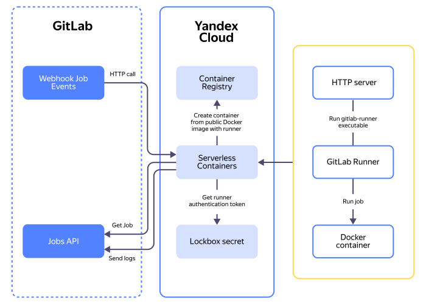

# Starting {{ GLR }} in {{ serverless-containers-full-name }}


In this tutorial, you will learn to start [{{ GLR }}]({{ gl.docs }}/runner/) in {{ yandex-cloud }} using [{{ serverless-containers-full-name }}](../../serverless-containers/).

To start {{ GLR }} in {{ serverless-containers-name }}:

1. [Get your cloud ready](#before-begin).
1. [Create {{ GLR }} and get a token](#create-gitlab-runner).
1. [Create a secret](#create-secret).
1. [Create service accounts](#create-sa).
1. [Create the service account API key](#create-api-key).
1. [Create a container](#create-container).
1. [Set up a webhook in {{ GL }}](#configure-webhook-gitlab).

If you no longer need the resources you created, [delete them](#clear-out).


## How it works {#how-it-works}



Once a job is created, {{ GL }} sends a webhook request to the new {{ serverless-containers-name }} container. The container runs based on a public image from [{{ container-registry-full-name }}](../../container-registry/) and gets the necessary secrets from [{{ lockbox-full-name }}](../../lockbox/). {{ GLR }} deploys inside the container, connects to {{ GL }} and takes the job for execution, runs it in an isolated Docker container, and shuts down when done. This approach eliminates the need to keep [VMs](../../compute/concepts/vm.md) running continuously: you pay only for actual job execution time.

You can check the source code in the {{ src-full-name }} [repository]({{ link-src-main }}/yandex-cloud-examples/serverless-gitlab-runner).

**Key steps**

* The service receives HTTP requests on port `PORT` (`8080` by default) and at `WEBHOOK_PATH` (`/` by default).
* If necessary, it checks the secret in the `X-Gitlab-Token` header using the `GITLAB_SECRET` environment variable.
* The only requests that are processed are those headed `X-Gitlab-Event: Job Hook`.
* The `build_status` field is extracted from the request body. If it is set to `pending`, the service runs this command:

    ```bash
    gitlab-runner run-single \
      --url CI_SERVER_URL \
      --token RUNNER_TOKEN \
      --wait-timeout WAIT_TIMEOUT \
      --executor docker \
      --docker-privileged \
      --max-builds MAX_BUILDS
    ```

* When running a container, the service also does the following:

    * If needed, mounts `cgroup v2`.
    * Prepares the `/run` and `/var/lib/docker` folders.
    * Starts the built-in `dockerd` and waits till it is ready (`DOCKERD_READY_TIMEOUT`).

**How it works inside the container**

Inside the container, the service starts an HTTP server and a {{ GLR }} process, which then takes a new CI/CD job from {{ GL }} and executes it in separate isolated docker containers.

**Environment variables**

The service uses the following environment variables:

Variable              | By default         | Required | Description
----------------------- | -------------------- | ----------- | ---
`RUNNER_TOKEN`          | —                    | Yes          | {{ GLR }} token (project/group/instance)
`CI_SERVER_URL`         | `https://gitlab.com` | No         | {{ GL }} CI address
`PORT`                  | `8080`               | No         | HTTP port
`WEBHOOK_PATH`          | `/`                  | No         | Webhook endpoint path
`GITLAB_SECRET`         | —                    | No         | Secret for checking the `X-Gitlab-Token` header
`WAIT_TIMEOUT`          | `10`                 | No         | Value for `gitlab-runner --wait-timeout`, in seconds
`MAX_BUILDS`            | `1`                  | No         | Value for `gitlab-runner --max-builds`
`DOCKERD_READY_TIMEOUT` | `5s`                 | No         | Timeout until `dockerd` is ready (`time.Duration`)

**Restrictions**

* This tutorial uses the Docker executor only. You can build a [container](../../serverless-containers/concepts/container.md) yourself with required dependencies and use the Shell executor in it.
* Each webhook request starts a separate ephemeral runner. The state between runners is not retained.
* Jobs should have tags that match the runner’s tags. If a `job` in `.gitlab-ci.yml` has no matching tags, the runner will not take it. Use the `Run untagged jobs` option when creating a runner for it to take all jobs.


## Get your cloud ready {#before-begin}




### Required paid resources {#paid-resources}

The infrastructure support cost includes:

* Fee for container invocation count, computing resources allocated to run the application, and outbound traffic (see [{{ serverless-containers-name }} pricing](../../serverless-containers/pricing.md)).
* Fee for storing secrets (see [{{ lockbox-name }} pricing](../../lockbox/pricing.md)).


## Create {{ GLR }} and get a token {#create-gitlab-runner}

1. Create a project in [{{ GL }}](https://gitlab.com) and open it.
1. In the left-hand panel, select  **Settings** → **CI/CD**.
1. Open the **Runners** section and click **Create project runner**.
1. In the **Tags** field, specify tags for the jobs for this runner to process.
1. Click **Create runner**.
1. Under **Step 1**, copy the runner authentication token and save it.


## Create a secret {#create-secret}

Create a [{{ lockbox-full-name }}](../../lockbox/) secret with the runner authentication token.



- Management console {#console}

  1. In the [management console]({{ link-console-main }}), select the [folder](../../resource-manager/concepts/resources-hierarchy.md#folder) where you are going to create your infrastructure.
  1. In the list of services, select **{{ ui-key.yacloud.iam.folder.dashboard.label_lockbox }}**.
  1. Click **{{ ui-key.yacloud.lockbox.button_create-secret }}**.
  1. In the **{{ ui-key.yacloud.common.name }}** field, specify the [secret](../../lockbox/concepts/secret.md) name: `gitlab-runner-token`.
  1. Under **{{ ui-key.yacloud.lockbox.forms.title_secret-data-section }}**:

      1. Select the `{{ ui-key.yacloud.lockbox.forms.title_secret-type-custom }}` secret type.
      1. Add the {{ GLR }} token value:

          * In the **{{ ui-key.yacloud.lockbox.forms.label_key }}** field, specify `gitlab_runner_token`.
          * In the **{{ ui-key.yacloud.lockbox.forms.label_value }}** field, specify the runner authentication token you [got earlier](#create-gitlab-runner).

  1. Click **{{ ui-key.yacloud.common.create }}**.

- {{ yandex-cloud }} CLI {#cli}

  

  

  To create a [secret](../../lockbox/concepts/secret.md), run this command:

  ```bash
  yc lockbox secret create \
    --name gitlab-runner-token \
    --payload '[{"key": "gitlab_runner_token", "text_value": "<runner_token>"}]'
  ```

  Where:

  * `--name`: Secret name.
  * `--payload`: Contents of the secret provided as a YAML or JSON array.
  * `<runner_token>`: Runner authentication token you [got earlier](#create-gitlab-runner).

  Result:

  ```text
  id: e6qdur7h55vd********
  folder_id: b1g681qpemb4********
  created_at: "2025-09-16T06:04:12.604Z"
  name: gitlab-runner-token
  status: ACTIVE
  current_version:
    id: e6qbaf927irb********
    secret_id: e6qdur7h55vd********
    created_at: "2025-09-16T06:04:12.604Z"
    status: ACTIVE
    payload_entry_keys:
      - gitlab_runner_token
  ```

- API {#api}

  To create a [secret](../../lockbox/concepts/secret.md), use the [create](../../lockbox/api-ref/Secret/create.md) REST API method for the [Secret](../../lockbox/api-ref/Secret/index.md) resource or the [SecretService/Create](../../lockbox/api-ref/grpc/Secret/create.md) gRPC API call.




## Create service accounts {#create-sa}

Create two service accounts:

* `gitlab-runner-lockbox-payload-viewer` with the `{{ roles-lockbox-payloadviewer }}` [role](../../lockbox/security/index.md#lockbox-payloadViewer) for access to the {{ lockbox-short-name }} secret.
* `gitlab-runner-caller` with the `{{ roles-serverless-containers-invoker }}` [role](../../serverless-containers/security/index.md#serverless-containers-containerinvoker) for the folder. This service account will perform these two functions:

    * {{ GL }} will use it to invoke the container. The API key [will be specified](#configure-webhook-gitlab) in the `Authorization` header.
    * {{ GL }} will use its ID to set jobs for the runner for the container to be invoked asynchronously. The ID will be provided when [creating](#create-container) a container revision.

    You can split these two functions between two different service accounts as needed.



- Management console {#console}

  1. In the [management console]({{ link-console-main }}), select **{{ ui-key.yacloud.iam.folder.dashboard.label_iam }}**.
  1. Click **{{ ui-key.yacloud.iam.folder.service-accounts.button_add }}**.
  1. Enter a name for the service account: `gitlab-runner-caller`.
  1. Click  **{{ ui-key.yacloud.iam.folder.service-account.label_add-role }}** and select `{{ roles-serverless-containers-invoker }}`.
  1. Click **{{ ui-key.yacloud.iam.folder.service-account.popup-robot_button_add }}**.
  1. Similarly, create the `gitlab-runner-lockbox-payload-viewer` service account without assigning a role to it.
  1. Assign a role for the secret to the `gitlab-runner-lockbox-payload-viewer` service account:

      1. In the [management console]({{ link-console-main }}), select **{{ ui-key.yacloud.iam.folder.dashboard.label_lockbox }}**.
      1. Select the `gitlab-runner-token` secret.
      1. In the left-hand panel, select  **{{ ui-key.yacloud.common.resource-acl.label_access-bindings }}**.
      1. Click **{{ ui-key.yacloud.common.resource-acl.button_new-bindings }}**.
      1. Find and select the `gitlab-runner-lockbox-payload-viewer` service account.
      1. Click  **{{ ui-key.yacloud.component.acl.update-dialog.button_add-role }}** and select `{{ roles-lockbox-payloadviewer }}`.
      1. Click **{{ ui-key.yacloud.common.save }}**.

- {{ yandex-cloud }} CLI {#cli}

  1. Create these service accounts:

      ```bash
      yc iam service-account create --name gitlab-runner-lockbox-payload-viewer
      yc iam service-account create --name gitlab-runner-caller
      ```

      Result:

      ```text
      id: ajenprbpf1s3********
      folder_id: b1g681qpemb4********
      created_at: "2025-09-16T06:06:13.092790480Z"
      name: gitlab-runner-lockbox-payload-viewer

      id: ajetqjm00ji8********
      folder_id: b1g681qpemb4********
      created_at: "2025-09-16T06:06:15.661704808Z"
      name: gitlab-runner-caller
      ```

  1. Assign roles to the service accounts:

      ```bash
      yc lockbox secret add-access-binding \
        --name gitlab-runner-token \
        --role {{ roles-lockbox-payloadviewer }} \
        --service-account-name gitlab-runner-lockbox-payload-viewer

      yc resource-manager folder add-access-binding \
        --id <folder_ID> \
        --role {{ roles-serverless-containers-invoker }} \
        --service-account-name gitlab-runner-caller
      ```

      Where:

      * `--name`: Secret name.
      * `--id`: Folder ID.
      * `--role`: Role being assigned.
      * `--service-account-name`: Service account name.

      Result:

      ```text
      ...1s...done (4s)
      ...1s...done (2s)
      effective_deltas:
        - action: ADD
          access_binding:
            role_id: {{ roles-serverless-containers-invoker }}
            subject:
              id: ajetqjm00ji8********
              type: serviceAccount
      ```

- API {#api}

  To create a service account, use the [create](../../iam/api-ref/ServiceAccount/create.md) REST API method for the [ServiceAccount](../../iam/api-ref/ServiceAccount/index.md) resource or the [ServiceAccountService/Create](../../iam/api-ref/grpc/ServiceAccount/create.md) gRPC API call.

  To assign the `{{ roles-lockbox-payloadviewer }}` role for a secret to the service account, use the [updateAccessBindings](../../lockbox/api-ref/Secret/updateAccessBindings.md) REST API method for the [Secret](../../lockbox/api-ref/Secret/index.md) resource or the [SecretService/UpdateAccessBindings](../../lockbox/api-ref/grpc/Secret/updateAccessBindings.md) gRPC API call.

  To assign the service account the `{{ roles-serverless-containers-invoker }}` role for the folder, use the [updateAccessBindings](../../resource-manager/api-ref/Folder/updateAccessBindings.md) REST API method for the [Folder](../../resource-manager/api-ref/Folder/index.md) resource or the [FolderService/UpdateAccessBindings](../../resource-manager/api-ref/grpc/Folder/updateAccessBindings.md) gRPC API call.




## Create the service account API key {#create-api-key}

Create an [API key](../../iam/concepts/authorization/api-key.md) for the service account you are going to use to invoke the container. You will need this API key to set up a webhook in {{ GL }}.



- Management console {#console}

  1. In the [management console]({{ link-console-main }}), select **{{ ui-key.yacloud.iam.folder.dashboard.label_iam }}**.
  1. Select the `gitlab-runner-caller` service account you created earlier.
  1. In the top panel, click  **{{ ui-key.yacloud.iam.folder.service-account.overview.button_create-key-popup }}** and select **{{ ui-key.yacloud.iam.folder.service-account.overview.button_create_api_key }}**.
  1. In the **{{ ui-key.yacloud.iam.folder.service-account.overview.field_key-scope }}** field, select the `yc.serverless.containers.invoke` [scope](../../iam/concepts/authorization/api-key.md#scoped-api-keys).
  1. Click **{{ ui-key.yacloud.iam.folder.service-account.overview.popup-key_button_create }}**.

- CLI {#cli}

  1. Create an API key for the `gitlab-runner-caller` service account:

      ```bash
      yc iam api-key create \
        --service-account-name gitlab-runner-caller \
        --scopes yc.serverless.containers.invoke
      ```

      Where:

      * `--service-account-name`: Service account name.
      * `--scopes`: Key [scope](../../iam/concepts/authorization/api-key.md#scoped-api-keys).

      Result:

      ```yaml
      api_key:
        id: aje3oa26mt52********
        service_account_id: ajetqjm00ji8********
        created_at: "2025-09-16T06:08:47.018697312Z"
        scope: yc.serverless.containers.invoke
        scopes:
          - yc.serverless.containers.invoke
      secret: AQVNw8KEa3SiA8vlpXEhfl9k-uYT22Ws********
      ```

- API {#api}

  To create an API key, use the [create](../../iam/api-ref/ApiKey/create.md) REST API method for the [ApiKey](../../iam/api-ref/ApiKey/index.md) resource or the [ApiKeyService/Create](../../iam/api-ref/grpc/ApiKey/create.md) gRPC API call.



Save the secret key you got: you will not be able to get it a second time.


## Create a container {#create-container}

Create a [container](../../serverless-containers/concepts/container.md) and a [container revision](../../serverless-containers/concepts/container.md#revision) with a Docker image to start {{ GLR }}.



In our example, we mount an ephemeral disk at `/mnt` to expand the available space in the root file system for the period of executing the container. Docker stores data in `/var/lib/docker`: this location becomes available thanks to the root file system expansion.





- Management console {#console}

  1. In the [management console]({{ link-console-main }}), select **{{ ui-key.yacloud.iam.folder.dashboard.label_serverless-containers }}** from the list of services.
  1. Click **{{ ui-key.yacloud.serverless-containers.button_create-container }}**.
  1. Enter a name for the container: `serverless-gitlab-runner`.
  1. Click **{{ ui-key.yacloud.common.create }}**.
  1. Navigate to the **{{ ui-key.yacloud.serverless-containers.label_editor }}** tab.

      1. Under **{{ ui-key.yacloud.serverless-containers.section_resources }}**, specify the required RAM, e.g., `1024 {{ ui-key.yacloud.common.units.label_megabyte }}`.
      1. Under **{{ ui-key.yacloud.serverless-containers.section_image }}**:

          1. Click **{{ ui-key.yacloud.component.image-field.button_custom-image }}**, and specify `{{ registry }}/yc/serverless/gitlab-runner` in the **{{ ui-key.yacloud.serverless-containers.label_image-url }}** field.
          1. In the **{{ ui-key.yacloud.serverless-containers.label_environment }}** field, add the following variables:

              * `CI_SERVER_URL`: `https://gitlab.com`
              * `WEBHOOK_PATH`: `/webhook`

          1. In the **{{ ui-key.yacloud.serverless-functions.item.editor.label_lockbox-secret }}** field, specify:

              * **{{ ui-key.yacloud.serverless-functions.item.editor.label_lockbox-env-key }}**: `RUNNER_TOKEN`.
              * **{{ ui-key.yacloud.serverless-functions.item.editor.label_lockbox-secret-id }}**: `gitlab-runner-token`.
              * **{{ ui-key.yacloud.serverless-functions.item.editor.label_lockbox-version-id }}**: Current version ID.
              * **{{ ui-key.yacloud.serverless-functions.item.editor.label_lockbox-secret-key }}**: `gitlab_runner_token`.

        1. Under **{{ ui-key.yacloud.serverless-containers.section_parameters }}**:

            1. In the **{{ ui-key.yacloud.serverless-containers.label_service-account }}** field, specify `gitlab-runner-lockbox-payload-viewer`.
            1. In the **{{ ui-key.yacloud.serverless-containers.label_timeout }}** field, specify the required value, e.g., `600 {{ ui-key.yacloud.common.units.label_time-sec_many }}`.

        1. Under **{{ ui-key.yacloud.serverless-functions.item.editor.title_ephemeral-storage }}**:

            1. Click **{{ ui-key.yacloud.serverless-functions.item.editor.label_add-ephemeral-storage }}**.
            1. In the **{{ ui-key.yacloud.serverless-functions.item.editor.label_mount-point-path }}** field, specify `/mnt`.
            1. In the **{{ ui-key.yacloud.serverless-functions.item.editor.label_ephemeral-storage-size }}** field, specify the required value, e.g., `10 {{ ui-key.yacloud.common.units.label_gigabyte }}`.

        1. Under **{{ ui-key.yacloud.serverless-containers.section_async }}**:

            1. Click **{{ ui-key.yacloud.serverless-containers.label_async-enable }}**.
            1. In the **{{ ui-key.yacloud.forms.label_service-account-select }}** field, select `gitlab-runner-caller`.

  1. Click **{{ ui-key.yacloud.serverless-containers.button_deploy-revision }}**.

- CLI {#cli}

  1. Create a container:

      ```bash
      yc serverless container create --name serverless-gitlab-runner
      ```

      Result:

      ```text
      id: bba83i1mrb5s********
      folder_id: b1g681qpemb4********
      created_at: "2025-09-16T06:10:03.153Z"
      name: serverless-gitlab-runner
      url: https://bba83i1mrb5s********.{{ serverless-containers-host }}/
      status: ACTIVE
      ```

  1. Create a container revision:

      ```bash
      yc serverless container revision deploy \
        --container-name serverless-gitlab-runner \
        --runtime=http \
        --cores <number_of_cores> \
        --memory <RAM_size> \
        --image {{ registry }}/yc/serverless/gitlab-runner \
        --environment CI_SERVER_URL=https://gitlab.com \
        --environment WEBHOOK_PATH=/webhook \
        --secret id=<secret_ID>,version-id=<secret_version_ID>,key=gitlab_runner_token,environment-variable=RUNNER_TOKEN \
        --service-account-id <service_account_1_ID> \
        --execution-timeout <timeout> \
        --mount type=ephemeral-disk,mount-point=/mnt,size=<disk_size>\
        --async-service-account-id <service_account_2_ID>
      ```

      Where:

      * `--container-name`: Container name.
      * `--runtime`: Operating mode.
      * `--cores`: Number of cores available to the container, e.g., `1`.
      * `--memory`: Required memory, e.g., `1GB`.
      * `--image`: `gitlab-runner` Docker image URL.
      * `--environment`: Environment variables:

          * `CI_SERVER_URL`: {{ GL }} CI address.
          * `WEBHOOK_PATH`: Webhook endpoint path.

      * `--secret`: {{ lockbox-short-name }} secret.

      * `--service-account-id`: `gitlab-runner-lockbox-payload-viewer` service account ID.
      * `--execution-timeout`: Timeout, e.g., `600s`.
      * `--mount`: Ephemeral disk mounting parameters:

          * `type=ephemeral-disk`: Type of the file system being mounted.
          * `mount-point`: Name of the mount point. The directory the disk will be mounted to will be available at `/mnt`.
          * `size`: Ephemeral disk size in GB, e.g., `10GB`.

      * `--async-service-account-id`: `gitlab-runner-caller` service account ID.

      Result:

      ```text
      id: bba27hejd69a********
      container_id: bba83i1mrb5s********
      created_at: "2025-09-18T09:38:14.528Z"
      image:
        image_url: cr.yandex/yc/serverless/gitlab-runner
        image_digest: sha256:ac62...
        environment:
          CI_SERVER_URL: https://gitlab.com
          WEBHOOK_PATH: C:/Program Files/Git/webhook
      resources:
        memory: "1073741824"
        cores: "1"
        core_fraction: "100"
      execution_timeout: 600s
      concurrency: "1"
      service_account_id: ajenprbpf1s3********
      status: ACTIVE
      secrets:
        - id: e6qdur7h55vd********
          version_id: e6qbaf927irb********
          key: gitlab_runner_token
          environment_variable: RUNNER_TOKEN
      log_options:
        folder_id: b1g681qpemb4********
      mounts:
        - mount_point_path: /mnt
          ephemeral_disk_spec:
            size: "10737418240"
            block_size: "4096"
      runtime:
        http: {}
      async_invocation_config:
        service_account_id: ajetqjm00ji8********
      ```

      

      In case of the `mounts[0].mount_point_path: Field does not match the pattern /[-_0-9a-zA-Z/]*/` error, escape the mount point name:

      ```bash
      mount-point=//mnt
      ```

      

- API {#api}

  To create a container, use the [create](../../serverless-containers/containers/api-ref/Container/create.md) REST API method for the [Container](../../serverless-containers/containers/api-ref/Container/index.md) resource or the [ContainerService/Create](../../serverless-containers/containers/api-ref/grpc/Container/create.md) gRPC API call.

  To create a container revision, use the [deployRevision](../../serverless-containers/containers/api-ref/Container/deployRevision.md) REST API method for the [Container](../../serverless-containers/containers/api-ref/Container/index.md) resource or the [ContainerService/DeployRevision](../../serverless-containers/containers/api-ref/grpc/Container/deployRevision.md) gRPC API call.




## Set up a webhook in {{ GL }} {#configure-webhook-gitlab}

1. Open your project in [{{ GL }}](https://gitlab.com).
1. In the left-hand panel, select  **Settings** → **Webhooks**.
1. Click **Add new webhook**.
1. In the **URL** field, specify the {{ serverless-containers-name }} public endpoint: `https://<container_ID>.{{ serverless-containers-host }}/webhook`.
1. Under **Custom headers**, click **Add custom header** and add the following ones:

    Header name | Header value | Description
    --- | --- | ---
    `Authorization` | `Api-Key <API_key>` | `gitlab-runner-caller` service account API key. Required if the container is private; otherwise, the request will be denied. Learn more in [Authenticating when invoking a private container via HTTPS](../../serverless-containers/operations/auth.md).
    `X-Ycf-Container-Integration-Type` | `async` | Asynchronous container invocation. The platform will immediately return respond to the invocation with `202`.

1. Under **Trigger**, make sure the `Job events` option is enabled.
1. Click **Add webhook**.

After that, you will be able to use serverless {{ GLR }}s.



You can additionally configure {{ GLR }} using environment variables and flags.

View the available options by running the `gitlab-runner run-single -h` command. You can also look up the guide section on the [{{ GLR }} commands]({{ gl.docs }}/runner/commands/).



## How to delete the resources you created {#clear-out}

To stop paying for the resources you created:

1. [Delete](../../serverless-containers/operations/delete.md) the container.
1. [Delete](../../lockbox/operations/secret-delete.md) the secret.
