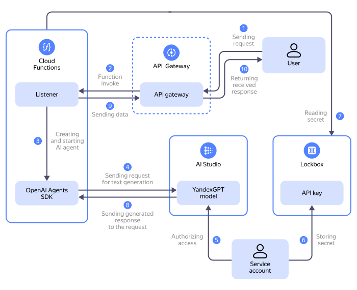

In this tutorial, you will create an agent with response streaming via [web sockets](https://{{ lang }}.wikipedia.org/wiki/WebSocket) on [{{ sf-full-name }}](../../functions/) and [{{ api-gw-full-name }}](../../api-gateway/). The function will use the [OpenAI Agents SDK](https://openai.github.io/openai-agents-python/) to access [the {{ foundation-models-full-name }}](../../ai-studio/quickstart/yandexgpt.md) models.

When an agent handles complex requests, it may take a long time to respond. For example, this may occur when generating large texts with reasoning, performing search operations, or indexing. In such cases, it is essential to monitor progress and receive incremental results in real time. Response streaming enables immediate output of tokens, phrases, intermediate messages, step statuses, and logs, followed by the final response, without waiting for the entire scenario to complete. This enhances perceived speed, provides a more interactive UI/UX, and enables users to cancel, retry, and dynamically update the interface. Streaming is supported by most frameworks. The OpenAI Agents SDK also supports [streaming](https://openai.github.io/openai-agents-python/streaming/).



On the diagram:

1. A user establishes a WebSocket connection to the [API gateway](../../api-gateway/concepts/index.md) and sends a request to the AI agent over it.
1. The API gateway forwards the request to the [function](../../functions/concepts/function.md) handler.
1. The function handler creates and runs the AI agent using the OpenAI Agent SDK in streaming mode. In this mode, the agent will stream data from the model as it becomes available, without waiting for the complete response.
1. The AI agent augments the user request with additional context and sends it to the [text generation model](../../ai-studio/concepts/generation/index.md).
1. A [service account](../../iam/concepts/users/service-accounts.md) provides the AI agent with the [Text Generation API](../../ai-studio/text-generation/api-ref/index.md) access using an [API key](../../iam/concepts/authorization/api-key.md).
1. The service account grants the function access to the [secret](../../lockbox/concepts/secret.md) containing the service account API key.
1. The function retrieves the service account API key from the secret.
1. The model sends the generated response to the AI agent.
1. The AI agent streams data from the model as it becomes available. The data is immediately forwarded to the WebSocket connection the user established earlier using the [{{ api-gw-name }} Web Socket Connection Service](../../api-gateway/apigateway/websocket/api-ref/Connection/send.md). The function then terminates.
1. The API gateway forwards the response to the user.

To create an agent:

1. [Get your cloud ready](#before-begin).
1. [Set up your environment](#setup-environment).
1. [Prepare the project files](#prepare-files).
1. [Create a service account](#create-sa).
1. [Create an API key](#create-api-key).
1. [Create a secret for the API key](#create-secret).
1. [Create a function](#create-function).
1. [Create an API gateway](#create-gateway).
1. [Check the result](#check-result).

If you no longer need the resources you created, [delete them](#clear-out).



If you do not want to tie your AI agent to a specific vendor, deploy the function in {{ serverless-containers-full-name }} as described in [{#T}](../../tutorials/serverless/functions-framework-to-container.md).







## Get your cloud ready {#before-begin}




### Required paid resources {#paid-resources}

The infrastructure support cost for this tutorial includes:

* Fee for the number of requests to the API gateway and outbound traffic (see [{{ api-gw-name }} pricing](../../api-gateway/pricing.md)).
* Text generation fee (see [{{ foundation-models-full-name }} pricing](../../ai-studio/pricing.md)).
* Fee for the number of function calls, computing resources allocated to a function, and outbound traffic (see [{{ sf-name }} pricing](../../functions/pricing.md)).
* Fee for storing the secret and operations with it (see [{{ lockbox-full-name }} pricing](../../lockbox/pricing.md)).
* Fee for collecting and storing logs (see [{{ cloud-logging-full-name }} pricing](../../logging/pricing.md)).


## Set up your environment {#setup-environment}

1. Install [jq](https://jqlang.org/manual/) to work with [JSON](https://{{ lang }}.wikipedia.org/wiki/JSON):

    

      - Linux {#linux}

        ```bash
        apt-get install jq
        ```

      - macOS {#macos}

        ```bash
        brew install jq
        ```

    

1. Install [wscat](https://www.npmjs.com/package/wscat) to test the agent:

    ```bash
    npm install -g wscat
    ```


## Prepare the project files {#prepare-files}

To follow this guide, you need files containing the function code and the API gateway specification.



- Repository

  Clone the repository:

  ```bash
  git clone https://github.com/yandex-cloud-examples/yc-serverless-streaming-openai-agent
  ```

  In the repository, you will see:

  * `function.zip` containing the `function.py` source file and the `requirements.txt` dependency file.
  * `gateway-spec.yaml` file with the API gateway specification.

- Manually

  1. Create a directory named `yc-serverless-streaming-openai-agent` and open it.
  1. Create a file named `function.py` and paste this code into it:

      ```python
      import asyncio
      import json
      import os
      import random
      from typing import Dict, Any

      from agents import Agent, OpenAIProvider, Runner, RunConfig, function_tool, set_tracing_disabled
      from openai import AsyncOpenAI
      from openai.types.responses import ResponseTextDeltaEvent
      from yandex.cloud.serverless.apigateway.websocket.v1.connection_service_pb2 import SendToConnectionRequest
      from yandex.cloud.serverless.apigateway.websocket.v1.connection_service_pb2_grpc import ConnectionServiceStub
      from yandexcloud import SDK

      BASE_URL = os.getenv("BASE_URL")
      API_KEY = os.getenv("API_KEY")
      MODEL_NAME = os.getenv("MODEL_NAME")
      FOLDER_ID = os.environ.get('FOLDER_ID')

      client = AsyncOpenAI(base_url=BASE_URL, api_key=API_KEY)
      set_tracing_disabled(disabled=True)

      @function_tool
      def how_many_jokes() -> int:
          return random.randint(1, 10)

      # Initializing the SDK {{ yandex-cloud }}
      sdk = SDK()

      def get_websocket_service():
          return sdk.client(ConnectionServiceStub)

      def stream_to_websocket(connection_id: str, message: str):
          """Sending messages to the WebSocket connetion"""
          websocket_service = get_websocket_service()
          request = SendToConnectionRequest(
              connection_id=connection_id,
              type=SendToConnectionRequest.TEXT,
              data=message.encode('utf-8')
          )
          websocket_service.Send(request)

      async def process_stream(agent: Agent, run_config: RunConfig, connection_id: str, input_text: str):
          """Processing the agent stream and sending to WebSocket"""
          result = Runner.run_streamed(
              agent,
              input=input_text,
              run_config=run_config
          )

          print("=== Run starting ===")

          async for event in result.stream_events():
              if event.type == "raw_response_event" and isinstance(event.data, ResponseTextDeltaEvent):
                  stream_to_websocket(connection_id, event.data.delta)

          print("=== Run complete ===")

      def handler(event: Dict[str, Any], context):
          """Cloud Function main handler"""
          try:
              # Getting event parameters
              input_text = event['body']
              request_context = event.get('requestContext')
              connection_id = request_context.get('connectionId')

              if not connection_id or not input_text:
                  return {
                      'statusCode': 400,
                      'body': json.dumps({'error': 'Missing required parameters'})
                  }

              # Creating the agent
              agent = Agent(
                  name="Joker",
                  instructions="First call the `how_many_jokes` tool, then tell that many jokes about topic from input.",
                  tools=[how_many_jokes],
                  model=f"gpt://{FOLDER_ID}/yandexgpt/latest",
              )

              run_config = RunConfig(
                  model_provider=OpenAIProvider(
                      api_key=API_KEY,
                      project=FOLDER_ID,
                      base_url="https://rest-assistant.api.cloud.yandex.net/v1",
                      use_responses=True
                  )
              )

              # Running asynchronous handling
              asyncio.run(process_stream(agent, run_config, connection_id, input_text))

              return {
                  'statusCode': 200
              }

          except Exception as e:
              return {
                  'statusCode': 500,
                  'body': json.dumps({'error': str(e)})
              }
      ```

  1. Create a file named `requirements.txt` and paste this code into it:

      ```text
      openai-agents>=0.0.17
      yandexcloud>=0.227.0
      grpcio>=1.60.0
      protobuf>=4.25.1
      openai~=1.86.0
      ```

  1. Create the `function.zip` archive and add the `function.py` and `requirements.txt` files to it.
  1. Create a file named `gateway-spec.yaml` and paste this code into it:

      ```yaml
      openapi: 3.0.0
      info:
        title: Sample API
        version: 1.0.0
      paths:
        /:
          x-yc-apigateway-websocket-message:
            x-yc-apigateway-integration:
              payload_format_version: '0.1'
              function_id: <function_ID>
              tag: $latest
              type: cloud_functions
              service_account_id: <service_account_ID>
      ```

      After you create the service account and functions, specify their IDs.




## Create a service account {#create-sa}

The function will use the service account to get access to the secret and {{ foundation-models-name }} model, and the API gateway will get access to the function.



- Management console {#console}

  1. In the [management console]({{ link-console-main }}), select the [folder](../../resource-manager/concepts/resources-hierarchy.md#folder) where you are going to create your infrastructure.
  1. In the list of services, select **{{ ui-key.yacloud.iam.folder.dashboard.label_iam }}**.
  1. Click **{{ ui-key.yacloud.iam.folder.service-accounts.button_add }}**.
  1. Name the service account: `agent-streamer-sa`.
  1. Click  **{{ ui-key.yacloud.iam.folder.service-account.label_add-role }}** and select these [roles](../../iam/roles-reference.md):
      * `serverless.functions.invoker`
      * `lockbox.payloadViewer`
      * `api-gateway.websocketWriter`
      * `ai.languageModels.user`

  1. Click **{{ ui-key.yacloud.iam.folder.service-account.popup-robot_button_add }}**.

- {{ yandex-cloud }} CLI {#cli}

  

  

  1. Create a service account:

      ```bash
      yc iam service-account create --name agent-streamer-sa
      ```

      Result:

      ```text
      id: ajehqs5gee2e********
      folder_id: b1g681qpemb4********
      created_at: "2025-07-12T17:53:28.180991864Z"
      name: agent-streamer-sa
      ```

  1. Assign [roles](../../iam/roles-reference.md) to the service account:

      ```bash
      yc resource-manager folder add-access-binding <folder_name_or_ID> \
        --role serverless.functions.invoker \
        --subject serviceAccount:<service_account_ID>

      yc resource-manager folder add-access-binding <folder_name_or_ID> \
        --role lockbox.payloadViewer \
        --subject serviceAccount:<service_account_ID>

      yc resource-manager folder add-access-binding <folder_name_or_ID> \
        --role api-gateway.websocketWriter \
        --subject serviceAccount:<service_account_ID>

      yc resource-manager folder add-access-binding <folder_name_or_ID> \
        --role ai.languageModels.user \
        --subject serviceAccount:<service_account_ID>
      ```

      Result:

      ```text
      effective_deltas:
        - action: ADD
          access_binding:
            role_id: serverless.functions.invoker
            subject:
              id: ajehqs5gee2e********
              type: serviceAccount

      effective_deltas:
        - action: ADD
          access_binding:
            role_id: lockbox.payloadViewer
            subject:
              id: ajehqs5gee2e********
              type: serviceAccount

      effective_deltas:
        - action: ADD
          access_binding:
            role_id: api-gateway.websocketWriter
            subject:
              id: ajehqs5gee2e********
              type: serviceAccount

      effective_deltas:
        - action: ADD
          access_binding:
            role_id: ai.languageModels.user
            subject:
              id: ajehqs5gee2e********
              type: serviceAccount
      ```

- API {#api}

  To create a service account, use the [create](../../iam/api-ref/ServiceAccount/create.md) REST API method for the [ServiceAccount](../../iam/api-ref/ServiceAccount/index.md) resource or the [ServiceAccountService/Create](../../iam/api-ref/grpc/ServiceAccount/create.md) gRPC API call.

  To assign the service account the `serverless.functions.invoker`, `lockbox.payloadViewer`, `api-gateway.websocketWriter`, and `ai.languageModels.user` [roles](../../iam/roles-reference.md) for the folder, use the [updateAccessBindings](../../resource-manager/api-ref/Folder/updateAccessBindings.md) REST API method for the [Folder](../../resource-manager/api-ref/Folder/index.md) resource or the [FolderService/UpdateAccessBindings](../../resource-manager/api-ref/grpc/Folder/updateAccessBindings.md) gRPC API call.




## Create an API key {#create-api-key}

The function will use the API key to get access to the {{ foundation-models-name }} model.



- Management console {#console}

  1. In the [management console]({{ link-console-main }}), select **{{ ui-key.yacloud.iam.folder.dashboard.label_iam }}**.
  1. Select the `agent-streamer-sa` service account you created earlier.
  1. In the top panel, click  **{{ ui-key.yacloud.iam.folder.service-account.overview.button_create-key-popup }}** and select **{{ ui-key.yacloud.iam.folder.service-account.overview.button_create_api_key }}**.
  1. In the **{{ ui-key.yacloud.iam.folder.service-account.overview.field_key-scope }}** field, select the `yc.ai.languageModels.execute` [scope](../../iam/concepts/authorization/api-key.md#scoped-api-keys).
  1. Click **{{ ui-key.yacloud.iam.folder.service-account.overview.popup-key_button_create }}**.
  1. Save the ID and secret key you got, as you will need them later when creating the function.

      

      After you close this dialog, the key value will no longer be available.

      

- {{ yandex-cloud }} CLI {#cli}

  

  Run this command:

  ```bash
  yc iam api-key create \
    --service-account-id <service_account_ID> \
    --scopes yc.ai.languageModels.execute
  ```

  Where:

  * `--service-account-id`: `agent-streamer-sa` service account ID.
  * `--scopes`: Key [scopes](../../iam/concepts/authorization/api-key.md#scoped-api-keys).

  Result:

  ```text
  api_key:
    id: aje3dkdmq2qn********
    service_account_id: ajehqs5gee2e********
    created_at: "2025-07-12T18:00:46.418035313Z"
    scope: yc.ai.languageModels.execute
    scopes:
      - yc.ai.languageModels.execute
  secret: AQVNw20bbQtXhfpblT04zJs8Z1wUT5rD********
  ```

  Save the value of the `secret` field.

- API {#api}

  To create an API key, use the [create](../../iam/api-ref/ApiKey/create.md) REST API method for the [ApiKey](../../iam/api-ref/ApiKey/index.md) resource or the [ApiKeyService/Create](../../iam/api-ref/grpc/ApiKey/create.md) gRPC API call.




## Create a {{ lockbox-name }} secret {#create-secret}

The [{{ lockbox-name }}](../../lockbox/) secret will store the secret key.



- Management console {#console}

  1. In the [management console]({{ link-console-main }}), select **{{ ui-key.yacloud.iam.folder.dashboard.label_lockbox }}**.
  1. Click **{{ ui-key.yacloud.lockbox.button_create-secret }}**.
  1. In the **{{ ui-key.yacloud.common.name }}** field, specify the secret name: `api-key-secret`.
  1. In the **{{ ui-key.yacloud.lockbox.forms.title_secret-type }}** field, select `{{ ui-key.yacloud.lockbox.forms.title_secret-type-custom }}`.
  1. In the **{{ ui-key.yacloud.lockbox.forms.label_key }}** field, enter `api-key`.
  1. In the **{{ ui-key.yacloud.lockbox.forms.label_value }}** field, paste the secret key you obtained in the previous step.
  1. Click **{{ ui-key.yacloud.common.create }}**.

- {{ yandex-cloud }} CLI {#cli}

  

  Run this command:

  ```bash
  yc lockbox secret create \
    --name api-key-secret \
    --payload "[{'key': 'api-key', 'text_value': '<secret_key>'}]"
  ```

  Where `text_value` is the API gateway secret key you got in the previous step.

  Result:

  ```text
  id: e6q0rdjdggjp********
  folder_id: b1g681qpemb4********
  created_at: "2025-07-12T18:23:49.844Z"
  name: api-key-secret
  status: ACTIVE
  current_version:
    id: e6qbp772i014********
    secret_id: e6q0rdjdggjp********
    created_at: "2025-07-12T18:23:49.844Z"
    status: ACTIVE
    payload_entry_keys:
      - api-key
  ```

- API {#api}

  To create a secret, use the [create](../../lockbox/api-ref/Secret/create.md) REST API method for the [Secret](../../lockbox/api-ref/Secret/index.md) resource or the [SecretService/Create](../../lockbox/api-ref/grpc/Secret/create.md) gRPC API call.




## Create a function {#create-function}

The function will be created based on the archive with its code and dependencies.



- Management console {#console}

  1. In the [management console]({{ link-console-main }}), select **{{ ui-key.yacloud.iam.folder.dashboard.label_serverless-functions }}**.
  1. Create a function:

     1. Click **{{ ui-key.yacloud.serverless-functions.list.button_create }}**.
     1. In the window that opens, enter `agent-streamer` as the function name.
     1. Click **{{ ui-key.yacloud.common.create }}**.

  1. Create a [function version](../../functions/concepts/function.md#version):

     1. Select `{{ python-full-ver }}` as the runtime environment, disable **{{ ui-key.yacloud.serverless-functions.item.editor.label_with-template }}**, and click **{{ ui-key.yacloud.serverless-functions.item.editor.button_action-continue }}**.
     1. In the **{{ ui-key.yacloud.serverless-functions.item.editor.field_method }}** field, select `{{ ui-key.yacloud.serverless-functions.item.editor.value_method-zip-file }}` and attach the `function.zip` archive you created earlier.
     1. Specify the entry point: `function.handler`.
     1. Under **{{ ui-key.yacloud.serverless-functions.item.editor.label_title-params }}**, specify:

         * **{{ ui-key.yacloud.serverless-functions.item.editor.field_timeout }}**: `30 seconds`.
         * **{{ ui-key.yacloud.serverless-functions.item.editor.field_resources-memory }}**: `512 {{ ui-key.yacloud.common.units.label_megabyte }}`.
         * **{{ ui-key.yacloud.forms.label_service-account-select }}**: Select the `agent-streamer-sa` service account.
         * **{{ ui-key.yacloud.serverless-functions.item.editor.field_environment-variables }}**:

             * `BASE_URL`: {{ foundation-models-full-name }} URL, `https://{{ api-host-llm }}/v1`.
             * `MODEL_NAME`: URI of the {{ foundation-models-full-name }} text generation [model](../../ai-studio/concepts/generation/models.md#generation).

                 For example, `gpt://<folder_ID>/yandexgpt/latest`, where `<folder_ID>` is the [ID of the folder](../../resource-manager/operations/folder/get-id.md) you are creating the infrastructure in.

             * `FOLDER_ID`: [ID of the folder](../../resource-manager/operations/folder/get-id.md) you are creating the infrastructure in.

         * **{{ ui-key.yacloud.serverless-functions.item.editor.label_lockbox-secret }}**:

             * In the **{{ ui-key.yacloud.serverless-functions.item.editor.label_lockbox-env-key }}** field, specify `API_KEY` and select the previously created `api-key-secret`, its version, and `api-key`.

        * If you prefer to opt out of logging so as not to [pay](../../logging/pricing.md) for [{{ cloud-logging-name }}](../../logging/), disable the **{{ ui-key.yacloud.logging.field_logging }}** option.

     1. Click **{{ ui-key.yacloud.serverless-functions.item.editor.button_deploy-version }}**.

- {{ yandex-cloud }} CLI {#cli}

  

  1. Create a function:

      ```bash
      yc serverless function create --name agent-streamer
      ```

      Result:

      ```text
      id: d4eem33cun2k********
      folder_id: b1g681qpemb4********
      created_at: "2025-07-12T18:15:59.854Z"
      name: agent-streamer
      http_invoke_url: https://{{ sf-url }}/d4eem33cun2k********
      status: ACTIVE
      ```

  1. Create a function version:

      ```bash
      yc serverless function version create \
        --function-name agent-streamer \
        --runtime python312 \
        --entrypoint function.handler \
        --memory 512m \
        --execution-timeout 30s \
        --source-path <path_to_archive> \
        --service-account-id <service_account_ID> \
        --environment BASE_URL=https://{{ api-host-llm }}/v1 \
        --environment MODEL_NAME=gpt://<folder_ID>/yandexgpt/latest \
        --environment FOLDER_ID=<folder_ID> \
        --secret name=api-key-secret,key=api-key,environment-variable=API_KEY
      ```

      Where:

      * `--source-path`: Path to `function.zip`.
      * `--service-account-id`: `agent-streamer-sa` service account ID.
      * `--environment`: Environment variables:

          * `BASE_URL`: {{ foundation-models-full-name }} URL, `https://{{ api-host-llm }}/v1`.
          * `MODEL_NAME`: URI of the {{ foundation-models-full-name }} text generation [model](../../ai-studio/concepts/generation/models.md#generation).

              For example, `gpt://<folder_ID>/yandexgpt/latest`, where `<folder_ID>` is the [ID of the folder](../../resource-manager/operations/folder/get-id.md) you are creating the infrastructure in.

          * `FOLDER_ID`: [ID of the folder](../../resource-manager/operations/folder/get-id.md) you are creating the infrastructure in.

      * `--secret`: `api-key-secret` secret.

      Result:

      ```text
      id: d4e6d89oi342********
      function_id: d4eem33cun2k********
      created_at: "2025-07-12T18:27:29.887Z"
      runtime: python312
      entrypoint: function.handler
      resources:
        memory: "536870912"
      execution_timeout: 30s
      service_account_id: ajehqs5gee2e********
      image_size: "59891712"
      status: ACTIVE
      tags:
        - $latest
      environment:
        BASE_URL: https://{{ api-host-llm }}/foundationModels/v1
        FOLDER_ID: b1g681qpemb4********
        MODEL_NAME: gpt://b1g681qpemb4********/yandexgpt/latest
      secrets:
        - id: e6q0rdjdggjp********
          version_id: e6qbp772i014********
          key: api-key
          environment_variable: API_KEY
      log_options:
        folder_id: b1g681qpemb4********
      concurrency: "1"
      ```

- API {#api}

  To create a function, use the [create](../../functions/functions/api-ref/Function/create.md) REST API method for the [Function](../../functions/functions/api-ref/Function/index.md) resource or the [FunctionService/Create](../../functions/functions/api-ref/grpc/Function/create.md) gRPC API call.

  To create a function version, use the [createVersion](../../functions/functions/api-ref/Function/createVersion.md) REST API method for the [Function](../../functions/functions/api-ref/Function/index.md) resource or the [FunctionService/CreateVersion](../../functions/functions/api-ref/grpc/Function/createVersion.md) gRPC API call.




## Create an API gateway {#create-gateway}

Create the API gateway for accessing the function.

1. Open the `gateway-spec.yaml` file and specify the following in it:

    * `function_id`: `agent-streamer` function ID.
    * `service_account_id`: `agent-streamer-sa` service account ID.

1. Create an API gateway:

    

    - Management console {#console}

      1. In the [management console]({{ link-console-main }}), select **{{ ui-key.yacloud.iam.folder.dashboard.label_api-gateway }}**.
      1. Click **{{ ui-key.yacloud.serverless-functions.gateways.list.button_create }}**.
      1. In the **{{ ui-key.yacloud.common.name }}** field, enter `agent-streamer-gateway` as the name of the API gateway.
      1. Under **{{ ui-key.yacloud.serverless-functions.gateways.form.field_spec }}**, paste the contents of the `gateway-spec.yaml` file.
      1. If you prefer to opt out of logging so as not to pay {{ cloud-logging-name }}, disable the **{{ ui-key.yacloud.logging.field_logging }}** option.
      1. Click **{{ ui-key.yacloud.serverless-functions.gateways.form.button_create-gateway }}**.
      1. Select the created API gateway. Save the **{{ ui-key.yacloud.serverless-functions.gateways.overview.label_wss_domain }}** field value as you will need it at the next step.

    - {{ yandex-cloud }} CLI {#cli}

      

      Run this command:

      ```bash
      yc serverless api-gateway create \
      --name agent-streamer-gateway \
      --spec <specification_file_path>
      ```

      Where `--spec` is the path to the `gateway-spec.yaml` file.

      Result:

      ```text
      id: d5dgs4pn5iil********
      folder_id: b1g681qpemb4********
      created_at: "2025-07-12T18:34:29.535Z"
      name: agent-streamer-gateway
      status: ACTIVE
      domain: d5dgs4pn5iil********.********.apigw.yandexcloud.net
      connectivity: {}
      log_options:
        folder_id: b1g681qpemb4********
      execution_timeout: 300s
      ```

      Save the `domain` field value as you will need it at the next step.

    - API {#api}

      To create an API gateway, use the [create](../../api-gateway/apigateway/api-ref/ApiGateway/create.md) REST API method for the [ApiGateway](../../api-gateway/apigateway/api-ref/ApiGateway/index.md) resource or the [ApiGatewayService/Create](../../api-gateway/apigateway/api-ref/grpc/ApiGateway/create.md) gRPC API call.

    


## Test the agent {#check-result}

1. Connect to WebSocket:

    ```bash
    wscat -c wss://<API_gateway_domain>
    ```


1. Send a message:

    ```text
    Tell me a joke about programming
    ```

    Result:

    ```text
    < Here
    <  are 5 jokes about
    <  programming:
    ...
    ```

    The actual response text may differ.


## How to delete the resources you created {#clear-out}

Delete the resources you no longer need to avoid [paying](#paid-resources) for them:

1. [Delete the API gateway](../../api-gateway/operations/api-gw-delete.md).
1. [Delete](../../functions/operations/function/function-delete.md) the function.
1. [Delete](../../lockbox/operations/secret-delete.md) the secret.
1. If you had left the function logging feature on, [delete](../../logging/operations/delete-group.md) the log group.