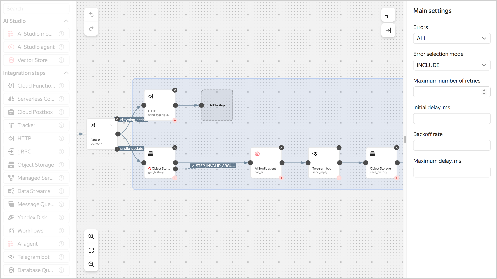

# How to create a Telegram bot with AI agent support using {{ sw-full-name }}


With serverless technologies, you can create a Telegram bot with [text generation model]({{ link-docs-ai }}ai-studio/concepts/generation/models) support based on [{{ ai-studio-full-name }}]({{ link-docs-ai }}ai-studio/concepts/).

In this tutorial, you will create a bot which provides movie recommendations based on user preferences. You will do this by creating an AI agent, arranging for data storage in [{{ objstorage-full-name }}](../../storage/) and [{{ lockbox-full-name }}](../../lockbox/), setting up bot logic in [{{ sw-full-name }}](../../serverless-integrations/), and a webhook to start using a link.

To create a bot:

1. [Get your cloud ready](#before-you-begin).
1. [Register your Telegram bot](#create-bot).
1. [Create a secret](#create-secret).
1. [Create a bucket](#create-bucket).
1. [Create a service account](#create-sa).
1. [Create an AI agent](#create-ai-agent).
1. [Set up a workflow](#config-workflow).
1. [Set up a webhook for your bot](#config-webhook).
1. [Test your bot](#check-result).
1. [Customize the agent](#what-is-next).

If you no longer need the resources you created, [delete them](#clear-out).


## Getting started {#before-you-begin}




## Required paid resources {#paid-resources}

The cost of Telegram bot support includes:

* Text generation fee (see [{{ ai-studio-full-name }} pricing]({{ link-docs-ai }}ai-studio/pricing)).
* Fee for storing the secret and requests to the secret (see [{{ lockbox-full-name }} pricing](../../lockbox/pricing.md)).
* Fee for the amount of stored data, number of data operations, and outbound traffic (see [{{ objstorage-full-name }} pricing](../../storage/pricing.md)).
* Fee for collecting and storing logs (see [{{ cloud-logging-full-name }} pricing](../../logging/pricing.md)).


## Register your Telegram bot {#create-bot}

Register your bot in Telegram and get a token.

1. To register the new bot, start [BotFather](https://t.me/BotFather) and run this command:

    ```text
    /newbot
    ```

1. Specify the bot’s name, e.g., `Serverless AI Telegram Bot`. This is the name users will see when chatting with the bot.
1. Specify the username of your bot, e.g., `ServerlessAITelegramBot`. You can use it to find the bot in Telegram. The username must end with `...Bot` or `..._bot`.

    As a result, you will get a token. Save it, as you will need it later.


## Create a secret {#create-secret}

Create a [secret](../../lockbox/concepts/secret.md) to store the token for access to the Telegram API.



- Management console {#console}

  1. In the [management console]({{ link-console-main }}), select the [folder](../../resource-manager/concepts/resources-hierarchy.md#folder) where you are going to create your infrastructure.
  1. [Go](../../console/operations/select-service.md#select-service) to **{{ ui-key.yacloud.iam.folder.dashboard.label_lockbox }}**.
  1. Click **{{ ui-key.yacloud.lockbox.button_create-secret }}**.
  1. In the **{{ ui-key.yacloud.common.name }}** field, enter a name for the secret.
  1. Select the `{{ ui-key.yacloud.lockbox.forms.title_secret-type-custom }}` secret type.
  1. In the **{{ ui-key.yacloud.lockbox.forms.label_key }}** field, enter `token`.
  1. In the **{{ ui-key.yacloud.lockbox.forms.label_value }}** field, specify the bot’s token you got when [creating](#create-bot) it.
  1. Click **{{ ui-key.yacloud.common.create }}**.

- {{ yandex-cloud }} CLI {#cli}

  

  

  1. View the description of the CLI command for creating a secret:

      ```bash
      yc lockbox secret create --help
      ```

  1. Create a secret:

      ```bash
      yc lockbox secret create \
        --name tg-bot-token \
        --payload '[{"key":"token","text_value":"<bot_token>"}]'
      ```

      Where:

      * `--name`: Secret name.
      * `--payload`: Secret contents as a YAML or JSON array.

          * `key`: Secret key.
          * `text_value`: Secret value. Specify the token you received when [creating the bot](#create-bot).

      Result:

      ```text
      id: e6qf05v4ftms********
      folder_id: b1g681qpemb4********
      created_at: "2025-08-20T12:26:02.961Z"
      name: tg-bot-token
      status: ACTIVE
      current_version:
        id: e6q768pl3vrf********
        secret_id: e6qf05v4ftms********
        created_at: "2025-08-20T12:26:02.961Z"
        status: ACTIVE
        payload_entry_keys:
          - token
      ```

- API {#api}

  To create a secret, use the [Create](../../lockbox/api-ref/Secret/create.md) REST API method for the [Secret](../../lockbox/api-ref/Secret/index.md) resource or the [SecretService/Create](../../lockbox/api-ref/grpc/Secret/create.md) gRPC API call.




## Create a bucket {#create-bucket}

Create a [bucket](../../storage/concepts/bucket.md) to store your chat history with the bot.



- Management console {#console}

  1. Open the [management console]({{ link-console-main }}).
  1. [Go](../../console/operations/select-service.md#select-service) to **{{ ui-key.yacloud.iam.folder.dashboard.label_storage }}**.
  1. In the top panel, click **{{ ui-key.yacloud.storage.buckets.button_create }}**.
  1. Enter a name for the bucket consistent with the [naming conventions](../../storage/concepts/bucket.md#naming).
  1. Specify the maximum bucket size: `5 {{ ui-key.yacloud.common.units.label_gigabyte }}`.
  1. Click **{{ ui-key.yacloud.storage.buckets.create.button_create }}**.

- {{ yandex-cloud }} CLI {#cli}

  1. View the description of the CLI command to create a bucket:

      ```bash
      yc storage bucket create --help
      ```

  1. Create a bucket in the default [folder](../../resource-manager/concepts/resources-hierarchy.md#folder):

      ```bash
      yc storage bucket create \
        --name <bucket_name> \
        --default-storage-class standard \
        --max-size 5368709120
      ```

      Where:

      * `--name`: Bucket name consistent with the [naming conventions](../../storage/concepts/bucket.md#naming).
      * `--default-storage-class`: [Storage class](../../storage/concepts/storage-class.md).
      * `--max-size`: Maximum bucket size, in bytes.

      Result:

      ```text
      name: bot-history-storage
      folder_id: b1g681qpemb4********
      anonymous_access_flags: {}
      default_storage_class: STANDARD
      versioning: VERSIONING_DISABLED
      max_size: "5368709120"
      created_at: "2025-08-20T12:23:21.361186Z"
      resource_id: e3erbgk1qmih********
      ```

- AWS CLI {#aws-cli}

  

  To create a bucket, [assign](../../iam/operations/sa/assign-role-for-sa.md) the `storage.editor` [role](../../storage/security/index.md#storage-editor) to the service account used by the AWS CLI.

  In the terminal, run this command:

  ```bash
  aws s3api create-bucket \
    --endpoint-url=https://{{ s3-storage-host }} \
    --bucket <bucket_name>
  ```

  Where:

  * `--endpoint-url`: {{ objstorage-name }} endpoint.
  * `--bucket`: Bucket name consistent with the [naming conventions](../../storage/concepts/bucket.md#naming).

- API {#api}

  To create a bucket, use the [Create](../../storage/api-ref/Bucket/create.md) REST API method for the [Bucket](../../storage/api-ref/Bucket/index.md) resource, the [BucketService/Create](../../storage/api-ref/grpc/Bucket/create.md) gRPC API call, or the [create](../../storage/s3/api-ref/bucket/create.md) S3 API method.




## Create a service account {#create-sa}

Create a [service account](../../iam/concepts/users/service-accounts.md) named `sa-workflows`, which you will use to execute the workflow steps.



- Management console {#console}

  1. Open the [management console]({{ link-console-main }}).
  1. [Go](../../console/operations/select-service.md#select-service) to **{{ ui-key.yacloud.iam.folder.dashboard.label_iam }}**.
  1. Click **{{ ui-key.yacloud.iam.folder.service-accounts.button_add }}**.
  1. Enter a name for the service account: `sa-workflows`.
  1. Click  **{{ ui-key.yacloud.iam.folder.service-account.label_add-role }}** and assign these [roles](../../iam/roles-reference.md):

      * `storage.uploader`
      * `storage.viewer`
      * `{{ roles-lockbox-payloadviewer }}`
      * `{{ roles-yagpt-user }}`
      * `ai.assistants.editor`

  1. Click **{{ ui-key.yacloud.iam.folder.service-account.popup-robot_button_add }}**.

- {{ yandex-cloud }} CLI {#cli}

  1. If you do not have [jq](https://stedolan.github.io/jq/download/) yet, install it.

  1. View a description of the CLI command to create a service account:

      ```bash
      yc iam service-account create --help
      ```

  1. Create a service account:

      ```bash
      yc iam service-account create --name sa-workflows
      ```

      Where `--name` is the service account name.

      Result:

      ```text
      id: ajersnus6rb2********
      folder_id: b1g681qpemb4********
      created_at: "2025-08-20T12:18:41.869376672Z"
      name: sa-workflows
      ```

  1. Save the service account ID and the folder ID to these variables:

      ```bash
      WF_SA=$(yc iam service-account get --name sa-workflows --format json | jq -r .id)
      FOLDER_ID=$(yc config get folder-id)
      ```

  1. View the description of the CLI command for assigning a [role](../../iam/roles-reference.md) for the folder:

      ```bash
      yc resource-manager folder add-access-binding --help
      ```

  1. Assign the following roles for the folder to the service account:

      ```bash
      yc resource-manager folder add-access-binding \
        --id $FOLDER_ID \
        --role storage.uploader \
        --subject serviceAccount:$WF_SA

      yc resource-manager folder add-access-binding \
        --id $FOLDER_ID \
        --role storage.viewer \
        --subject serviceAccount:$WF_SA

      yc resource-manager folder add-access-binding \
        --id $FOLDER_ID \
        --role {{ roles-lockbox-payloadviewer }} \
        --subject serviceAccount:$WF_SA

      yc resource-manager folder add-access-binding \
        --id $FOLDER_ID \
        --role {{ roles-yagpt-user }} \
        --subject serviceAccount:$WF_SA

      yc resource-manager folder add-access-binding \
        --id $FOLDER_ID \
        --role ai.assistants.editor \
        --subject serviceAccount:$WF_SA
      ```

      Where:

      * `--id`: Folder ID.
      * `--role`: Role.
      * `--subject`: Service account ID.

      Result:

      ```text
      effective_deltas:
        - action: ADD
          access_binding:
            role_id: {{ roles-yagpt-user }}
            subject:
              id: ajersnus6rb2********
              type: serviceAccount
      ```

- API {#api}

  Create a service account named `sa-workflows` with the following roles:

  * `storage.uploader`
  * `storage.viewer`
  * `{{ roles-lockbox-payloadviewer }}`
  * `{{ roles-yagpt-user }}`
  * `ai.assistants.editor`

  To create a service account, use the [Create](../../iam/api-ref/ServiceAccount/create.md) REST API method for the [ServiceAccount](../../iam/api-ref/ServiceAccount/index.md) resource or the [ServiceAccountService/Create](../../iam/api-ref/grpc/ServiceAccount/create.md) gRPC API call.

  To assign a role to a service account, use the [updateAccessBindings](../../iam/api-ref/ServiceAccount/updateAccessBindings.md) REST API method for the [ServiceAccount](../../iam/api-ref/ServiceAccount/index.md) resource or the [ServiceAccountService/UpdateAccessBindings](../../iam/api-ref/grpc/ServiceAccount/updateAccessBindings.md) gRPC API call.




## Create an AI agent {#create-ai-agent}

Create a [text agent]({{ link-docs-ai }}ai-studio/concepts/agents/text-agents) in {{ ai-studio-name }} to process user requests.



- Management console {#console}

  1. Open the [{{ ai-studio-name }} interface]({{ link-console-ai }}).
  1. Click **{{ ui-key.yacloud.yagpt.YaGPT.Overview3.action-card_create-ai-agent_ahZQH }}** → **{{ ui-key.yacloud.yagpt.YaGPT.CreateAgentCard.create-agent_button-text_n2qCs }}**.
  1. In the **{{ ui-key.yacloud.yagpt.YaGPT.name_hTzhB }}** field, enter a name for the agent, e.g., `Cinephile agent`.
  1. In the **{{ ui-key.yacloud.yagpt.YaGPT.agent_instruction_9oe6q }}** field, enter an instruction for the agent:

      ```
      You are a movie selection consultant
      
      You goal is to help the user find a movie to watch based on their preferences.
      On first request, ask them to name some of their favorite movies (one per line).
      Use this information to make recommendations, ask clarifying questions.
      
      History of previous conversations: not_var{{ backstory }}
      ```

      

      The `not_var{{ backstory }}` variable is used to provide conversation history to the agent. It allows the agent to be aware of the user’s previous messages when generating a response.

      

  1. Click **{{ ui-key.yacloud.common.create }}**.
  1. Copy the ID of the agent you created by clicking **ID**  at the top left. Save it. You will need this ID to set up a workflow.




## Set up a workflow {#config-workflow}

Set up a workflow to enable the bot to read and save the chat history, call the AI agent, and send responses to Telegram.






### Prepare a YaWL specification {#prepare-spec-wf}

Save the workflow [YaWL specification](../../serverless-integrations/concepts/workflows/yawl/index.md) to a YAML file, e.g., `yawl-spec.yaml`.

```yaml
yawl: '0.1'
start: do_work
steps:
  do_work:
    parallel:
      branches:

        # Branch which outputs _typing_ to reanimate the chat faster
        send_typing_action:
          start: send_typing_action
          steps:
            send_typing_action:
              httpCall:
                url: >-
                  https://api.telegram.org/bot\(lockboxPayload("<secret_ID>"; "token"))/sendChatAction
                method: POST
                headers:
                  Content-Type: application/json
                body: |
                  \({
                    chat_id: .input.message.chat.id,
                    action: "typing"
                  })

        # Basic logic
        handle_update:
          start: get_history
          steps:
            get_history:
              objectStorage:
                bucket: <bucket_name>
                object: history/\(.input.message.chat.id).json
                get:
                  contentType: JSON
                output: '\({history: .Content})'
                next: call_ai
                catch:
                  - errorList:
                      - STEP_INVALID_ARGUMENT # There is no file or it is not JSON -> initialize
                    errorListMode: INCLUDE
                    output: '\({history: []})'
                    next: call_ai

            call_ai:
              aiStudioAgent:
                promptTemplateId: <agent_ID>
                message: \(.input.message.text)
                variables:
                  backstory: >-
                    History of previous conversations (JSON array of objects):
                    {role,message}): "\(.history)"
                output: '\({reply: .Result})'
                next: send_reply

            send_reply:
              telegramBot:
                token: \(lockboxPayload("<secret_ID>"; "token"))
                sendMessage:
                  chatId: \(.input.message.chat.id)
                  text: \(.reply)
                  replyTo: \(.input.message.message_id)
                  parseMode: MARKDOWN
                next: save_history

            save_history:
              objectStorage:
                bucket: <bucket_name>
                object: history/\(.input.message.chat.id).json
                put:
                  contentType: JSON
                  content: >-
                    \(
                      .history +
                      [
                        {role:"user", message:.input.message.text},
                        {role:"assistant", message:.reply}
                      ]
                    )
```

Where:

* `<bucket_name>`: Name of the bucket you [created earlier](#create-bucket).
* `<secret_ID>`: ID of the secret you [created earlier](#create-secret).
* `<agent_ID>`: ID of the agent [you created earlier](#create-ai-agent).


### Create a workflow {#create-workflow}



- Management console {#console}

  1. Open the [management console]({{ link-console-main }}).
  1. [Go](../../console/operations/select-service.md#select-service) to **{{ ui-key.yacloud.iam.folder.dashboard.label_serverless-integrations }}**.
  1. In the left-hand panel, click  **{{ ui-key.yacloud.serverless-workflows.label_service }}**.
  1. In the top-right corner, click **{{ ui-key.yacloud.serverless-workflows.button_create-workflow }}**.
  1. Choose the `{{ ui-key.yacloud.serverless-workflows.spec-editor-type_label_text-editor }}` method.
  1. In the code editor, paste the text of the previously prepared YaWL workflow specification.
  1. Expand **{{ ui-key.yacloud.serverless-workflows.label_additional-parameters }}**:

      1. Enter a name for the workflow. Follow these naming requirements:

          

      1. Select the `sa-workflows` service account.
      1. Under **{{ ui-key.yacloud.logging.label_title }}**, disable **{{ ui-key.yacloud.logging.field_logging }}** if you do not want to pay for storing logs.

  1. Click **{{ ui-key.yacloud.common.create }}**.

- {{ yandex-cloud }} CLI {#cli}

  1. See the description of the CLI command for creating a workflow:

      ```bash
      yc serverless workflow create --help
      ```

  1. Create a workflow:

      ```bash
      yc serverless workflow create \
        --yaml-spec <specification_file> \
        --name <workflow_name> \
        --service-account-id $WF_SA
      ```

      Where:

      * `--yaml-spec`: Path to the file with the workflow YaWL specification prepared earlier, e.g., `./yawl-spec.yaml`.
      * `--name`: Workflow name. Follow these naming requirements:

          

      * `--service-account-id`: `sa-workflows` service account ID.

      Result:

      ```text
      id: dfqjl5hh5p90********
      folder_id: b1g681qpemb4********
      specification:
        spec_yaml: "yawl: ..."
      created_at: "2025-03-11T09:27:51.691990Z"
      name: my-workflow
      status: ACTIVE
      log_options: {}
      service_account_id: aje4tpd9coa********
      execution_url: https://serverless-workflows.{{ api-host }}/workflows/v1/execution/dfq0eod50iol********/start
      ```

- API {#api}

  To create a workflow, use the [Create](../../serverless-integrations/workflows/api-ref/Workflow/create.md) REST API method for the [Workflows](../../serverless-integrations/workflows/api-ref/Workflow/index.md) resource or the [Workflow/Create](../../serverless-integrations/workflows/api-ref/grpc/Workflow/create.md) gRPC API call.




### Make the workflow public {#make-public}

Make the workflow public so it can be executed via a link without authentication.



- Management console {#console}

  1. In the [management console]({{ link-console-main }}), select the folder containing the [workflow](../../serverless-integrations/concepts/workflows/workflow.md).
  1. [Go](../../console/operations/select-service.md#select-service) to **{{ ui-key.yacloud.iam.folder.dashboard.label_serverless-integrations }}**.
  1. In the left-hand panel, click  **{{ ui-key.yacloud.serverless-workflows.label_service }}**.
  1. Select the workflow.
  1. Enable **{{ ui-key.yacloud.serverless-workflows.label_public-access }}**.
  1. Click **{{ ui-key.yacloud.common.save }}**.

- {{ yandex-cloud }} CLI {#cli}

  1. View the description of the CLI command for updating a [workflow](../../serverless-integrations/concepts/workflows/workflow.md):

      ```bash
      yc serverless workflow update --help
      ```

  1. Make the workflow public:

      ```bash
      yc serverless workflow update \
        --name <workflow_name> \
        --set-is-public
      ```

      Result:

      ```text
      id: dfqjl5hh5p90********
      ...
      is_public: true
      execution_url: https://serverless-workflows.{{ api-host }}/workflows/v1/execution/dfq0eod50iol********/start
      ```

- API {#api}

  To make a [workflow](../../serverless-integrations/concepts/workflows/workflow.md) public, use the [Update](../../serverless-integrations/workflows/api-ref/Workflow/update.md) REST API method for the [Workflows](../../serverless-integrations/workflows/api-ref/Workflow/index.md) resource or the [workflow/Update](../../serverless-integrations/workflows/api-ref/grpc/Workflow/update.md) gRPC API call with `isPublic: true`.





Any user can execute a public workflow without an IAM token. This is necessary for setting up a Telegram webhook to send workflow execution requests via a link.




## Set up a webhook for your bot {#config-webhook}

Set up a webhook for your bot for it to send workflow execution requests via a link.


### Get a workflow execution link {#get-execution-url}



- Management console {#console}

  1. In the [management console]({{ link-console-main }}), select the folder containing the workflow.
  1. [Go](../../console/operations/select-service.md#select-service) to **{{ ui-key.yacloud.iam.folder.dashboard.label_serverless-integrations }}**.
  1. In the left-hand panel, click  **{{ ui-key.yacloud.serverless-workflows.label_service }}**.
  1. Select a workflow. The execution link will appear in the **{{ ui-key.yacloud.serverless-workflows.label_execution-url }}** field.

- {{ yandex-cloud }} CLI {#cli}

  To get an execution link, run this command:

  ```bash
  yc serverless workflow get <workflow_name>
  ```

  Result:

  ```text
  id: dfqjl5hh5p90********
  ...
  is_public: true
  execution_url: https://serverless-workflows.{{ api-host }}/workflows/v1/execution/dfq0eod50iol********/start
  ```

  Save the value of the `execution_url` field.

- API {#api}

  To get a workflow execution link, use the [get](../../serverless-integrations/workflows/api-ref/Workflow/get.md) REST API method for the [Workflow](../../serverless-integrations/workflows/api-ref/Workflow/index.md) resource or the [WorkflowsService/Get](../../serverless-integrations/workflows/api-ref/grpc/Workflow/get.md) gRPC API call. The execution link will appear in the `execution_url` field.




### Set up a webhook {#setup-webhook}

If you do not have [cURL](https://curl.haxx.se) yet, install it.



Set up a webhook for your bot:



- Bash {#bash}

  Run this command:

  ```bash
  curl -s "https://api.telegram.org/bot<bot_token>/setWebhook" \
    -d "url=<execution_url>"
  ```

  Where:

  * `<bot_token>`: Token you got when [creating the bot](#create-bot).
  * `<execution_url>`: Workflow execution link you got in the [previous step](#get-execution-url).

  For example:

  ```bash
  curl -s "https://api.telegram.org/bot1357246809:AAFhSteLniAw71g8jx6K5kTErO3********/setWebhook" \
    -d "url=https://serverless-workflows.{{ api-host }}/workflows/v1/execution/fd2g4pu20roc********/start"
  ```

  Result:

  ```text
  {"ok":true,"result":true,"description":"Webhook was set"}
  ```




## Test your bot {#check-result}

1. Find the bot in Telegram by its username, which you created [earlier](#create-bot).
1. Click **START** to start a chat.
1. Send the bot a list of movie titles, one per line.

    For example:

    ```text
    Movie 1
    Movie 2
    Movie 3
    ```

    Bot's response:

    ```text
    Hi there! Thank you for letting me know your preferences. Here are the movies I would recommend based on your tastes:
    ...
    Which of these films you would like to watch? Or do you have some other favourite movies you want me to consider?
    ```


#### What's next {#what-is-next}

Try editing the agent's instruction in {{ ai-studio-name }} to suit your task. For example, edit the agent's instruction to make it select music artists:

```
You are a music artist selection consultant

You goal is to help the user find music to listen to based on their preferences.
On first request, ask them to name some of their favorite bands, artists,
composers, and genres (one per line).
Use this information to make recommendations, ask clarifying questions.

History of previous conversations: not_var{{ backstory }}
```

Also, you can:
* Add text or files as sources of information for the agent. For more information, see [Text-based agents in {{ ai-studio-name }}]({{ link-docs-ai }}ai-studio/concepts/agents/text-agents).
* Configure conversation context management. For more information, see [Conversation context management]({{ link-docs-ai }}ai-studio/operations/agents/manage-context).
* Use the agent's other tools, such as file search or web search.


## How to delete the resources you created {#clear-out}

Delete the resources you no longer need to avoid [paying](#paid-resources) for them:

1. [Delete](../../serverless-integrations/operations/workflows/workflow/delete.md) the workflow.
1. [Delete](../../storage/operations/buckets/delete.md) the bucket.
1. [Delete](../../lockbox/operations/secret-delete.md) the secret.
1. Delete the AI agent in {{ ai-studio-name }}.
1. If the workflow logging feature was left on, [delete](../../logging/operations/delete-group.md) the log group.