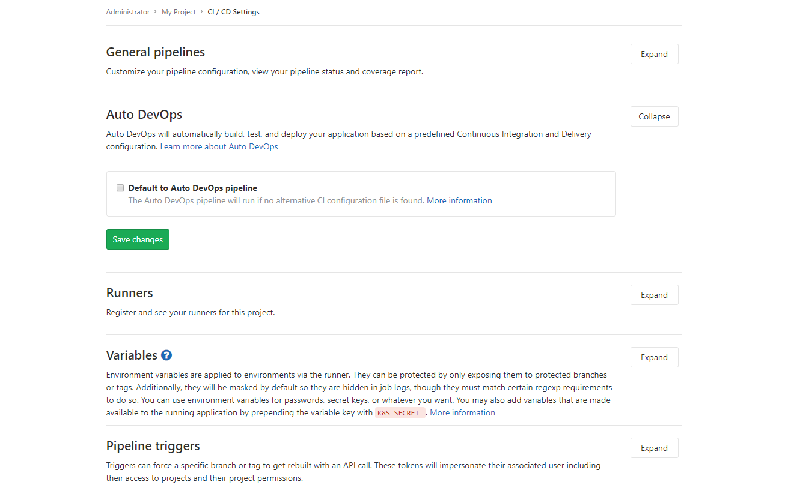
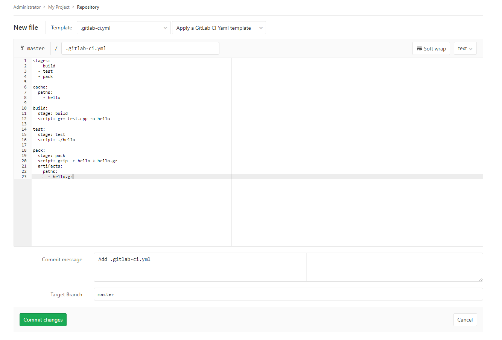

# Testing applications with GitLab

[GitLab](https://ru.wikipedia.org/wiki/GitLab) is a web-based Git repository management site and system. GitLab also lets developers run a continuous deployment process for writing, testing, and deploying code.

Using these instructions, you'll configure GitLab on a VM, create a simple C++ project, set up a test script for the project, and test it.

To create and test a project in the GitLab environment:

1. [Before you start](#before-you-begin).
1. [Required paid resources](#paid-resources).
1. [Create a VM with GitLab](#create-vm).
1. [Configure GitLab](#configure-gitlab).
1. [Set privacy settings](#disable-signup).
1. [Create a project](#create-project).
1. [Set up and run testing for the project](#ci-cd).
1. [Configure and register a Runner](#configure-runner).
1. [Create a test script](#create-test-case).
1. [Create an error in the project](#create).
1. [How to delete created resources](#clear-out).

## Before you start {#before-you-begin}





### Required paid resources {#paid-resources}

The cost for maintaining a GitLab server includes:

* A fee for a disk and continuously running VM (see [pricing{{ compute-full-name }}](../../compute/pricing.md)).
* A fee for using a dynamic or static public IP address (see [{{ vpc-full-name }} pricing](../../vpc/pricing.md)).



## Create a VM with GitLab {#create-vm}

1. On the folder page in the [management console]({{ link-console-main }}), click **Create resource**, and select **Virtual machine**.

1. In the **Name** field, enter a name for the VM: `gitlab`.

1. Select the [availability zone](../../overview/concepts/geo-scope.md) to host the VM in.

1. Under **Image/boot disk selection**, click the **{{ marketplace-name }}** tab, and select the public [GitLab](/marketplace/products/yc/gitlab) image.

1. Under **Disks**, select an SSD with 20 GB.

1. Under **Computing resources**:

   * Choose a [platform](../../compute/concepts/vm-platforms.md) for the VM.

   * Specify the necessary number of vCPUs and amount of RAM.

     For GitLab to run properly, specify the following configuration:
      * **Platform**: Intel Ice Lake.
      * **Guaranteed vCPU share**: 100%.
      * **vCPU**: 2.
      * **RAM**: 4 GB.

1. Under **Network settings**:
   - Select the **Network** and **Subnet** to connect the VM to. If you don't have a network or subnet, create them right on the VM creation page.
   - In the **Public address** field, leave the **Auto** value to assign a random external IP address from the {{ yandex-cloud }} pool, or select a static address from the list if you reserved one in advance.

1. Under **Access**, specify the information required to access the VM:
   - In the **Login** field, enter a username to be created on the VM.
   - In the **SSH key** field, paste your public SSH key. You need to create a key pair for the SSH connection yourself. Learn [how to connect to VMs via SSH](../../compute/operations/vm-connect/ssh.md).

1. Click **Create VM**.

1. Wait about five minutes until the VM is created and all services are started on it. After all of the services fully launch, GitLab becomes available from the web interface in the browser.

## Configure GitLab {#configure-gitlab}

1. In the [management console]({{ link-console-main }}), open the {{ compute-name }} service page. Select the `gitlab` VM and copy its public IP address.
1. Open the GitLab web interface in the browser using the VM public IP address: `http://<VM public IP>`.
1. This opens the start page where you're prompted to create an admin password. Enter the password twice and click **Change your password**.
1. Log in using an administrator account:
   * **Username or email**: `root`.
   * **Password**: The password set in the previous step.

### Set privacy settings {#disable-signup}

Disable sign-up for other users on the login page:

1. Click **Configure GitLab**
1. In the left panel, go to **Settings** and select **General**.
1. Under **Sign-up restrictions**, click **Expand**.
1. Disable **Sign-up enabled**.
1. Click **Save changes**.

Now, only the administrator can register a new user from the **Users** tab in **Overview**.

## Create a project {#create-project}

To create a project:

1. On the GitLab home page, select **Create a project**.

1. On the page that opens, specify:
   * Project name: `My Project`.
   * Project group and ID: `root` and `my-project`.
   * If necessary, give a description and the scope of the project.

1. Click **Create project**.


1. Once you create the project, in the left panel, go to **Settings** and select **CI/CD**.

1. Under **Auto DevOps**, click **Expand**, disable the option **Default to Auto DevOps pipeline**, and save changes by clicking **Save changes**.


1. Add a project file.

   1. In the left panel, go to **Project** and select **Details**.

   1. On the project page, click **New file**.

   1. Name the file `test.cpp`. Add the code of a program that checks the product of multiplying 2 x 2 and outputs `Hello World` if it's 4:

      ```cpp
      #include <iostream>
      #include <cassert>
      
      int main() {
        assert(2 * 2 == 4);
        std::cout << "Hello world!" << std::endl;
        return 0;
      }
      ```

      

   2. Enter a name for the commit in the **Commit message** field.

   3. Click **Commit changes**.

## Set up and run testing for the project {#ci-cd}

A Runner is a special program that tests and builds projects in the GitLab environment according to the instructions you set.

### Configure and register a Runner {#configure-runner}

1. [Log in via SSH](../../compute/operations/vm-connect/ssh.md) to the VM and switch to admin mode in the console:

   ```bash
   sudo -i
   ```

1. Download the Runner:

   ```bash
   # curl -L --output /usr/local/bin/gitlab-runner https://gitlab-runner-downloads.s3.amazonaws.com/latest/binaries/gitlab-runner-linux-amd64
   ```

1. Make the Runner executable:

   ```bash
   # chmod +x /usr/local/bin/gitlab-runner
   ```

1. Create a separate user to start the Runner:

   ```bash
   # useradd --comment 'GitLab Runner' --create-home gitlab-runner --shell /bin/bash
   ```

1. Install and start the Runner:

   ```bash
   # gitlab-runner install --user=gitlab-runner --working-directory=/home/gitlab-runner
   # gitlab-runner start
   ```

1. Register the Runner with GitLab:

   1. Launch interactive registration with the `gitlab-runner register` command.

   1. Enter the URL of your GitLab server. When you see the prompt:

      ```
      Please enter the gitlab-ci coordinator URL (e.g. https://gitlab.com)
      ```

      enter `http://<public-IP-address-of-your-VM>`

   1. Enter the registration token for the Runner. To find it, go to the project page in GitLab, select **Settings** in the left panel, and open the **CI/CD** tab. Then click **Expand** under **Runners**. Under **Set up a specific Runner manually**, copy the token from step 3 and enter it in the request response:

      ```
      Please enter the gitlab-ci token for this runner
      <token>
      ```

      

   1. When prompted:

      ```
      Please enter the gitlab-ci description for this runner
      ```

      enter a description for the Runner: `My runner`.

   1. Don't specify anything in the tag field, just press **Enter**. Otherwise, by default, the Runner won't run without specifying the appropriate tags for the project.

   1. Specify the runtime environment. In our case, when prompted:

      ```
      Please enter the executor: ssh, docker+machine, docker-ssh+machine, kubernetes, docker, parallels, virtualbox, docker-ssh, shell:
      ```

      enter: `shell`

Runner installation and setup is complete. If everything is done correctly, the **Runners activated for this project** section with the registered Runner should appear on the page where you copied the registration token.


### Create a test script {#create-test-case}

Create a test script that executes the Runner. The script is described in a special file named `.gitlab-ci.yml`. It should be located in the project root directory. According to the script, the Runner will compile the project source file, convert it to an executable file, and then run it.

Since testing is performed on the VM operating system, you need to install the apps required for testing: `git` to clone a project from the repository and `g++` to compile the project.

To create a test script:

1. Connect to the VM via SSH and install the necessary apps:

   ```bash
   sudo apt update
   sudo apt install -y git g++
   ```

1. Add a test script:

   1. In the left panel of the GitLab web interface, select **Project** and then **Details**.

   1. On the page that opens, click **Set up CI&CD**.

   1. A page opens asking you to add a new file named `.gitlab-ci.yml`, in which you should describe the script in [YAML](https://en.wikipedia.org/wiki/YAML) format. Add the script text:

      ```
      stages:
        - build
        - test
        - pack
      
      cache:
        paths:
          - hello
      
      build:
        stage: build
        script: g++ test.cpp -o hello
      
      test:
        stage: test
        script: ./hello
      
      pack:
        stage: pack
        script: gzip -c hello > hello.gz
        artifacts:
          paths:
            - hello.gz
      ```

      The script indicates that the process is divided into three stages that are performed sequentially:
         * `build`: At the first stage, the project is compiled and converted to an executable file named `hello`.
         * `test`: At the second stage, the executable file is run.
         * `pack`: At the third stage, an archive with the executable file is created, which can be downloaded via the GitLab web interface after the script successfully finishes. In the `artifacts` block, there's a list of files available for download.

      In the `cache`, the files and directories that are transferred between stages are specified. If you omit it, the `hello` file won't be available at the `test` stage and an error will occur.

      

   2. Click **Commit changes**

After committing, the system automatically starts testing the last commit. You can view the testing process and results under **CI/CD** in the left panel. The resulting line should contain the first test and `passed` status. By clicking the cloud icon, you can download the build artifacts.

### Create an error in the project {#create}

Now, make the project run with an error that the Runner should help you find during testing. To do this:

1. Go to the project repository and open the `test.cpp` file.
1. Click **Edit**.
1. In the check, assert that the product of multiplying 2 x 2 should be 5. In this case, an error occurs when the program is run and it fails.

   ```cpp
   ...
   assert(2 * 2 == 5);
   ...
   ```
1. Name the commit `Wrong assert in test.cpp`.
1. Click **Commit Changes**.

Open the **CI/CD** section. In the **Stages** column, you can see that, as a result of the test, the first stage, `build`, completed successfully and the second stage, `test`, ended with an error. The third stage, `pack`, was skipped and the final artifacts were not generated.

If you click the `failed` progress status and go to **Failed Jobs**, you can see the error text saying that `assertion` failed:


## How to delete created resources {#clear-out}

To stop paying for your deployed server, just delete the created `gitlab` VM.

If you reserved a static public IP address specifically for this VM:

1. Select the **{{ vpc-short-name }}** in your folder.
1. Go to the **IP addresses** tab.
1. Find the address you need, click , and select **Delete**.

