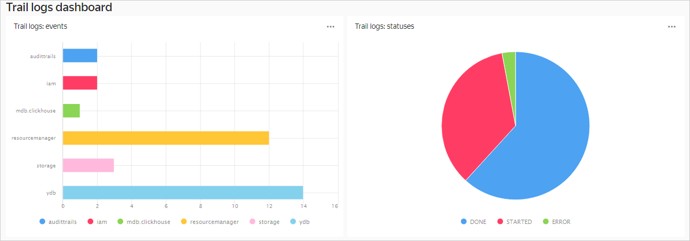

# Uploading audit logs to {{ mch-full-name }} and data visualization in {{ datalens-full-name }}

Upload [audit logs](../audit-trails/concepts/format.md) from a folder to {{ mch-full-name }} and analyze resource use in [{{ datalens-full-name }}]({{ link-datalens-main }}).

1. [Before you start](#before-begin).
1. [Prepare the environment](#environment-preparing).
1. [Create a trail](#create-trail).
1. [Create a source endpoint for a {{ yds-name }} data stream](#create-source-endpoint).
1. [Create a target endpoint for a {{ CH }} database](#create-target-endpoint).
1. [Create a transfer](#create-datatransfer).
1. [Visualize your data in {{ datalens-full-name }}](#datalens-visualization).

If you no longer need these resources, [delete them](#clear-out).

## Before you begin {#before-begin}



### Required paid resources {#paid-resources}

The infrastructure support cost includes:

* Data stream usage costs (see [{{ yds-name }} pricing](../data-streams/pricing.md)).
* Fees for the continuously running cluster {{ mch-name }} (see [{{ mch-name }} pricing](../managed-clickhouse/pricing.md)).

## Prepare the environment {#environment-preparing}

### Create a service account and assign roles {#create-sa}



- Management console

   1. In [the management console]({{ link-console-main }}), select a folder where you wish to create a service account.
   1. Go to the **Service accounts** tab.
   1. Click **Create service account**.
   1. Enter the service account name: `sa-trail-logs`.
   1. Click  **Add role** and select `audit-trails.viewer` and `yds.editor`.
   1. Click **Create**.

- CLI

   

   

   1. Create a service account with the name `sa-trail-logs`:

      ```bash
      yc iam service-account create --name sa-trail-logs
      ```

      Result:

      ```
      id: aje6o61*****h6g9a33s
      folder_id: b1gvmob*****aplct532
      created_at: "2022-07-25T18:01:25Z"
      name: sa-trail-logs
      ```

      For more information about the `yc iam service-account create` command, see the [CLI reference](../cli/cli-ref/managed-services/iam/service-account/create.md).

   1. Assign the service account the `audit-trails.viewer` role:

      ```bash
      yc resource-manager folder add-access-binding <folder_name> \
        --role audit-trails.viewer \
        --subject serviceAccount:<sa-trail-logs_service_account_ID>
      ```

      For more information about the `yc resource-manager folder add-access-binding` command, see the [CLI reference](../cli/cli-ref/managed-services/resource-manager/folder/add-access-binding.md).

   1. Assign the service account the `yds.editor` role:

      ```bash
      yc resource-manager folder add-access-binding <folder_name> \
        --role yds.editor \
        --subject serviceAccount:<sa-trail-logs_service_account_ID>
      ```

- {{ TF }}

   If you don't have {{ TF }}, [install it and configure the {{ yandex-cloud }} provider](../tutorials/infrastructure-management/terraform-quickstart.md#install-terraform).

   1. In the configuration file, describe the service account parameters:

      ```
      resource "yandex_iam_service_account" "sa" {
        name = "sa-trail-logs"
      }

      resource "yandex_resourcemanager_folder_iam_binding" "sa-role-audit-viewer" {
        folder_id   = "<folder_ID>"
        role        = "audit-trails.viewer"
        members     = [
          "serviceAccount:<sa-trail-logs_service_account_ID>",
        ]
      }

      resource "yandex_resourcemanager_folder_iam_binding" "sa-role-yds-editor" {
        folder_id   = "<folder_ID>"
        role        = "yds.editor"
        members     = [
          "serviceAccount:<sa-trail-logs_service_account_ID>",
        ]
      }
      ```

      For more information about resources you can create using {{ TF }}, see the [provider documentation]({{ tf-provider-link }}/iam_service_account).

   1. Make sure that the configuration files are correct.

      1. In the command line, go to the directory where you created the configuration file.
      1. Run the check using the command:

         ```
         terraform plan
         ```

      If the configuration is described correctly, the terminal displays a list of created resources and their parameters. If the configuration contain errors, {{ TF }} will point them out.

   1. Deploy the cloud resources.

      1. If the configuration doesn't contain any errors, run the command:

         ```
         terraform apply
         ```

      1. Confirm the resource creation: type `yes` in the terminal and press **Enter**.

- API

   1. Create a service account using the [create](../iam/api-ref/ServiceAccount/create.md)create method for the [ServiceAccount](../iam/api-ref/ServiceAccount/index.md)ServiceAccount resource.

   1. Find out the service account ID:

      ```bash
      export FOLDER_ID=<folder_ID>
      export IAM_TOKEN=<iam_token>
      curl -H "Authorization: Bearer ${IAM_TOKEN}" \
        "https://iam.{{ api-host }}/iam/v1/serviceAccounts?folderId=${FOLDER_ID}"
      ```

      Result:

      ```json
      {
       "serviceAccounts": [
        {
         "id": "aje6o61*****h6g9a33s",
         "folderId": "b1gvmob*****aplct532",
         "createdAt": "2022-07-25T18:01:25Z",
         "name": "sa-trail-logs",
        }
       ]
      }
      ```

   1. Create a request body in the `body.json` file. Set the `action` property to `ADD` and specify the `serviceAccount` type and `sa-trail-logs` service account ID in the `subject` property:

      **body.json:**
      ```json
      {
       "accessBindingDeltas": [
        {
         "action": "ADD",
         "accessBinding": {
           "roleId": "audit-trails.viewer",
           "subject": {
             "id": "<sa-trail-logs_service_account_ID>",
             "type": "serviceAccount"
             }
           }
         }
         {
          "action": "ADD",
          "accessBinding": {
            "roleId": "yds.writer",
            "subject": {
              "id": "<sa-trail-logs_service_account_ID>",
              "type": "serviceAccount"
              }
            }
         }
       ]
      }
      ```

   1. Assign roles to the service account:

      ```bash
      export FOLDER_ID=<folder_ID>
      export IAM_TOKEN=<iam_token>
      curl -X POST \
        -H "Content-Type: application/json" \
        -H "Authorization: Bearer ${IAM_TOKEN}" \
        -d '@body.json' \
        "https://resource-manager.{{ api-host }}/resource-manager/v1/folders/${FOLDER_ID}:updateAccessBindings"
      ```



### Create a {{ CH }} cluster {#create-ch-cluster}



- Management console

   1. On the folder page in the [management console]({{ link-console-main }}), click **Create resource** and select **{{ CH }} cluster**.
   1. Specify the settings for a {{ CH }} cluster:

      1. Under **General parameters**, enter the cluster name `trail-logs`.
      1. Under **Host class**, select the type of virtual machine **burstable** and the **b2.nano** host type.
      1. Under **Database**, enter the DB name `trail_data`, the username `user` and the password. Remember the database name.
      1. Under **Hosts**, click . Enable **Public access** and click **Save**.
      1. Under **Additional settings**, enable the following options:

         * Access from {{ datalens-short-name }}.
         * Access from management console.
         * Access from {{ data-transfer-name }}.

   1. After configuring all the settings, click **Create cluster**.

- CLI

   1. Check whether the folder has any subnets for the cluster hosts:

      ```bash
      yc vpc subnet list
      ```

      If there are no subnets in the folder, [create the necessary subnets](../vpc/operations/subnet-create.md) create the necessary subnets in{{ vpc-short-name }}.

   1. Specify the cluster parameters in the create command:

      ```bash
      {{ yc-mdb-ch }} cluster create \
        --name trail-logs \
        --environment production \
        --network-name <network_name> \
        --host type=clickhouse,zone-id=<availability_zone>,subnet-id=<subnet_ID> \
        --clickhouse-resource-preset b2.nano \
        --clickhouse-disk-type network-hdd \
        --clickhouse-disk-size 10 \
        --user name=user,password=<user_password> \
        --database name=trail_data \
        --datalens-access=true \
        --datatransfer-access=true \
        --websql-access=true
      ```

      For more information about the `yc managed-clickhouse cluster create` command, see the [CLI reference](../cli/cli-ref/managed-services/managed-clickhouse/cluster/create.md).

- {{ TF }}

   1. Add a description of the cluster and cluster hosts to the configuration file:

      ```hcl
      resource "yandex_mdb_clickhouse_cluster" "trail-logs" {
        name                = "trail-logs"
        environment         = "PRODUCTION"
        network_id          = yandex_vpc_network.<network_name_in_{{ TF }}>.id

        clickhouse {
          resources {
            resource_preset_id = "b2.nano"
            disk_type_id       = "network-hdd"
            disk_size          = 10
          }
        }

        database {
          name = "trail_data"
        }

        user {
          name     = "user"
          password = "<password>"
          permission {
            database_name = "trail_data"
          }
        }

        host {
          type      = "CLICKHOUSE"
          zone      = "<availability_zone>"
          subnet_id = yandex_vpc_subnet.<subnet_name_in_{{ TF }}>.id
        }

        access {
          datalens     = true
          datatransfer = true
        }
      }
      ```

      For more information on resources that you can create with {{ TF }}, see the [provider documentation]({{ tf-provider-mch }}).

   1. Make sure that the configuration files are correct.

      1. In the command line, go to the directory where you created the configuration file.
      1. Run the check using the command:

         ```
         terraform plan
         ```

      If the configuration is described correctly, the terminal displays a list of created resources and their parameters. If the configuration contain errors, {{ TF }} will point them out.

   1. Deploy the cloud resources.

      1. If the configuration doesn't contain any errors, run the command:

         ```
         terraform apply
         ```

      1. Confirm the resource creation: type `yes` in the terminal and press **Enter**.

- API

   Use the [create](../managed-clickhouse/api-ref/Cluster/create.md) REST API method.



### Create a data stream {#create-stream}

A data stream is used to upload audit logs.



- Management console

   1. On the folder page in the [management console]({{ link-console-main }}), click **Create resource** and select **{{ yds-name }}**.
   1. In the **Database** field, click **Create new**. A new {{ ydb-short-name }} database creation page opens:
   1. Enter the database **Name**: `stream-db`.
   1. Under **Database type**, select `Serverless`.
   1. Click **Create database**.
   1. Return to the stream creation page. Click **Update** and select the created database from the list.
   1. Enter the data stream name: `trail-logs-stream`.
   1. Click **Create**.

   Wait for the stream to start. Once the stream is ready for use, its status changes from `CREATING` to `ACTIVE`.



## Create a trail {#create-trail}

A trail uploads audit logs of all the resources in your folder to a {{ yds-name }} stream.



- Management console

   1. On the [management console]({{ link-console-main }}) folder page, click **Create resource** and select **Audit trail**.
   1. Enter the name of the created trail: `folder-trail`.
   1. Under **Filter**, set up the audit log scope:

      * **Resource**: Select `Folder`.
      * **Folder**: An automatically populated field (shows the name of the folder that will host the trail).

   1. Under **Destination**, set up the destination object:

      * **Destination**: `{{ yds-name }}`.
      * **Data stream**: Select the data stream `trail-logs-stream`.

   1. Under **Service account**, select the service account `sa-trail-logs`.
   1. Click **Create**.



## Create a source endpoint for a {{ yds-name }} data stream {#create-source-endpoint}

To create transfer, you need to specify the source endpoint that leads to a {{ yds-name }} stream.



- Management console

   1. Go to the [folder page]({{ link-console-main }}) and select **{{ data-transfer-name }}**.
   1. On the left-hand panel, select  **Endpoints**.
   1. Click **Create endpoint**.
   1. In the **Direction** field, select `Source`.
   1. Enter the endpoint name: `source-logs-stream`.
   1. Under **Database type**, select `{{ yds-full-name }}`.
   1. Configure the endpoint parameters:

      * **Database**: Select the database registered for the `trail-logs-stream` stream.
      * **Stream**: `trail-logs-stream`.
      * **Service account**: `sa-trail-logs`.

   1. Set up conversion rules:

      * **Data format**: `JSON`.
      * **Data schema**: `List of fields`.

         Specify the list of fields from the table below:

         | Name | Type | Key | Required | Path |
         |-------------------|----------|-----|----------|---------------------------------|
         | event_id | STRING | - | - | event_id |
         | event_source | STRING | - | - | event_source |
         | event_type | STRING | - | - | event_type |
         | event_time | DATETIME | - | - | event_time |
         | authenticated | ANY | - | - | authentication.authenticated |
         | subject_type | STRING | - | - | authentication.subject_type |
         | subject_id | STRING | - | - | authentication.subject_id |
         | subject_name | STRING | - | - | authentication.subject_name |
         | authorized | ANY | - | - | authorization.authorized |
         | resource_metadata | ANY | - | - | resource_metadata |
         | remote_address | STRING | - | - | request_metadata.remote_address |
         | user_agent | STRING | - | - | request_metadata.user_agent |
         | request_id | STRING | - | - | request_metadata.request_id |
         | event_status | STRING | - | - | event_status |
         | details | ANY | - | - | details |

      * Enable **Add columns with no markup**.

   1. Click **Create**.



## Create a target endpoint for a {{ CH }} database {#create-target-endpoint}

To create transfer, you need to specify the target endpoint with {{ CH }} database settings.



- Management console

   1. Go to the [folder page]({{ link-console-main }}) and select **{{ data-transfer-name }}**.
   1. On the left-hand panel, select  **Endpoints**.
   1. Click **Create endpoint**.
   1. In the **Direction** field, select `Target`.
   1. Enter the endpoint name: `target-logs-ch`.
   1. Under **Database type**, select `{{ CH }}`.
   1. Under **Endpoint parameters**, specify:

      1. **Connection settings**: **MDB cluster**. Select the cluster `trail-logs`.
      1. **User**: `user`.
      1. **Password**: Enter the DB user's password.
      1. **Database**: `trail_data`.

   1. Click **Create**.



## Create a transfer {#create-datatransfer}

Using transfer, data is migrated between the source service (a stream) and the target service (a {{ CH }} database).



- Management console

   1. Go to the [folder page]({{ link-console-main }}) and select **{{ data-transfer-full-name }}**.
   1. On the left-hand panel, select  **Transfers**.
   1. Click **Create transfer**.
   1. Enter the transfer name: `logs-transfer`.
   1. Select the endpoint for the source: `source-logs-stream`.
   1. Select the endpoint for the target: `target-logs-ch`.
   1. Click **Create**.
   1. Click  next to the name of the transfer and select **Activate**.
   1. Wait until the transfer status changes to **Replicated**.

- CLI

   Create a transfer with the name `logs-transfer`:

   ```bash
   yc datatransfer transfer create --name logs-transfer
     --source-id <source-logs-stream_source_endpoint_ID>
     --target-id <target-logs-ch_target_endpoint_ID>
     --type increment-only
   ```

   For more information about the `yc datatransfer transfer create` command, see the [CLI reference](../cli/cli-ref/managed-services/datatransfer/transfer/create.md).

- {{ TF }}

   1. Add a transfer description to the configuration file.

      ```hcl
      resource "yandex_datatransfer_transfer" "transfer" {
        folder_id   = "<folder_ID>"
        name        = "logs-transfer"
        source_id   = "<source-logs-stream_source_endpoint_ID>"
        target_id   = "<target-logs-ch_target_endpoint_ID>"
        type        = "INCREMENT_ONLY"
      }
      ```

      For more information on resources that you can create with {{ TF }}, see the [provider documentation]({{ tf-provider-dt-transfer }}).

   1. Make sure that the configuration files are correct.

      1. In the command line, go to the directory where you created the configuration file.
      1. Run the check using the command:

         ```
         terraform plan
         ```

      If the configuration is described correctly, the terminal displays a list of created resources and their parameters. If the configuration contain errors, {{ TF }} will point them out.

   1. Deploy the cloud resources.

      1. If the configuration doesn't contain any errors, run the command:

         ```
         terraform apply
         ```

      1. Confirm the resource creation: type `yes` in the terminal and press **Enter**.



After enabling the transfer, go to {{ mch-name }} and make sure the `trail_logs_stream` table with {{ at-name }} events is present in the `trail_data` database.

You can run queries to the `trail_data` database to search for security events of interest.



* FInd out who deleted a folder:

   ```sql
   select * from trail_data.trail_logs_stream
   where event_type = 'yandex.cloud.audit.resourcemanager.DeleteFolder' and JSONExtractString(details, 'folder_name') = '<folder_name>'
   ```

* What actions did a specific user perform over a period of time (name ID and date are required):

   ```sql
   select * from trail_data.trail_logs_stream
   where subject_name = '<Name_ID_user>' and  event_time >= 2022-06-26
   ```

* Trigger when creating keys for service accounts:

   ```sql
   select * from trail_data.trail_logs_stream
   where event_type = 'yandex.cloud.audit.iam.CreateAccessKey' or event_type = 'yandex.cloud.audit.iam.CreateKey' or event_type = 'yandex.cloud.audit.iam.CreateApiKey'
   ```

All events of interest are collected in the [solution](https://github.com/yandex-cloud/yc-solution-library-for-security/blob/master/auditlogs/_use_cases_and_searches/Use-casesANDsearches_RU.pdf).



## Visualize your data in {{ datalens-full-name }} {#datalens-visualization}

To visualize data, you need to connect to the {{ CH }} database where the logs were moved and create a dataset based on the data there.

### Create a connection {#create-connection}

1. Go to the **{{ datalens-full-name }}** [homepage]({{ link-datalens-main }}).
1. In the window that opens, click **Create connection**.
1. Select a **{{ CH }}** connection.
1. Select the **Select in folder** connection type and enter the connection settings:

   1. In the **Cluster** field, select `trail-logs`.
   1. In the **Host name** field, select the {{ CH }} host from the drop-down list.
   1. Enter the DB user's name and password.

1. Click **Check connection**.
1. After checking the connection, click **Create connection**.
1. Enter the connection name `trail-logs-con` and click **Create**.
1. After saving the connection, in the upper-right corner, click **Create dataset**.

### Create a dataset {#create-dataset}

1. Drag the `trail_data.trail_logs_stream` table from the **Tables** section on the left of the screen to the workspace.
1. In the upper-right corner, click **Save**.
1. Enter the dataset name `trail-logs-dataset` and click **Create**.
1. When the dataset is saved, in the upper-right corner, click **Create chart**.

### Create a line chart {#create-bar-chart}

To display the number of events for each source, create a line chart:

1. For the visualization type, select **Line chart**.
1. Drag the `event_source` field from the **Dimensions** section to the **Y** section.
1. Drag the `event_id` field from the **Dimensions** section to the **X** section.
1. Drag the `event_source` field from the **Dimensions** section to the **Colors** section.
1. In the upper right-hand corner, click **Save**.
1. In the window that opens, enter the name `Trail logs: events` for the chart and click **Save**.

### Create a pie chart {#create-pir-chart}

To show numerical proportion by event status, create a pie chart:

1. Copy the chart from the previous step:

   1. In the upper-right corner, click the down arrow next to the **Save** button.
   1. Click **Save as**.
   1. In the window that opens, enter the name `Trail logs: statuses` for the new chart and click **Save**.

1. For the visualization type, select **Pie chart**. The `event_source` and `event_id` are automatically copied to the **Color** and **Measures** sections, respectively.
1. Delete the `event_source` field from the **Color** section and drag the `event_status` field there.
1. In the upper right-hand corner, click **Save**.

### Create a dashboard and add charts there {#create-dashboard}

Create a dashboard to add charts to:

1. Go to the **{{ datalens-full-name }}** [homepage]({{ link-datalens-main }}).
1. Click **Create dashboard**.
1. Enter the name `Trail logs dashboard` for the dashboard and click **Create**.
1. In the upper-right corner, click **Add** and choose **Chart**.
1. In the **Chart** chart, click **Select** and choose the `Trail logs: events` pie chart from the list.
1. Click **Add**. The chart is displayed on the dashboard.
1. Repeat the previous steps for the `Trail logs: statuses` chart.
1. In the upper-right corner, click **Save**.

Example dashboard:



## How to delete created resources {#clear-out}

To stop paying for the resources created:

* [Delete the cluster](../managed-postgresql/operations/cluster-delete.md) `trail-logs`.
* [Delete the stream](../data-streams/operations/manage-streams.md#delete-data-stream) `trail-logs-stream`.
* [Delete endpoints](../data-transfer/operations/endpoint/index.md#delete) for the source and target.
* [Delete the transfer](../data-transfer/operations/transfer.md#delete) `logs-transfer`.
