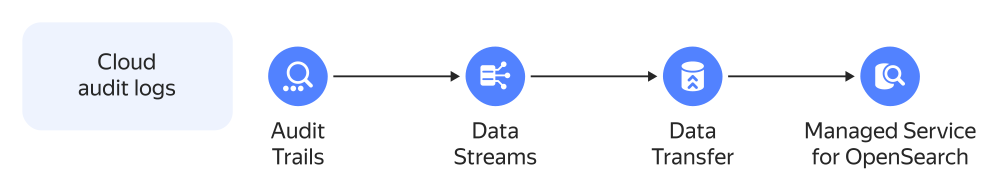
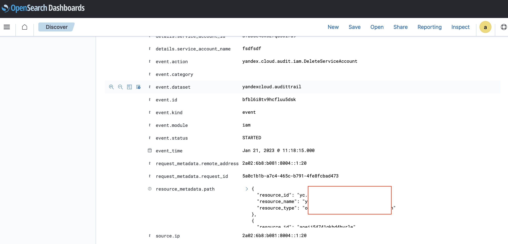

# Exporting audit logs to {{ mos-full-name }}

Create a trail to upload [audit logs](../audit-trails/concepts/format.md) for {{ yandex-cloud }} resources to a [{{ yds-full-name }}](../data-streams/) data stream. Once done, configure continuous log delivery to a {{ mos-full-name }} cluster using {{ data-transfer-full-name }}.



You can export organization, cloud, or folder logs.

To export audit logs:

1. [Prepare your cloud](#before-begin).
1. [Create a trail to send logs to a {{ yds-name }} data stream](#create-trail).
1. [Create a {{ mos-name }} cluster](#create-os).
1. [Set up a transfer to deliver logs to the {{ mos-name }} cluster](#configure-data-transfer).
1. [Check the result](#check-result).
1. [Upload additional content](#additional-content).

If you no longer need the resources you created, [delete them](#clear-out).

## Getting started {#before-begin}



### Required paid resources {#paid-resources}

The infrastructure support cost includes:

* Fee for the {{ OS }} cluster computing resources and storage (see [{{ mos-full-name }} pricing](../managed-opensearch/pricing.md)).
* Using a data stream (see [{{ yds-name }} pricing](../data-streams/pricing.md)).
* Using {{ ydb-full-name }} in serverless mode (see [{{ ydb-name }} pricing](../ydb/pricing/serverless.md)).

## Create a trail to send logs to a {{ yds-name }} data stream {#create-trail}

Prepare the environment and create a trail depending on the {{ yandex-cloud }} resources:

* [Organization](../audit-trails/operations/export-organization-data-streams.md)
* [Cloud](../audit-trails/operations/export-cloud-data-streams.md)
* [Folder](../audit-trails/operations/export-folder-data-streams.md)

Make sure to give your stream the `audit‑trails` name to make it easier to upload the [Security Content](#additional-content) library objects.

## Create a {{ mos-name }} cluster {#create-os}



- Manually {#manual}

   [Create a {{ mos-name }} cluster](../managed-opensearch/operations/cluster-create.md) with any suitable configuration.

- Using {{ TF }} {#tf}

   1. 
   1. 
   1. 
   1. 

   1. Download the [trails-to-opensearch.tf](https://github.com/yandex-cloud-examples/yc-data-transfer-from-audit-trails-to-opensearch/blob/main/trails-to-opensearch.tf) configuration file to the same working directory.

      This file describes:

      * [Network](../vpc/concepts/network.md#network).
      * [Subnet](../vpc/concepts/network.md#subnet).
      * [Security group](../vpc/concepts/security-groups.md) and rules required to connect to a {{ mos-name }} cluster.
      * {{ mos-name }} target cluster.
      * Transfer.

   1. In the `trails-to-opensearch.tf` file, specify the following variables:

      * `os_version`: {{ OS }} version in the target cluster.
      * `os_admin_password`: `admin` user password.
      * `transfer_enabled`: Set to `0` to ensure that no transfer is created until you [create endpoints manually](#prepare-transfer).

   1. Make sure the {{ TF }} configuration files are correct using this command:

      ```bash
      terraform validate
      ```

      If there are any errors in the configuration files, {{ TF }} will point them out.

   1. Create the required infrastructure:

      

      



## Set up a transfer to deliver logs to the {{ mos-name }} cluster {#configure-data-transfer}

1. [Create a source endpoint](../data-transfer/operations/endpoint/source/data-streams.md):

   * **{{ ui-key.yacloud.data-transfer.forms.label-database_type }}**: `{{ yds-full-name }}`.
   * **{{ ui-key.yacloud.data-transfer.forms.section-endpoint }}**:

      * **{{ ui-key.yc-data-transfer.data-transfer.console.form.yds.console.form.yds.YDSSource.connection.title }}**:

         * **{{ ui-key.yc-data-transfer.data-transfer.console.form.yds.console.form.yds.YDSConnection.database.title }}**: Select the {{ ydb-name }} database from the list.
         * **{{ ui-key.yc-data-transfer.data-transfer.console.form.yds.console.form.yds.YDSConnection.stream.title }}**: Specify the name of the {{ yds-name }} data stream.
         * **{{ ui-key.yc-data-transfer.data-transfer.console.form.yds.console.form.yds.YDSConnection.service_account_id.title }}**: Select or create a service account with the `yds.editor` role.

      * **{{ ui-key.yc-data-transfer.data-transfer.console.form.yds.console.form.yds.YDSSource.advanced_settings.title }}**:

         * **{{ ui-key.yc-data-transfer.data-transfer.console.form.yds.console.form.yds.YDSSourceAdvancedSettings.converter.title }}**: `{{ ui-key.yc-data-transfer.data-transfer.console.form.logbroker.console.form.logbroker.ParserConfigCommon.parser_config_audit_trails_v1.title }}`.

1. [Create a target endpoint](../data-transfer/operations/endpoint/target/opensearch.md):

   * **{{ ui-key.yacloud.data-transfer.forms.label-database_type }}**: `{{ OS }}`.
   * **{{ ui-key.yacloud.data-transfer.forms.section-endpoint }}**:

      * **{{ ui-key.yc-data-transfer.data-transfer.console.form.opensearch.console.form.opensearch.OpenSearchTarget.connection.title }}**:

         * **{{ ui-key.yc-data-transfer.data-transfer.console.form.opensearch.console.form.opensearch.OpenSearchConnection.connection_type.title }}**: `{{ ui-key.yc-data-transfer.data-transfer.console.form.opensearch.console.form.opensearch.OpenSearchConnectionType.mdb_cluster_id.title }}`.

            * **{{ ui-key.yc-data-transfer.data-transfer.console.form.opensearch.console.form.opensearch.OpenSearchConnectionType.mdb_cluster_id.title }}**: Select the source cluster from the list.

         * **{{ ui-key.yc-data-transfer.data-transfer.console.form.opensearch.console.form.opensearch.OpenSearchConnection.user.title }}** and **{{ ui-key.yc-data-transfer.data-transfer.console.form.opensearch.console.form.opensearch.OpenSearchConnection.password.title }}**: Enter the name and password of the user who has access to the database, e.g., [`admin`](../managed-opensearch/operations/cluster-users.md).

1. Create and activate the transfer:

   

   - Manually {#manual}

      1. [Create a transfer](../data-transfer/operations/transfer.md#create) of the **{{ ui-key.yc-data-transfer.data-transfer.console.form.transfer.console.form.transfer.TransferType.increment.title }}** type that will use the created endpoints.
      1. [Activate the transfer](../data-transfer/operations/transfer.md#activate) and wait for its status to change to **{{ ui-key.yacloud.data-transfer.label_connector-status-RUNNING }}**.

   - Using {{ TF }} {#tf}

      1. In the `trails-to-opensearch.tf` file, specify the following variables:

         * `source_endpoint_id`: Source endpoint ID.
         * `target_endpoint_id`: Target endpoint ID.
         * `transfer_enabled`: Set to `1` to enable transfer creation.

      1. Make sure the {{ TF }} configuration files are correct using this command:

         ```bash
         terraform validate
         ```

         If there are any errors in the configuration files, {{ TF }} will point them out.

      1. Create the required infrastructure:

         

      1. The transfer is activated automatically. Wait for its status to change to **{{ ui-key.yacloud.data-transfer.label_connector-status-RUNNING }}**.

   

## Check the result {#check-result}

Make sure the data from {{ at-name }} is successfully uploaded to {{ OS }}:

1. Wait for the transfer status to change to **{{ ui-key.yacloud.data-transfer.label_connector-status-RUNNING }}**.
1. Connect to the target cluster using [{{ OS }} Dashboards](../managed-opensearch/operations/connect.md#dashboards).
1. Select the `Global` tenant.
1. Create a new index patten named `audit-trails*`:

    1. Open the control panel by clicking .
    1. Under **Management**, select **Stack Management**.
    1. Go to **Index Patterns** and click **create an index pattern** at the bottom of the page.
    1. In the **Index pattern name** field, specify `audit-trails*` and click **Next step**.
    1. In **Time field**, select `application_usage_daily.timestamp` and click **Create index pattern**.

1. Open the control panel by clicking .
1. Under **OpenSearch Dashboards**, select **Discover**.
1. The dashboard that opens should contain data from {{ at-name }} in [Elastic Common Schema]({{ links.es.docs }}/ecs/current/ecs-reference.html) format.





## Upload additional content {#additional-content}

For your convenience, the {{ yandex-cloud }} security team created Solution Library with a set of examples and recommendations for building a secure infrastructure in {{ yandex-cloud }}. The library is available in this [public GitHub repository](https://github.com/yandex-cloud-examples/yc-security-solutions-library). It contains the following objects to upload to {{ OS }}:

* Dashboard with use cases and statistics.
* Set of ready-to-use queries to search for security events.
* Sample events with preset alerts (the client should specify the alert destination on their own).

All required event fields are converted to [Elastic Common Schema (ECS)]({{ links.es.docs }}/ecs/current/index.html) format; the complete mapping table is provided in the [{{ yandex-cloud }} Security Solution Library document](https://github.com/yandex-cloud-examples/yc-export-auditlogs-to-elk/blob/main/papers/Описание%20объектов.pdf).

To use Security Content:

1. Clone the {{ yandex-cloud }} Security Solution Library repository:

    ```bash
    git clone https://github.com/yandex-cloud-examples/yc-export-auditlogs-to-opensearch.git
    ```

1. Connect to the target cluster using [{{ OS }} Dashboards](../managed-opensearch/operations/connect.md#dashboards).
1. Open the control panel by clicking .
1. Under **Management**, select **Stack Management**.
1. Go to **Saved Objects** and import files from the `yc-export-auditlogs-to-opensearch/update-opensearch-scheme/content-for-transfer/` folder:

    * `dashboard.ndjson`
    * `filters.ndjson`
    * `search.ndjson`

### Dashboards {#dashboard}

Use the ready-made `Audit-trails-dashboard`:

1. Open the control panel by clicking .
1. Under **OpenSearch Dashboards**, select **Dashboard**.
1. Select `Audit-trails-dashboard` in the dashboard list.


### Security events {#discover}

Run a ready-to-use query to view security events that can be selected using filters.

1. Open the control panel by clicking .
1. Under **OpenSearch Dashboards**, select **Discover**.
1. In the **Open** tab, select the `Search:Yandexcloud: Yandexcloud: Interesting fields` query.


### Alert settings {#alerts}

Use code samples for the `monitor` and `trigger` entities when setting up [alerts]({{ os.docs }}/monitoring-plugins/alerting/index/):

1. Open the control panel by clicking .
1. Under **OpenSearch Plugins**, select **Alerting**.
1. Copy the sample file contents and paste them into the creation window:

    * [monitor.json](https://github.com/yandex-cloud-examples/yc-export-auditlogs-to-opensearch/blob/main/update-opensearch-scheme/content-for-transfer/monitor.json)
    * [trigger_action_example.json](https://github.com/yandex-cloud-examples/yc-export-auditlogs-to-opensearch/blob/main/update-opensearch-scheme/content-for-transfer/trigger_action_example.json)

## Delete the resources you created {#clear-out}



Before deleting the created resources, [deactivate the transfer](../data-transfer/operations/transfer.md#deactivate).



Some resources are not free of charge. To avoid paying for them, delete the resources you no longer need:

1. [Delete the transfer](../data-transfer/operations/transfer.md#delete).
1. [Delete endpoints](../data-transfer/operations/endpoint/index.md#delete) for both the source and target.
1. [Delete the {{ ydb-name }} database](../ydb/operations/manage-databases.md#delete-db).
1. [Delete the created service accounts](../iam/operations/sa/delete.md).
1. Delete the [{{ at-name }} trail](../audit-trails/concepts/trail.md).

Delete the other resources depending on how they were created:



- Manually {#manual}

   [Delete the {{ mos-name }} cluster](../managed-opensearch/operations/cluster-delete.md).

- Using {{ TF }} {#tf}

   1. In the terminal window, go to the directory containing the infrastructure plan.
   1. Delete the `trails-to-opensearch.tf` configuration file.
   1. Make sure the {{ TF }} configuration files are correct using this command:

      ```bash
      terraform validate
      ```

      If there are any errors in the configuration files, {{ TF }} will point them out.

   1. Confirm updating the resources.

      

      All the resources described in the `trails-to-opensearch.tf` configuration file will be deleted.



