# 1C-Bitrix website

[1C-Bitrix: Site Management](https://www.1c-bitrix.ru/products/cms/) is a web project management system from 1C-Bitrix. It allows you to easily manage the structure and content of your website without knowing programming or design. 1C-Bitrix: Site Management does the technical work for you.

In this tutorial, you will deploy and configure a website using the 1C-Bitrix information portal template. As part of the configuration, you will create a VM in {{ yandex-cloud }}, deploy the 1C-Bitrix image on it, and launch the necessary services. As a database, you will deploy a managed MySQL database cluster and ensure its fault tolerance.

Resources required for 1C-Bitrix to work correctly:
* A VM running [Ubuntu 20.04 LTS](/marketplace/products/yc/ubuntu-20-04-lts) with access to an external network and hosting 1C-Bitrix.
* A MySQL cluster that serves as a database for the 1C-Bitrix website.

To deploy and configure 1C-Bitrix:
1. [Prepare your cloud](#before-you-begin).
1. [Create a VM in the cloud](#create-vm).
1. [Create a MySQL database cluster](#create-mysql).
1. [Configure a server to work with 1C-Bitrix](#configure-server).
1. [Configure 1C-Bitrix](#configure-bitrix).

If you no longer need the website, [delete all its resources](#clear-out).

You can also deploy the infrastructure for hosting a website in Bitrix via {{ TF }} using a [ready-made configuration file](#terraform).

## Prepare your cloud {#before-you-begin}




### Required paid resources

The cost for maintaining the 1C-Bitrix server includes:
* Fee for {{ compute-full-name }} disks and continuously running VM (see [{{ compute-full-name }} pricing](../../compute/pricing.md)).
* Fee for using a dynamic or static external IP address (see [{{ vpc-full-name }} pricing](../../vpc/pricing.md)).
* Fee for using a managed database (see [pricing for {{ mmy-name }}](../../managed-mysql/pricing.md)).

The current scenario uses the trial version of 1C-Bitrix with a trial period of 30 days. You can check the cost of the product software versions on the [1C-Bitrix](https://www.1c-bitrix.ru) official website.


## Create a VM in the cloud {#create-vm}

To create a VM:



- Management console

   1. In the [management console]({{ link-console-main }}), select the folder to create the virtual machine in.

   1. In the list of services, select **{{ compute-name }}**.

   1. Click **Create VM**.

   1. In the **Name** field, enter a name for the VM, such as `bitrixwebsite`.

   1. Leave the default availability zone.

   1. Under **{{ marketplace-name }}**, select the [Ubuntu 20.04 lts](/marketplace/products/yc/ubuntu-20-04-lts) image.

   1. Under **Disks**, select an `SSD` with `20 GB`.

   1. Under **Computing resources**:

      * Choose a VM [platform](../../compute/concepts/vm-platforms.md).
      * For 1C-Bitrix to work correctly, specify the following configuration:
         * **Platform**: `Intel Ice Lake`.
         * **Guaranteed vCPU share**: `20%`.
         * **vCPU**: `2`.
         * **RAM**: `4 GB`.

   1. Under **Network settings**:

      * Select the **Network** and **Subnet** to connect your VM to. If you have no network or subnet, create them directly on the VM creation page.
      * Under **Public address**, keep **Auto** to assign your VM a random external IP address from the {{ yandex-cloud }} pool, or select a static address from the list if you reserved one in advance.

   1. Under **Access**, specify the information required to access the VM:

      * In the **Login** field, enter your preferred username to be created on the VM, for example, `ubuntu`.
      * In the **SSH key** field, paste your public SSH key. You need to create a key pair for the SSH connection [yourself](../../compute/operations/vm-connect/ssh.md).

   1. Click **Create VM**.

   You may need to save [disk snapshots](../../compute/operations/disk-control/create-snapshot.md) of your VM. They contain a copy of the VM file system from when the snapshot was created.

   You can use disk snapshots for various purposes, such as:
   * Migrating data from one disk to another, for example, to a disk in a different availability zone.
   * Creating a disk backup before performing operations that may cause damage to your data.
   * Performing disk versioning by creating snapshots on a regular basis.

- {{ TF }}

   See [How to create an infrastructure using {{ TF }}](#terraform).



## Create a MySQL database cluster {#create-mysql}

To create a MySQL database cluster:



- Management console

   1. On the folder page in the [management console]({{ link-console-main }}), select **{{ mmy-name }}**.

   1. Click **Create resource** and select **MySQL cluster**.

   1. In the **Name** field, enter the cluster name, for example, `BitrixMySQL`.

   1. Under **Host class**, select `s2.micro`. These characteristics are enough for 1C-Bitrix to run.

   1. Under **Storage size**, select the type of storage: 10 GB `network-ssd`.

   1. Under **Database**, enter:

      * **DB name**. Leave the default value, `db1`.
      * **Username** to connect to the database. Leave the default value, `user1`.
      * **Password** for 1C-Bitrix to access the MySQL database, for example, `p@s$woRd!`.

   1. Under **Hosts**, change the **Availability zone** for the database. To do this, click  in the line containing host details. In the window that opens, select the desired availability zone and click **Save**.

      We recommend selecting the same availability zone as when you created the VM. This reduces latency between the VM and database.

      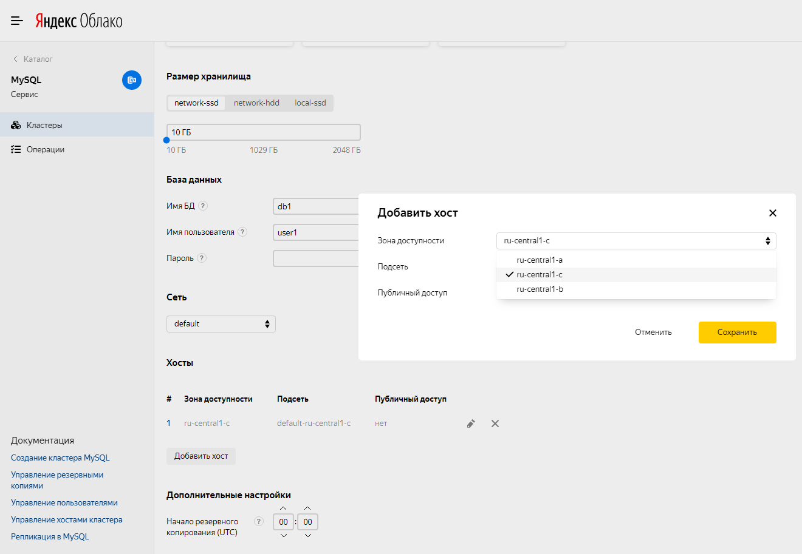

   1. To make your database fault-tolerant, you can add more hosts for it. To do this, select **Add host** and specify the availability zone to place it in.

   1. Leave the other fields as they are.

   1. Click **Create cluster**.

   Creating a DB cluster may take a few minutes. To check that the new cluster is available, select **{{ mmy-name }}** in the {{ yandex-cloud }} management console. On the **Clusters** tab, the cluster status should be **Running** and its state should be **Alive**.

- {{ TF }}

   See [How to create an infrastructure using {{ TF }}](#terraform).



## Configure a server to work with 1C-Bitrix {#configure-server}

To configure a server to work with 1C-Bitrix:

1. Log in to the created VM using [SSH](../../compute/operations/vm-connect/ssh.md).

   ```bash
   ssh ubuntu@<VM-public-IP>
   ```

   Where `ubuntu` is the username in the **Login** field that you set when [creating the VM](#create-vm).

   To find out the public IP address of your VM, on the folder page in the [management console]({{ link-console-main }}):

   1. Select the **{{ compute-name }}** section.
   1. Click the name of your VM ( **bitrixwebsite** in the example).
   1. This will open a window with general information about your VM. You can find the public IP address in the **Public IPv4** field under **Network**.

1. Install the required software:

   ```bash
   sudo apt-get update
   sudo apt-get install -y apache2 libapache2-mod-php php-gd php-mbstring php-mysql
   ```

1. Go to the project's working folder and download the <q>1C-Bitrix: Site Management</q> distribution:

   ```bash
   cd /var/www/html/
   sudo wget https://www.1c-bitrix.ru/download/standard_encode.tar.gz
   ```

1. Unpack the downloaded archive and delete unnecessary files:

   ```bash
   sudo tar -zxf standard_encode.tar.gz
   sudo rm -f index.html standard_encode.tar.gz
   ```

1. Assign the `www-data` user as the owner of the working directory of the project:

   ```bash
   sudo chown -R www-data:www-data /var/www/html
   ```

   Check the permissions and owners of the working folder:

   ```bash
   ls -l
   ```

   Result:

   ```text
   total 76
   drwxrwxr-x 6 www-data www-data  4096 May 15 13:50 bitrix
   -rwxrwxr-x 1 www-data www-data  1378 May 15 13:50 index.php
   -rwxrwxr-x 1 www-data www-data   150 Mar 11  2013 install.config
   -rwxrwxr-x 1 www-data www-data 30741 Apr 10 14:36 license.html
   -rwxrwxr-x 1 www-data www-data   113 Nov 20  2012 license.php
   -rwxrwxr-x 1 www-data www-data 14054 Feb  6  2017 readme.html
   -rwxrwxr-x 1 www-data www-data   112 Mar 27  2013 readme.php
   drwxrwxr-x 2 www-data www-data  4096 May 15 13:50 upload
   -rwxrwxr-x 1 www-data www-data   691 Oct 27  2009 web.config
   ```

1. For 1C to work correctly, configure the PHP settings. To do this, use the built-in `nano` editor and modify the following variables in the `php.ini` configuration file:

   ```bash
   sudo nano /etc/php/7.4/apache2/php.ini
   ```

   | Previously | Now |
   :----------------------------------------------| :---------------------------------------------
   | `short_open_tag = Off` | `short_open_tag = On` |
   | `memory_limit = 128M` | `memory_limit = 256M` |
   | `;date.timezone =` | `date.timezone = Europe/Moscow` |
   | `;opcache.revalidate_freq =2` | `opcache.revalidate_freq =0` |
   | `;session.save_path = "/var/lib/php/sessions"` | `session.save_path = "/var/lib/php/sessions"` |

   

   To find the parameter you need in the `nano` editor, press **Ctrl** + **W**. Find the required parameter from the table above and save the changes using **Ctrl** + **O**. To exit the editor, press **Ctrl** + **X**.

   

1. Configure the Apache web server. To do this, edit the `/etc/apache2/sites-enabled/000-default.conf` configuration file.

   1. Open the file in the text editor:

      ```bash
      sudo nano /etc/apache2/sites-enabled/000-default.conf
      ```

   1. Add the following block after the `DocumentRoot /var/www/html` line:

      ```
      <Directory /var/www/html>
      Options Indexes FollowSymLinks
      AllowOverride All
      Require all granted
      </Directory>
      ```

   1. Restart the web server to apply all the new settings.

      ```bash
      sudo service apache2 restart
      ```

After you run these commands, the server side will be configured for 1C-Bitrix to work correctly.

## Configure 1C-Bitrix {#configure-bitrix}

Install and configure 1C-Bitrix:

1. Open the 1C-Bitrix: Site Management web interface at: `http://<VM-public-IP-address>/`. This should open a page prompting you to install 1C-Bitrix.

1. Click **Next**.

   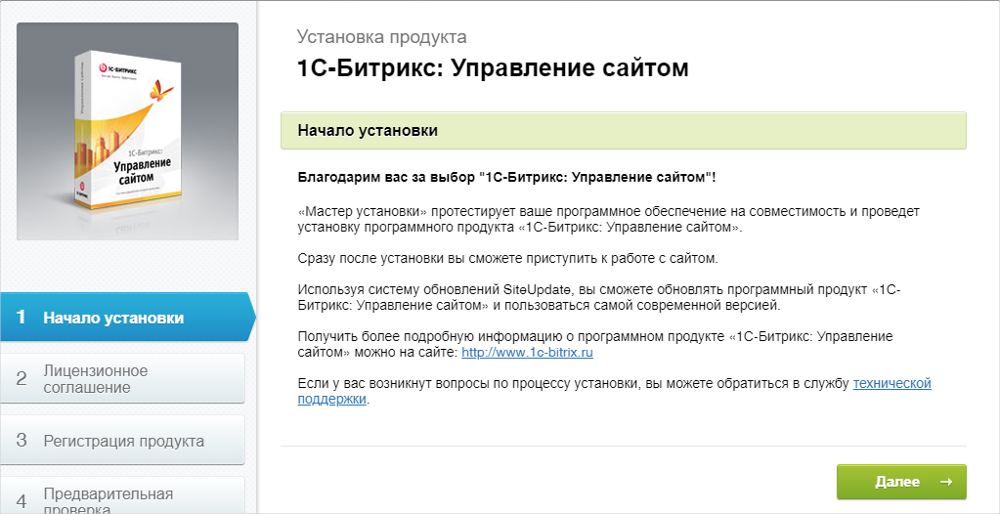

1. Read the license agreement and select **I accept the license agreement**. Then click **Next**.

   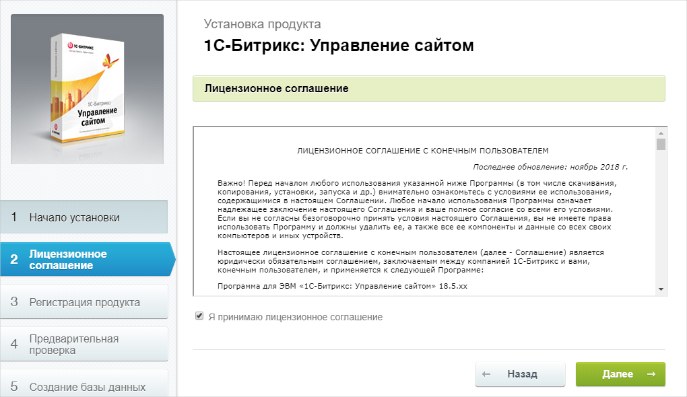

1. Registration is optional, so you can uncheck the corresponding checkbox, but leave **Install in UTF-8 encoding** and click **Next**.

   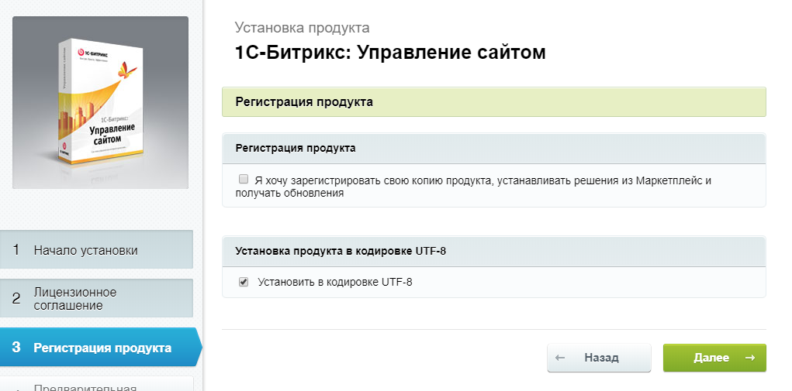

1. 1C-Bitrix will check the server configuration. View the parameters on this page and click **Next**.

   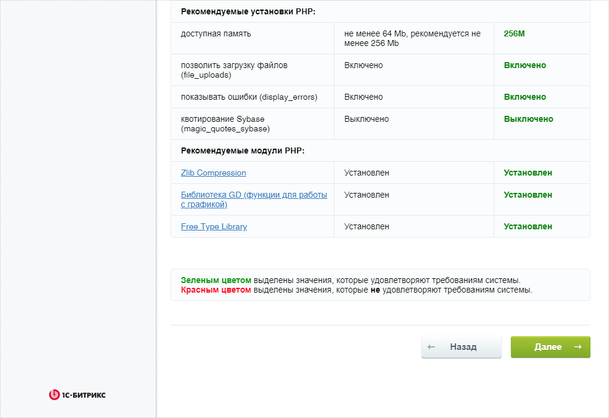

1. Specify the parameters of the created database:

   1. In the **Server** field, enter the fully qualified domain name of the database you created. To find out this name:
      1. In the [management console]({{ link-console-main }}), open the folder page in a new browser tab.
      1. Choose **Managed Service for MySQL**.
      1. In the table, select the database you created.
      1. Select the **Hosts** tab in the left menu.
      1. Hover over the **Hostname** (of the form `rc1c-cfazv1dbzv02u4qk`) and copy the fully qualified domain name of the database by clicking the . The fully qualified domain name is added to the host name, so the **Server** field should contain a name of the following form: `rc1c-cfazv1dbzv02u4qk.{{ dns-zone }}`.
   1. In the **Username** and **Password** fields, enter the data that you specified when creating the database in [Create MySQL database cluster](#create-mysql).
   1. In the **Database name** field, specify the name of the created database (`db1`).
   1. Click **Next**.

   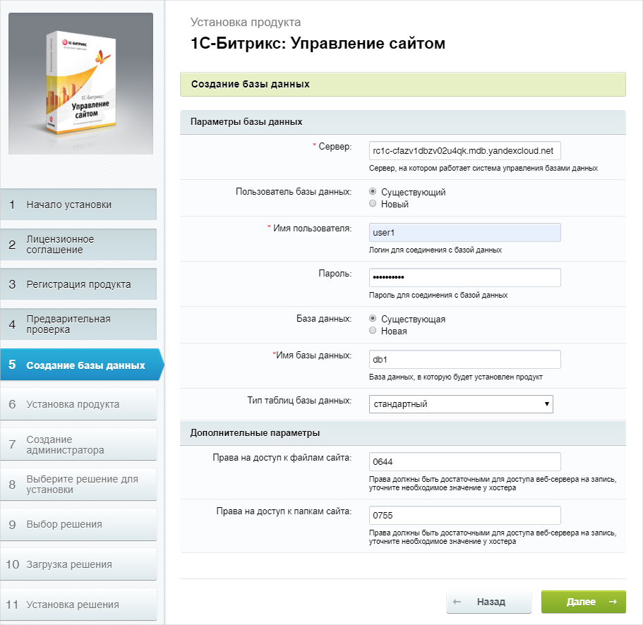

1. Wait for the {{ MY }} database to initialize.

   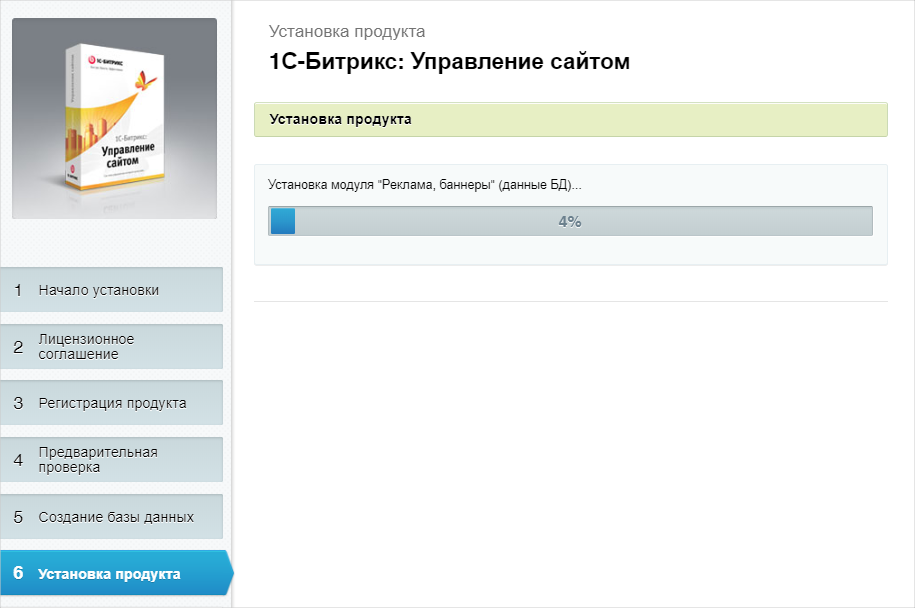

1. Create an administrator account authorized to make changes to your system. Fill in all the fields and click **Next**.

   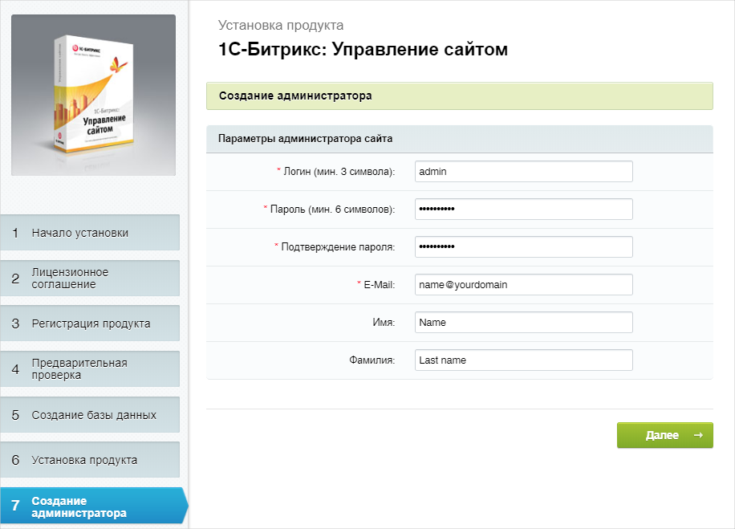

1. Select the **Information portal** template and click **Next**.

   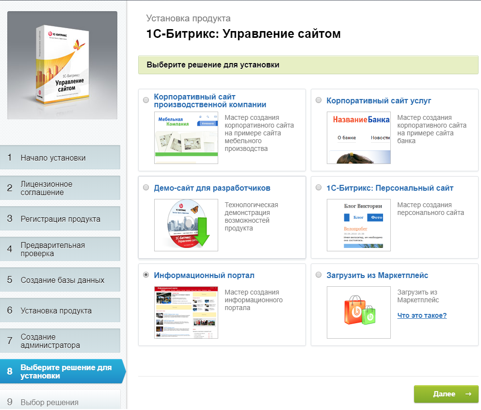

1. Confirm the selection of the only layout template available and click **Next**.

   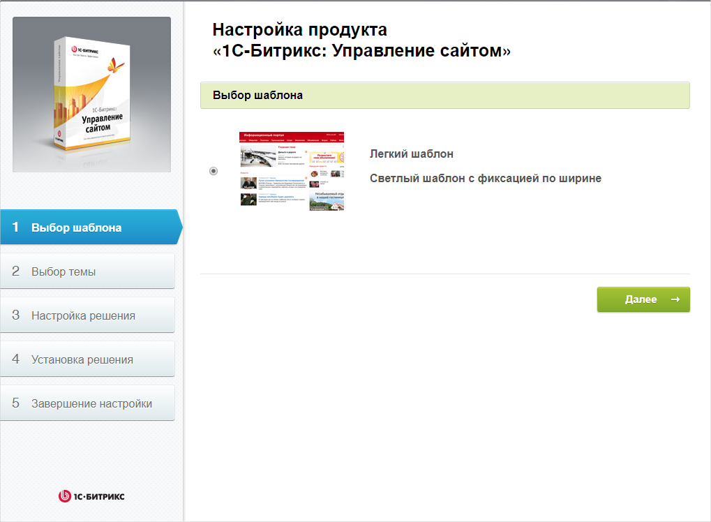

1. Select a color and click **Next**.

   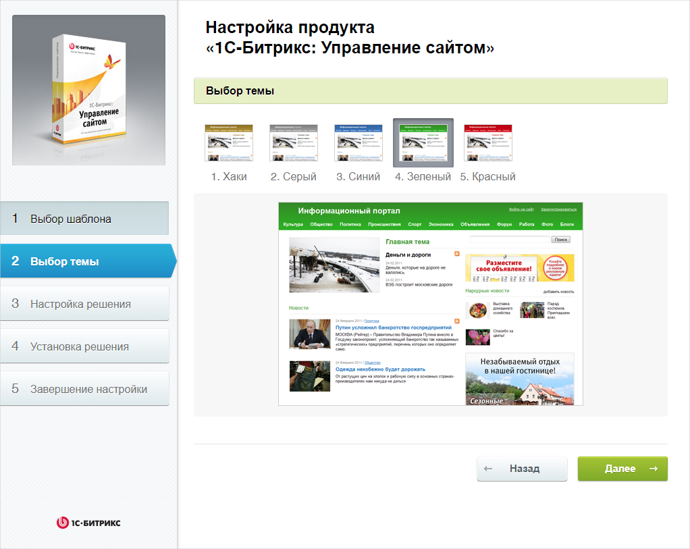

1. Fill in all the fields according to your website requirements and click **Install**. This will begin the installation and configuration of all system components. Wait for them to be completed.

   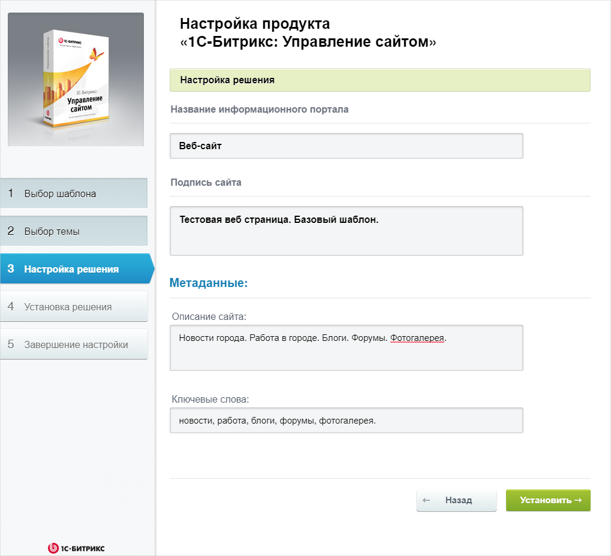

1. After a while, a notification page will inform you that the system is installed and configured. To start using the website, click **Go to site**.

   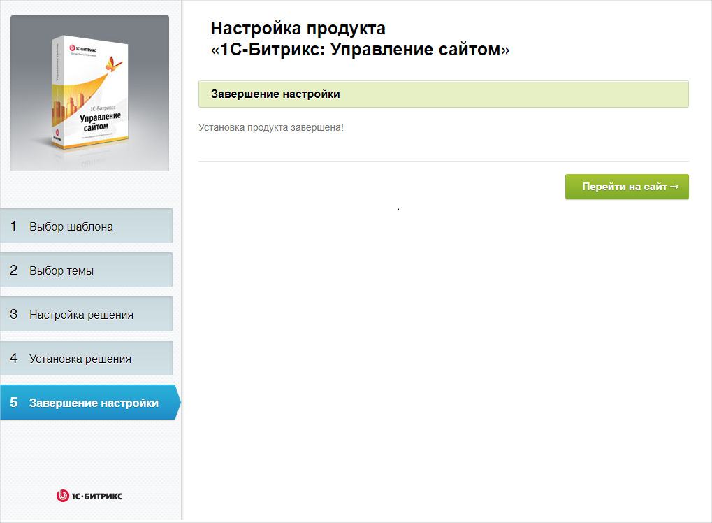

1. The system is now ready to use. You are in the content editing mode of its web interface.

   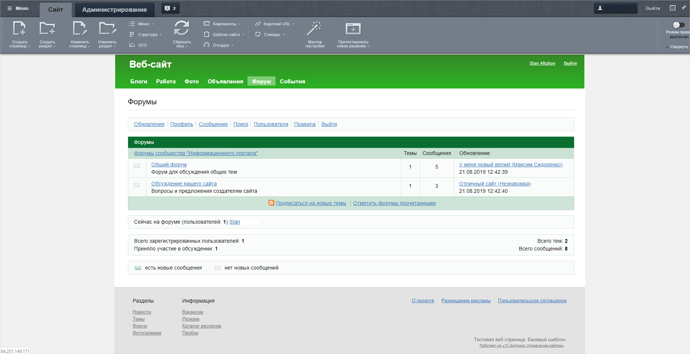

1. To view the website's home page as a user, click **Exit** in the upper-right corner of the page to exit from your website admin panel and go to `http://<VM-public-IP-address>/`. To return to edit mode, log in to the website using the 1C-Bitrix administrator credentials.

   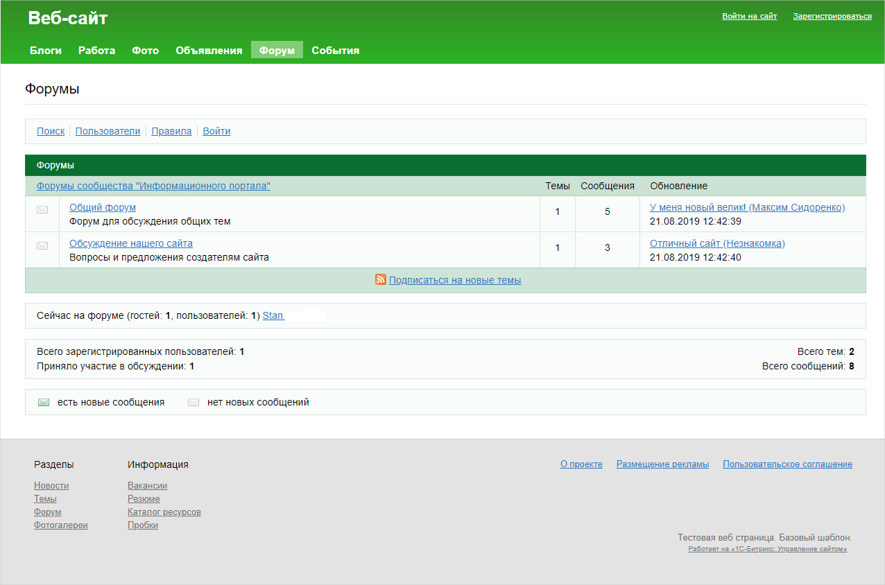

## How to delete the resources you created {#clear-out}

To stop paying for a deployed server:

1. [Delete the VM](../../compute/operations/vm-control/vm-delete.md) `bitrixwebsite`.

   If you reserved a static public IP address specifically for this VM:
   1. Select **{{ vpc-short-name }}** in your folder.
   1. Go to the **IP addresses** tab.
   1. Find the required address, click , and select **Delete**.

1. [Delete the database cluster](../../managed-mysql/operations/cluster-delete.md) `BitrixMySQL`.

## How to create an infrastructure using {{ TF }} {#terraform}



To host your site in Bitrix via {{ TF }}:

1. [Install {{ TF }}](../../tutorials/infrastructure-management/terraform-quickstart.md#install-terraform), [get the authentication credentials](../../tutorials/infrastructure-management/terraform-quickstart.md#get-credentials), and specify the source for installing the {{ yandex-cloud }} provider (see [{#T}](../../tutorials/infrastructure-management/terraform-quickstart.md#configure-provider), step 1).
1. Prepare files with the infrastructure description:

   

   - Ready-made archive

      1. Create a directory for files:
      1. Download the [archive](https:///{{ s3-storage-host }}/doc-files/bitrix.zip) (1 KB).
      1. Unpack the archive to the directory. The `bitrix.tf` file should be added to the directory.

   - Creating files manually

      1. Create a directory for files:
      1. Create the `bitrix.tf` configuration file in the directory:

         

         

         

   

   For more information about the parameters of resources used in {{ TF }}, see the provider documentation:

   * [yandex_compute_instance]({{ tf-provider-resources-link }}/compute_instance)
   * [yandex_mdb_mysql_cluster]({{ tf-provider-resources-link }}/mdb_mysql_cluster)
   * [yandex_mdb_mysql_database]({{ tf-provider-resources-link }}/mdb_mysql_database)
   * [yandex_mdb_mysql_user]({{ tf-provider-resources-link }}/mdb_mysql_user)
   * [yandex_vpc_security_group]({{ tf-provider-resources-link }}/vpc_security_group)
   * [yandex_vpc_network]({{ tf-provider-resources-link }}/vpc_network)
   * [yandex_vpc_subnet]({{ tf-provider-resources-link }}/vpc_subnet)

1. Under `metadata`, enter your username and the contents of your SSH key. For more information, see [{#T}](../../compute/concepts/vm-metadata.md).

1. Create resources:

   

1. [Configure a server to work with 1C-Bitrix](#configure-server).

1. [Configure 1C-Bitrix](#configure-bitrix).
