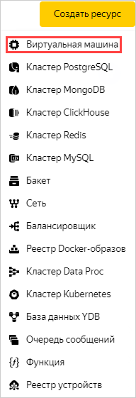
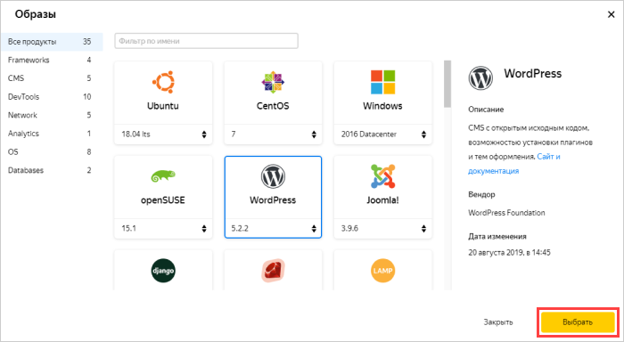
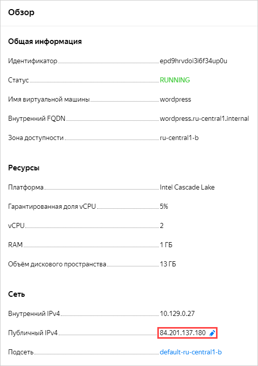
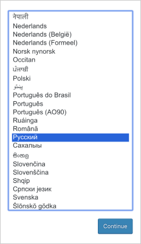
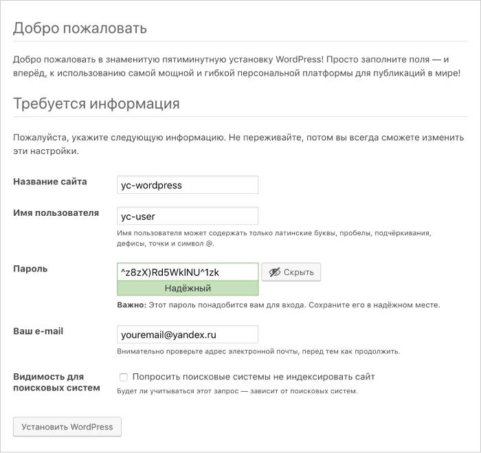
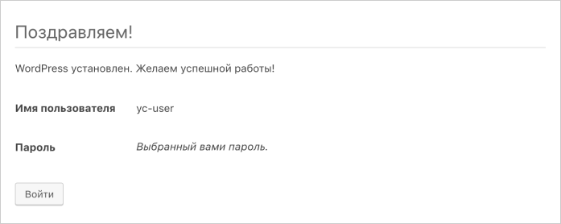

# Creating a website in WordPress

Create and configure a website in WordPress CMS using a special image of the VM.

To set up a website in WordPress:
1. [Create a security group](#create-security-group).
1. [Create a VM for WordPress](#create-vm).
1. [Configure the DNS](#configure-dns).
1. [Configure WordPress](#wordpress-setup).

If you no longer need the website, [delete the VM containing it](#clear-out).

You can also deploy the infrastructure for hosting a website in the WordPress CMS via {{ TF }} using a [ready-made configuration file](#terraform).

## Prepare your cloud {#before-you-begin}



Make sure the selected folder has a cloud network with a subnet in at least one availability zone. To do this, select **{{ vpc-short-name }}** on the folder page. If the list contains a network, click on its name to see the list of subnets. If the subnets or network you need are not listed, [create them](../../vpc/quickstart.md).

### Required paid resources {#paid-resources}

The cost of hosting a website in WordPress includes:
* A fee for a continuously running VM (see [{{ compute-full-name }} pricing](../../compute/pricing.md)).
* A fee for using a dynamic or static external IP address (see [{{ vpc-full-name }} pricing](../../vpc/pricing.md)).

## Create a security group {#create-security-group}

To create a security group:



- Management console

   1. In the [management console]({{ link-console-main }}), select **{{ vpc-name }}**.
   1. Open the **Security groups** tab.
   1. Click **Create group**.
   1. Enter the **name** of the group: `wordpress`.
   1. Select the **Network**.
   1. Under **Rules**, create the following rules using the instructions below the table:

      | Traffic direction | Description | Port range | Protocol | Source/ destination type | Source / destination |
      |-------------------------|-----------|---------------------|----------|--------------------------------|---------------------------|
      | Outgoing | any | All | Any | CIDR | 0.0.0.0/0 |
      | Incoming | ext-http | 80 | TCP | CIDR | 0.0.0.0/0 |
      | Incoming | ext-https | 443 | TCP | CIDR | 0.0.0.0/0 |

      1. Select the **Outgoing traffic** or **Incoming traffic** tab.
      1. Click **Add rule**.
      1. In the **Port range** window that opens, specify the port receiving traffic. Do not indicate anything for outgoing traffic.
      1. In the **Protocol** field, specify the required protocol. For outgoing traffic, leave **Any** to allow traffic over all protocols.
      1. In the **Destination** or **Source** field, select the **CIDR**, and the rule is applied to a range of IP addresses. In the **CIDR blocks** field, enter `0.0.0.0/0`.
      1. Click **Save**. Repeat the steps to create all rules from the table.

   1. Click **Save**.

- {{ TF }}

   See [How to create an infrastructure using {{ TF }}](#terraform).



## Create a virtual machine for WordPress {#create-vm}

To create a VM:



- Management console

   1. On the folder page in the [management console]({{ link-console-main }}), click **Create resource** and select **Virtual machine**.

      

   1. In the **Name** field, enter the VM name: `wordpress`.

      

   1. Select an [availability zone](../../overview/concepts/geo-scope.md) to place the VM in.
   1. Under **Image/boot disk selection**, click the **{{ marketplace-name }}** tab and select [WordPress](/marketplace/products/yc/wordpress) as your public image.

      

   1. Under **Computing resources**:
      * Choose a [platform](../../compute/concepts/vm-platforms.md).
      * Specify the necessary number of vCPUs and amount of RAM.

      The minimum configuration is enough for testing:
      * **Platform**: Intel Ice Lake.
      * **vCPU**: 2.
      * **Guaranteed vCPU share**: 20%.
      * **RAM**: 1 GB.

   1. In **Network settings**, select the subnet to connect the VM to once it is created.
   1. In **Public address**, select **Automatically**.

      

   1. In **Security group**, select the `wordpress` group.
   1. Enter the VM access information:
      * Enter the username in the **Login** field.
      * In the **SSH key** field, paste the contents of the public key file.

         You will need to create a key pair for the SSH connection yourself. For details, see [{#T}](../../compute/operations/vm-connect/ssh.md).

   1. Click **Create VM**.

   The VM may take several minutes to create. When the VM's status changes to `RUNNING`, you can begin configuring the website.

   Once created, the VM is assigned an IP address and a host name (FQDN). This data can be used when configuring the DNS and SSH access.

- {{ TF }}

   See [How to create an infrastructure using {{ TF }}](#terraform).



## Configure the DNS (if you have a domain name) {#configure-dns}

If you have a registered domain name, use the {{ dns-name }} service to manage the domain.

You can also configure the DNS via {{ TF }}. For more information, see [How to create an infrastructure using {{ TF }}](#terraform).



## Setting up WordPress {#wordpress-setup}

After the `wordpress` VM's status changes to `RUNNING`, do the following:
1. Under **Network** on the VM page in the [management console]({{ link-console-main }}), find the VM's public IP address and enter it in the A resource record you previously created.

   

1. Open the domain name you configured or the VM's address in the browser.
1. Select the language and click **Continue**.

   

1. Fill out information to access the website:
   1. Enter any name for the website (for example, `yc-wordpress`).
   1. Specify the username to be used to log in to the admin panel (for example, `yc-user`).
   1. Enter the password to be used to log in to the admin panel.
   1. Enter your email address.

   

1. Click **Install WordPress**.
1. If the installation is successful, click **Log in**.

   

1. Log in to the website with the username and password specified in the previous steps. This opens the admin panel, where you can start working with your website.
1. Make sure the website is accessible by opening the VM's public IP address in your browser.

## How to delete created resources {#clear-out}

To stop paying for your deployed server, just [delete](../../compute/operations/vm-control/vm-delete.md) the `wordpress` VM.

If you reserved a static public IP address specifically for this VM:
1. Select **{{ vpc-short-name }}** in your folder.
1. Go to the **IP addresses** tab.
1. Find the required address, click , and select **Delete**.

## How to create an infrastructure using {{ TF }} {#terraform}



To host your site in WordPress CMS via {{ TF }}:

1. [Install {{ TF }}](../../tutorials/infrastructure-management/terraform-quickstart.md#install-terraform), [get the authentication credentials](../../tutorials/infrastructure-management/terraform-quickstart.md#get-credentials), and specify the source for installing the {{ yandex-cloud }} provider (see [{#T}](../../tutorials/infrastructure-management/terraform-quickstart.md#configure-provider), step 1).
1. Prepare files with the infrastructure description:

   

   - Ready-made archive

      1. Create a directory for files:
      1. Download the [archive](https://{{ s3-storage-host }}/www.example.com/doc-files/wordpress.zip) (1 KB).
      1. Unpack the archive to the directory. The `wordpress.tf` file should be added to the directory.

   - Creating files manually

      1. Create a directory for files:
      1. Create the `wordpress.tf` configuration file in the directory:

         

         

         

   

   For more information about the parameters of resources used in {{ TF }}, see the provider documentation:

   * [yandex_compute_instance]({{ tf-provider-resources-link }}/compute_instance)
   * [yandex_vpc_security_group]({{ tf-provider-resources-link }}/yandex_vpc_security_group)
   * [yandex_vpc_network]({{ tf-provider-resources-link }}/vpc_network)
   * [yandex_vpc_subnet]({{ tf-provider-resources-link }}/vpc_subnet)
   * [yandex_dns_zone]({{ tf-provider-resources-link }}/dns_zone)
   * [yandex_dns_recordset]({{ tf-provider-resources-link }}/dns_recordset)

1. Under `metadata`, enter the metadata for creating a VM instance: `<username>:<SSH_key_contents>`. Regardless of the username specified, the key is assigned to the user set in the WordPress image configuration. In different images, these users differ. For more information, see [{#T}](../../compute/concepts/vm-metadata.md#keys-processed-in-public-images).

1. Create resources:

   

1. [Configure WordPress](#wordpress-setup).
