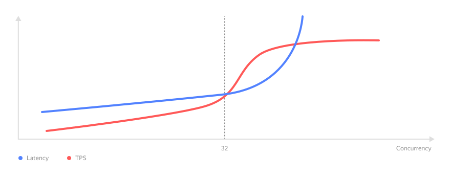

# Dedicated instances



With {{ foundation-models-name }}, you can deploy some models on a _dedicated instance_. Unlike a manual deployment on {{ compute-full-name }} VMs, you do not have to configure the environment or select optimal VM parameters. {{ foundation-models-name }} provides stable, reliable, and efficient model inference and monitors its operation automatically. 

Dedicated instances have a number of advantages:

* Guaranteed performance parameters that are not affected by other users' traffic.
* No additional quotas for requests and parallel generations. The restrictions you get only depend on the instance configuration you select.
* Optimized model inference for efficient hardware utilization.

Dedicated instances will benefit you if you need to process massive volumes of requests without delays. Dedicated instance is not [priced](../../pricing.md) based on the amount of incoming and outgoing tokens: you only pay for its running time. 

## Dedicated instance models {#models}

All deployed models are accessible via an API compatible with [{{ openai }}](../openai-compatibility.md), {{ ml-sdk-name }}, and in {{ ai-playground }}. To deploy a dedicated instance, you need the `ai.models.editor` [role](../../security/index.md) or higher for the folder. To access the model, it is enough to have the `ai.languageModels.user` role.

#|
|| **Model** | **Context** | **License** ||
|| **Qwen 2.5 VL 32B Instruct**
[Model card](https://huggingface.co/Qwen/Qwen2.5-VL-32B-Instruct) | 32,768 | [Apache 2.0]({{ license-apache }}) license ||
|| **Qwen 2.5 7B Instruct** 
[Model card](https://huggingface.co/Qwen/Qwen2.5-7B-Instruct) | 32,768 | [Qwen license](https://huggingface.co/Qwen/Qwen2.5-72B-Instruct/blob/main/LICENSE) ||
|| **Gemma 3 4B it**
[Model card](https://huggingface.co/google/gemma-3-4b-it) | 131,072 | [Gemma Terms of Use]({{ license-gemma }})  ||
|| **Gemma 3 12B it**
[Model card](https://huggingface.co/google/gemma-3-12b-it) | 65,536 | [Gemma Terms of Use]({{ license-gemma }}) ||
|| **T-pro-it-2.0-FP8** 
[Model card](https://huggingface.co/t-tech/T-pro-it-2.0-FP8) | 32,768 | [Apache 2.0]({{ license-apache }}) license ||
|#

## Dedicated instance configurations {#config}

Each model may be available for deployment in several configurations: **S**, **M**, or **L**. Each configuration guarantees specific values ​of TTFT (_time to first token_), _Latency_ (time it takes to generate a response), and TPS (_tokens per second_) for requests with different context lengths.

The figure below shows the dependence of latency and the number of tokens processed by the model on the number of parallel generations (_Concurrency_ in the figure): up to a certain point, the more generations the model processes in parallel, the longer the generation will last, and the more tokens will be generated per second.

