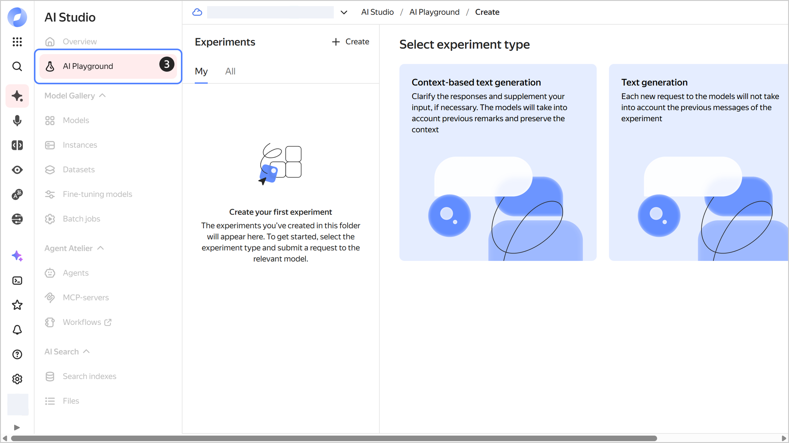
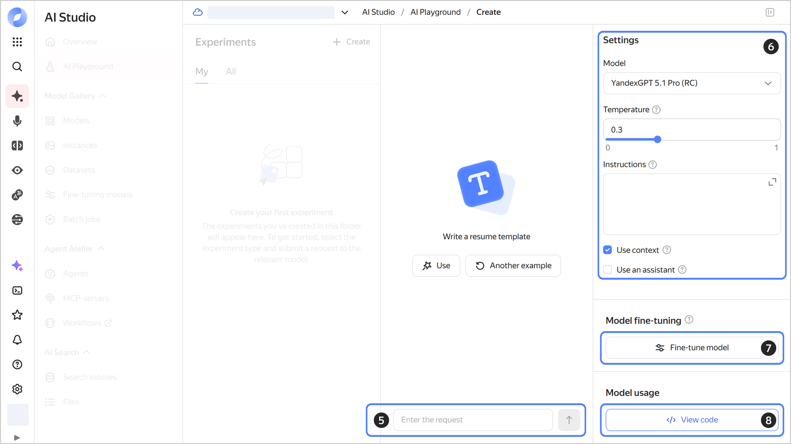

# Getting started with {{ gpt-lite }} and {{ gpt-pro }}

In this section, you will learn how to use the {{ yagpt-name }} model to generate texts in [synchronous mode](../concepts/generation/index.md#working-mode) without adding any context. For other examples, see [Guides on how to use {{ foundation-models-full-name }}](../operations/index.md#yandexgpt-api).

For information about the {{ foundation-models-full-name }} pricing, see [{#T}](../pricing.md).

## Getting started {#before-begin}

To get started in {{ yandex-cloud }}:

1. Log in to the [management console]({{ link-console-main }}). If not signed up yet, navigate to the management console and follow the on-screen instructions.
1. In [{{ billing-name }}]({{ link-console-billing }}), make sure you have a [billing account](../../billing/concepts/billing-account.md) linked and its [status](../../billing/concepts/billing-account-statuses.md) is `ACTIVE` or `TRIAL_ACTIVE`. If you do not have a billing account yet, [create one](../../billing/quickstart/index.md#create_billing_account).
1. If you do not have a [folder](../../resource-manager/concepts/resources-hierarchy.md#folder) yet, [create one](../../resource-manager/operations/folder/create.md).



- Management console {#console}

  You can start working from the management console right away.

- SDK {#sdk}

  To use the examples of requests using SDK:

  



## Generate the text {#generate-text}





- Management console {#console}

  1. In the [management console]({{ link-console-main }}), select a folder for which your account has the `{{ roles-yagpt-user }}` role or higher.
  1. Click  **{{ ui-key.yacloud.iam.folder.dashboard.label_products }}** on the left-hand panel and select **{{ ui-key.yacloud.iam.folder.dashboard.label_ai-studio }}** or find it using the search bar on the dashboard.
  1. In the left-hand panel, select  **{{ ui-key.yacloud.yagpt.playground }}**.

     

  1. Select the generation type:

      * **Context-aware generation**: Model will generate responses based on the dialog history. This will allow you to refine the result during the interaction.
      * **Text generation**: Model will generate responses based only on your last message and instructions.

  1. Type your query in the input field below and click  or press **Enter**. You can also use the query examples provided above.

     All your dialogs are saved in the **{{ ui-key.yacloud.yagpt.experiments-page-subtitle }}** panel on the right. Click  next to the dialog to rename or delete it.

  1. To set up a chat, under **{{ ui-key.yacloud.yagpt.settings }}**, do the following:

     1. Select a generation [model](../concepts/generation/models.md).
     1. **{{ ui-key.yacloud.yagpt.label_temperature-text }}**: Enter a value between `0` and `1` for the model's response variability. With a higher value, you get a more unpredictable result.
     1. **{{ ui-key.yacloud.yagpt.instruction }}**: Describe your task, the appropriate writing style, limits, and other requirements for the model. .
     1. **{{ ui-key.yacloud.yagpt.use-context }}**: Change the generation type.
     1. **{{ ui-key.yacloud.yagpt.use-assistant }}**: If this option is enabled, {{ ai-playground }} will work based on [{{ assistant-api }}](../concepts/assistant/index.md).

  1. Click  **{{ ui-key.yacloud.yagpt.train-modal }}** if you want to [train the model](../concepts/tuning/index.md) to follow a complex response format.
  1. Click  **View code** to get the code for a request to the model via the ML SDK for Python or [cURL](https://curl.haxx.se).

     

- SDK {#sdk}

  



#### What's next {#what-is-next}

* [Learn more about the service](../concepts/index.md)
* [Learn about API authentication methods](../api-ref/authentication.md)
* 