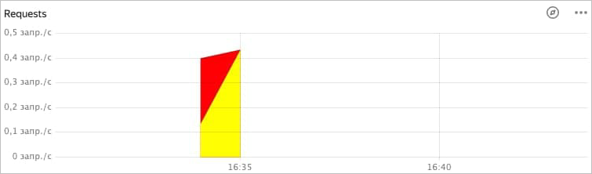
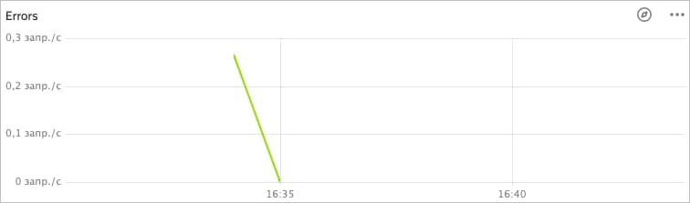
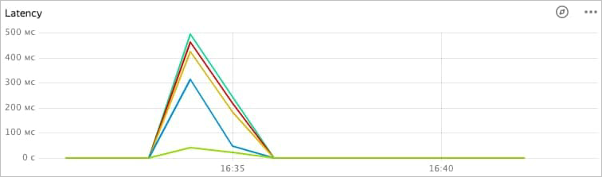

# View monitoring charts

You can view charts for the following metrics:

* [Number of API gateway requests](#requests)
* [Number of errors that occurred when accessing the API gateway](#errors)
* [API gateway request execution time](#latency)

## Number of API gateway requests {#requests}

To view the chart:

1. Open the **{{ api-gw-name }}** section in the folder with the API gateway you want to get information about.

1. In the window that opens, select the API gateway that you want to view monitoring charts for.

1. Go to the **Monitoring** tab.

1. Select the period for the chart. You can choose a predefined interval (hour, day, week, month) or enter a custom period in the date fields.

1. The number of requests to the API gateway is shown in the **Requests** chart:

    

## Number of errors that occurred when accessing the API gateway {#errors}

To view the chart:

1. Open the **{{ api-gw-name }}** section in the folder with the API gateway you want to get information about.

1. In the window that opens, select the API gateway that you want to view monitoring charts for.

1. Go to the **Monitoring** tab.

1. Select the period for the chart. You can choose a predefined interval (hour, day, week, month) or enter a custom period in the date fields.

1. The number of errors that occurred when accessing the API gateway is shown in the **Errors** chart:

    

## API gateway request execution time {#latency}

To view the chart:

1. Open the **{{ api-gw-name }}** section in the folder with the API gateway you want to get information about.

1. In the window that opens, select the API gateway that you want to view monitoring charts for.

1. Go to the **Monitoring** tab.

1. Select the period for the chart. You can choose a predefined interval (hour, day, week, month) or enter a custom period in the date fields.

1. The API gateway request execution time is displayed on the **Latency** chart:

   

