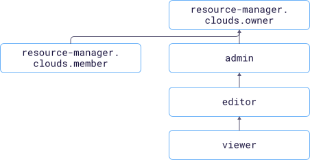

# Access management in {{ alb-name }}

In this section, you'll learn:

* [What resources you can assign roles to](#resources).
* [What roles exist in the service](#roles-list).
* [What roles are required](#required-roles) for particular actions.



## What resources you can assign roles to {#resources}



## What roles exist in the service {#roles-list}

The diagram shows which roles are available in the service and how they inherit each other's permissions. For example, the `editor` role includes all `viewer` role permissions. A description of each role is given under the diagram.

Active roles in the service:

* Primitive roles:
    * 
    * 
    * 

## What roles do I need {#required-roles}

The table below lists the roles needed to perform a given action. You can always assign a role granting more permissions than the role specified. For example, you can assign `editor` instead of `viewer`.

| Action | Methods | Required roles |
| ----- | ----- | ----- |
| **View data** |  |
| View information about any resource | `get`, `list` | `viewer` for this resource |
| **Manage resources** |  |
| Create resources in a folder | `create` | `editor` for the folder |
| Edit, delete resources | `update`, `delete` | `editor` |
| **Manage resource access** |  |
| [Assign](../../iam/operations/roles/grant.md), [revoke](../../iam/operations/roles/revoke.md), and view roles granted for the resource | `setAccessBindings`, `updateAccessBindings`, `listAccessBindings` | `admin` for the resource |

#### What's next

* [How to assign a role](../../iam/operations/roles/grant.md).
* [How to revoke a role](../../iam/operations/roles/revoke.md).
* [Learn more about access management in {{ yandex-cloud }}](../../iam/concepts/access-control/index.md).
* [For more information about role inheritance](../../resource-manager/concepts/resources-hierarchy.md#access-rights-inheritance).

