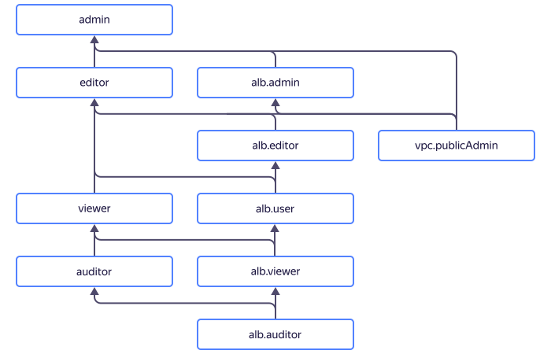

# Access management in {{ alb-name }}

In this section, you will learn:
* [Which resources you can assign a role for](#resources).
* [Which roles exist in the service](#roles-list).
* [Which roles are required](#required-roles) for particular actions.



## Which resources you can assign a role for {#resources}



## Which roles exist in the service {#roles-list}



### Service roles {#service-roles}

#### alb.auditor {#alb-auditor}



#### alb.viewer {#alb-viewer}



#### alb.user {#alb-user}



#### alb.editor {#alb-editor}



#### alb.admin {#alb-admin}



   

   To connect a public IP address to a new or existing L7 load balancer, you need to assign the `vpc.publicAdmin` role to the network where the load balancer is located, apart from the `alb.editor` or `alb.admin` roles.

   

### Primitive roles {#primitive-roles}



## What roles do I need {#required-roles}

The table below lists the roles needed to perform a particular action. You can always assign a role granting more permissions than the role specified. For example, you can assign the `editor` role instead of `viewer`.

| Action | Methods | Required roles |
----- | ----- | -----
| **View data** | |
| View information about any resource | `get`, `list`, `listOperations` | `alb.viewer` for this resource |
| **Manage L7 load balancers** | |
| [Create](../operations/application-load-balancer-create.md) and [update](../operations/application-load-balancer-update.md) L7 load balancers with public IP addresses | `create` | `alb.editor` and `vpc.publicAdmin` to the network where the load balancer is located |
| Create and update L7 load balancers without a public IP address | `create` | `alb.editor` |
| [Delete L7 load balancers](../operations/application-load-balancer-delete.md) | `update`, `delete` | `alb.editor` |
| Get the status of target groups | `getTargetStates` | `alb.viewer` |
| Add, update, and remove listeners | `addListener`, `updateListener`, `removeListener` | `alb.editor` |
| Add, update, and remove an SNI match | `addSniMatch`, `updateSniMatch`, `removeSniMatch` | `alb.editor` |
| Getting certificates for listeners with TLS encryption | `addListener`, `updateListener` | `certificate-manager.certificates.downloader` |
| Stop and start an L7 load balancer | `stop`, `start` | `alb.editor` |
| **Manage HTTP routers** | |
| [Create an HTTP router](../operations/http-router-create.md) | `create` | `alb.editor` |
| [Update an HTTP router](../operations/http-router-update.md) | `update` | `alb.editor` |
| [Delete an HTTP router](../operations/http-router-delete.md) | `delete` | `alb.editor` |
| **Manage backend groups** | |
| [Create](../operations/backend-group-create.md) and [update](../operations/backend-group-update.md) backend groups | `create`, `update`, `updateBackend` | `alb.editor` |
| [Delete backend groups](../operations/backend-group-delete.md) | `delete` | `alb.editor` |
| Add resources in a backend group | `addBackend` | `alb.editor` |
| Remove resources in a backend group | `removeBackend` | `alb.editor` |
| **Manage target groups** | |
| [Create](../operations/target-group-create.md) and [update](../operations/target-group-update.md) target groups in a folder | `create`, `update` | `alb.editor` |
| [Delete target groups](../operations/target-group-delete.md) | `delete` | `alb.editor` |
| Add resources in a target group | `addTargets` | `alb.editor` |
| Remove resources in a target group | `removeTargets` | `alb.editor` |
| **Manage resource access** | |
| [Grant a role](../../iam/operations/roles/grant.md), [revoke a role](../../iam/operations/roles/revoke.md), and view roles granted for the resource | `setAccessBindings`, `updateAccessBindings`, `listAccessBindings` | `admin` for the resource |

#### What's next

* [How to assign a role](../../iam/operations/roles/grant.md).
* [How to revoke a role](../../iam/operations/roles/revoke.md).
* [Learn more about access management in {{ yandex-cloud }}](../../iam/concepts/access-control/index.md).
* [Learn more about inheriting roles](../../resource-manager/concepts/resources-hierarchy.md#access-rights-inheritance).
