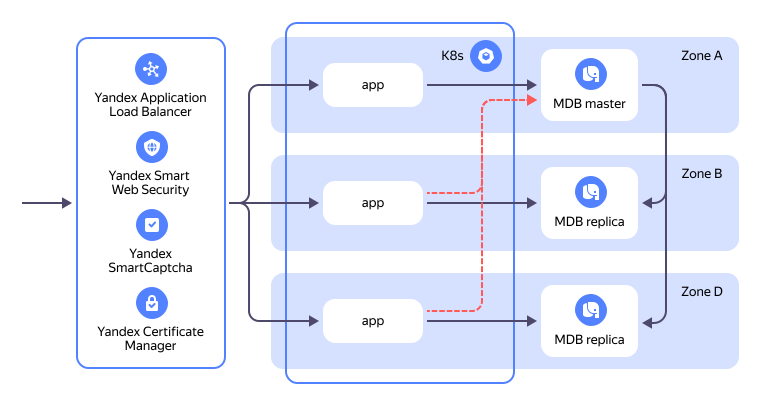

# Deploying a web app in a fault-tolerant configuration in {{ yandex-cloud }}

This guide gives an example of how to deploy a web app in a fault-tolerant configuration in the {{ yandex-cloud }} infrastructure. The infrastructure behind our web app is built around a group of scalable managed services of the {{ yandex-cloud }} ecosystem: [{{ managed-k8s-full-name }}](../managed-kubernetes/index.yaml), [{{ mpg-full-name }}](../managed-postgresql/index.yaml), and [{{ alb-full-name }}](../application-load-balancer/index.yaml).

In addition to the core components listed above, there are auxiliary services used to launch and test the app. These are [{{ container-registry-full-name }}](../container-registry/index.yaml), [{{ certificate-manager-full-name }}](../certificate-manager/index.yaml), [{{ dns-full-name }}](../dns/index.yaml), [{{ compute-full-name }}](../compute/index.yaml), [{{ iam-full-name }}](../iam/index.yaml), [{{ kms-full-name }}](../kms/index.yaml), and [{{ vpc-full-name }}](../vpc/index.yaml).


## System architecture {#architecture}

The solution's infrastructure is engineered based on the fault-tolerant infrastructure [recommendations](./fault-tolerance.md) and {{ PG }} cluster topology planning [recommendations](../managed-postgresql/concepts/planning-cluster-topology.md). 



### Network {#network}

The infrastructure is comprised of one {{ vpc-name }} [cloud network](../vpc/concepts/network.md#network) named `net-todo-app`.

#### Subnets {#subnets}

The `net-todo-app` network consists of six [subnets](../vpc/concepts/network.md#subnet):

* `net-todo-app-k8s1`, `net-todo-app-k8s2`, and `net-todo-app-k8s3` for {{ k8s }} [cluster](../managed-kubernetes/concepts/index.md#kubernetes-cluster) nodes, one in each [availability zone](../overview/concepts/geo-scope.md).
* `net-todo-app-db1`, `net-todo-app-db2`, and `net-todo-app-db3` for {{ PG }} [cluster](../managed-postgresql/concepts/index.md) nodes, one in each availability zone.

#### Security groups {#security-groups}

Network access to infrastructure resources is controlled with the help of these [security groups](../vpc/concepts/security-groups.md):

* `db-todo-app` allows incoming traffic to {{ PG }} cluster nodes only from {{ k8s }} cluster nodes to TCP port `6432`.
* `k8s-cluster-todo-app` allows:

    * Incoming traffic to the {{ k8s }} cluster's TCP ports `443` and `6443` from cluster nodes.
    * The security group also allows incoming traffic to the cluster's TCP ports `443` and `6443` from the internet. This goes well with a test environment. 

        

        In a production environment, limit access to your {{ k8s }} cluster to [internal](../vpc/concepts/address.md#internal-addresses) or individual [public](../vpc/concepts/address.md#public-addresses) IP addresses.

        

* `k8s-nodes-todo-app` allows:

    * Incoming traffic [from other cluster nodes](../managed-kubernetes/operations/connect/security-groups.md#rules-internal-nodegroup) as well as from the CIDRs of the cluster and the services.
    * Incoming traffic from the {{ k8s }} cluster to TCP ports `10250` and `10256` for `kubectl exec`/`kubectl logs` and for `kubeproxy` health checks.
    * Incoming traffic from {{ alb-name }} [resource units](../application-load-balancer/concepts/application-load-balancer.md#lcu-scaling) to TCP port `10501` for [cluster node availability checks](../managed-kubernetes/tutorials/custom-health-checks.md).
    * Incoming traffic from any internet addresses to ports in the `30000` to `32767` range to publish the services run in the cluster.

        

        If you require no access to {{ k8s }} services bypassing the [L7 load balancer](../application-load-balancer/concepts/application-load-balancer.md), restrict access to this range reserving it only for the {{ alb-name }} resource units.

        

    * Incoming traffic from the {{ network-load-balancer-full-name }} [health check](../network-load-balancer/concepts/health-check.md) system. If not intending to use any [{{ network-load-balancer-short-name }} tools](../managed-kubernetes/nlb-ref/index.md), [delete](../vpc/operations/security-group-delete-rule.md) this rule from the security group.
    * Incoming traffic from the {{ k8s }} cluster to TCP port `4443` for the metric collector.
* `k8s-alb-todo-app` allows:

    * Incoming traffic from the internet to TCP ports `80` and `443` enabling user access to the web app.
    * Incoming traffic for the whole TCP port range to health-check the load balancer.

In addition, all security groups allow incoming ICMP traffic. 

#### Resource addresses {#addresses}

Your new infrastructure uses two [public IP addresses](../vpc/concepts/address.md#public-addresses):
* IP address of the `primary-address-todo-app` L7 load balancer.
* IP address of the {{ k8s }} cluster (not counted towards the overall public IP address [quota](#resources)).

The {{ k8s }} and {{ PG }} cluster nodes use [internal addresses](../vpc/concepts/address.md#internal-addresses). 

### {{ PG }} {#postgresql}

The web app database is hosted in a managed {{ mpg-name }} [cluster](../managed-postgresql/concepts/index.md) named `main-todo-app`.

Boasting the most fault-tolerant configuration, the cluster has its worker nodes in three [availability zones](../overview/concepts/geo-scope.md), as per the {{ PG }} cluster topology planning [guidelines](../managed-postgresql/concepts/planning-cluster-topology.md#three-or-more-hosts-cluster).

The {{ PG }} cluster nodes have no public IP addresses; you can access the database only via internal IP addresses – and that only from the {{ k8s }} cluster nodes or through the [{{ websql-full-name }} user interface](../websql/concepts/index.md#user-interface).

The cluster has a database named `todo` and a user named `todo`, both used by the web app.

### {{ k8s }} {#k8s}

To run the app components, there is a managed {{ managed-k8s-name }} [cluster](../managed-kubernetes/concepts/index.md#kubernetes-cluster) named `main-todo-app`.

In line with the fault-tolerant infrastructure [recommendations](./fault-tolerance.md), the cluster has the following configuration:

* High-availability {{ managed-k8s-name }} cluster with [masters](../managed-kubernetes/concepts/index.md#master) in three [availability zones](../overview/concepts/geo-scope.md).
* The cluster uses the DNS request caching service [NodeLocal DNS Cache](../managed-kubernetes/tutorials/node-local-dns.md).

The {{ k8s }} cluster employs an auxiliary {{ alb-name }} [ingress controller](../application-load-balancer/tools/k8s-ingress-controller/index.md) service to manage the L7 load balancer configuration with the help of [Ingress](../managed-kubernetes/alb-ref/ingress.md) objects.

Public API access is on to manage the {{ k8s }} auxiliary services with the help of {{ TF }} manifests. Access to the API is restricted with the help of [security groups](#security-groups).

{{ k8s }} cluster nodes need access to the internet, including to download [Docker images](../container-registry/concepts/docker-image.md) from the {{ container-registry-full-name }} [registry](../container-registry/concepts/registry.md). The cluster nodes access the internet using a [NAT gateway](../vpc/concepts/gateways.md#nat-gateway) named `net-todo-app-egress-nat` and a [route table](../vpc/concepts/routing.md#rt-vm) named `net-todo-app-default-route-table` associated with the {{ k8s }} cluster subnets. Their internet access is not restricted.

### L7 load balancer {#alb}

The infrastructure uses the managed {{ alb-name }} solution for web app load balancing. {{ managed-k8s-name }} dynamically creates the {{ alb-name }} [L7 load balancer](../application-load-balancer/concepts/application-load-balancer.md) with the help of [Ingress](../managed-kubernetes/alb-ref/ingress.md) objects. The {{ alb-name }} [ingress controller](../application-load-balancer/tools/k8s-ingress-controller/index.md) monitors changes to Ingress objects and modifies the relevant load balancer settings, including its creation and deletion. Ingress is part of the app installation [Helm chart](https://helm.sh/docs/topics/charts/).

{{ alb-name }} is integrated with [{{ certificate-manager-full-name }}](../certificate-manager/index.yaml), a service that automatically gets your [Let's Encrypt](https://letsencrypt.org) certificates for you.

## Scaling features and modifications {#scaling-features}

All the infrastructure components are scalable, both horizontally and vertically:

* The {{ managed-k8s-name }} cluster can be autoscaled by adding new nodes.
* The {{ mpg-name }} cluster can autoscale its storage based on utilization, but adding additional cluster nodes is a manual operation.
* {{ alb-name }} supports automatic and manual scaling depending on load. 
* You can quickly expand the infrastructure using other managed services such as [{{ mrd-full-name }}](../managed-redis/index.yaml), [{{ mkf-full-name }}](../managed-kafka/index.yaml), [{{ objstorage-full-name }}](../storage/index.yaml), etc. 

In addition to the built-in features, you can connect extra components:

* You can connect a {{ sws-full-name }} [security profile](../smartwebsecurity/concepts/profiles.md) for protection against bots, DDoS and web attacks, also acting as WAF and [ARL](../smartwebsecurity/concepts/arl.md).
* If you need to restrict access to the internet or use a fixed IP address for access, you can easily modify the infrastructure and set up an internet connection [using a NAT instance](../tutorials/routing/nat-instance/index.md) or [another]({{ link-cloud-marketplace }}?categories=network) networking product from [{{ marketplace-full-name }}](../marketplace/index.yaml).

## Test app {#sample-app}

The [todo](https://github.com/yandex-cloud-examples/yc-demo-todo-application) test web app deployed in this tutorial is [adapted](https://12factor.net/) to operate in a cloud infrastructure. For a runtime environment, it uses a [managed {{ k8s }} cluster](../managed-kubernetes/concepts/index.md#kubernetes-cluster). The app is comprised of two components: [frontend](https://en.wikipedia.org/wiki/Frontend_and_backend) and [backend](https://en.wikipedia.org/wiki/Frontend_and_backend).

Both are assembled and packed into a [distroless](https://github.com/GoogleContainerTools/distroless) container image named `gcr.io/distroless/base-debian12` for maximum compactness and security.

The backend is written in [Go](https://go.dev/) and requires a [PostgreSQL DBMS](https://www.postgresql.org/). In accordance with the fault-tolerant infrastructure [recommendations](fault-tolerance.md), the app implements a health check feature to monitor the availability of connected resources (in particular, the {{ PG }} cluster).

The frontend is written in [React](https://react.dev/). The frontend is published to an [Angie](https://angie.software/angie/) web server, statically built from the source code for the sake of size and security.

The [Docker images](../container-registry/concepts/docker-image.md) and [Helm chart](https://helm.sh/docs/topics/charts/) you need for the installation reside in a [{{ container-registry-name }}](../container-registry/concepts/registry.md). 

## Expected {{ yandex-cloud }} resource consumption {#resources}

Quota | Quantity
--- | ---
**{{ alb-name }}** |
[L7 load balancers](../application-load-balancer/concepts/application-load-balancer.md) | 1
[HTTP routers](../application-load-balancer/concepts/http-router.md) | 2
[Backend groups](../application-load-balancer/concepts/backend-group.md) | 2
[Target groups](../application-load-balancer/concepts/target-group.md) | 2
**{{ certificate-manager-name }}** |
[TLS certificates](../certificate-manager/concepts/managed-certificate.md) | 1
**{{ dns-name }}** |
[DNS zones](../dns/concepts/dns-zone.md) | 1
[Resource records](../dns/concepts/resource-record.md) | 4
**{{ compute-name }}** |
[Instance groups](../compute/concepts/instance-groups/index.md) | 3
[Virtual machines](../compute/concepts/vm.md) | 3
[Disks](../compute/concepts/disk.md) | 3
Total number of VM [vCPUs](../compute/concepts/vm.md#types) | 12
Total VM [RAM](../compute/concepts/vm.md#types) | 24 GB
Total size of [non-replicated SSDs](../compute/concepts/disk.md#disks-types) | 279 GB
**{{ iam-name }}** |
[Service accounts](../iam/concepts/users/service-accounts.md) | 3
[Authorized keys](../iam/concepts/authorization/key.md) | 1
**{{ kms-name }}** |
[Symmetric keys](../kms/concepts/key.md) | 1
**{{ mpg-name }}** |
[{{ PG }} clusters](../managed-postgresql/concepts/index.md) | 1
Total number of database host vCPUs  | 6
Total database host RAM | 24 GB
Total database host [storage](../managed-postgresql/concepts/storage.md) size | 99 GB
**{{ managed-k8s-name }}** |
[{{ k8s }} clusters](../managed-kubernetes/concepts/index.md#kubernetes-cluster) | 1
[Node groups](../managed-kubernetes/concepts/index.md#node-group) | 3
Nodes | 3
Total number of cluster node vCPUs | 12
Total cluster node RAM | 24 GB
Total cluster node disk size | 279 GB
Total number of vCPUs of all cluster masters | 6
Total RAM of all cluster masters | 24 GB
**{{ vpc-name }}** |
[Cloud networks](../vpc/concepts/network.md#network) | 1
[Subnets](../vpc/concepts/network.md#subnet) | 8
[Public IP addresses](../vpc/concepts/address.md#public-addresses) | 1
Static public IP addresses | 1
[Security groups](../vpc/concepts/security-groups.md) | 4
Gateways | 1
[NAT gateways](../vpc/concepts/gateways.md#nat-gateway) | 1
[Route tables](../vpc/concepts/routing.md#rt-vpc) | 1
[Static routes](../vpc/concepts/routing.md#static) | 1

Before you start creating your infrastructure, [make sure](../quota-manager/operations/list-quotas.md) your [cloud](../resource-manager/concepts/resources-hierarchy.md#cloud) has enough unused [quotas](../quota-manager/concepts/index.md) for resources.

You create the infrastructure with the help of the [{{ yandex-cloud }} {{ TF }} provider]({{ tf-provider-link }}). For the source code discussed in the tutorial, visit [GitHub](https://github.com/yandex-cloud-examples/yc-mk8s-ha-todo-application).

To deploy your web app in a fault-tolerant {{ yandex-cloud }} environment:

1. [Get your cloud ready](#before-you-begin).
1. [Create your infrastructure](#deploy).
1. [Test your web application](#test).

If you no longer need the resources you created, [delete them](#clear-out).

## Get your cloud ready {#before-you-begin}




### Required paid resources {#paid-resources}

The infrastructure support costs for a web app include:

* Fee for VM computing resources and disks the {{ k8s }} cluster will be deployed on (see [{{ compute-name }} pricing](../compute/pricing.md)).
* Fee for using the L7 load balancer’s computing resources (see [{{ alb-full-name }} pricing](../application-load-balancer/pricing.md)).
* Fee for using the master of the {{ managed-k8s-name }} managing cluster and outbound traffic (see [{{ managed-k8s-full-name }} pricing](../managed-kubernetes/pricing.md)).
* Fee for using [public IP addresses](../vpc/concepts/address.md#public-addresses) and [NAT gateway](../vpc/concepts/gateways.md) (see [{{ vpc-full-name }} pricing](../vpc/pricing.md)).
* Fee for a continuously running {{ mpg-name }} cluster (see [{{ mpg-name }} pricing](../managed-postgresql/pricing.md)).
* Fee for using a public [DNS zone](../dns/concepts/dns-zone.md#public-zones) and public DNS requests (see [{{ dns-full-name }} pricing](../dns/pricing.md)).
* Fee for logging and log storage in a [log group](../logging/concepts/log-group.md) (see [{{ cloud-logging-full-name }} pricing](../logging/pricing.md)).
 
## Create your infrastructure {#deploy}



To create an infrastructure using {{ TF }}:
1. [Install {{ TF }}](../tutorials/infrastructure-management/terraform-quickstart.md#install-terraform), [get the credentials](../tutorials/infrastructure-management/terraform-quickstart.md#get-credentials), and specify the source for installing {{ yandex-cloud }} (see [{#T}](../tutorials/infrastructure-management/terraform-quickstart.md#configure-provider), step 1).

1. Set up your infrastructure description files:

    1. Clone the repository with configuration files:

        ```bash
        git clone https://github.com/yandex-cloud-examples/yc-mk8s-ha-todo-application.git
        ```
    1. Navigate to the repository directory:

        ```bash
        cd yc-mk8s-ha-todo-application
        ```
    1. In the `terraform.tfvars` file, set the following user-defined properties:

        * `folder_id`: [Folder ID](../resource-manager/operations/folder/get-id.md).
        * `target_host`: Your domain's name. The domain must be [delegated](../dns/concepts/dns-zone.md#public-zones) to [{{ dns-full-name }}](../dns/index.yaml).

1. Create the resources:

   

The required infrastructure will be deployed in the selected folder. The deployment may take up to 40 minutes.



Once your infrastructure has been successfully created, wait for 5-7 minutes before you test the web app. This time is required for the ingress controller to create and start the L7 load balancer.



## Test your web application {#test}

In your web browser address bar, enter your domain's name you specified in `terraform.tfvars`.

This will open a web app named `Todo app` deployed in the fault-tolerant {{ yandex-cloud }} infrastructure.

## How to delete the resources you created {#clear-out}

To stop paying for the resources and delete the infrastructure you created, do the following:

1. In the command line, navigate to the directory with the {{ TF }} configuration file.
1. Run this command:

    ```bash
    terraform destroy
    ```
1. Type `yes` and press **Enter**.

Wait until the deletion process is over. You can check the deletion of all your resources in the [management console]({{ link-console-main }}).