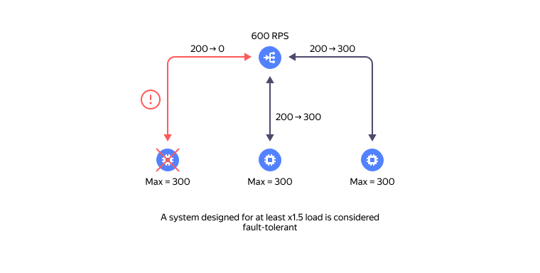

# Recommendations on fault tolerance in {{ yandex-cloud }}

Fault tolerance is the capability of a system to continue its operation in case of any fault in one or multiple components. 
Faults can be either total or partial. A partial fault is an intermediate state between full operability and a total fault, manifested by a partial rather than entire loss of the system’s capability to perform its functions. Example: 50% loss of network packages during transmission via communication circuits is a partial fault. 

Below are recommendations on designing a fault-tolerant infrastructure in {{ yandex-cloud }}.

## Introduction {#introduction}

{{ yandex-cloud }} infrastructure divides into [regions](../overview/concepts/region) and [availability zones](../overview/concepts/geo-scope). An availability zone is an isolated part of the infrastructure that is protected from faults in other zones. Availability zones are organized territorially and located around 300 km away from each other.

Currently, the following regions are available in {{ yandex-cloud }}:

* **Russia** (ru-central1): `ru-central1-a`, `ru-central1-b`, and `ru-central1-d` availability zones.
* **Kazakhstan** (kz1): `kz1-a` availability zone.

A region provides direct network (IP) connectivity across availability zones, common [APIs](../overview/api), [SLAs](../overview/sla), and unified [pricing](../../prices) for cloud services.

Here are the possible fault types regarding which this document provides recovery recommendations:

1. Short (hours-long) total or partial outage of **one** availability zone.
1. Short partial fault of API services.

To build fault-tolerant services in {{ yandex-cloud }}, factor in the platform’s architectural specifications: availability zones and nuances of cloud tools for building fault-tolerant systems.

## Resource placement {#resource-placement}

To ensure fault-tolerance, you must deploy your services in **multiple availability zones**. The best option is **three-zone** placement, as it allows the operation of quorum algorithms used in, e.g., managed databases (MDBs) and {{ managed-k8s-name }} (mK8s).



High-performance environments with demanding requirements for fault recovery speed must be placed in exactly three availability zones.



### Reservation schemes {#reservation-schemes}

Depending on requirements for fault recovery time, two basic schemes are available:

1. **Cold reserve (active-passive)**:
   * The bulk of the load is processed in one availability zone.
   * A minimal number of resources, e.g., DB replicas, is placed in another zone for a quick start in case of a main zone fault.
   * This scheme is simple and less costly, since it does not require continuous duplication of all resources.
   * It does not guarantee continuous availability of the service due to the long time it takes to switch to the standby infrastructure.

1. **Load balancing (Active-Active)**:
   * The load is distributed among multiple zones (see the scheme below). 
   * This sheme requires software adaptation and minimizing network delays across the zones (e.g., traffic localization).
   * The scheme shows high fault tolerance and minimum recovery time.

   Delay minimization is one of the subjects in the [Quest for microseconds: Optimizing cloud service performance](https://yandex.cloud/ru/events/935) webinar.


### Fault handling {#failure-handling}

When deploying fault-tolerant services, we recommend you to use load balancers. In {{ yandex-cloud }}, load balancers are crucial to reducing or eliminating fault impact on service performance. Load balancers consist of two central parts:

* **Listener**: Element that receives traffic and distributes it among the targets.
* **Targets**: Groups of resources receiving traffic from the listener.

For both reservation schemes described above, you can only minimize failover time automatically by tracking the state of targets and redirecting user requests from the listener only to those targets that are ready to handle such requests. You can find out if a target is ready to accept requests through a health check. The most difficult part of configuring it is selecting the appropriate check values and correctly performing the readiness checks on the target side.

Also, note that the automatic mechanism of availability checks may not be triggered in case of partial faults in the availability zone. To recover a service in case of such faults, you must provide a mechanism for manual redistribution of load from the failed zone to healthy ones.

To minimize fault handling time, especially in case of API faults, it is essential to make sure each zone has enough computing resources. This will allow you to use the capacity of the remaining healthy zones for handling the estimated load if an availability zone fails. We recommend you to have at least a 50% reserve above the estimated load for resources in each zone (see the diagram below).


## Tools for ensuring fault tolerance {#ha-tools}

* Load balancers: 
   * [{{network-load-balancer-name}}](../network-load-balancer/concepts/)
   * [{{ alb-name }}](../application-load-balancer/concepts/)

* Platform services: 
   * Managed databases (MDBs)
   * [{{ managed-k8s-name }}](../managed-kubernetes/) in a fault-tolerant configuration

* Natively fault-tolerant cloud services: 
   * [{{ objstorage-name }}](../storage)
   * [{{ container-registry-name }}](../container-registry/)
   * [Serverless Functions](../functions/)
   * [Egress NAT](../vpc/concepts/gateways)

* Autoscaling tools: 
   * [Instance groups](../compute/concepts/instance-groups/) 
   * [{{ k8s }} node groups](../managed-kubernetes/concepts/node-group/cluster-autoscaler)

## Load balancers ({{ network-load-balancer-name }}, {{ alb-name }}) {#load-balancers}

### {{ network-load-balancer-name }} {#nlb}

The central tool for building fault-tolerant solutions in {{ yandex-cloud }} is a [network load balancer ({{ network-load-balancer-name }})](../network-load-balancer/concepts/), which distributes TCP connections among targets. It can be external, for processing traffic from the internet (listener with a public IP address), or internal, for processing internal network traffic (listener with an internal IP address). Health checks are used to check if the targets are ready. Currently, {{ network-load-balancer-name }} does not support disabling traffic in a specific zone.

Here is an [example](../tutorials/web/load-balancer-website/) of creating a fault-tolerant website with load balancing using {{ network-load-balancer-name }} between two availability zones with fault protection in one zone.

### {{ alb-name }} {#alb}

[{{ alb-name }}](../application-load-balancer/) is a smarter yet more costly balancing tool. It supports integration with protection services, such as [{{ sws-name }}](../smartwebsecurity/), [ARL](../smartwebsecurity/concepts/arl.md), [WAF](../smartwebsecurity/concepts/waf.md), and [{{ captcha-name }}](../smartcaptcha/). {{ alb-name }} allows disabling resources in a specific zone and [localizing traffic inside an availability zone](../application-load-balancer/concepts/backend-group.md#locality). 

Here is an [example](../tutorials/web/application-load-balancer-website/index.md) of creating a fault-tolerant website with load balancing using {{ alb-name }} between three availability zones with fault protection in one zone.

## Fault tolerance of platform services {#platform-services-ha}

Placement of platform service hosts in different availability zones is the key method of achieving fault tolerance.

### Fault tolerance of managed databases (MDBs) {#mdb-ha}

Under the [SLA](https://yandex.ru/legal/cloud_sla_mdb/), a fault-tolerant configuration is a configuration of a `DB cluster consisting of two or more DB hosts located in different availability zones`. The best practice is to place DB cluster nodes in three availability zones, since it is systems based on quorum algorithms that are used for ensuring fault tolerance.



High-performance environments with demanding requirements for fault recovery speed must be placed in exactly three availability zones.



In case the DB master fails, the automatic mechanism of the service initiates switching to another host. In certain cases, the automatic mechanism of the DB service cannot initiate master switching during a fault. In this case, you must switch manually, e.g., using the `yc` command. Here is an example for a {{ PG }} cluster: 

```bash
   yc managed-postgresql cluster start-failover <cluster_name> --host <host_name>
```

To allow a client to connect to the current DB master anytime without requesting the cluster state from the API, {{ yandex-cloud }} provides [special FQDNs](../managed-postgresql/operations/connect.md#special-fqdns). Connecting over a [special FQDN](../managed-postgresql/operations/connect.md#special-fqdns) simplifies application coding but does not guarantee quick switching to a new master in case it is replaced. To quickly switch to a new master, you need to ensure, on the application end, monitoring the master replacement and reconnection.

Currently, {{ yandex-cloud }} does not have a service automatically balancing reading load between DB cluster nodes. Methods of such balancing are the subject in the [Quest for microseconds: Optimizing cloud service performance](https://yandex.cloud/ru/events/935) webinar.

### {{ managed-k8s-name }} fault tolerance {#mk8s-ha}

Under the [SLA](https://yandex.ru/legal/cloud_sla_kb/), {{ k8s }} clusters are only deemed fault-tolerant if they use a `master with fault tolerance settings in three availability zones (one host per zone)`.

To build a fault-tolerant infrastructure, beyond the cluster itself, you need to:
   * Place cluster worker nodes in multiple availability zones.
   * Distribute maintenance services, such as CoreDNS, and application services among multiple availability zones.

To minimize the impact of cluster node faults, you need to ensure even load distribution. To do this, we recommend using such tools as:
   * `topologySpreadConstraints`: To ditribute pods among availability zones.
   * `podAntiAffinity`: To prevent placement of pods on a single node.

To reduce service down time during cluster updates, you need to set `podDisruptionBudget` policies.

## Autoscaling tools {#auto-scaling}

In case one of the availability zones fails, you need to redistribute the load among the other zones. If you are using `cold reserve (active-passive)` fault tolerance, you can reduce recovery time by ensuring resource autoscaling.

The central scaling tool in {{ yandex-cloud }} is an [instance group](../compute/concepts/instance-groups/). An instance group includes:

   * Instance template
   * Scaling policy (manual or automatic)
   * Scaling mechanism

Here is an [example](../tutorials/infrastructure-management/vm-autoscale/) of deploying an instance group with an autoscaling policy for managing extra load.

For autoscaling, you can use any parameter from {{ yandex-cloud }} {{ monitoring-name }} in addition to the basic parameter (CPU load).

Recommendations on ensuring tolerance against zone faults:
   1. Use a separate instance group for each availability zone. Avoid using the same instance group for creating instances in various availability zones, since it can complicate managing them in case one of the zones fails.
   1. Similarly, autoscaling {{ k8s }} cluster node groups is also based on instance groups.



{{ k8s }} cluster node groups cannot use the entire functionality of instance groups.





When designing a fault-tolerant cloud infrastructure, note that in case one of the availability zones fails, the available resources in other zones will be depleted much faster.



## Fault tolerance of client services {#client-service-ha}

To ensure fault tolerance and quick fault handling in {{ managed-k8s-name }} applications:

   1. Allocate enough resources (CPU, RAM) for the service.
   1. Minimize or eliminate resubscription of resources on the worker nodes of a {{ managed-k8s-name }} cluster, especially of RAM.
   1. Set up correct health checks.
   1. Apply a retry policy to the provider’s services.
   1. Set up autoscaling of cluster worker nodes for automatic resource redistribution in case of an unexpected load increase or fault in one of the availability zones.

## How to shift load from an availability zone {#traffic-shifting}

{{ alb-name }} supports manual [disabling of traffic in a specific zone](../application-load-balancer/concepts/application-load-balancer#lb-location). 
For {{ network-load-balancer-name }}, you can only remove traffic from an availability zone by disabling health checks for targets in the faulty zone. There are several ways to do this:

   * At the infrastructure level, block checks at the network security group level.
   * Disable instances that handle requests in the faulty zone.
   * At the operating system level, restrict access to checks using a firewall.
   * At the application level, configure the application in such a way that it would not respond to health checks.

We recommend using network security groups. To do this, you need to configure separate rules allowing availability checks up to the targets in each availability zone. Deleting a rule allows you to disable traffic in a certain zone. This type of configuration enables you to use network security groups for testing fault tolerance.

You should consider the other methods in case the {{ yandex-cloud }} API is unavailable.

### Application high availability testing {#app-ha-test}

To test an application’s fault tolerance, i.e., its ability to handle traffic when an availability zone fails, you can use this pre-configured [scenario](https://github.com/yandex-cloud-examples/yc-deploy-ha-app-with-nlb), where the web app is deployed behind the NLB load balancer, and the [high availability testing technique](https://github.com/yandex-cloud-examples/yc-deploy-ha-app-with-nlb?tab=readme-ov-file#sg) that involves isolating a specific app component from the load balancer.

You can test your web applications using this technique, if required.

### NLB tagging for a zonal shift {#nlb-zone-shift}

We are introducing `NLB Zone Shift` to better respond to partial failure incidents.

After successful HA testing of an application, you can tag the relevant NLB load balancer with a special flag. This flag enables the {{ yandex-cloud }} support team to shift traffic away from the load balancer in case of partial failures in an availability zone that are not captured by regular [target health checks](../network-load-balancer/concepts/health-check.md), such as issues with external communication circuits.

To tag an NLB load balancer with a zonal shift flag, run this YC CLI command:
```bash
yc load-balancer network-load-balancer update <nlb-id> --allow-zonal-shift
``` 


## Monitoring and escalation {#monitoring-escalation}

[Monitoring](../monitoring/concepts/) and [alerts](../monitoring/concepts/alerting/alert.md) are key tools for ensuring fault tolerance. Beyond the basic monitoring tools provided with the cloud services, it is crucial to configure monitoring of business metrics. For example, tracking the number of service users for the recent minutes allows you to detect problems at a high level, even with their source in the infrastructure not tracked. 
For quick notification about problems, you need to configure an [escalation policy](../monitoring/concepts/alerting/escalations.md), which is currently at the [preview](../overview/concepts/launch-stages.md) stage, in addition to monitoring.

## Action plan {#action-plan}

To quickly restore a service and address faults, you need to have action plans ready in advance, such as switching the DB master manually or disabling an availability zone.

## Testing fault tolerance {#ha-testing}

Any fault tolerance solutions require regular testing in various fault scenarios. Learn more about testing fault tolerance in a cloud from this webinar: [Disabling a data center, or How to test fault tolerance in a cloud](https://yandex.cloud/ru/events/841).

## See also {#see-also}

* [{#T}](../tutorials/infrastructure-management/fault-tolerance.md)