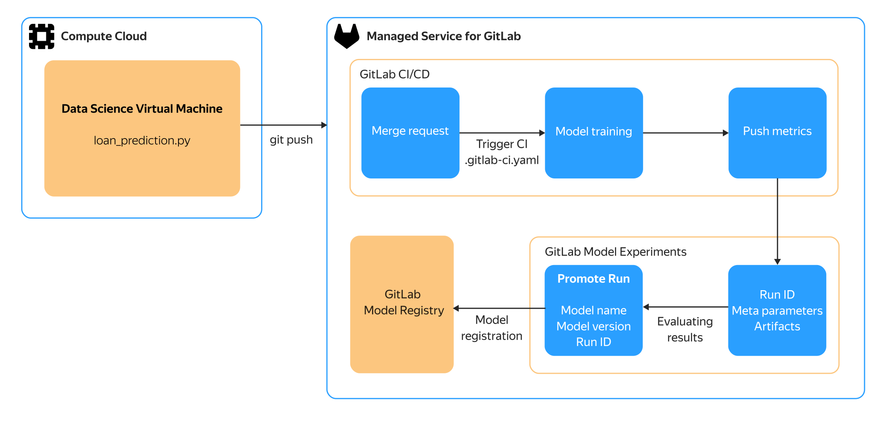

# Managing the MLOps lifecycle with ML Registry in {{ mgl-full-name }}

The machine learning model lifecycle comprises development, model training, quality evaluation, and model deployment. This guide explores {{ GL }}'s capabilities related to storing and versioning of the ML artifacts you get during experiments with the ML model within the {{ yandex-cloud }} infrastructure. The experiments change the model's hyperparameters, i.e., settings configured prior to the start of model training, which determine its architecture, training strategy, and overall behavior. Unlike the model's parameters (weights, coefficients), which are picked out in the course of data-based training, hyperparameters are not changed automatically: they are selected by the researcher or ML engineer.

The diagram depicts the model development and testing lifecycle in the {{ GL }} environment:



The development and testing environment is represented by a DSVM. Your {{ GL }} instance with the [ML Registry]({{ gl.docs }}/user/project/ml/model_registry/) package preinstalled is enabled by the scalable [{{ mgl-full-name }}](../managed-gitlab/index.yaml). This makes the following MLOps tools available to you:

* Model Registry, which you can use to log metrics, analyze model application experiments, and perform quality assessment.
* The Model Experiments catalog used for model storage and versioning management.

There is the MLFlow platform's [Python API library](https://mlflow.org/docs/latest/api_reference/python_api/index.html) for integration of your model with ML Registry.

In addition to {{ mgl-name }}, you use [{{ compute-full-name }}](../compute/index.yaml) to work with the model's source code, and [{{ vpc-full-name }}](../vpc/index.yaml) for the network infrastructure.

## System architecture {#architecture}

### Network {#network}

As part of the solution, you create a {{ vpc-name }} [cloud network](../vpc/concepts/network.md#network) named `net-gitlab`.

#### Subnets {#subnets}

Within `net-gitlab`, you create a [subnet](../vpc/concepts/network.md#subnet) in an [availability zone](../overview/concepts/geo-scope.md) of your choice to host the {{ mgl-name }} instance and the VM.

#### Security groups {#security-groups}

Network access to resources within the infrastructure is controlled with the help of [security groups](../vpc/concepts/security-groups.md). [More on configuring security group rules for {{ mgl-name }}](../managed-gitlab/operations/configure-security-group.md).

#### Resource addresses {#addresses}

The new infrastructure uses a [public IP address](../vpc/concepts/address.md#public-addresses) for the new VM and the URL of the {{ GL }} instance in the `gitlab.yandexcloud.net` domain.

### {{ mgl-name }} {#gitlab}

The [{{ GL }} instance](../managed-gitlab/concepts/) is deployed on a VM managed by [{{ mgl-name }}](../managed-gitlab/index.yaml). The instance can be accessed by its address via the standard {{ GL }} web interface.

To execute {{ GL }} CI/CD jobs, create and configure {{ GLR }} for your {{ mgl-name }} instance.

### {{ compute-name }} {#compute}

Local testing and uploads of changes to the model's source code repository are done with the help of a [{{ dsvm-name }}](../compute/operations/dsvm/index.md) virtual machine. A separate VM can be used to deploy {{ GLR }}.

## Test model {#sample-ml}

The test ML model deployed in this guide simulates the development and versioning cycle of a credit pipeline model. The model is adapted for use in a cloud infrastructure.

To deploy the model's development environment in the {{ yandex-cloud }} environment:

1. [Get your cloud ready](#before-you-begin).
1. [Create your infrastructure](#deploy).
1. [Create a project and configure the environment](#project).
1. [Create an experiment and a model version](#experiment).

If you no longer need the resources you created, [delete them](#clear-out).

## Get your cloud ready {#before-you-begin}



### Required paid resources {#paid-resources}

* {{ mgl-name }}: use of computing resources of the instance (VM) and its data storage capacity (see [{{ mgl-name }} pricing](../managed-gitlab/pricing.md)). Depending on where {{ GLR }} is deployed, you may have to pay for the {{ compute-name }} VM used to install {{ GLR }}.
* VMs: use of computing resources, storage, public IP address, and OS (see [{{ compute-name }} pricing](../compute/pricing.md)).
* {{ objstorage-name }}: storage of {{ mgl-name }} backups (see [{{ objstorage-name }} pricing](../storage/pricing.md)).

## Create your infrastructure {#deploy}



Before you start creating your infrastructure, [make sure](../quota-manager/operations/list-quotas.md) your [cloud](../resource-manager/concepts/resources-hierarchy.md#cloud) has enough unused [quotas](../quota-manager/concepts/index.md) for resources.





- Manually {#manual}

  1. [Create a network](../vpc/operations/network-create.md) named `net-gitlab`. with the **{{ ui-key.yacloud.vpc.networks.create.field_is-default }}** option disabled.
  1. In the `net-gitlab` network, [create](../vpc/operations/subnet-create.md) a subnet with the following parameters in the `{{ region-id }}-a` availability zone:
      * **{{ ui-key.yacloud.vpc.subnetworks.create.field_name }}**: `subnet-gitlab-a`
      * **{{ ui-key.yacloud.vpc.subnetworks.create.field_zone }}**: `{{ region-id }}-a`
      * **{{ ui-key.yacloud.vpc.subnetworks.create.field_ip }}**: `10.16.0.0/24`
  1. In the `net-gitlab` network, [create a security group](../vpc/operations/security-group-create.md) named `gitlab-sg` for the [{{ mgl-name }} instance](../managed-gitlab/concepts/index.md#instance) and the VM. Follow the [instruction](../managed-gitlab/operations/configure-security-group.md) to set up the rules in this security group.
  1. [Create](../iam/operations/sa/create.md) a service account named `gitlab-sa` and [assign](../iam/operations/sa/assign-role-for-sa.md) the `compute.admin`, `{{ roles-vpc-admin }}`, and `iam.serviceAccounts.user` [roles](../iam/concepts/access-control/roles.md) to it.
  1. [Create and activate a {{ GL }} instance](../managed-gitlab/operations/instance/instance-create.md) of any suitable configuration. When creating the instance, specify the subnet and security group you created earlier.
  1. [Create a VM from the {{ dsvm-short-name }} image](../compute/operations/dsvm/quickstart.md) named `vm-mlops` in the `{{ region-id }}-a` availability zone and the subnet created earlier. When creating the VM, specify the security group you created earlier.

- {{ TF }} {#tf}

    1. 
    1. 
    1. 
    1. 

    1. Download the [ml-ops-managed-gitlab.tf](https://github.com/yandex-cloud-examples/yc-ml-ops-managed-gitlab/blob/main/ml-ops-managed-gitlab.tf) configuration file to the same working directory.

        This file describes:

        * [Network](../vpc/concepts/network.md#network).
        * [Subnet](../vpc/concepts/network.md#subnet).
        * [Security group](../vpc/concepts/security-groups.md) and rules the {{ mgl-name }} instance needs to operate.
        * {{ mgl-name }} instance.
        * VM with a [DSVM](/marketplace/products/yc/dsvm) image.
        * Service account.

    1. In the `ml-ops-managed-gitlab.tf` file, specify the following settings:

        * `instance_name`: {{ GL }} instance name.
        * `instance_login`: {{ GL }} instance admin login.
        * `instance_email`: Instance admin email address.
        * `instance_domain`: Instance domain name in `<name>.gitlab.yandexcloud.net` format.
        * `vm_username` and `vm_public_key`: Username and absolute path to the [public key](../compute/operations/vm-connect/ssh.md#creating-ssh-keys), which are going to be used to access the VM.
        * `sa_folder_id`: ID of the new service account's folder.

    1. Validate your {{ TF }} configuration files using this command:

        ```bash
        terraform validate
        ```

        {{ TF }} will display any configuration errors detected in your files.

    1. Create the required infrastructure:

        

        



## Create a project and configure the environment {#project}

1. [Create a {{ GL }} project]({{ gl.docs }}/ee/user/project/), select **Import project** on the home page, and specify the import settings:

   * **Import project from**: **Repository by URL**.
   * **Git Repository URL**: `https://github.com/yandex-cloud-examples/yc-ml-ops-managed-gitlab.git`.
   * **Project name**: `gitlab-mlflow`.

1. Deploy a [runner](../managed-gitlab/concepts/index.md#runners) for the new {{ GL }} project according to the [instruction](../managed-gitlab/tutorials/install-gitlab-runner.md). During deployment, specify the [previously created](#deploy) infrastructure components:

   * If installing the runner on your VM manually, select the `subnet-gitlab-a` subnet and the `gitlab-sg` security group when creating the VM.
   * If creating the runner using the management console, specify the `gitlab-sa` service account and the `gitlab-sg` security group.

### Configure the environment variables {#variables}

1. Open the {{ GL }} project named `gitlab-mlflow`.
1. Navigate to **Settings** in the left-hand panel and select **Access Tokens** from the drop-down list.
1. Create a new token with the following settings:
   * **Token name**: `mlflow`.
   * **Select a role**: `Maintainer`.
   * **Select scopes**: `api`, `manage_runner`, `read_repository`, `write_repository`.
1. Click **Create project access token**.
1. Copy the token value.
1. Select the **Settings** tab on the left and **CI/CD** in the popup list.
1. Under **Variables**, click **Expand**.
1. Add these environment variables:
      * `MLFLOW_TRACKING_TOKEN`: New token.
      * `MLFLOW_TRACKING_URI`: `https://<{{ GL }}_instance_address>.gitlab.yandexcloud.net/api/v4/projects/4/ml/mlflow`.
      * `REPO_TOKEN`: New token.

      To add a variable:
      * Click **Add variable**.
      * In the window that opens, specify a variable name in the **Key** field and its value in the **Value** field.
      * Click **Add variable**.

## Create an experiment and a model version {#experiment}

1. [Connect](../compute/operations/vm-connect/ssh.md) to the `vm-mlops` VM over SSH.
1. [Add](https://docs.gitlab.com/user/ssh/) an SSH key for secure access to {{ GL }}.
1. [Clone](https://docs.gitlab.com/topics/git/clone/) the `gitlab-mlflow` project repository using SSH.

1. Navigate to the repository directory and create a branch named `mlops-experiment-1`:

   ```bash
   git checkout -b mlops-experiment-1
   ```

1. Edit the model's parameters in the `loan_prediction.py` file, for example, edit `RANDOM_SEED`.
1. Upload the changes to {{ GL }}:

   ```bash
   git add -A
   git commit -m "Change model parameter"
   git push
   ```

1. Open the {{ GL }} project named `gitlab-mlflow` and [create a merge request]({{ gl.docs }}/user/project/merge_requests/creating_merge_requests/) from the new branch. A training and testing scenario for the modified model will be created automatically.

1. Run the scenario:
    1. In the left-hand panel, select **Build**.
    1. Select **Pipelines** from the drop-down list.
    1. Click  in the **Actions** column and select **trigger_train**.

    Wait for the scenario to end.

1. Create a registry of model versions:
   1. In the left-hand panel, select **Deploy**.
   1. Select **Model Registry** from the drop-down list.
   1. Click **Create/import model** and select **Create new model**.
   1. Enter `loan-prediction-demo` as the model's name and click **Create**.

1. Check the results of the experiment:
   1. In the left-hand panel, select **Analyze**.
   1. Select **Model Experiments** from the drop-down list.
   1. Select the `Loan_prediction` experiment from the list in the right and navigate to the **Runs** tab. The list displays all the model training methods, their parameters, and training results.
   1. Click an item in the **Name** column. The **Artifacts** tab displays the training artifacts of the method you select.
   1. Click **Promote run** to register the model version. Select the `loan-prediction-demo` model from the drop-down list in the **Model** field, enter `0.0.1` in the **Version** field, and click **Promote**. A new version and all its training artifacts will be added to the version registry.

## Delete the resources you created {#clear-out}

Some resources are not free of charge. Delete the resources you no longer need to avoid paying for them:



- Manually {#manual}

    1. [Delete the {{ GL}} instance](../managed-gitlab/operations/instance/instance-delete.md).
    1. [Delete the VM](../compute/operations/vm-control/vm-delete.md).

- {{ TF }} {#tf}

    



## See also {#see-also}

* [Machine Learning Model Experiments]({{ gl.docs }}/user/project/ml/experiment_tracking/)
* [Model Registry]({{ gl.docs }}/user/project/ml/model_registry/)
