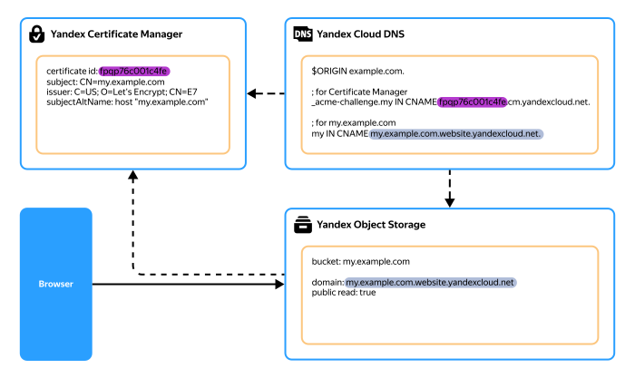
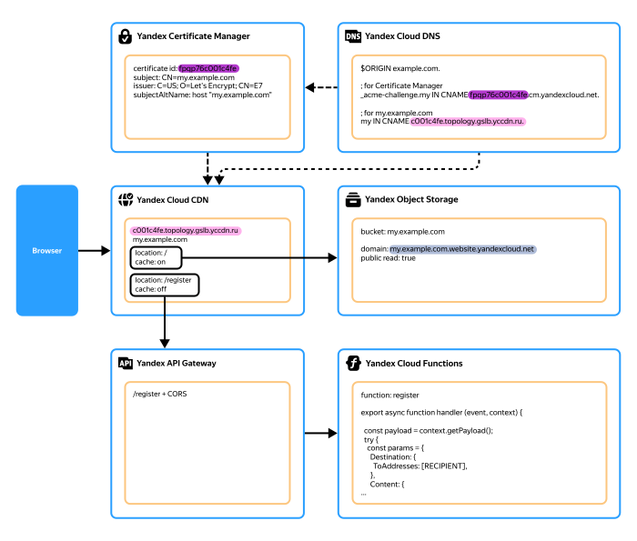
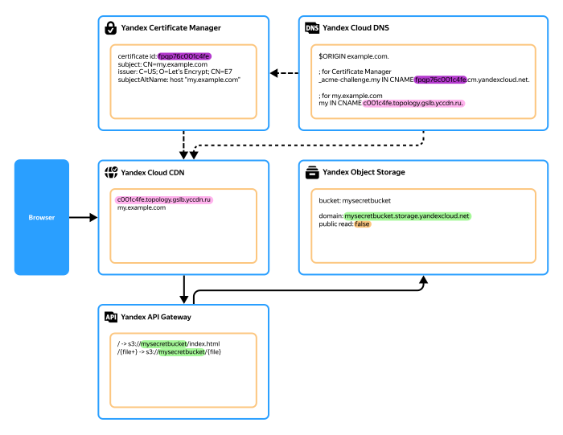
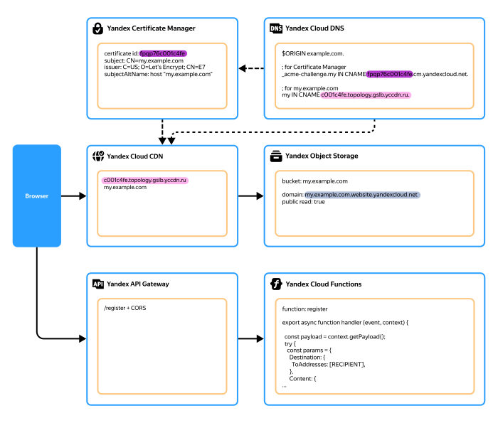

# Deploying a static website in a fault-tolerant configuration in {{ yandex-cloud }}

This guide presents several options for how to deploy a fault-tolerant static website with dynamic elements, e.g., registration or application form, in the {{ yandex-cloud }} infrastructure.

These options optimize costs and ensure high website loading speeds for the end users.

## Solution architecture overview {#architecture}

The core infrastructure components in all solutions are [{{ objstorage-full-name }}](../storage/index.yaml) and [{{ vpc-full-name }}](../vpc/index.yaml). [{{ cdn-full-name }}](../cdn/index.yaml) ensures fast content delivery to end users. Also, different solutions rely on various combinations of other [services](../overview/concepts/services.md) within the {{ yandex-cloud }} ecosystem, such as [{{ dns-full-name }}](../dns/index.yaml), [{{ certificate-manager-full-name }}](../certificate-manager/index.yaml), [{{ api-gw-full-name }}](../api-gateway/index.yaml), [{{ alb-full-name }}](../application-load-balancer/index.yaml), [{{ postbox-full-name }}](../postbox/index.yaml), and [{{ sf-full-name }}](../functions/index.yaml).

Fault tolerance  is achieved through automatic replication of data stored in {{ objstorage-name }} [buckets](../storage/concepts/bucket.md), as well as optional bucket [versioning](../storage/concepts/versioning.md).

The proposed solutions offer the following benefits:

* You do not need to plan simultaneous fault-tolerant website deployments across multiple [availability zones](../overview/concepts/geo-scope.md). All services natively provide high availability and fault tolerance.
* Streamlined architecture.
* Lower costs compared to other hosting solution with an [option](../billing/concepts/serverless-free-tier.md) to use `free tier` which allows you to host low-traffic and low-data projects almost entirely for free.

### Automatic infrastructure deployment {#automation}

This tutorial includes supplemental [{{ TF }}](../terraform/index.yaml) configuration examples that allow you to accelerate your cloud infrastructure deployment. These examples provide ready-to-use solutions for common tasks, such as:

* Uploading and updating static website files in {{ objstorage-name }}.
* Creating a Let's Encrypt [certificate](../certificate-manager/concepts/managed-certificate.md) for the website in {{ certificate-manager-name }}.
* Setting up {{ postbox-name }} to send transactional emails.
* Integrating a [function](../functions/concepts/function.md) from {{ sf-name }} to send emails and an example of such a function for [Node.js](https://nodejs.org/en/docs/).

You can find the supplemental materials in the [ **yc-object-storage-cdn-static-site**](https://github.com/yandex-cloud-examples/yc-object-storage-cdn-static-site) GitHub repository.

## Solution overview {#solutions}

Depending on your website’s requirements, the system architecture of the solutions can vary significantly. However, all hosting options require a custom domain name for the website, a correctly configured DNS for the domain, and an SSL certificate.

This overview describes the following static website hosting options for the {{ yandex-cloud }} infrastructure:

* [{#T}](#simple-bucket)
* [{#T}](#bucket-cdn)
* [{#T}](#bucket-cdn-api-gateway)
* [{#T}](#bucket-alb)

## {{ objstorage-full-name }} bucket with public access {#simple-bucket}

{{ objstorage-full-name }} buckets feature a dedicated [{{ ui-key.yacloud.storage.bucket.website.switch_hosting }} mode](../storage/concepts/hosting.md), which is one of the simplest and most affordable ways to host a static website in {{ yandex-cloud }}. Smaller projects may also be eligible for a `free tier`, as an additional benefit. For more information about the {{ objstorage-name }} free tier, see [this {{ billing-name }} article](../billing/concepts/serverless-free-tier.md#objstorage).

Here is a diagram that illustrates the solution:



### Required resources {#simple-bucket-resources}

To host a static website using this solution, you need:

* {{ objstorage-name }} bucket with enabled `{{ ui-key.yacloud.storage.bucket.website.switch_hosting }}` mode.
* Domain name and its associated SSL certificate.
* Public DNS [zone](../dns/concepts/dns-zone.md#public-zones) configured for your domain and a [resource record](../dns/concepts/resource-record.md) mapping the bucket to your domain name.



To enable access to your website by its domain name, the [bucket name](../storage/concepts/bucket.md#naming) and the domain name must match. Here is an example: `my.example.com`.



For a step-by-step guide on setting up a static website using a public {{ objstorage-name }} bucket with enabled `{{ ui-key.yacloud.storage.bucket.website.switch_hosting }}`, see [{#T}](../tutorials/web/static/index.md).

### Pros and cons {#simple-bucket-advantages-drawbacks}

#|
|| **Pros**  | **Cons**  ||
|| 
* Fault tolerance through automatic data replication in {{ objstorage-name }} buckets.
* Streamlined architecture.
* Low cost for large projects.
* Free tier eligibility for small projects.
|
* It is impossible to segment the website into public and private areas, as the entire bucket must be [publicly](../storage/concepts/bucket.md#bucket-access) readable.
* No option to configure fallback routing of requests, e.g., for [SPAs](https://en.wikipedia.org/wiki/Single-page_application); {{ objstorage-name }} has no native equivalent to the [nginx](https://nginx.org/) `try_files $uri $uri/ /index.html =404;` directive.
* Search engine conflict between your website main domain and the bucket's service domains. [Learn more](#simple-bucket-troubleshooting) about this issue and how to resolve it.
* No option to configure forwarding rules for existing bucket [objects](../storage/concepts/object.md). You can only configure these rules for objects that do not exist yet.
* Client caching settings must be configured separately for each object.
* Outgoing traffic is billable under the {{ vpc-full-name }} [pricing policy](../vpc/pricing.md).
* Websites with many objects may incur high fees for requests to objects, as {{ objstorage-name }} [charges](../storage/pricing.md) both for the storage of objects and requests to them.
||
|#

Other deployment [options](#solutions) can help overcome the above constraints.

### Implementation considerations {#simple-bucket-details}

When deploying a website, consider the following:

* The type of the DNS resource record mapping a domain name to a bucket depends on the domain level:

    * For second-level domains, e.g., `example.com`, create an [ANAME resource record](../dns/concepts/resource-record.md#aname).
    * For third-level domains and higher, e.g., `my.example.com`, `my.other.example.com`, etc., create a [CNAME resource record](../dns/concepts/resource-record.md#cname).

    

    The resource record must always point to the bucket's [service domain](../storage/concepts/hosting.md#bucket-url).

    For example, for the `my.example.com` domain in the `example.com` public DNS zone, create a `my` CNAME record pointing to `my.example.com.{{ s3-web-host }}.`.
    
    You must include the trailing dot; omitting it will take your website down.

    

    For more information on how to create a resource record, see [{#T}](../dns/operations/resource-record-create.md).

* {{ objstorage-name }} is integrated with {{ certificate-manager-name }}, which supports both [custom](../certificate-manager/concepts/imported-certificate.md) and Let's Encrypt certificates.

    When creating a Let's Encrypt certificate, [verify your domain ownership](../certificate-manager/concepts/challenges.md). The most reliable and convenient way is DNS verification via a CNAME record. This is a one-time [check](../certificate-manager/concepts/challenges.md#cname) that requires no further user actions for certificate renewal.

    For more on how to pass domain ownership verification, see [{#T}](../certificate-manager/operations/managed/cert-validate.md).
* The `{{ ui-key.yacloud.storage.bucket.website.switch_hosting }}` mode requires public access to the bucket and unlocks several additional features.

    

    * Requests to the `/` path return the file contents specified in the **{{ ui-key.yacloud.storage.bucket.website.field_index }}** parameter.
    * Requests to non-existent objects return the file contents specified in the **{{ ui-key.yacloud.storage.bucket.website.field_error }}** parameter.
    * Support for request redirection.
    * Service domain natively supports `https` to handle requests to the main domain.
    * Service domain of a bucket in `{{ ui-key.yacloud.storage.bucket.website.switch_hosting }}` mode: `{{ s3-web-host }}`.

        

        When the `{{ ui-key.yacloud.storage.bucket.website.switch_hosting }}` mode is disabled, the bucket uses the `{{ s3-storage-host }}` service domain.

        

    

* If a bucket domain name contains dots, `https` access to the bucket's service domain in `<domain_name>.{{ s3-web-host }}` format is not possible. The service domain in this format uses a wildcard SSL certificate that only supports fourth-level domains (`*.{{ s3-web-host }}`).

    To access the bucket's service domain over `https` in this scenario, use a URL in `https://{{ s3-web-host }}/<domain_name>` format.

    Here is an example: `https://{{ s3-web-host }}/my.example.com`.
* You can restrict access to the bucket contents using [bucket policies](../storage/concepts/policy.md). However, these policies may have practical limitations. For example, you can restrict access to bucket contents for specific IP ranges but not for domain names.

    For more on how to configure a bucket policy, see [{#T}](../storage/operations/buckets/policy.md).
* When uploading objects to a bucket, you can set headers to control how your content is processed. For example, the `Content-Type` header allows you to explicitly [define](#simple-bucket-troubleshooting) the content’s MIME type.

    There are more headers you can set for {{ objstorage-name }} bucket objects to customize how browsers process your content.

    

    * `Content-Type`: Defines the MIME content type of the bucket object.
    * `Cache-Control`: Manages client-side caching and on intermediary caching servers. Customizing client-side caching settings may considerably improve page load speed and reduce traffic consumption.

        

        Use caution when defining caching settings via the `Cache-Control` header, especially for HTML pages. If a client caches a corrupted page for a long period, the browser will display incorrect information until the cache expires or the user clears it manually.

        

    * `Content-Disposition`: Instructs the browser to save the object as a local file and sets the default file name.
    * `Content-Encoding`: Indicates the file’s encoding method, e.g., `gzip` compression.

    

    For more on how to set headers for bucket objects, see [Troubleshooting](#simple-bucket-troubleshooting).

### Troubleshooting {#simple-bucket-troubleshooting}



- Search conflict between the main domain of your website and the bucket's service domains

  {{ objstorage-name }} natively exposes your website content both at its main address, `my.example.com`, and these {{ objstorage-name }} service domains:

  * `my.example.com.{{ s3-web-host }}`
  * `{{ s3-web-host }}/my.example.com`
  * `{{ s3-storage-host }}/my.example.com`

  Search engine algorithms treat these addresses as competing URLs, which negatively affects your website's ranking in search results.

  For more information about this issue and how to resolve it, see [this Yandex Webmaster guide](https://yandex.ru/support/webmaster/en/yandex-indexing/site-addresses).

- Browsers download website pages as files instead of rendering them on screen, or JavaScript scripts hosted in separate files fail to run.

  This behavior may be caused by an incorrect `Content-Type` metadata header in bucket objects. If you omit the header when uploading an object to the bucket, {{ objstorage-name }} will attempt to auto-detect the content type. This auto-assigned `Content-Type` header value may be incorrect and cause unexpected behavior.

  We recommend that you always explicitly define `Content-Type` when uploading static website files to the bucket:

  * Set the header to `text/html` so the browser opens the page instead of saving it as a file.
  * Set the header to `application/javascript` for `JavaScript` to run.

  

  ```bash
  yc storage s3api put-object \
    --bucket my.example.com \
    --key index.html \
    --body /path/to/my/index.html \
    --content-type 'text/html'
  ```

  

  

  ```hcl
  variable "site_source_dir" {
    type        = string
    description = "Site source directory" # Local directory with website files
    default     = "~/path/to/my/site"     # Use the pathexpand() function to handle ~ and other special characters 
  }

  locals {
    site_mime_types = jsondecode(file("mime.json")) # File with a table mapping file extensions to Mime types
  }

  resource "yandex_storage_object" "files" {
    for_each     = var.site_source_dir == null ? toset([]) : fileset(pathexpand(var.site_source_dir), "**") # Going through all folder files recursively
    bucket       = "my.example.com"
    key          = each.key
    source       = pathexpand("${var.site_source_dir}/${each.key}")
    source_hash  = filemd5(pathexpand("${var.site_source_dir}/${each.key}")) # Storing file digest in state to trigger file updates when content changes
    content_type = lookup(local.site_mime_types, regex("\\.[^.]+$", each.key), null) # Assigning Content-Type dynamically based on the file extension
  }
  ```

  Example of the `mime.json` contents:

  ```json
  {
    ".html": "text/html",
    ".htm": "text/html",
    ".shtml": "text/html",
    ".css": "text/css",
    ".xml": "text/xml",
    ".gif": "image/gif",
    ...
  }
  ```

  

  For information on how to change the content type for a group of objects already uploaded to a bucket, see [Fixing issues with incorrect MIME types of objects when uploading them to {{ objstorage-short-name }}](../troubleshooting/storage/known-issues/incorrect-mime-type.md).



## Public {{ objstorage-full-name }} bucket with {{ cdn-full-name }} content delivery {#bucket-cdn}

In this solution, a bucket in hosting mode serves as an [origin](../cdn/concepts/origins.md) for a {{ cdn-name }} [resource](../cdn/concepts/resource.md). A CNAME resource record maps your website domain name to a special CDN provider domain name assigned to the user [cloud](../resource-manager/concepts/resources-hierarchy.md#cloud) [folder](../resource-manager/concepts/resources-hierarchy.md#folder) in {{ yandex-cloud }}.

The CDN resource caches end-user requests on its servers and queries the origin bucket only when the requested file is missing from the cache.

The main advantage of CDN is geographical distribution. CDN [points of presence](../cdn/concepts/points-of-presence.md) are located in major cities in close proximity to your primary content consumers. Content caching and reducing the distance between the client and the CDN server accelerates website loading speed in the end user's browser.



Here is a diagram for a fully static website:


### Required resources {#bucket-cdn-resources}

To host a static website using this solution, you need:

* {{ objstorage-name }} bucket with enabled `{{ ui-key.yacloud.storage.bucket.website.switch_hosting }}` mode.
* {{ cdn-name }} resource.
* Domain name and its associated SSL certificate.
* Configured public DNS zone for the domain and a resource record mapping the CDN resource to your domain name.

For more information on how to create a CDN resource, see [{#T}](../cdn/operations/resources/create-resource.md).

### Pros and cons {#bucket-cdn-advantages-drawbacks}

#|
|| **Pros**  | **Cons**  ||
|| 
* Geographical distribution and content caching.
* Ability to [restrict access to the origin bucket](#bucket-cdn-troubleshooting), making it accessible only to {{ cdn-name }} hosts.
* Support for internal request forwarding and basic redirection, e.g., from `http://` to `https://`.
* Ability to [configure different settings](#bucket-cdn-troubleshooting) for website objects based on their paths.
* Ability to create a website with [dynamic sections](#bucket-cdn-troubleshooting).
* Fault tolerance through automatic data replication in {{ objstorage-name }} buckets.
* Ability to further [improve fault tolerance](#bucket-cdn-troubleshooting) by using [origin groups](../cdn/concepts/origins.md#groups).
* Costs reduced by minimizing requests to bucket objects ({{ objstorage-name }} [charges](../storage/pricing.md) both for the storage of objects and requests to them).
* Reduced traffic costs as network traffic from {{ cdn-name }} to the end user is charged at [{{ cdn-name }} rates](../cdn/pricing.md), which are much lower than [{{ vpc-name }} rates](../vpc/pricing.md). Traffic between {{ objstorage-name }} and {{ cdn-name }} is free of charge.
|
* It is impossible to segment the website into public and private areas, as the entire bucket must be publicly readable.
||
|#

Therefore, if your website's content is cache-friendly, which static websites usually are, and you configure hosting with SEO in mind, you can achieve significant savings in traffic delivery costs, maximize your website's availability to end users, and, as a result, considerably improve the overall customer experience.

### Troubleshooting {#bucket-cdn-troubleshooting}



- How to restrict access to the origin bucket?

  This solution allows you to restrict access to the bucket and make it accessible only by {{ cdn-name }} hosts. Implementing this restriction prevents search engines from indexing your website via the bucket's internal service domains.

  There are several ways to make a bucket accessible only to {{ cdn-name }} hosts:

  * Use access policies to allow bucket access only from {{ cdn-name }} subnets.

      The current list of such subnets is [publicly](https://tech.cdn.yandex.net/prefixes/yc.json) available.
      
      

      The list of {{ cdn-name }} subnets may change. If using this method to restrict bucket access, make sure to monitor these updates and promptly make changes to the allowing access rules.

      For more information, see [{#T}](../troubleshooting/storage/how-to/permit-bucket-access-only-to-cdn-networks.md).

      

  * To avoid having to constantly monitor changes to the {{ cdn-name }} subnet list, you can enable [origin shielding](../cdn/concepts/origins-shielding.md) and update bucket policies to grant bucket access only to the subnets used for origin shielding:

      * `188.72.110.0/24`
      * `188.72.111.0/24`

      The list of these subnets is more stable and less likely to change.

      For information on how to configure a bucket policy, see [{#T}](../storage/operations/buckets/policy.md).

- How to configure individual settings for website objects based on their paths?

  This solution enables you to specify different data origins, caching parameters, and other settings within a single domain based on the path of the requested object, including path masks. To implement this behavior, use [location rules](../cdn/concepts/location-rules.md).

  Request processing rules use regular expressions to evaluate the path of each requested object. For each rule, you can specify the following:

  * Content origin: Bucket, [L7 load balancer](../application-load-balancer/concepts/application-load-balancer.md), or any server.
  * Settings for content storage in CDN and client-side caching settings.
  * Rules for request modification and redirection.
  * [CORS](../cdn/concepts/cors.md) header values.

  There are more settings you can configure within request processing rules. For more information, see [{#T}](../cdn/concepts/location-rules.md) and [{#T}](../cdn/operations/resources/location-rules.md).
 
- How to create a website with dynamic elements?

  As a rule, static websites are designed to drive user engagement via targeted calls to action, such as clicking a link or filling out a form.

  Using location rules, you can build a fairly complex website that integrates both static and dynamic sections, such as registration forms.

  

  By default, {{ cdn-name }} blocks the `POST`, `PUT`, `PATCH`, and `DELETE` HTTP methods for client requests. To remove this restriction, [create a request]({{ link-console-support }}) to support.

  

  The traffic load on form data processors is usually uneven and may fluctuate from long idle periods to hundreds of requests per second.

  {{ sf-full-name }} provides a convenient tool to process requests under these unpredictable traffic patterns. To invoke functions from website pages, deploy a [{{ api-gw-full-name }}](../api-gateway/concepts/index.md).

  

  Here is a diagram for a static website with dynamic components:

  

  For more information on how to create a function, see [{#T}](../functions/operations/function/function-create.md) and [{#T}](../functions/operations/function/version-manage.md).

  For more information on how to create an API gateway, see [{#T}](../api-gateway/operations/api-gw-create.md).

- How to improve the solution fault tolerance?

  You can use {{ cdn-full-name }} as a global load balancer to implement fault-tolerant scenarios. For example, you can use origin groups to distribute requests across multiple origins hosted by different providers or configure a backup origin for situations when the main origin goes down.

  For more on how to use origin groups, see [{#T}](../cdn/operations/index.md#origin-groups).




## {{ objstorage-full-name }} bucket without public access with {{ api-gw-full-name }} and content delivery via {{ cdn-full-name }} {#bucket-cdn-api-gateway}

In some scenarios, you may need to restrict access to the entire bucket or its part. For example, if your website must contain both a public section, accessible to all visitors, and a private section, accessible only to authorized users.

One way to implement this scenario is to use {{ api-gw-name }} and its [extensions](../api-gateway/concepts/extensions/index.md).

Here is a diagram that illustrates the solution:



### Required resources {#bucket-cdn-api-gateway-resources}

To host a static website using this solution, you need:

* {{ objstorage-name }} bucket with `{{ ui-key.yacloud.storage.bucket.website.switch_hosting }}` mode disabled.
* {{ api-gw-name }}.
* {{ cdn-name }} resource.
* Domain name and its associated SSL certificate.
* Configured public DNS zone for the domain and a resource record mapping the API gateway service domain to your domain name.

In this solution, you do not need to assign a name to the bucket that matches the domain name. End users will not access the bucket directly, but through an API gateway associated with your domain name.

For more information on how to create an API gateway, see [{#T}](../api-gateway/operations/api-gw-create.md).

### Pros and cons {#bucket-cdn-api-gateway-advantages-drawbacks}

#|
|| **Pros**  | **Cons**  ||
|| 
* Ability to use a [service account](../iam/concepts/users/service-accounts.md) to provide access to a bucket with public access disabled.
* Ability to flexibly manage access to specific sections within a bucket.
* Support for user authorization with a JWT token.
* Ability to modify and redirect user requests.
* Geographical distribution and content caching.
* Fault tolerance through automatic data replication in {{ objstorage-name }} buckets.
* Ability to further improve fault tolerance by using origin groups.
* Ability to create a website with [dynamic sections](#bucket-cdn-api-gateway-troubleshooting).
* Costs reduced by minimizing requests to bucket objects ({{ objstorage-name }} [charges](../storage/pricing.md) both for the storage of objects and requests to them).
* Reduced traffic costs as network traffic from {{ cdn-name }} to the end user is charged at [{{ cdn-name }} rates](../cdn/pricing.md), which are much lower than [{{ vpc-name }} rates](../vpc/pricing.md). Traffic between {{ objstorage-name }} and {{ cdn-name }} is free of charge.
|
* Currently, you cannot configure request redirection from the default domain to the main domain of your website, as the `servers` field definition is only supported at the entire gateway level and not supported at the path and method level.
* Costs include additional [fees](../api-gateway/pricing.md) for requests forwarded through the API gateway.
||
|#

This static website hosting option is not suitable for private corporate portals with access via VPN or [{{ interconnect-full-name }}](../interconnect/index.yaml). The API gateway always uses a [public IP address](../vpc/concepts/address.md#public-addresses) and does not have native tools to restrict access by IP address.



To restrict access to {{ api-gw-name }}, you must connect a {{ sws-full-name }} [profile](../smartwebsecurity/concepts/profiles.md) and configure access restrictions using basic rules. For a private corporate portal, this hosting solution works better: [{#T}](#bucket-alb).



### Implementation considerations {#bucket-cdn-api-gateway-details}

Since you cannot enable the {{ ui-key.yacloud.storage.bucket.website.switch_hosting }} mode for a non-public bucket, configure request forwarding instead. Make sure to properly configure root page `/` request processing so that such requests return the contents of your website's main page (typically the `index.html` file). Additionally, set up an error page to return together with `4xx` code responses.



```yaml
openapi: "3.0.0"
info:
  version: 1.0.0
  title: Mailer API
servers:
- url: https://d5dglu90r7y0********.wm******.apigw.yandexcloud.net
- url: https://my.example.com
paths:
  /:
    get:
      summary: Serve root page
      parameters:
        - name: file
          in: path
          required: true
          schema:
            type: string
      x-yc-apigateway-integration:
        type: object_storage
        bucket: mysecretbucket0x7adfbu
        object: index.html
        error_object: 
          object: 404.html
          statusCode: 404
        service_account_id: ajebg5lgngy0********
  /{file+}:
    get:
      summary: Serve static site content
      parameters:
        - name: file
          in: path
          required: true
          schema:
            type: string
      x-yc-apigateway-integration:
        type: object_storage
        bucket: mysecretbucket0x7adfbu
        object: '{file}'
        error_object: 
          object: 404.html
          statusCode: 404
        service_account_id: ajebg5lgngy0********
```

The service account with the `ajebg5lgngy0********` ID must have a [role](../storage/security/index.md#roles-list) with read permissions for the `mysecretbucket0x7adfbu` bucket.



For more information on how to update API gateway settings, see [{#T}](../api-gateway/operations/api-gw-update.md).

### Troubleshooting {#bucket-cdn-api-gateway-troubleshooting}



- Website returns the `429 Too Many Requests` error

  API gateway throughput can handle a significant number of requests per second, but its capacity is still limited. Reaching this threshold will trigger the `429 Too Many Requests` gateway error.

  To avoid this error, maximize website availability under load, and reduce costs, configure a CDN resource that allows caching of incoming website requests.

  

  Implement shielding of CDN resource origins to further improve the solution's performance by adding an extra caching layer.

  

  For more information on how to create a CDN resource, see [{#T}](../cdn/operations/resources/create-resource.md).

- How to create a website with dynamic sections?

  

  

  Here is a diagram for the solution using an API gateway to invoke a function:

  

  For more information on how to create a function, see [{#T}](../functions/operations/function/function-create.md) and [{#T}](../functions/operations/function/version-manage.md).



## {{ objstorage-full-name }} bucket without public access with {{ alb-full-name }} {#bucket-alb}

To create a static website based on a non-public {{ objstorage-name }} bucket, you can use an L7 load balancer.

L7 load balancers automatically scale as load increases by creating new [resource units](../application-load-balancer/concepts/application-load-balancer.md#lcu-scaling), which ensures significantly higher performance compared to {{ api-gw-name }}.

### Required resources {#bucket-alb-resources}

To host a static website using this solution, you need:

* {{ objstorage-name }} bucket with `{{ ui-key.yacloud.storage.bucket.website.switch_hosting }}` mode disabled.
* {{ alb-name }} (L7).
* Domain name and its associated SSL certificate.
* Configured public DNS zone for the domain and a resource record mapping the IP address of the L7 load balancer listener to your domain name.

In this solution, you do not need to assign a name to the bucket that matches the domain name. End users will not access the bucket directly but through an L7 load balancer associated with your domain name.

For more information on how to create an L7 load balancer, see [{#T}](../application-load-balancer/operations/application-load-balancer-create.md).

### Pros and cons {#bucket-alb-advantages-drawbacks}

#|
|| **Pros**  | **Cons**  ||
||
* Ability to configure access to the bucket without exposing it publicly.
* High performance.
* Support for various application-layer (`HTTP`, `TLS`, `WebSocket`, etc.) and transport-layer (`TCP`, `Stream`) protocols.
* Ability to modify and redirect user requests.
* Ability to modify user request headers.
* Advanced load balancing features with diverse [balancing algorithms](../application-load-balancer/concepts/backend-group.md#balancing-mode), [traffic localization](../application-load-balancer/concepts/backend-group.md#locality) within an availability zone, Zonal Shift, etc.
* Support for domain-based request processing.
* Ability to only use a [private IP address](../vpc/concepts/address.md#internal-addresses) accessible strictly from a {{ vpc-full-name }} [network](../vpc/concepts/network.md#network), via VPN, or {{ interconnect-full-name }}.
* Fault tolerance through automatic data replication in {{ objstorage-name }} buckets.
* Ability to create a website with [dynamic sections](#bucket-alb-troubleshooting).
|
* It is impossible to access the bucket using a service account or JWT token authorization.
* High L7 load balancer [fees](../application-load-balancer/pricing.md), which include charges for requests routed via the load balancer.
||
|#

### Implementation considerations {#bucket-alb-details}

When implementing this solution, consider the following {{ alb-name }} features:

* There are fees for load balancer resource units. As the load on your website grows, the number of resource units may increase as per scaling rules, which increases your costs.

    

    To cut costs for a public website, connect a CDN resource that allows caching of incoming website requests. Implement shielding of CDN resource origins to further improve the solution's performance by adding an extra caching layer.

    Note that internal load balancers do not support {{ cdn-full-name }} caching.

    

    For more information on how to create a CDN resource, see [{#T}](../cdn/operations/resources/create-resource.md).

* Since you cannot enable {{ ui-key.yacloud.storage.bucket.website.switch_hosting }} on a non-public bucket or a bucket with access via a service connection, make sure to properly configure root page `/` request processing on the load balancer side: such requests must return the contents of your website's main page (typically`index.html` file).

    For more information on how to configure request processing in a load balancer, see [{#T}](../application-load-balancer/operations/http-router-update.md).
* L7 load balancer does not create additional (service) domains.

### Troubleshooting {#bucket-alb-troubleshooting}



- How to restrict access to bucket data?

  To restrict access to bucket data using an L7 load balancer, replace the `Referer` header with a secret word and configure a bucket policy that allows access to content only if incoming requests contain this specific secret word in the header. You cannot restrict bucket access for {{ alb-name }} resource units because {{ alb-name }} interacts with the bucket over an internal service network.

  Another way to restrict access to bucket data is to use buckets with access via a [service connection](../vpc/concepts/private-endpoint.md). Service connections allow you to create buckets isolated from the internet and accessible only via internal {{ vpc-full-name }} IP addresses. Choose this method when the data you store requires enhanced security.

  For information on how to configure a bucket policy, see [{#T}](../storage/operations/buckets/policy.md).

- How to create a website with dynamic sections?

  

  The function is [invoked](../functions/concepts/function-invoke.md#http) using a dedicated function URL: `https://{{ sf-url }}/<function_ID>`. However, attempting to call the function directly from a website page in a browser will fail with an error: the browser will block the request because the function URL and the website have different origins.

  For the function call to succeed, the function must support [preflight](https://en.wikipedia.org/wiki/Cross-origin_resource_sharing#Preflight_example) requests and return responses with the correct CORS headers.

  You can implement preflight request processing in {{ sf-name }}.

  For more information on how to create a function, see [{#T}](../functions/operations/function/function-create.md) and [{#T}](../functions/operations/function/version-manage.md).


