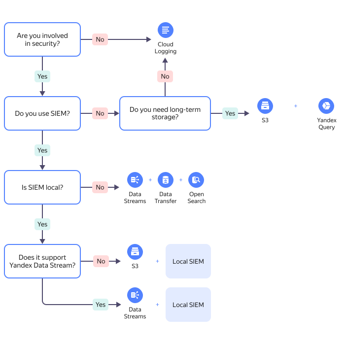

# Exporting audit logs to SIEM systems

You can export audit log files to SIEM systems.

The {{ yandex-cloud }} team has prepared a set of solutions for exporting audit logs into several SIEM systems. You can find solution files in the respective sections of the [{{ yandex-cloud }} Security Solution Library repository](https://github.com/yandex-cloud-examples/yc-security-solutions-library).

[{{ yandex-cloud }} Security Solution Library](/solutions/security-solution-library) is a public repo on GitHub with a set of examples and recommendations on how to build a secure infrastructure in {{ yandex-cloud }}.

<small>How to choose an architecture</small>

As of today, solutions have been prepared for the following SIEM systems:
* [{{ mos-full-name }}](../tutorials/trails-logs-opensearch.md).
* [ArcSight](../tutorials/export-logs-to-arcsight.md).
* [Splunk](../tutorials/export-logs-to-splunk.md).
* [MaxPatrol SIEM](../tutorials/maxpatrol.md).

All the solutions provide continuous delivery of audit log files from buckets to the SIEM system and also contain correlation rules, dashboards, and preset queries to search for important security events. The {{ yandex-cloud }} team supports and regularly updates all the solutions.
