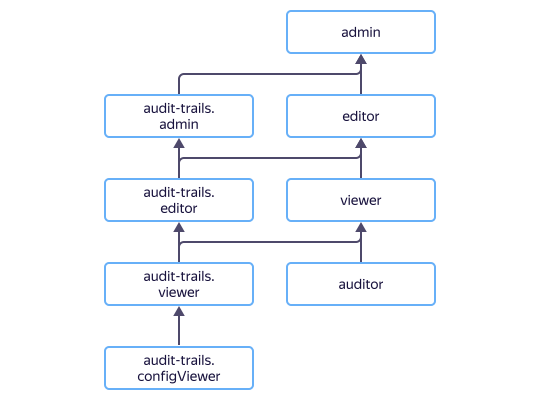

# Access management {{ at-name }}

In this section, you'll learn:

* [Which resources you can assign roles to](#resources).
* [Which roles exist in the service](#roles).



## What resources you can assign roles to {#resources}

In the {{ yandex-cloud }} console, you can assign a role for a [cloud](../../resource-manager/concepts/resources-hierarchy.md#cloud) and [folder](../../resource-manager/concepts/resources-hierarchy.md#folder). Roles assigned for clouds or folders also apply to the trails in them.

## What roles exist in the service {#roles}

The diagram shows which roles are available in the service and how they inherit each other's permissions. For example, `audit-trails.editor` includes all `audit-trails.viewer` role permissions. A description of each role is given under the diagram.

### Service roles

| Role | Permissions |
----- | -----
| `resource-manager.clouds.member` | A role everyone requires to access cloud resources, except for [cloud owners](../../resource-manager/concepts/resources-hierarchy.md#owner) and [service accounts](../../iam/concepts/users/service-accounts.md) |
| `resource-manager.clouds.owner` | Grants you full access to a cloud and the resources in it. Can only be assigned for clouds |
| `audit-trails.configViewer` | Lets you view information about trails |
| `audit-trails.viewer` | Gives you access to audit logs of the trails. Includes all access rights of the `audit-trails.configViewer` role |
| `audit-trails.editor` | Lets you manage trails (create, edit, and delete them). Includes all access rights of the `audit-trails.viewer` role |
| `audit-trails.admin` | Lets you manage your trails and user access to them. Includes all access rights of the `audit-trails.editor` role |

### Primitive roles



## What roles do I need

The table shows actions and minimum roles required to perform them. You can always assign a role granting broader access rights than the role from the table. For example, instead of `audit-trails.configViewer`, you can assign the `audit-trails.editor` role.

| Action | Role |
----- | -----
| Viewing information about a trail | `audit-trails.configViewer` |
| Collecting and viewing audit events in a trail | `audit-trails.viewer` |
| Creating a trail | `audit-trails.editor` |
| Editing a trail | `audit-trails.editor` |
| Deleting a trail | `audit-trails.editor` |
| Managing roles of other users for a trail | `audit-trails.admin` |

## What's next {#whats-next}

* Review the [audit log](../concepts/format.md) structure.

* See an example of [uploading audit logs to {{ cloud-logging-name }}](../operations/export-cloud-logging.md).

