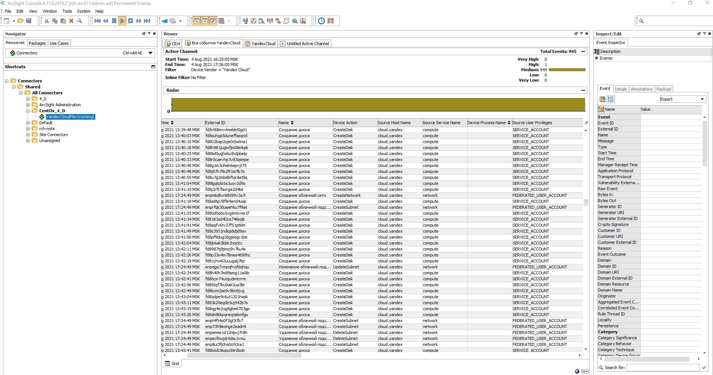

# Uploading audit logs to ArcSight SIEM

Create a trail to upload management event (Control Plane) audit logs of resources in an individual folder to a {{ objstorage-full-name }} bucket with encryption enabled. Then configure continuous log delivery to ArcSight SIEM.

To complete the tutorial successfully, you must have an ArcSight instance installed.

The solution described in the tutorial follows the procedure below:
1. A [trail](../concepts/trail.md) uploads logs to an {{ objstorage-name }} bucket.
1. A [bucket](../../storage/concepts/bucket.md) is mounted via a [FUSE](https://en.wikipedia.org/wiki/Filesystem_in_Userspace) interface to a folder on an intermediate VM.
1. [SmartConnector](https://www.microfocus.com/documentation/arcsight/arcsight-smartconnectors/AS_SmartConn_getstart_HTML/) collects logs from the folder and delivers them to ArcSight for analysis.

For more information about the scripts for delivering audit logs to ArcSight, see [{{ yandex-cloud }} Security Solution Library](https://github.com/yandex-cloud-examples/yc-export-auditlogs-to-arcsight#two-log-shipping-scenarios).



To configure delivery of audit log files to ArcSight:

1. [Prepare your cloud](#before-begin).
1. [Prepare the environment](#prepare-environment).
1. [Assign roles to the service accounts](#add-roles).
1. [Create a trail](#create-trail).
1. [Mount the bucket](#mount-bucket).
1. [Connect ArcSight SmartConnector](#configure-arcsight).

If you no longer need the resources you created, [delete them](#clear-out).

## Getting started {#before-begin}







### Required paid resources {#paid-resources}

The infrastructure support cost includes:

* Fee for using VM instances (see [{{ compute-short-name }} pricing](../../compute/pricing.md)).
* Fee for storing data in a bucket (see [{{ objstorage-name }} pricing](../../storage/pricing.md#prices-storage)).
* Fee for data operations (see [{{ objstorage-name }} pricing](../../storage/pricing.md#prices-operations)).
* Fee for using {{ kms-short-name }} keys (see [{{ kms-name }} pricing](../../kms/pricing.md#prices)).

## Prepare the environment {#prepare-environment}

### Prepare an intermediate VM {#setup-vm}

You can use a VM that has access to an ArcSight instance or create a new one:

1. [Create a VM](../../compute/operations/vm-create/create-linux-vm.md) from a Linux image based on [Ubuntu 20.04](/marketplace/products/yc/ubuntu-20-04-lts).
1. [Connect to the VM](../../compute/operations/vm-connect/ssh.md#vm-connect) via SSH.

### Create a bucket for audit logs {#create-backet}



- Management console

   1. In the [management console]({{ link-console-main }}), select the folder to create a bucket in, e.g., `example-folder`.
   1. Select **{{ ui-key.yacloud.iam.folder.dashboard.label_storage }}**.
   1. Click **{{ ui-key.yacloud.storage.buckets.button_empty-create }}**.
   1. On the bucket creation page:
      1. Enter a name for the bucket according to the [naming requirements](../../storage/concepts/bucket.md#naming).
      1. Limit the maximum bucket size, if required.

         

      1. Select the `{{ ui-key.yacloud.storage.bucket.settings.access_value_private }}` [access](../../storage/concepts/bucket.md#bucket-access) type.
      1. Select the default [storage class](../../storage/concepts/storage-class.md).
      1. Click **{{ ui-key.yacloud.storage.buckets.create.button_create }}**.



### Create an encryption key in {{ kms-name }} {#create-key}



- Management console

   1. In the [management console]({{ link-console-main }}), go to `example-folder`.
   1. Select **{{ ui-key.yacloud.iam.folder.dashboard.label_kms }}**.
   1. Click **{{ ui-key.yacloud.kms.symmetric-keys.button_empty-create }}** and specify:
      * **{{ ui-key.yacloud.common.name }}**: `arcsight-kms`
      * **{{ ui-key.yacloud.kms.symmetric-key.form.field_algorithm }}**: `AES-256`
      * Leave the other parameters at their default settings.
   1. Click **{{ ui-key.yacloud.common.create }}**.



### Enable bucket encryption {#backet-encoding}



- Management console

   1. In the [management console]({{ link-console-main }}), go to the previously created bucket.
   1. In the left-hand panel, select **{{ ui-key.yacloud.storage.bucket.switch_encryption }}**.
   1. In the **{{ ui-key.yacloud.storage.bucket.encryption.field_key }}** field, select the `arcsight-kms` key.
   1. Click **{{ ui-key.yacloud.storage.bucket.encryption.button_save }}**.



### Create service accounts {#create-sa}

You need to create two accounts: one for a trail and one for a bucket.

Create the `sa-arcsight` service account:



- Management console

   1. In the [management console]({{ link-console-main }}), go to `example-folder`.
   1. At the top of the screen, go to the **{{ ui-key.yacloud.iam.folder.switch_service-accounts }}** tab.
   1. Click **{{ ui-key.yacloud.iam.folder.service-accounts.button_add }}**.
   1. Enter a name for the service account according to the naming requirements:

      

      For example, `sa-arcsight`.

   1. Click **{{ ui-key.yacloud.iam.folder.service-account.popup-robot_button_add }}**.



Create the `sa-arcsight-bucket` service account the same way.

### Create a static key {#create-access-key}

You will need the key ID and secret key when mounting the bucket.



- Management console

   1. In the [management console]({{ link-console-main }}), go to `example-folder`.
   1. At the top of the screen, go to the **{{ ui-key.yacloud.iam.folder.switch_service-accounts }}** tab.
   1. Choose `sa-arcsight-bucket` and click the row with its name.
   1. Click **{{ ui-key.yacloud.iam.folder.service-account.overview.button_create-key-popup }}** on the top panel.
   1. Select **{{ ui-key.yacloud.iam.folder.service-account.overview.button_create_service-account-key }}**.
   1. Enter a description for the key and click **{{ ui-key.yacloud.iam.folder.service-account.overview.popup-key_button_create }}**.
   1. Save the ID and private key.

      

      Once you close the dialog, the private key value will be unavailable.

      

- CLI

   1. Create an access key for `sa-arcsight-bucket`:

      ```bash
      yc iam access-key create --service-account-name sa-arcsight-bucket
      ```

      Result:

      ```
      access_key:
        id: aje*******k2u
        service_account_id: aje*******usm
        created_at: "2022-09-22T14:37:51Z"
        key_id: 0n8*******0YQ
      secret: JyT*******zMP1
      ```

   1. Save the ID `key_id` and `secret` key. You will not be able to get the key value again.



## Assign roles to the service accounts {#add-roles}

Assign `sa-arcsight` the `audit-trails.viewer`, `storage.uploader`, and `kms.keys.encrypterDecrypter` roles:



- CLI

   1. The `audit-trails.viewer` [role](../../audit-trails/security/#roles) to the folder:

      ```
      yc resource-manager folder add-access-binding \
      --role audit-trails.viewer \
      --id <folder_ID> \
      --service-account-id <service_account_ID>
      ```

      Where:

      * `--role`: Role being assigned.
      * `--id`: ID of `example-folder`.
      * `--service-account-id`: ID of the `sa-arcsight` service account.

      For more information about the `yc resource-manager folder add-access-binding` command, see the [CLI reference](../../cli/cli-ref/managed-services/resource-manager/folder/add-access-binding.md).

   1. The `storage.uploader` [role](../../storage/security/#storage-uploader) to the folder with a bucket:

      ```
      yc resource-manager folder add-access-binding \
      --role storage.uploader \
      --id <folder_ID> \
      --service-account-id <service_account_ID>
      ```

      Where:

      * `--role`: Role being assigned.
      * `--id`: ID of `example-folder`.
      * `--service-account-id`: ID of the `sa-arcsight` service account.

   1. The `kms.keys.encrypterDecrypter` [role](../../kms/security/#service) to the `arcsight-kms` encryption key:

      ```
      yc kms symmetric-key add-access-binding \
      --role kms.keys.encrypterDecrypter \
      --id <key_ID> \
      --service-account-id <service_account_ID>
      ```

      Where:

      * `--role`: Role being assigned.
      * `--id`: ID of the `arcsight-kms` {{ kms-short-name }} key.
      * `--service-account-id`: ID of the `sa-arcsight` service account.



Assign `sa-arcsight-bucket` the `storage.viewer` and `kms.keys.encrypterDecrypter` roles:



- CLI

   1. The `storage.viewer` role to the folder:

      ```
      yc resource-manager folder add-access-binding \
      --id <folder_ID> \
      --role storage.viewer \
      --service-account-id <service_account_ID>
      ```

      Where:

      * `--id`: ID of `example-folder`.
      * `--role`: Role being assigned.
      * `--service-account-id`: ID of `sa-arcsight-bucket`.

   1. The `kms.keys.encrypterDecrypter` role to the `arcsight-kms` encryption key:

      ```
      yc kms symmetric-key add-access-binding \
      --role kms.keys.encrypterDecrypter \
      --id <key_ID> \
      --service-account-id <service_account_ID>
      ```

      Where:

      * `--role`: Role being assigned.
      * `--id`: ID of the `arcsight-kms` {{ kms-short-name }} key.
      * `--service-account-id`: ID of the `sa-arcsight-bucket` service account.



## Create a trail {#create-trail}



- Management console

   1. In the [management console]({{ link-console-main }}), go to `example-folder`.
   1. Select **{{ ui-key.yacloud.iam.folder.dashboard.label_audit-trails }}**.
   1. Click **{{ ui-key.yacloud.audit-trails.button_create-trail }}** and specify:

      * **{{ ui-key.yacloud.common.name }}**: Name of the trail being created, e.g., `arcsight-trail`
      * **{{ ui-key.yacloud.common.description }}**: Description of the trail (optional)

   1. Under **{{ ui-key.yacloud.audit-trails.label_destination }}**, set up the destination object:

      * **{{ ui-key.yacloud.audit-trails.label_destination }}**: `{{ ui-key.yacloud.audit-trails.label_objectStorage }}`.
      * **{{ ui-key.yacloud.audit-trails.label_bucket }}**: Bucket name.
      * **{{ ui-key.yacloud.audit-trails.label_object-prefix }}**: Optional parameter used in the [full name](../../audit-trails/concepts/format.md#log-file-name) of the audit log file.

      

      * **{{ ui-key.yacloud.audit-trails.title_kms-key }}**: Specify the `arcsight-kms` encryption key the bucket is [encrypted](../../storage/concepts/encryption.md) with.

   1. Under **{{ ui-key.yacloud.audit-trails.label_service-account }}**, select `sa-arcsight`.

   1. Under **{{ ui-key.yacloud.audit-trails.label_path-filter-section }}**, set up the collection of management event audit logs:

      * **{{ ui-key.yacloud.audit-trails.label_collecting-logs }}**: Select `{{ ui-key.yacloud.common.enabled }}`.
      * **{{ ui-key.yacloud.audit-trails.label_resource-type }}**: Select `{{ ui-key.yacloud.audit-trails.label_resource-manager.folder }}`.
      * **{{ ui-key.yacloud.audit-trails.label_resource-manager.folder }}**: Automatically populated field containing the name of the current folder.

   1. Under **{{ ui-key.yacloud.audit-trails.label_event-filter-section }}**, select `{{ ui-key.yacloud.common.disabled }}` in the **{{ ui-key.yacloud.audit-trails.label_collecting-logs }}** field.
   1. Click **{{ ui-key.yacloud.common.create }}**.

   

   The solution will delete the logs from the bucket after they are exported to ArcSight. If you need to keep the logs in the bucket, create a separate bucket and trail.

   



## Mount a bucket {#mount-bucket}

A bucket is mounted on an intermediate VM where ArcSight SmartConnector is installed.
To mount the bucket, create a file with the `sa-arcsight-bucket` service account static access key.

1. On the intermediate VM, create a file with the static access key:

   ```bash
   echo <access_key_ID>:<secret_access_key> > ${HOME}/.passwd-s3fs
   chmod 600 ${HOME}/.passwd-s3fs
   ```

1. Install [s3fs](https://github.com/s3fs-fuse/s3fs-fuse):

   ```bash
   sudo apt install s3fs
   ```

1. Create a directory where the bucket will be mounted. For example: `mybucket` in the home directory:

   ```bash
   sudo mkdir ${HOME}/mybucket
   ```

1. Mount the bucket:

   ```bash
   s3fs <bucket_name> ${HOME}/mybucket -o passwd_file=${HOME}/.passwd-s3fs -o url=https://{{ s3-storage-host }} -o use_path_request_style
   ```

1. Check that the bucket was mounted:

   ```bash
   ls ${HOME}/mybucket
   ```

## Install and configure ArcSight SmartConnector {#configure-arcsight}



To complete this stage of the tutorial, you need an ArcSight SmartConnector distribution and access to an ArcSight instance.



1. On the intermediate VM, [install](https://www.microfocus.com/documentation/arcsight/arcsight-smartconnectors/AS_smartconn_install/) `ArcSight SmartConnector`:
   1. When installing it, select **ArcSight FlexConnector JSON Folder Follower** and specify the path to the `mybucket` folder.
   1. Specify **JSON configuration filename prefix**: `yc`.
1. [Download](https://github.com/yandex-cloud-examples/yc-export-auditlogs-to-arcsight/tree/main/arcsight_content) the `arcsight_content` files.
1. Copy the `yc.jsonparser.properties` file from the `flex` folder to the `<agent_installation_folder>/current/user/agent/flexagent` folder.
1. Copy the `map.0.properties` file from the `flex` folder to the `<agent_installation_folder>/current/user/agent/map` folder.
1. Edit the file `<agent_installation_folder>/current/user/agent/agent.properties`:

   ```bash
   agents[0].mode=DeleteFile
   agents[0].proccessfoldersrecursively=true
   ```

1. Start the connector and make sure that events are received by ArcSight:

   

## How to delete the resources you created {#clear-out}

Some resources are not free of charge. To avoid paying for them, delete the resources you no longer need:

1. [Delete](../../storage/operations/buckets/delete.md) the {{ objstorage-name }} bucket.
1. [Destroy](../../kms/operations/key.md#delete) the {{ kms-name }} key.
1. [Delete](../../compute/operations/vm-control/vm-delete.md) the intermediate VM if you created it in {{ compute-short-name }}.
