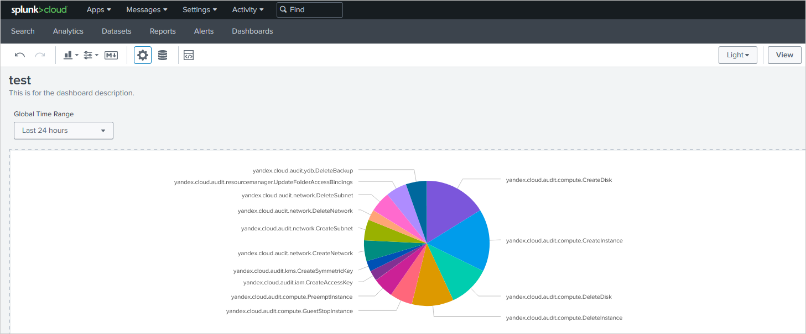

# Exporting audit logs to SIEM Splunk systems

Create a trail to upload the audit logs of resources in a single folder to a {{ objstorage-full-name }} bucket with encryption enabled. Following that, configure continuous log delivery to SIEM Splunk.

The solution described in the tutorial follows the procedure below:
1. A [trail](../concepts/trail.md) uploads logs to a {{ objstorage-name }} bucket.
1. The bucket is mounted as part of the [file system](https://ru.wikipedia.org/wiki/FUSE_(%D0%BC%D0%BE%D0%B4%D1%83%D0%BB%D1%8C_%D1%8F%D0%B4%D1%80%D0%B0))(https://en.wikipedia.org/wiki/Filesystem_in_Userspace) of an intermediate VM.
1. The intermediate VM is running a script that picks the logs up from the bucket on a schedule and forwards them to Splunk.

To configure delivery of audit log files from a bucket to Splunk:

1. [Prepare your cloud.](#before-begin)
1. [Prepare the environment.](#prepare-environment)
1. [Assign roles to the service account.](#add-roles)
1. [Create a trail.](#create-trail)
1. [Set Splunk up for import.](#prepare-splunk)
1. [Enable NAT for the Internet in the subnet the intermediate VM is connected to.](#enable-nat)
1. [Create the intermediate VM.](#create-vm)
1. [Visualize the data in Splunk.](#splunk-visualization)

Some of the steps are completed in {{ TF }}.

If you no longer need these resources, [delete them](#clear-out).

## Before you begin {#before-begin}







To be able to go through the tutorial, you need an instance of Splunk available to the intermediate VM on port `8080`.

### Required paid resources {#paid-resources}

The infrastructure support cost includes:

* Using virtual machines (see [{{ compute-short-name }} pricing](../../compute/pricing.md)).
* A fee for storing data in a bucket (see [{{ objstorage-name }} pricing](../../storage/pricing.md#prices-storage)).
* A fee for data operations (see [{{ objstorage-name }} pricing](../../storage/pricing.md#prices-operations)).
* A fee for using KMS keys (see [{{ kms-name }} pricing](../../kms/pricing.md#prices)).

## Prepare the environment {#prepare-environment}

### Create a new bucket to use for uploading audit logs {#create-backet}



- Management console

   1. In the [management console]({{ link-console-main }}), select the folder where you wish to create a [bucket](../../storage/concepts/bucket.md).
   1. Select **{{ objstorage-name }}**.
   1. Click **Create bucket**.
   1. On the bucket creation page:
      1. Enter the bucket name, following the [naming guidelines](../../storage/concepts/bucket.md#naming).

         By default, a bucket with a dot in the name is only available over HTTP. To provide HTTPS support for your bucket, [upload your own security certificate](../../storage/operations/hosting/certificate.md) to {{ objstorage-name }}.

      1. If necessary, limit the maximum bucket size.

         

      1. Selected the type of [access](../../storage/concepts/bucket.md#bucket-access).
      1. Select the default [storage class](../../storage/concepts/storage-class.md).
      1. Click **Create bucket** to complete the operation.



### Create an encryption key in {{ kms-name }} {#create-key}



- Management console

   1. In the [management console]({{ link-console-main }}), select the folder containing your bucket.
   1. Select **{{ kms-name }}**.
   1. Click **Create** and set the key attributes:

     * Any name and optional description.
     * Encryption algorithm, such as AES-256.
     * [Rotation](../../kms/concepts/index.md#rotation) period (how often to change key versions).
     * Click **Create**.

   The key is created along with its first version: click the key in the list to open the page with its attributes.



### Enable bucket encryption {#backet-encoding}



- Management console

   1. In the [management console]({{ link-console-main }}), select the bucket you wish to configure encryption for.
   1. In the left panel, select **Encryption**.
   1. In the **{{ kms-short-name }} key** field, select an existing key or create a new one:

      

   1. Click **Save**.



### Create a service account {#create-sa}



- Management console

   1. In the [management console]({{ link-console-main }}), select the folder where you wish to create a service account.
   1. Go to the **Service accounts** tab.
   1. Click **Create service account**.
   1. Enter the name of the service account:

      

   1. Click **Create**.



## Assign roles to the service account {#add-roles}



- CLI

   1. Assign the [audit-trails.viewer](../../audit-trails/security/#roles) role to the folder whose resources will be polled for audit logs:

      ```
      yc resource-manager folder add-access-binding \
      --role audit-trails.viewer \
      --id <folder_ID> \
      --service-account-id <service_account_ID>
      ```

      Where:

      * `role`: The role assigned.
      * `id`: The ID of the folder from which audit logs will be collected.
      * `service-account-id`: The ID of your service account.

   1. Assign the [storage.uploader](../../storage/security/#storage-uploader) role to the folder that will host the trail:

      ```
      yc resource-manager folder add-access-binding \
      --role storage.uploader \
      --id <folder_ID> \
      --service-account-id <service_account_ID>
      ```

      Where:

      * `role`: The role assigned.
      * `id`: The ID of the folder to host the trail:
      * `service-account-id`: The ID of your service account.

   1. Assign the [kms.keys.encrypterDecrypter](../../kms/security/#service) role to the encryption key:

      ```
      yc kms symmetric-key add-access-binding \
      --role kms.keys.encrypterDecrypter \
      --id <KMS_key_ID> \
      --service-account-id <service_account_ID>
      ```

      Where:

      * `role`: The role assigned.
      * `id`: The ID of the KMS key.
      * `service-account-id`: The ID of your service account.



## Create a trail {#create-trail}

To be able to create the trail, please make sure you have the following roles:

* `iam.serviceAccounts.user` for the service account.
* `audit-trails.editor` for the folder to host the trail.
* `audit-trails.viewer` for the folder from which audit logs will be collected.
* `storage.viewer` for the bucket or the folder.



- Management console

   1. In the [management console]({{ link-console-main }}), select the folder where you wish to create the trail.
   1. Select **{{ at-name }}**.
   1. Click **Create trail** and specify:

      * **Name**: The name of the trail being created.
      * **Description**: A description of the trail (optional).

   1. Under **Filter**, set up the audit log scope:

      * **Resource**: Select `Folder`.
      * **Folder**: An automatically populated field containing the name of the current folder.

   1. Under **Destination**, set up the destination object:

      * **Destination**: `{{ objstorage-name }}`.
      * **Bucket**: The name of the [bucket](../../storage/operations/buckets/create.md) where you want to upload audit logs.
      * **Object prefix**: An optional parameter used in the [full name](../../audit-trails/concepts/format.md#log-file-name) of the audit log file.

      

      Use a [prefix](../../storage/concepts/object.md#key) to store audit logs and third-party data in the same bucket. Do not use the same prefix for logs and other bucket objects because that may cause logs and third-party objects to overwrite each other.

      

   1. Under **Service account**, select the service account that the trail will use to upload audit log files to the bucket.
   1. Click **Create**.

   

   The solution will delete the logs from the bucket after they are exported to Splunk. If you need to keep the logs in the bucket, create a separate bucket and trail.

   



## Set up Splunk for import {#prepare-splunk}

Enable `HTTPEventCollector` and retrieve an `Event Collector` token by following the [procedure](https://docs.splunk.com/Documentation/SplunkCloud/8.2.2105/Data/UsetheHTTPEventCollector#Configure_HTTP_Event_Collector_on_Splunk_Cloud_Platform).

## Enable NAT for the Internet in the subnet the intermediate VM is connected to {#enable-nat}

An intermediate VM will be deployed on the subnet.



- Management console

   1. In the [management console]({{ link-console-main }}), select the folder containing the intermediate VM's subnet.
   1. In the list of services, select **{{ vpc-name }}**.
   1. Select the network with the appropriate subnet.
   1. Under **Subnets**, click  in the line of the subnet.
   1. In the menu that opens, select **Enable NAT to the internet**.



## Create a VM for continuous log delivery to Splunk {#create-vm}



- {{ TF }}

   1. If you don't have {{ TF }}, [install it and configure the {{ yandex-cloud }} provider](../../tutorials/infrastructure-management/terraform-quickstart.md#install-terraform).
   1. Clone the [Yandex Cloud Security Solution Library repository](https://github.com/yandex-cloud/yc-solution-library-for-security/tree/master/auditlogs/export-auditlogs-to-Splunk)

      ```
      git clone https://github.com/yandex-cloud/yc-solution-library-for-security.git
      ```

   1. Create a subfolder under `/auditlogs/export-auditlogs-to-Splunk/terraform/` and change to it.
   1. Create a configuration file calling the `yc-splunk-trail` module:

      ```
      module "yc-splunk-trail" {
         source = "../modules/yc-splunk-trail/"
         folder_id = <folder_ID>
         splunk_token = <Event_Collector_token>
         splunk_server = <your_Splunk_server_address>:8088
         bucket_name = <bucket_name>
         bucket_folder = <name_of_bucket_root_folder>
         sa_id = <service_account_ID>
         coi_subnet_id = <subnet_ID>
      }
      ```
      Where:

      * `folder_id`: ID of the folder.
      * `splunk_token`: Event Collector token retrieved from Splunk.
      * `splunk_server`: Address of your Splunk server as https://<host_name_or_address>.
      * `bucket_name`: Bucket name.
      * `bucket_folder`: Name of root folder in bucket.
      * `sa_id`: Service account ID.
      * `coi_subnet_id`: ID of subnet with NAT for the Internet enabled.

   1. Make sure that the configuration files are correct:

      ```
      terraform plan
      ```

      If the configuration is described correctly, the terminal displays a list of created resources and their parameters. If the configuration contain errors, {{ TF }} will point them out.

   1. Deploy the cloud resources.
      1. If the configuration doesn't contain any errors, run the command:

         ```
         terraform apply
         ```

      1. Confirm resource creation: enter `yes` in the terminal and press **Enter**.



## Visualize the data in Splunk {#splunk-visualization}

1. Go to Splunk and search for the events created by the service account:

   ```
   index="main" authentication.subject_type="SERVICE_ACCOUNT" | stats count by event_type
   ```

1. To visualize the result, select the **Visualization** tab and select a suitable format (`LineChart`, `PieChart`, and so on):

   Data visualization example:

   

## How to delete created resources {#clear-out}

1. To delete the resources created with {{ TF }}:

   1. Run the command:
      ```
      terraform destroy
      ```

      

      {{ TF }} will delete all the resources you created in the current configuration, such as networks, subnets, virtual machines, and so on.

      


      After the command is executed, the terminal will display a list of resources to be deleted.

   1. To confirm deletion, type `yes` and press **Enter**.

1. [Delete](../../storage/operations/buckets/delete.md) the bucket {{ objstorage-name }}.

1. [Destroy](../../kms/operations/key.md#delete) the {{ kms-name }} key.