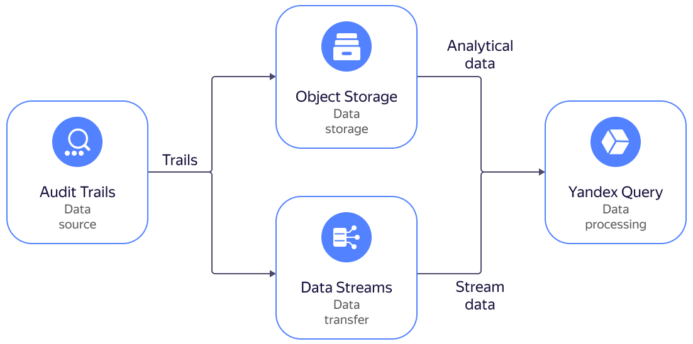

# Searching for {{ yandex-cloud }} events in {{ yq-full-name }}

{{ at-name }} support is integrated in [{{ yq-full-name }}](../../query/). You can analyze events of {{ yandex-cloud }} resources by executing [analytical](../../query/concepts/batch-processing.md) and [streaming](../../query/concepts/stream-processing.md) {{ yql-short-name }} queries.

You can execute analytical queries for logs stored in a [bucket](../operations/export-organization-bucket.md) and streaming queries for logs stored in a {{ yds-full-name }} [data stream](../operations/export-organization-data-streams.md).



To connect a bucket with [audit logs](../concepts/events.md) to {{ yq-full-name }} and execute [{{ yql-short-name }}](../../query/yql-tutorials/index.md) queries:

1. [Prepare the environment](#prepare-environment).
1. [Create a connection between a trail and {{ yq-short-name }}](#trail-yq).
1. [Execute a query to logs in {{ objstorage-name }}](#perform-request).

If you no longer need the resources you created, [delete them](#clear-out).


## Getting started {#before-begin}






## Required paid resources {#paid-resources}

The cost of infrastructure support includes a fee for a bucket (see [Pricing for {{ objstorage-name }}](../../storage/pricing.md)).


## Prepare the environment {#prepare-environment}


### Create a bucket for audit logs {#create-backet}



- Management console

   1. In the [management console]({{ link-console-main }}), select the folder to create a [bucket](../../storage/concepts/bucket.md) in, e.g., `example-folder`.
   1. Select **{{ ui-key.yacloud.iam.folder.dashboard.label_storage }}**.
   1. Click **{{ ui-key.yacloud.storage.buckets.button_empty-create }}**.
   1. On the bucket creation page:
      * Enter a name for the bucket according to the [naming requirements](../../storage/concepts/bucket.md#naming).
      * In the **{{ ui-key.yacloud.storage.bucket.settings.field_access-read }}**, **{{ ui-key.yacloud.storage.bucket.settings.field_access-list }}**, and **{{ ui-key.yacloud.storage.bucket.settings.field_access-config-read }}** fields, select `{{ ui-key.yacloud.storage.bucket.settings.access_value_private }}`.
      * For the other parameters, leave the default settings.
   1. Click **{{ ui-key.yacloud.storage.buckets.create.button_create }}**.




### Create service accounts {#create-sa}

Create a service account named `trail-sa`:



- Management console

   1. In the [management console]({{ link-console-main }}), go to `example-folder`.
   1. At the top of the screen, go to the **{{ ui-key.yacloud.iam.folder.switch_service-accounts }}** tab.
   1. Click **{{ ui-key.yacloud.iam.folder.service-accounts.button_add }}**.
   1. Enter the **{{ ui-key.yacloud.iam.folder.service-account.popup-robot_field_name }}**: `trail-sa`.
   1. Click **{{ ui-key.yacloud.iam.folder.service-account.popup-robot_button_add }}**.



Use the same method to create a service account named `bucket-yq-sa`.


### Assign rights to service accounts {#grant-roles}

Assign the `audit-trails.viewer` and `storage.uploader` roles to the `trail-sa` service account:



- CLI

   1. The `audit-trails.viewer` role to the organization:

      ```bash
      yc organization-manager organization add-access-binding \
      --role audit-trails.viewer \
      --id <organization_ID> \
      --service-account-id <trail-sa_service_account_ID>
      ```

      Result:

      ```text
      done (1s)
      ```

      For more information about the `yc resource-manager organization add-access-binding` command, see the [CLI reference](../../cli/cli-ref/managed-services/organization-manager/organization/add-access-binding.md).

   1. The `storage.uploader` role to `example-folder`:

      ```bash
      yc resource-manager folder add-access-binding example-folder \
          --role storage.uploader \
          --subject serviceAccount:<trail-sa_service_account_ID>
      ```

      Result:

      ```text
      done (1s)
      ```

      For more information about the `yc resource-manager folder add-access-binding` command, see the [CLI reference](../../cli/cli-ref/managed-services/resource-manager/folder/add-access-binding.md).



Assign the `bucket-yq-sa` service account the `storage.viewer` role to `example-folder`:



- CLI

   ```bash
   yc resource-manager folder add-access-binding example-folder \
       --role storage.viewer \
       --subject serviceAccount:<bucket-yq-sa_service_account_ID>
   ```

   Result:

   ```text
   done (1s)
   ```

   For more information about the `yc resource-manager folder add-access-binding` command, see the [CLI reference](../../cli/cli-ref/managed-services/resource-manager/folder/add-access-binding.md).




## Create a trail {#create-trail}



- Management console

   1. In the [management console]({{ link-console-main }}), select `example-folder`.
   1. Select **{{ ui-key.yacloud.iam.folder.dashboard.label_audit-trails }}**.
   1. Click **{{ ui-key.yacloud.audit-trails.button_create-trail }}**.
   1. In the **{{ ui-key.yacloud.common.name }}** field, specify `logsyq`.
   1. Under **{{ ui-key.yacloud.audit-trails.label_destination }}**, set up the destination object:
      * **{{ ui-key.yacloud.audit-trails.label_destination }}**: `{{ ui-key.yacloud.audit-trails.label_objectStorage }}`
      * **{{ ui-key.yacloud.audit-trails.label_bucket }}**: Select the [previously created](#create-backet) bucket.
   1. Under **{{ ui-key.yacloud.audit-trails.label_service-account }}**, select `trail-sa`.
   1. Under **{{ ui-key.yacloud.audit-trails.label_path-filter-section }}**, set up the collection of management event audit logs:

      * **{{ ui-key.yacloud.audit-trails.label_collecting-logs }}**: Select `{{ ui-key.yacloud.common.enabled }}`.
      * **{{ ui-key.yacloud.audit-trails.label_resource-type }}**: Select `{{ ui-key.yacloud.audit-trails.label_organization-manager.organization }}`.
      * **{{ ui-key.yacloud.audit-trails.label_organization-manager.organization }}**: Automatically populated field containing the name of the current organization.
      * **{{ ui-key.yacloud.audit-trails.label_resource-manager.cloud }}**: Keep the default value, `{{ ui-key.yacloud.common.all }}`.

   1. Under **{{ ui-key.yacloud.audit-trails.label_event-filter-section }}**, select `{{ ui-key.yacloud.common.disabled }}` in the **{{ ui-key.yacloud.audit-trails.label_collecting-logs }}** field.
   1. Click **{{ ui-key.yacloud.common.create }}**.




## Create a connection between a trail and {{ yq-short-name }} {#trail-yq}

A connection must be created only the first time a trail is connected to {{ yq-short-name }}.



- Management console

   1. In the [management console]({{ link-console-main }}), select `example-folder`.
   1. Select **{{ ui-key.yacloud.iam.folder.dashboard.label_audit-trails }}**.
   1. Select the `logsyq` trail.
   1. Click **{{ ui-key.yacloud.audit-trails.button_process-in-yq }}**.
   1. Create a connection.
      * Select the **{{ ui-key.yacloud.common.resource-acl.label_service-account }}**: `bucket-yq-sa`.
      * For the other parameters, leave the default settings.
   1. Click **{{ ui-key.yacloud.common.create }}**.
   1. In the window with data binding options, click **{{ ui-key.yacloud.common.create }}**.

   You will go to the page for creating a query to trail logs.




## Execute a query to logs in {{ objstorage-name }} {#perform-request}

Open the page to create an analytical query to {{ at-name }} logs:



- Management console

   1. In the [management console]({{ link-console-main }}), select a folder with a trail.
   1. In the list of services, select **{{ ui-key.yacloud.iam.folder.dashboard.label_audit-trails }}**.
   1. Select the trail for which a [connection to {{ yq-short-name }}](#trail-yq) is configured.
   1. Click **{{ ui-key.yacloud.audit-trails.button_process-in-yq }}** to go to the analytical query execution page.



Execute event queries to bind `audit-trails-logsyq-object_storage`:

1. Deleting a folder:

   1. From the list, select query **1. Find out who deleted a folder**.
   1. Edit the query by specifying the folder ID:

      ```SQL
      SELECT * FROM bindings.`audit-trails-logsyq-object_storage`
      WHERE
          JSON_VALUE(data, "$.event_type") = '{{ at-event-prefix }}.audit.resourcemanager.DeleteFolder'
          and JSON_VALUE(data, "$.details.folder_name") = '<folder_ID>'
          LIMIT 100;
      ```

   1. Click **Execute**.

1. Enabling access via the serial console:

   1. From the list, select query **6. Changing a VM: Adding access to the serial console**.
   1. Edit the query by specifying the number of displayed records:

      ```SQL
      SELECT * FROM bindings.`<audit-trails-logsyq-object_storage>`
      WHERE
          JSON_VALUE(data, "$.event_type") = '{{ at-event-prefix }}.audit.compute.UpdateInstance'
          and JSON_VALUE(data, "$.details.metadata_serial_port_enable") = '1'
          LIMIT <number_of_records>;
      ```

   1. Click **Execute**.

1. Changing access rights to an {{ objstorage-name }} bucket:

   1. From the list, select query **11. Suspicious activities with the {{ at-name }} log repository ({{ objstorage-name }} Bucket)**.
   1. Edit the query by specifying the number of displayed records:

      ```SQL
      SELECT * FROM bindings.`audit-trails-logsyq-object_storage`
      WHERE
          (JSON_VALUE(data, "$.event_type") = '{{ at-event-prefix }}.audit.storage.BucketAclUpdate'
          or JSON_VALUE(data, "$.event_type") = '{{ at-event-prefix }}.audit.storage.BucketPolicyUpdate')
          LIMIT <number_of_records>;
      ```

   1. Click **Execute**.

1. Assigning administrator rights:

   1. From the list, select query **20. Assigning admin rights (for resources: folder, cloud)**.
   1. Edit the query by specifying the number of displayed records:

      ```SQL
      SELECT * FROM bindings.`audit-trails-logsyq-object_storage`
      WHERE
          JSON_VALUE(data, "$.details.access_binding_deltas.access_binding.role_id") = 'admin'
          LIMIT <number_of_records>;
      ```

   1. Click **Execute**.


## How to delete the resources you created {#clear-out}

If you created a separate bucket to follow these instructions, you can [delete it](../../storage/operations/buckets/delete.md) to stop paying for [bucket use](../../storage/pricing.md).
