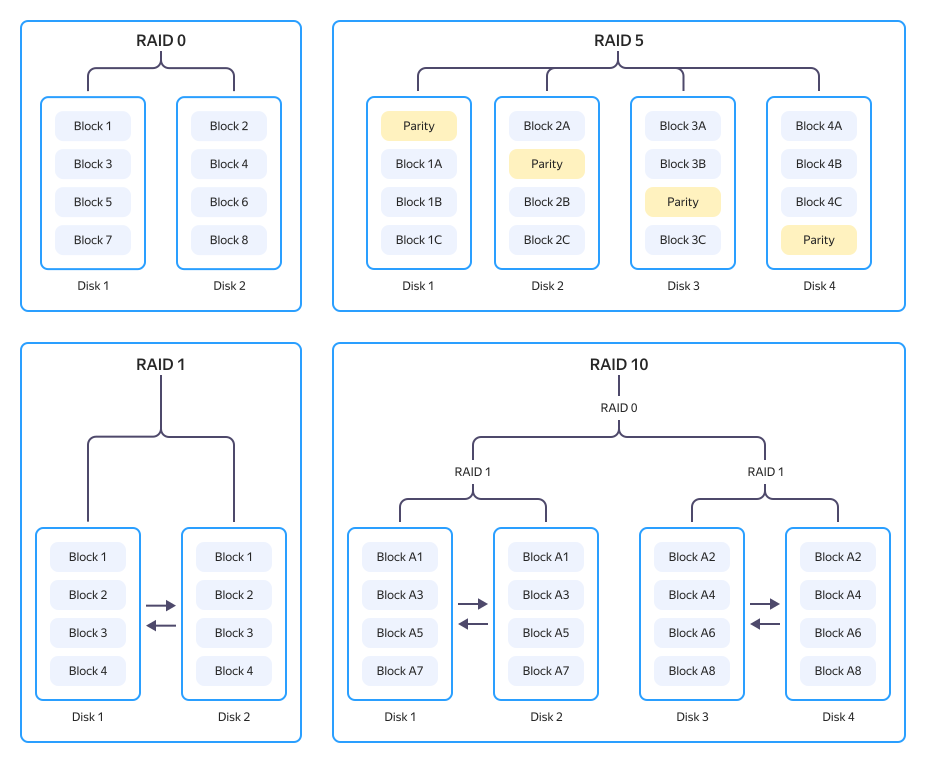

# RAID arrays in {{ baremetal-full-name }} servers

You can use _RAID_ arrays to increase performance and fault tolerance of your disk subsystem in {{ baremetal-name }} servers.

[RAID (Redundant Array of Independent Disks)](https://en.wikipedia.org/wiki/RAID) is a technology where several physical disks are combined into a single logical array. In RAID arrays, data can be duplicated to multiple disks at the same time. If some of them fail, the data will not be lost, and the array will continue to operate as a single block device. Furthermore, in a RAID array, read and write operations can be distributed between several disks for a massive increase in performance of data operations.

## RAID levels {#levels}

The logic of how multiple disks can operate together in a RAID array may vary. Depending on the logic, there are different RAID _levels_, the most common of which are:

#|
|| **Level** | **Logic** | **Fault tolerance** | **Performance** | **Use cases** ||
||
[RAID 0](https://en.wikipedia.org/wiki/Standard_RAID_levels#RAID_0) |
Striping: data is distributed across disks |
No

Each additional disk reduces fault tolerance |
Maximum |
* Working with temporary data
* Working with cache
* Speed-critical scenarios where data loss is acceptable
||
|| 
[RAID 1](https://en.wikipedia.org/wiki/Standard_RAID_levels#RAID_1) |
Mirroring: one disk fully duplicates the other |
Yes (1 disk) |
Read is faster than write |
* System disk
* Small critical databases
||
||
[RAID 5](https://en.wikipedia.org/wiki/Standard_RAID_levels#RAID_5) |
Striping with distributed parity: data is distributed across three or more disks |
Yes (1 disk) |
Good balance |
* File servers
* Universal storage that strikes a balance between reliability and capacity 
||
||
[RAID 10](https://en.wikipedia.org/wiki/Nested_RAID_levels#RAID_10) |
Combination of `RAID 1` + `RAID 0` (striping of `RAID 1` arrays) |
Yes (one disk per pair) |
High |
* High-load databases
* Scenarios dependent on both performance and fault tolerance
||
|#

The RAID levels described above (`RAID 0`, `RAID 1`, `RAID 5`, and `RAID 10`) are enough for most scenarios. But there are more RAID levels out there, e.g., `RAID 2`, `RAID 3`, `RAID 4`, `RAID 6`, `RAID 50`, `RAID 60`, etc. These, however, are rarely used in servers.

## RAID implementations in {{ baremetal-name }} servers {#implementation}

You can manage RAID arrays in {{ baremetal-name }} servers using several different technologies: [software](#software-raid) RAID, [hardware](#hardware-raid) RAID, [motherboard-integrated RAID controller](#fake-raid), and [Intel vROC](#vroc).

### Software RAID {#software-raid}

Software RAID is implemented directly by the operating system without a specialized hardware controller.

#### Linux {#linux}

[Linux](https://en.wikipedia.org/wiki/Linux) operating systems use the standard [mdadm](https://en.wikipedia.org/wiki/Mdadm) utility. It allows you to create RAID arrays from any disks available to the system and manage them using the OS tools. Installing an operating system directly on a software `RAID 1` is supported by most distributions: you configure the relevant parameter during installation in the disk partitioning section.

#### Windows Server {#windows}

In [Windows Server](https://en.wikipedia.org/wiki/Windows_Server) operating systems, software RAID is implemented via the `Storage Spaces` technology (starting with Windows Server 2012). This technology allows you to create mirrored (`RAID 1`) and striped (`RAID 0`) volumes, as well as parity (`RAID 5`) volumes. 

You can install the operating system on a mirrored volume, but this requires some additional steps: the mirror has to be configured through dynamic disk management after the system is installed on one of the disks. UEFI booting from a Storage Spaces volume is supported by current Windows Server versions if properly configured.

**Pros:**

* Hardware independence: the array can be moved to another server with any controller.
* No additional hardware costs.
* Flexible configuration and monitoring with native OS tools.

**Cons:**

* RAID array management consumes CPU resources.
* No hardware cache.
* Lack of software RAID support in some operating systems or products.

### Hardware RAID {#hardware-raid}

Hardware RAID is implemented using a separate physical controller [installed](../server-individual-configurations.md#gpu-and-raid) in the server. The controller takes over all array management computing: parity calculation, data recovery, and operation caching. The server's CPU has no part in managing the RAID array.

Different controllers support different types of disk interfaces. Most controller models work with [SATA](https://en.wikipedia.org/wiki/SATA) and [SAS](https://en.wikipedia.org/wiki/Serial_Attached_SCSI) drives, but {{ baremetal-full-name }} also offers controllers supporting [NVMe](./disk-types.md#nvme) drives.

**Pros:**

* Takes the load off the CPU.
* Hardware cache speeds up random read/write operations in most cases.
* Transparency for the OS: the RAID array is accessed as a regular disk.

**Cons:**

* Involves additional hardware costs.

### Motherboard-integrated RAID controller (Fake RAID) {#fake-raid}

Occupying a place between the hardware and software RAID, the _Fake RAID_ technology is implemented by motherboard vendors in integrated RAID controllers [Intel RST](https://en.wikipedia.org/wiki/Intel_Rapid_Storage_Technology) and `AMD RAIDXpert`.

Integrated RAID controllers operate at motherboard firmware level, the latter emulating a block device with basic bootloader functionality. For the OS to make full use of such RAID arrays, you need to install a driver for the integrated RAID controller. Some motherboards have no integrated RAID controllers.



**Pros:**

* Partially offloads the CPU.
* No additional hardware costs.
* Transparency for the OS: the RAID array is accessed as a regular disk.

**Cons:**

* Some motherboards may not have an integrated RAID controller.
* No hardware cache.
* Cannot be used with some operating systems or products.

For more information on creating a RAID array on a motherboard-integrated controller, see the [Additional server settings](../server-advanced-settings.md#rst-raids) section.

### Intel vROC (Virtual RAID on CPU) {#vroc}

[Intel vROC](https://en.wikipedia.org/wiki/Intel_Rapid_Storage_Technology#Intel_VROC_(Virtual_RAID_on_CPU)) is a RAID controller that builds upon the [Intel RST](https://en.wikipedia.org/wiki/Intel_Rapid_Storage_Technology) technology. An Intel vROC RAID array uses [NVMe](./disk-types.md#nvme) drives. Its computations are performed by the server CPU, yet the array is managed at firmware ([UEFI](https://en.wikipedia.org/wiki/UEFI)) – not OS – level.

The main advantage of Intel vROC over hardware RAID controllers is that there is no intermediary between the CPU and NVMe drives. Data is transferred directly over the PCIe bus, minimizing latency. 

**Pros:**

* Maximum performance for RAID arrays based on of NVMe drives.
* Full support for all RAID [levels](#levels).

**Cons:**

* Works only with NVMe drives.
* Available only on servers with Intel processors.
* Requires a special activation key for vROC.

### RAID implementation methods compared {#comparison}

| Parameter | Software RAID | Hardware RAID | Integrated controller | Intel vROC |
| --- | --- | --- | --- | --- |
| Disk type | [HDD](./disk-types.md#hdd), [SSD](./disk-types.md#ssd), [NVMe](./disk-types.md#nvme) | HDD, SSD, NVMe | HDD, SSD, NVMe | NVMe only |
| CPU load | Available | No | Minimum | Minimum |
| Hardware cache | No | Yes | No | No |
| Hardware independence | Yes | No | No | No |
| Performance | Medium | High | Medium | High |
| Support for RAID levels 0, 1, 5, 10 | Yes | Yes | Yes | Yes |

#### See also {#see-also}

* [{#T}](./disk-types.md)
* [{#T}](../../operations/servers/switch-raid-member.md)
* [{#T}](../server-advanced-settings.md)
