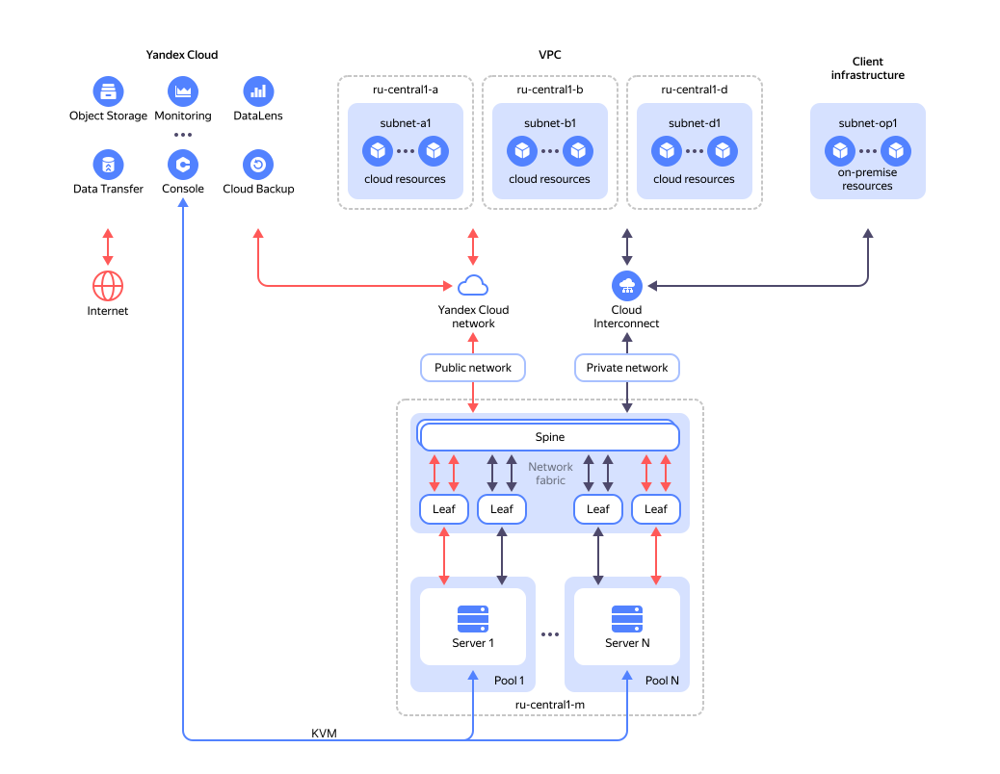

# Network

## Public network {#public-network}

A network with internet access, to which all servers are physically connected. On [some](./network-restrictions.md#blocked-ports) TCP and UDP ports, network traffic between the private network and the internet is limited.

When working with a public network and internet access, make sure to comply with the [terms of use](https://yandex.ru/legal/cloud_termsofuse/).

### Public subnet {#public-subnet}

This subnet includes a range of IP addresses that will be available to your servers in the selected [pool](./servers.md#server-pools). The IP address range is assigned to the public subnet automatically.

You can [order](../operations/reserve-public-subnet.md) a public subnet in the following sizes:

| Subnet size | Total number of IP addresses | Available IP addresses |
| --- | --- | --- |
| `/29` | 8 | 6 |
| `/28` | 16 | 14 |
| `/27`^*^ | 32 | 30 |
| `/26`^*^ | 64 | 62 |
| `/25`^*^ | 128 | 126 |
| `/24`^*^ | 256 | 254 |

^*^ To order public subnets with sizes `/27`, `/26`, `/25`, and `/24`, [contact]({{ link-console-support }}/tickets/create) support.





{{ baremetal-full-name }} public subnets are [billable](../pricing.md). The minimum lease term for a public subnet is one month from the order date, so a public subnet cannot be deleted during the first month after that date.

## Private network {#private-network}

A local network to which all servers are connected. Logically joins servers into isolated user networks.

### Private subnet {#private-subnet}

A network physically bounded by the network equipment of a single pool, isolated both from the internet and from other users' networks.

Within a single pool, L2 connectivity (VLAN) and L3 connectivity (VRF) are possible between leased servers. Between servers physically hosted in different pools, only L3 connectivity is available.

To configure networking between servers from different [pools](./servers.md), select the same [VRF](#vrf-segment) for the appropriate subnets under **Routing settings**.



### Virtual network segment (VRF) {#vrf-segment}

To provide L3 routing, private subnets with configured routing are aggregated into virtual network segments (VRFs).

Servers from the same or different pools connected to different private subnets aggregated into a VRF segment will be able to maintain L3 networking between them.

### Private connection to cloud networks {#private-connection-to-vpc}

To set up network connectivity between {{ baremetal-name }} [servers](./servers.md), {{ vpc-full-name }} private [subnets](../../vpc/concepts/network.md#subnet), and private subnets in the on-premise infrastructure, use [{{ interconnect-full-name }}](../../interconnect/concepts/priv-con.md).

#### See also {#see-also}

* [{#T}](./network-restrictions.md)