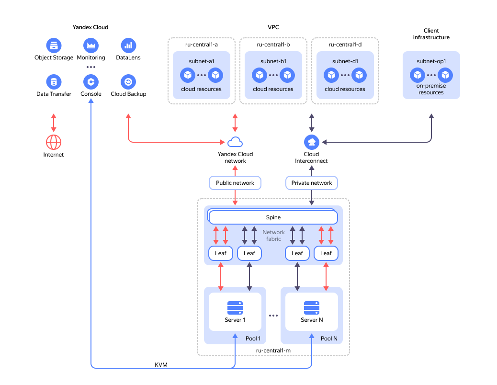

# Network

The {{ baremetal-full-name }} network infrastructure includes public and private networks that ensure server connectivity with the internet and between each other.



## Public network {#public-network}

A [public network](./public-network.md) is an internet-facing network to which all servers are physically connected. Public networks provide [ephemeral](./public-network.md#ephemeral-public-subnet) and [dedicated](./public-network.md#public-subnet) public subnets.

For more information about public networks, see [{#T}](./public-network.md).

## Private network {#private-network}

A [private network](./private-network.md) is a local network to which all servers from a single [pool](./servers.md#server-pools) are connected. Private networks provide [private subnets](./private-network.md#private-subnet), [VRFs](./private-network.md#vrf-segment), and [private connections to cloud networks](./private-network.md#private-connection-to-vpc).

For more information about private networks, see [{#T}](./private-network.md).

## MAC addresses of network interfaces {#mac-addresses}

You can [look up](../operations/servers/get-info.md) the MAC addresses of the {{ baremetal-name }} server network interfaces on the server information page under **{{ ui-key.yacloud.baremetal.title_section-network-interfaces }}**.

## Server routing table {#routing-table}

The {{ baremetal-name }} server’s OS must feature a [routing table](https://en.wikipedia.org/wiki/Routing_table) that sets traffic routes for the [public](#public-network) and [private](#private-network) networks at the same time.

The actual server routing table configuration depends on your OS; however, the routing table must follow this example:

```text
0.0.0.0/0 via <network_interface_in_public_network>
10.0.0.0/8 via <network_interface_in_private_network>
172.16.0.0/12 via <network_interface_in_private_network>
192.168.0.0/16 via <network_interface_in_private_network>
```

## {{ baremetal-full-name }} network traffic billing when communicating with other {{ yandex-cloud }} services {#traffic-pricing-pecs}

### {{ vpc-full-name }} {#vpc-traffic}



### {{ objstorage-full-name }} {#storage-traffic}



### {{ backup-full-name }} {#backup-traffic}



#### See also {#see-also}

* [{#T}](./public-network.md)
* [{#T}](./private-network.md)
* [{#T}](./dhcp.md)
* [{#T}](./mc-lag.md)
* [{#T}](./network-restrictions.md)