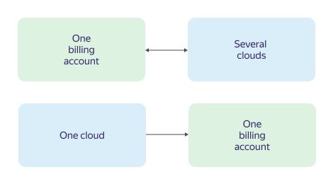

You can link a [billing account](../concepts/billing-account.md) to one or more clouds. Both new and existing clouds can be linked. You cannot unlink a cloud from a billing account. Instead, you can relink it to a different billing account.

If a billing account is added to an [organization](../../billing/concepts/organization.md), you will not be able to link new clouds from other organizations to it in the management console. However, you will be able to pay for and use clouds from other organizations previously linked to your billing account.



