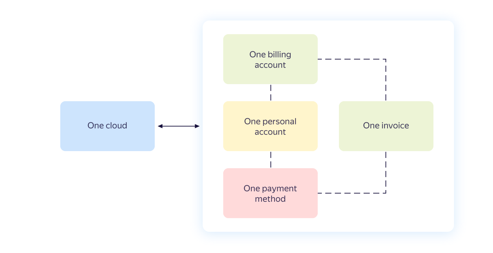

# Payment invoice

A payment invoice is a document issued for you to pay for the resources consumed. A payment invoice is issued within your [billing account](billing-account.md) and contains aggregate data on all the services used within a single cloud.

The relationship between the payment invoice, billing account, and cloud is shown in the diagram below.

## Issuing a payment invoice {#agregate}

A payment invoice is issued at the beginning of the next reporting period if the following conditions are met:

- The selected payment method is [Transfer from your bank account](../payment/payment-methods-business.md).
- The [credit limit](../concepts/credit-limit.md) is used.
- [The total invoice amount](#payment-amount) is greater than zero.



Yandex.Cloud reserves the right to issue a payment invoice during the current reporting period if you exceed the established credit limit.



## Payment invoice amount {#payment-amount}



 



- Example 1

   The personal account balance at the beginning of the reporting period is 0 rubles.
 The balance has not been topped up during the entire reporting period (0 rubles).
 The grant amount is 1000 rubles.
 The credit limit is 1000 rubles.
 At the end of the reporting period, the credit limit has not been reached and the amount for resources consumed is 1400 rubles.
 Total amount: 1400 - (0 + 0 + 1000) = 400 (rubles).
 At the beginning of the next reporting period, you will be issued a payment invoice for the amount you have actually used (in this case, 400 rubles).

- Example 2

   The personal account balance at the beginning of the reporting period is 0 rubles.
 The balance has not been topped up during the entire reporting period (0 rubles).
 The grant amount is 1000 rubles.
 The credit limit is not enabled.
 By the end of the reporting period, the amount for resources consumed is 800 rubles.
 The grant amount at the end of the reporting period is 200 rubles. The personal account balance has not changed.
 At the beginning of the next reporting month, no payment invoice will be generated.

- Example 3

   The personal account balance at the beginning of the reporting period is 0 rubles.
 The balance has not been topped up during the entire reporting period (0 rubles).
 The grant amount is 1000 rubles.
 The credit limit is 1000 rubles.
 In the middle of the reporting period, the established credit limit has been reached and the amount for resources consumed is 2000 rubles.
 Total amount: 2000 - (0 + 0 + 1000) = 1000 (rubles).
 In the middle of the reporting period, you will be issued a payment invoice for the amount actually used (in this case, 1000 rubles).



## Payment {#payment}

Invoices must be paid before the deadline stipulated in the [agreement](../concepts/contract.md). Payment is made by bank transfer. For more information, see [Payment methods for businesses](../payment/payment-methods-business.md).



## Payment invoice details {#parameters}



## Tax and fee accounting {#nds}



