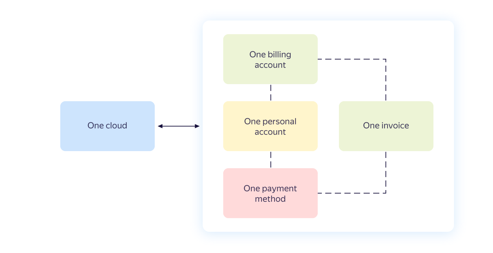
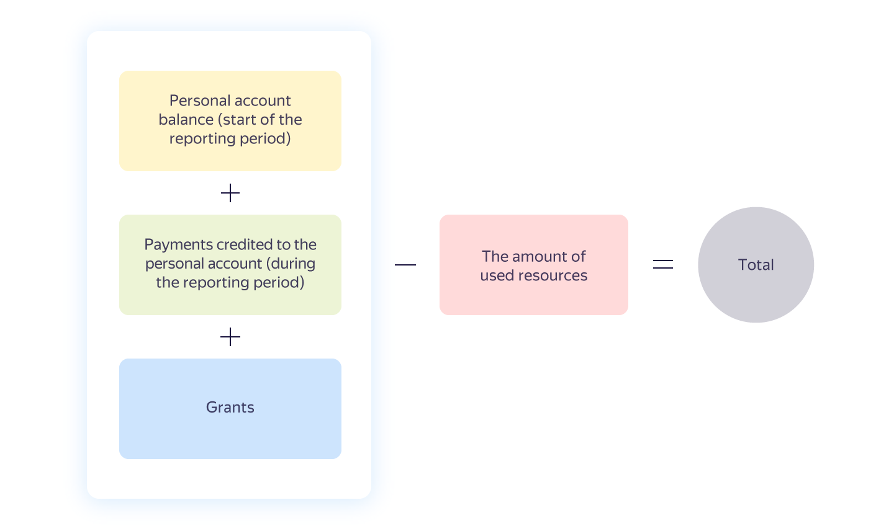

# Payment invoice

A payment invoice is a document issued for you to pay for the resources consumed. A payment invoice is issued in your [billing account](billing-account.md) and contains aggregate data on all the services used within a single cloud.

The relationship between the payment invoice, billing account, and cloud is shown in the diagram below.

## Issuing an invoice {#agregate}

A payment invoice is generated automatically and issued at the beginning of the following reporting period under the conditions below:
* The selected payment method is [Transfer from bank account](../payment/payment-methods-business.md).
* [Total invoice amount](#payment-amount) is greater than zero.

An invoice is only sent to the [billing account](billing-account.md) owner's email address. You cannot change the email address but you can configure message forwarding. For more information, see [Yandex Mail Help](https://yandex.com/support/mail/web/preferences/filters/forwarding.html).



{{ yandex-cloud }} reserves the right to issue a payment invoice during the current reporting period if you exceed your established billing threshold.



## Invoice amount {#payment-amount}







## Making payment {#payment}

Invoices must be paid before the deadline stipulated in the [agreement](../concepts/contract.md). Payment is made by bank transfer. For more information, see [Payment methods for businesses](../payment/payment-methods-business.md).



## Invoice details {#parameters}



## Taxes and fees {#nds}


