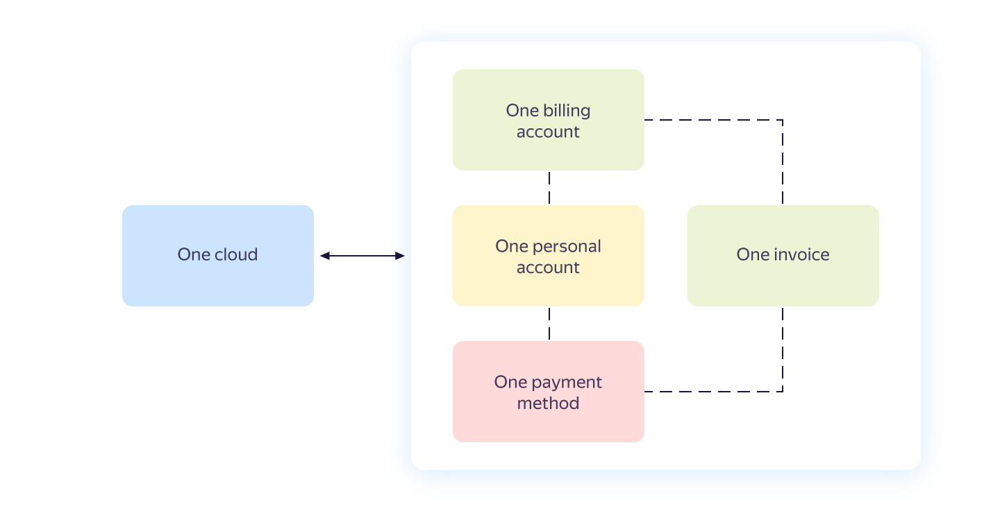
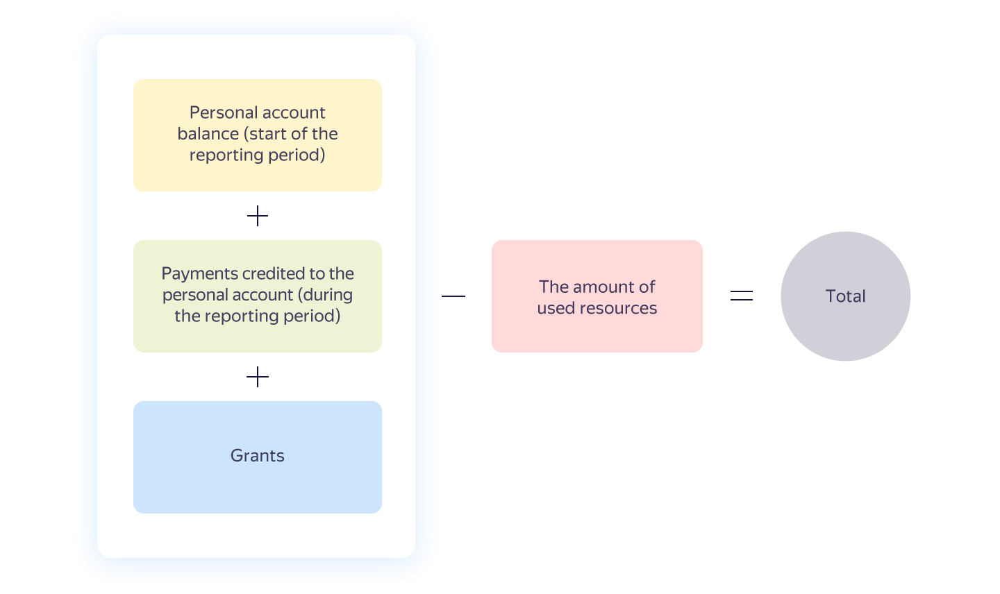

# Invoice

An invoice is a document issued for you to pay for the consumed resources. An invoice is issued in your [billing account](billing-account.md) and contains aggregate data on all services used within a single cloud.

The chart below shows how an invoice, billing account, and cloud are related.

## Issuing an invoice {#agregate}

An invoice is generated automatically and issued at the beginning of the following reporting period under the following conditions:
* The selected payment method is [Transfer from bank account](../payment/payment-methods-business.md).
* [Total invoice amount](#payment-amount) is greater than zero.

Invoices are only sent to the email address of the user who created the [billing account](billing-account.md). You cannot change the email address; however, you can configure message forwarding. For more information, see [Yandex Mail Help](https://yandex.com/support/mail/web/preferences/filters/forwarding.html).



{{ yandex-cloud }} reserves the right to issue an invoice during the current reporting period if your [personal account](personal-account.md) is in arrears.



Customers qualifying as a business and not using a linked company credit or debit card to top up their account will need to [generate payment details](../operations/pay-the-bill.md#legal-entities) through the management console on their own. Depending on which company you signed the agreement with, you can find more details in _Yandex Legal documents_ for [Iron Hive doo Beograd (Serbia)](https://yandex.com/legal/cloud_customer_agreement/) or [Direct Cursus Technology L.L.C. (Dubai)](https://yandex.com/legal/cloud_customer_agreement_uae/).

Payment details do not constitute a primary accounting document. There are no special legal requirements for drafting them. In accounting, the services are charged based on reports and invoices where all the required details are specified. Payment details are generated automatically, without any option to change customer data.

## Invoice amount {#payment-amount}







## Making payment {#payment}

Invoices must be paid before the deadline set out in the [agreement](../concepts/contract.md). Payment is made by bank transfer. For more information, see [Payment methods for businesses](../payment/payment-methods-business.md).



## Invoice details {#parameters}



## Taxes and fees {#nds}

