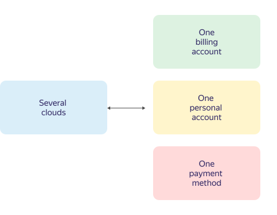

---

__system: {"dislikeVariants":["No answer to my question","Recomendations didn't help","The content doesn't match title","Other"]}
---
# Billing accounts

Billing accounts are used to identify the user paying for resources in Yandex.Cloud.

The billing account can be linked to multiple clouds and one [personal account](personal-account.md). You can only use the payment method that corresponds to the type of billing account and your [agreement](contract.md).

The relationship between clouds, billing accounts, personal accounts, and payment methods is shown in the diagram below.



The billing account is not used to manage Yandex.Cloud resources.



## Types of billing accounts {#ba-types}

The type of billing account determines the Yandex.Cloud resource [payment method](../payment/payment-methods.md).



- Individual account
   - Intended for residents of Russia.
   - Resources are paid for using a bank card.
   - Funds for the resources consumed are debited automatically. For more information, see [Billing cycle for individuals](../payment/billing-cycle-individual.md).

- Business account
   - Intended for residents of Russia and non-residents of Russia.
   - Consumed resources are paid for by bank transfer from the business's bank account or bt corporate bank card.
   - Payments for resources consumed are made based on the [agreement](../concepts/contract.md) and [bank invoice](bill.md), or the amount is debited automatically from the linked bank card. For more information, see [Billing cycle for businesses](../payment/billing-cycle-business.md).
   - A report on the services rendered and an invoice (residents only) are sent to your email address at the beginning of the next reporting period. For more information, see [Reporting documents](../payment/documents.md).



## Validity period  {#dates}

Billing accounts don't expire.

However, if Yandex.Cloud services are suspended due to arrears and you fail to pay the outstanding amount within 30 days of suspension, all your data, including the billing account, will be permanently blocked and deleted.

## Number of billing accounts {#restrictions}









