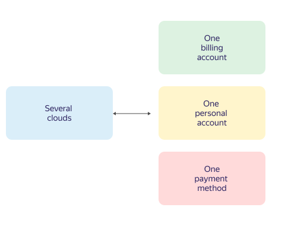

# Billing accounts

Billing accounts are used to identify users paying for resources in {{ yandex-cloud }}.

A billing account can be linked to multiple clouds and one [personal account](personal-account.md). You can only use the payment method that corresponds to the type of billing account and your [agreement](contract.md).

The relationship between clouds, billing accounts, personal accounts, and payment methods is shown in the diagram below.





A billing account is not used for managing {{ yandex-cloud }} resources.



To go to the list of billing accounts:



- Management console

   1. Open the {{ yandex-cloud }} [management console]({{ link-console-main }}).
   1. In the top-left corner, click  **{{ ui-key.yacloud.iam.folder.dashboard.label_products }}**.
   1. Select  [**{{ billing-name }}**]({{ link-console-billing }}).



## Billing account types {#ba-types}



- Individual account {#individual}

   * It is intended for residents of Russia or Kazakhstan.
   * Resources are paid for using a [bank card](../payment/payment-methods-individual.md).
   * Funds for the resources consumed are debited automatically. For more information, see [Billing cycle for individuals](../payment/billing-cycle-individual.md).

- Business account {#business}

   * It is intended for residents and non-residents of Russia or Kazakhstan.
   * Consumed resources are paid for by bank transfer from the [business's bank account](../payment/payment-methods-business.md) or a [bank card](../payment/payment-methods-card-business.md).
   * Payments for resources consumed are made based on the [agreement](../concepts/contract.md) and [bank invoice](bill.md), or the amount is debited automatically from the linked bank card. For more information, see [Billing cycle for businesses](../payment/billing-cycle-business.md).
   * A statement of the services rendered (for residents of Russia or Kazakhstan) and an invoice (for residents of Russia only) are sent to your email address at the beginning of the next billing cycle. Invoices for residents of Kazakhstan are generated electronically. For more information, see [Reporting documents](../payment/documents.md).



## Effective term {#dates}

Billing accounts have no validity period specified.

However, if {{ yandex-cloud }} services are suspended due to arrears and you fail to pay the outstanding amount within 60 days of suspension, all your data, including the billing account, will be permanently blocked and deleted.

You can [delete a billing account](../operations/delete-account.md) if you no longer plan to use {{ yandex-cloud }} services.

## Billing account ID {#billing-account-id}

Every billing account has an ID. To get a billing account's ID:



## Number of billing accounts {#restrictions}








