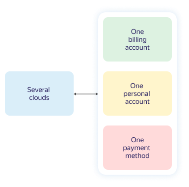

# Billing account

A billing account is used to identify the user paying for resources in Yandex.Cloud.

The billing account can only be linked to one [personal account](personal-account.md) and one cloud. You can use only the payment method which corresponds to the type of billing account and your [agreement](contract.md).

The relationship between the cloud, billing account, personal account, and payment method is shown in the diagram below.

> [!NOTE]
>
> The billing account is not used for the management of Yandex.Cloud resources.
>

## Types of billing accounts {#ba-types}

The type of a billing account determines the Yandex.Cloud resource [payment method](../payment/payment-methods.md).

  ---  

**[!TAB Individual account]**

- Intended for residents of Russia.
- You pay for resources using a bank card.
- Funds for the resources consumed are debited automatically. For more information, see the section [Billing cycle for individuals](../payment/billing-cycle-individual.md).
- Once the funds are debited from your bank card, a [payment receipt](individual-bill.md) is sent to your email address.

**[!TAB Business account]**

- Intended for residents of Russia.
- Resource usage is paid for via bank transfer from a business's bank account or a corporate bank card.
- Payments for the resources consumed are made based on the [agreement](../concepts/contract.md) and [payment invoice](bill.md), or the amount is debited automatically from the linked bank card. For more information, see the section [Billing cycle for businesses](../payment/billing-cycle-business.md).
- A report for services rendered and an invoice are sent to your email address at the beginning of the next reporting period. For more information, see the section [Financial documents](../payment/documents.md).

  ---  

## Validity period {#dates}

The billing account has no validity period.

However, if the use of Yandex.Cloud services is suspended due to outstanding charges and you fail to pay it within sixty days of suspension, all your data, including the billing account, will be permanently blocked and deleted.

## Number of billing accounts {#restrictions}

Each customer is allowed to create only one billing account.

## Account status {#conditions}

The status of your billing account depends on whether you have any outstanding charges resulting from a failure to pay for resource usage.

The table describes the statuses.

| Name | Balance | Reason | Description |
| ----- | ----- | ----- | ----- |
| Unverified | None | When creating the billing account, the **Bank transfer** method was selected. | The status persists until the account is validated by a Yandex.Cloud manager. |
| Active | Positive | There are no outstanding charges for resource usage. | This status is maintained until unpaid usage accumulates. |
| Suspended | Negative | There are outstanding charges for resource usage that was not paid for in time. | The use of the Yandex.Cloud services is suspended. During the suspension period, a fee is charged for data storage services, in addition to a late payment fee.  The maximum data storage period upon suspension is 60 calendar days.  If you pay the entire outstanding amount within 60 calendar days of suspension, your access to resources will be restored within 24 hours. |
| Blocked | Negative | More than 60 calendar days passed after the payment deadline. | Access to the use of the Yandex.Cloud services is blocked.  Within 60 calendar days of blocking access, the system checks whether a payment is made:   - If you pay the entire outstanding amount, your access to resources will be restored within 24 hours.   - If you do not pay the entire outstanding amount, all your data, including the billing account, will be permanently blocked and deleted. |

For more information, see the section [Billing cycle](../payment/billing-cycle.md).

