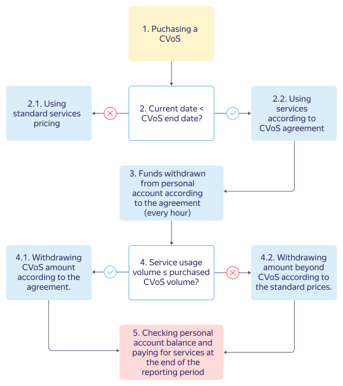
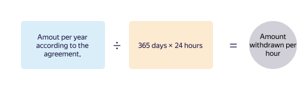
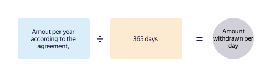
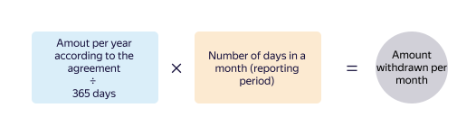

# Committed volume of services





The agreement only provides for a discount on a certain volume of services, but does not guarantee such availability in data centers.



## Discount amount {#amount}

The amount of the guaranteed discount depends on the amount of service resources that you plan to use and the CVoS validity period. The longer the CVoS validity period, the greater the discount. For more information about pricing rules for all services, see the [Pricing](/prices) page. If you have any questions, we'll help you calculate the benefits of committing to a certain volume of resources. Email us at [cloud-sales@yandex-team.ru](mailto:cloud-sales@yandex-team.ru).

## Purchase and validity period {#how-to-enable}

You can view the available offers and purchase a CVoS in the management console under **Commitments**.

When [purchasing a CVoS](../operations/purchase-cvos.md), you choose the following on your own:
* Validity period: 6 months or 1 year.
* Start date: The next calendar day or desired date.

Information about CVoS usage and its expiration is displayed in the management console.



Standard prices apply to {{ yandex-cloud }} services that aren't covered by the CVoS terms. For more information about pricing rules for all services, see the [Pricing](/prices) page.



## Usage and payment {#how-to-pay}

After purchasing the CVoS, the discount on the use of services is applied automatically.

During the selected validity period, you must pay for the CVoS even if you don't use any {{ yandex-cloud }} services. The [payment method](../payment/index.md) depends on your legal status ([billing account type](../concepts/billing-account.md#ba-types)).

See details of using and paying for your CVoS below.

1. You can purchase a CVoS for 6 months or 1 year. The CVoS is valid from the date you selected when purchasing it.
1. The CVoS validity period is verified throughout the entire billing period.

   2.1. If the validity period expired (the current date > the CVoS expiration date), [standard prices](/prices) apply to {{ yandex-cloud }} service usage.

   2.2. If the validity period hasn't expired (the current date < the CVoS expiration date), the terms of the agreement apply to {{ yandex-cloud }} service usage. Go to step 3.

1. Your personal account is charged hourly for the [amount](#formula) pursuant to the agreement, regardless of whether you use any {{ yandex-cloud }} services. Go to step 4.

1. The volume of services used is verified throughout the entire billing period:

   4.1. If the actual volume is less than or equal to the CVoS, the amount is only charged pursuant to the agreement. To calculate the amount charged, use one of the following [formulas](#formula).

   Funds for the use of {{ yandex-cloud }} services that aren't covered by the CVoS terms are charged at the standard prices. Go to step 5.

   4.2. If the actual volume exceeds the CVoS, the difference between the total volume and the CVoS is additionally charged at the [standard prices](/prices). Go to step 5.

1. At the beginning of the next billing period, your personal account balance and payment for the services used are verified: depending on the [billing account type](../concepts/billing-account.md#ba-types), you may be issued an invoice or the linked bank card may be debited. For more information, see [Billing cycle for individuals](../../billing/payment/billing-cycle-individual.md) and [Billing cycle for businesses and individual entrepreneurs](../../billing/payment/billing-cycle-business.md).

## Charged amount {#formula}

The amount charged for the CVoS is determined using the following formulas:



- Amount charged per hour

   

- Amount charged per day

   

- Amount charged per month

   



The total amount charged depends on whether any {{ yandex-cloud }} services that are not covered by the CVoS terms were used during the billing period. For more information, see [How to pay for resources](../payment/index.md).

## Changes and extensions {#how-to-update}

According to the agreement, you may not change the terms of the purchased CVoS, extend it, or cancel it.

However, you can purchase a new CVoS if you have any offers available in the management console. For detailed instructions, see [Purchase a CVoS](../operations/purchase-cvos.md).

## Services that you can purchase a CVoS for {#cvos-services}

Prices for services that you can purchase a CVoS for:
* [{{ mch-name }}](../../managed-clickhouse/pricing.md#cvos)
* [{{ mmy-name }}](../../managed-mysql/pricing.md#cvos)
* [{{ mpg-name }}](../../managed-postgresql/pricing.md#cvos)
* [{{ mrd-name }}](../../managed-redis/pricing.md#cvos)
* [{{ mkf-name }}](../../managed-kafka/pricing.md#cvos)
* [{{ ydb-name }}](../../ydb/pricing/dedicated.md#cvos)
