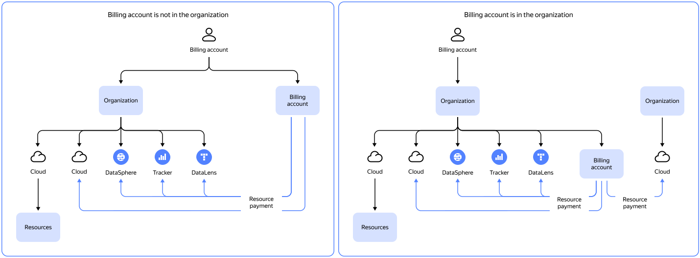

# Organization

_Organization_ is a workspace that combines different types of {{ yandex-cloud }} resources and users.

[Organization](../../organization/quickstart.md) members are [users](../../overview/roles-and-resources.md#users) who belong to an organization and can access the services within it.
Non-member users cannot access the resources within an organization.

The method of working with billing accounts in {{ billing-name }} depends on whether this account is added to an organization.

If a billing account is added to an organization, this organization dictates which cloud resources it can manage. For more information, refer to these sections:

* [Linking a cloud](../operations/pin-cloud.md#bind-cloud-organization)
* [Managing access](../security/index.md)



## Checking if your billing account is added to the organization



If you have questions on how to manage billing accounts in an organization, [submit a request to our support team]({{ link-console-support }}).