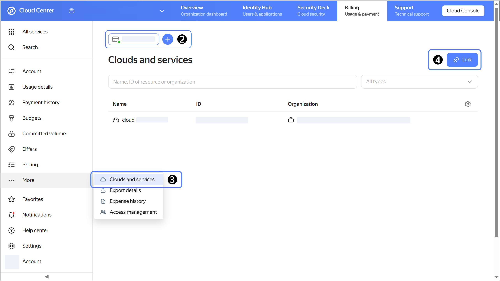
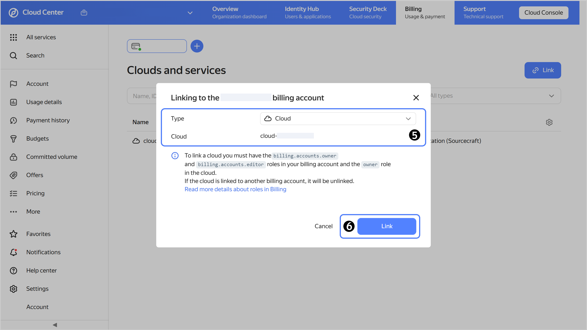

# Linking a cloud to a billing account



## Requirements for linking a cloud {#bind-roles}

Before linking a [cloud](../../resource-manager/concepts/resources-hierarchy.md#cloud), make sure the following conditions are met:
1. [Billing account](../concepts/billing-account.md) has been successfully activated, i.e., its [status](../concepts/billing-account-statuses.md) is `ACTIVE` or `TRIAL_ACTIVE`.
1. The user holds all these [roles](../../iam/concepts/access-control/roles.md) at once:
   * [resource-manager.clouds.owner](../../resource-manager/security/index.md#resource-manager-clouds-owner) for the cloud.
   * [billing.accounts.editor](../security/index.md#billing-accounts-editor) and higher for the billing account.

## Linking a cloud {#bind-cloud}

To link or re-link a cloud to a billing account:



- {{ billing-interface }} {#billing}

  1. 
  1. Select the billing account you want to link the cloud to.
  1. In the left-hand panel, select  **{{ ui-key.yacloud_org.billing.account.entities.label_title }}**.
  1. Click  **{{ ui-key.yacloud_billing.billing.account.bind-cloud.button_bind }}** in the top-right corner.

     

  1. In the **{{ ui-key.yacloud_org.billing.account.entities.label_type }}** field, pick the entity type you need from the list and select the resource to link to the billing account.
  1. Click **{{ ui-key.yacloud_billing.billing.account.bind-cloud.button_bind }}**; the cloud or service you added will appear in the list.
  1. If you are re-linking the cloud, pay any outstanding charges on the old billing account.

      

- {{ TF }} {#tf}

  

  To link a cloud, the [service account](../../iam/concepts/users/service-accounts.md) must have the `billing.accounts.editor` [role](../security/index.md#set-role) or higher for the billing account you are linking your cloud to.

  To link a cloud to a billing account:

  1. In the configuration file, describe the resources you want to create:

     ```hcl
     resource "yandex_billing_cloud_binding" "mycloud" {
       billing_account_id = "<billing_account_ID>"
       cloud_id           = "<cloud_ID>"
     }
     ```

     Where:
     * `billing_account_id`: ID of the billing account to link the cloud to.
     * `cloud_id`: ID of the cloud you want to link to the billing account.

     For more information about `yandex_billing_cloud_binding` properties, see [this {{ TF }} provider guide]({{ tf-provider-resources-link }}/billing_cloud_binding).
  1. Create the resources:

     

  After that, the cloud will be linked to the billing account. You can check that the cloud is linked to the account on the billing account page in [{{ billing-name }}]({{ link-console-billing }}).

- API {#api}

  To link a cloud, use the [bindBillableObject](../api-ref/BillingAccount/bindBillableObject.md) REST API method for the [BillingAccount](../api-ref/BillingAccount/index.md) resource or the [BillingAccountService/BindBillableObject](../api-ref/grpc/BillingAccount/bindBillableObject.md) gRPC API call.



If you want to stop using the old billing account, make sure it is on the free **Basic** service plan to avoid having your balance further debited. Otherwise, you will continue to be billed for the paid plan even if the account has no linked clouds.



Linking a cloud or another container to a [suspended account](../concepts/billing-account-statuses.md) will stop all your resources.



## Resource management in organizations {#bind-cloud-organization}

1. 
1. 
