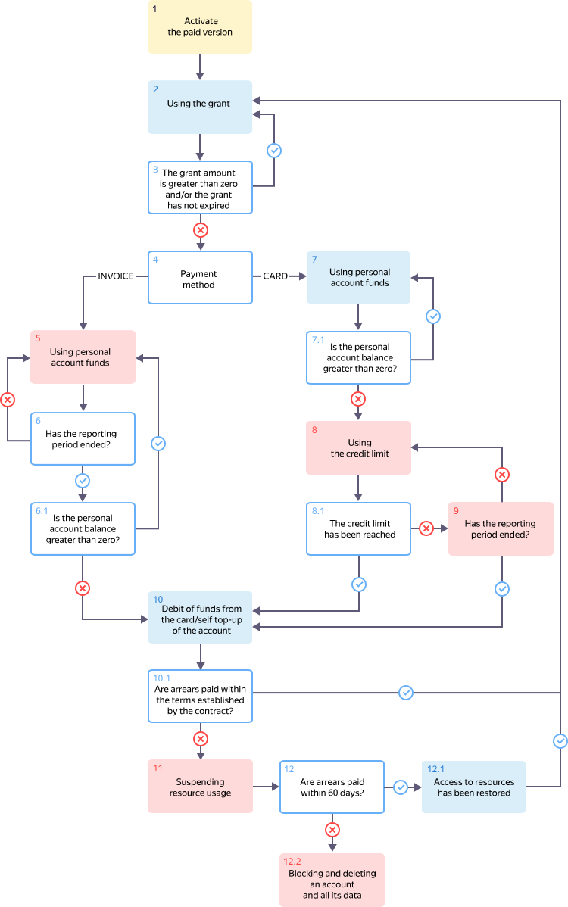

# Billing cycle for businesses and individual entrepreneurs

The diagram shows the cycle of issuing and paying invoices for businesses and individual entrepreneurs, as well as suspending and blocking access to the use of resources.

1. You [activate the paid version](../operations/activate-commercial.md) before the [trial period](../../billing/concepts/trial-period.md) expires.

   

1. If you get a grant, you use it. The grant amount is reduced progressively as you consume the resources of {{ yandex-cloud }} services.

1. The grant amount and validity period are checked throughout the reporting period.

   * If the grant amount is greater than zero and the grant has not expired, go back to step 2.
   * If the grant has expired or the grant amount is zero, go to step 4.

1. The payment method is verified:

   * If you are paying for resources from a bank account, go to step 5.
   * If you are paying for resources with a card, go to step 7.

1. You consume and pay for the use of {{ yandex-cloud }} resources at the end of each reporting period, and a [billing threshold](../concepts/billing-threshold.md) is not provided.

1. Verification is performed to check whether it is past the end of the reporting period:

   * If the reporting period has not ended yet, go back to step 5.
   * If a reporting period has ended, a [report](../concepts/act.md) and an [invoice](../concepts/invoice.md) are generated. Copies of these documents will be sent to the email address of the billing account owner. Go to step 6.1.

   1. At the end of the reporting period, your personal account balance is checked:

      * If the balance is positive, go back to step 5.
      * If the balance is negative, go to step 10.

1. Your [personal account balance](../concepts/personal-account.md#balance) decreases as {{ yandex-cloud }} service resources are consumed.

   1. Your personal account balance is checked throughout the reporting period.

      * If the balance is positive, go back to step 7.
      * If the balance is negative, go to step 8.

1. [Your billing threshold](../concepts/billing-threshold.md) is used. Your billing threshold is valid for a calendar month.

   1. The billing threshold amount and validity period are checked:

      * If your billing threshold is used up or has expired, go to step 10.
      * Otherwise, go back to step 9.

1. Verification is performed to check whether it is past the end of the reporting period:

   * If the reporting period has not ended yet, go back to step 8.
   * If a reporting period has ended, a [report](../concepts/act.md) and an [invoice](../concepts/invoice.md) are generated. Copies of these documents will be sent to the email address of the billing account owner. Go to step 10.

1. Payment is made for consumed {{ yandex-cloud }} resources:

   * [Top up](../operations/pay-the-bill.md) your personal account to a positive value within the deadline stipulated in the agreement.
   * If there is a bank card linked to your billing account, the system [calculates](payment-methods-card-business.md#payment-amount) the total amount due and debits it from the linked bank card.

   

   1. Payment for used resources is verified:

      * If you top up your personal account before the deadline stipulated in the agreement or the funds are debited from the linked bank card within one day, go back to step 2.
      * If your bank card balance is insufficient on the day when funds are to be debited and you fail to [top up](../operations/pay-the-bill.md) your personal account manually, another attempt to charge your card will be made later.
      * If you didn't top up your personal account, you don't have a linked bank card, or the funds could not be debited from any of your bank cards, {{ yandex-cloud }} reserves the right to change the status of your billing account to [SUSPENDED](../concepts/billing-account-statuses.md). Go to step 11.

         

1. If your account is in arrears, the use of {{ yandex-cloud }} resources may be suspended:

   * Your VM instances and DB clusters will be stopped completely.
   * You will not be able to read or download any saved data.

   During the suspension period, you will be charged the cost of data storage services and a late payment fee. Go to step 12.

1. Payment of the entire outstanding amount is checked throughout the 60-day suspension period:

   1. If you pay off the amount due during this time, access to resources is restored within 24 hours. The billing account status will be changed to [ACTIVE](../concepts/billing-account-statuses.md). Go back to step 2.

   1. Otherwise, access to {{ yandex-cloud }} services may be permanently blocked. All your data, including your [billing account](../concepts/billing-account.md), will be permanently deleted.



#### See also

* [Grant](../concepts/bonus-account.md)
* [Billing threshold](../concepts/billing-threshold.md)
* [Personal account](../concepts/personal-account.md)
* [Billing account](../concepts/billing-account.md)