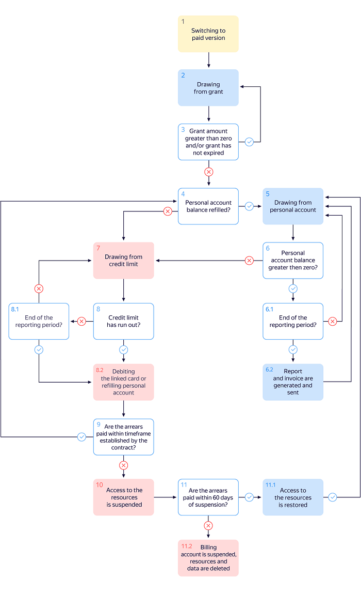

# Billing cycle for businesses

The diagrams show the cycle of issuing and paying bills for businesses, as well as suspending and blocking access to the use of resources.

--- 

**[!TAB I don't use the credit limit]**

1. You [activate the paid version](../operations/activate-commercial.md) before the end of the trial period.
 If you did not spend the entire amount of the [initial grant](../concepts/bonus-account.md), you can use the remaining amount after upgrading to the paid version.

1. If you are awarded a grant, you use it. The grant amount is reduced as the resources of Yandex.Cloud services are consumed.

1. The grant amount and its validity period is verified during the entire billing period.  See the table below.

   | Grant amount | Description |
   | ----- | ----- |
   | Greater than zero | If it is still valid, go back to step 2.  If it has expired, go to step 4. |
   | Equal to zero | Go to step 4 (regardless of the grant's validity). |

1. You need to [top up](../operations/pay-the-bill.md) your personal account:
   - If you top up your personal account, go to step 5.
   - If you do not top up your personal account, go to step 7.

1. You use the Yandex.Cloud resources. [The personal account balance](../concepts/personal-account.md#balance) decreases as resource usage increases. Go to step 6.

1. Your personal account balance is checked throughout the billing period.  See the table below.

   | Balance | Description |
   | ----- | ----- |
   | Greater than zero | 6.1. If the billing period has not ended yet, go back to step 5.  6.2. If the billing period has ended, a [report](../concepts/act.md) and [invoice](../concepts/invoice.md) are generated. Copies of these documents will be sent to the email address of the billing account owner.
 Go back to step 5. |
   | Equal to zero | Go back to step 4. |

1. The use of the Yandex.Cloud services may be suspended:
   - Your VM instances and DB clusters will be stopped completely.
   - You will not be able to read or download any saved data.

   The billing account status will be changed to [Suspended](../concepts/billing-account.md#conditions). During the suspension period, a fee is charged for data storage services, in addition to a late payment fee. Go to step 8.

1. Payment of the entire outstanding amount is verified within 60 days of suspension:
 8.1. If you pay the entire outstanding amount during this period, access to resources is restored within 24 hours. The billing account status will be changed to [Active](../concepts/billing-account.md#conditions). Go back to step 5.
 8.2. Otherwise, access to the use of Yandex.Cloud services may be permanently blocked. All your data, including your [billing account](../concepts/billing-account.md), will be permanently deleted.

**[!TAB I use the credit limit]**

1. You [activate the paid version](../operations/activate-commercial.md) before the end of the trial period.
 If you did not spend the entire amount of the [initial grant](../concepts/bonus-account.md), you can use the remaining amount after upgrading to the paid version.

1. If you are awarded a grant, you use it. The grant amount is reduced as the resources of Yandex.Cloud services are consumed.

1. The grant amount and its validity period is verified during the entire billing period.  See the table below.

   | Grant amount | Description |
   | ----- | ----- |
   | Greater than zero | If it is still valid, go back to step 2.  If it has expired, go to step 4. |
   | Equal to zero | Go to step 4 (regardless of the grant's validity). |

1. You need to [top up](../operations/pay-the-bill.md) your personal account:
   - If you have topped up your personal account, go to step 5.
   - If you have not topped your personal account, go to step 7.

1. You use the Yandex.Cloud resources. [The personal account balance](../concepts/personal-account.md#balance) decreases as resource usage increases. Go to step 6.

1. Your personal account balance is checked throughout the billing period.  See the table below.

    | Balance | Description |
    | ----- | ----- |
    | Greater than zero | 6.1. If the billing period has not ended yet, go back to step 5.  6.2. If the billing period has ended, a [report](../concepts/act.md) and [invoice](../concepts/invoice.md) are generated. Copies of these documents will be sent to the email address of the billing account owner.
 Go back to step 5. |
    | Less than zero | Go to step 7. |

1. You have used the [credit limit](../concepts/credit-limit.md) and there are outstanding charges. Go to step 8.

1. Your personal account balance is checked throughout the billing period:

     | Balance | Description |
     | ----- | ----- |
     | Credit limit not reached | 8.1. If the billing period has not ended, go back to step 7 or [top up](../operations/pay-the-bill.md) your personal account (step 4).
  8.2. If the billing period has ended:   - [Top up](../operations/pay-the-bill.md) your personal account to a positive value within the deadline stipulated in the agreement. Go to step 4.   - Otherwise, Yandex.Cloud reserves the right to change the status of your billing account to [Suspended](../concepts/billing-account.md#conditions). For more information, see step 9. |
     | Credit limit reached | Yandex.Cloud reserves the right to change the status of your billing account to [Suspended](../concepts/billing-account.md#conditions). For more information, see step 9. |

1. The use of the Yandex.Cloud services may be suspended if there are outstanding charges:
   - Your VM instances and DB clusters will be stopped completely.
   - You will not be able to read or download any saved data.

    During the suspension period, a fee is charged for data storage services, in addition to a late payment fee. Go to step 10.

1. Payment of the entire outstanding amount is verified within 60 days of suspension:
 10.1. If you pay the entire outstanding amount during this period, access to resources is restored within 24 hours. The billing account status will be changed to [Active](../concepts/billing-account.md#conditions). Go back to step 4.
 10.2. Otherwise, access to the use of Yandex.Cloud services may be permanently blocked. All your data, including your [billing account](../concepts/billing-account.md), will be permanently deleted.

--- 

  [!INCLUDE [blocked-note](../_includes/blocked-note.md)]

