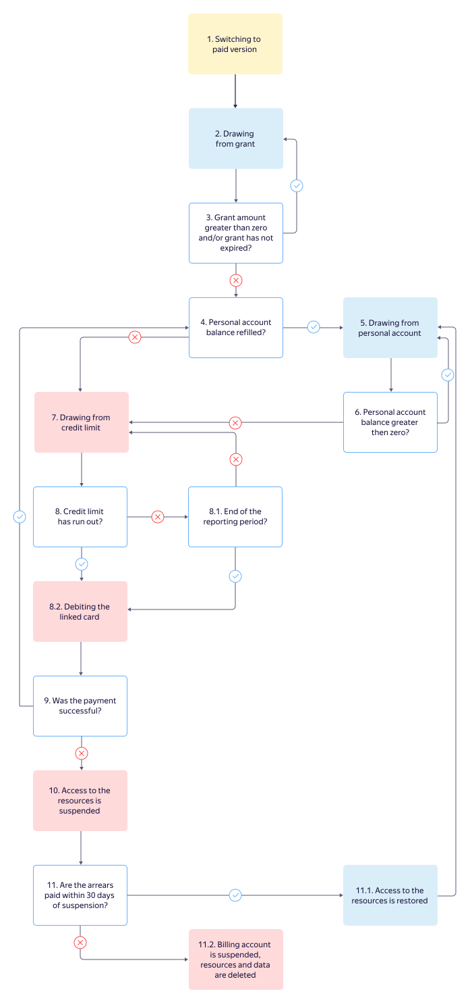

# Billing cycle for individuals



The diagram shows the cycle of debiting an individual's bank card, as well as suspending and blocking the use of resources.

1. You create a paid account.
1. If you get a grant, you are free to use it. The grant amount is reduced progressively as you consume the resources of {{ yandex-cloud }} services.
1. The grant amount and validity period are checked throughout the reporting period.  They are described in the table below.

   | Grant amount | Description |
   ----- | -----
   | Greater than zero | If it is still valid, go back to step 2.  If it has expired, go to step 4. |
   | Equal to zero | Go to step 4 (regardless of the grant's validity). |

1. You need to [top up](../operations/pay-the-bill.md) your personal account:
   - If you have topped up your personal account, go to step 5.
   - If you have not topped up your personal account, go to step 7.
1. You consume {{ yandex-cloud }} service resources. The [personal account balance](../concepts/personal-account.md#balance) decreases as resources are consumed. Go to step 6.
1. Your personal account balance is checked throughout the reporting period.

   - If the balance is positive, go back to step 5.
   - If the balance is negative, go to step 7.

1. You've used the [billing threshold](../concepts/billing-threshold.md) and there are outstanding charges. Go to step 8.
1. Your personal account balance is checked throughout the reporting period.

   8.1. If the billing threshold has not been reached and the reporting period has not ended, go back to step 7 or [top up](../operations/pay-the-bill.md) your personal account (step 4).
    8.2. If the reporting period has ended, the system [calculates](payment-methods-individual.md#payment-amount) the total amount due and submits a charge to the linked bank card. Go to step 9.

   

1. Verification of payment for consumed resources:
   - If the funds are debited from the bank card within one day, go back to step 4.
   - If your bank card balance is insufficient on the day when funds are to be debited and you failed to [top up](../operations/pay-the-bill.md) your personal account, the debit transaction will be repeated later. If the funds cannot be debited within one day, they may be debited from one of the bank cards linked to your Yandex account.  If the funds cannot be debited from any of your bank cards, {{ yandex-cloud }} reserves the right to change the status of your billing account to [PAYMENT_REQUIRED](../concepts/billing-account-statuses.md). For more information, see step 10.

      

1. The use of {{ yandex-cloud }} services may be suspended if there are outstanding charges:
   - Your VM instances and DB clusters will be stopped completely.
   - You will not be able to read or download any saved data.

   During the suspension period, a fee is charged for data storage services, in addition to a late payment fee. Go to step 11.
1. Payment of the entire outstanding amount is checked throughout the 60-day suspension period:

   11.1. If you pay off the amount due during this time, access to resources is restored within 24 hours. The billing account status will be changed to [ACTIVE](../concepts/billing-account-statuses.md). Go back to step 2.
    11.2. Otherwise, access to {{ yandex-cloud }} services may be permanently blocked. All your data, including your [billing account](../concepts/billing-account.md), will be permanently deleted.

   

#### See also {#see-also}

- [Grant](../concepts/bonus-account.md)
- [Billing threshold](../concepts/billing-threshold.md)
- [Personal account](../concepts/personal-account.md)
- [Billing account](../concepts/billing-account.md)
- [How to deactivate a subscription](../qa/all.md#delete-account)