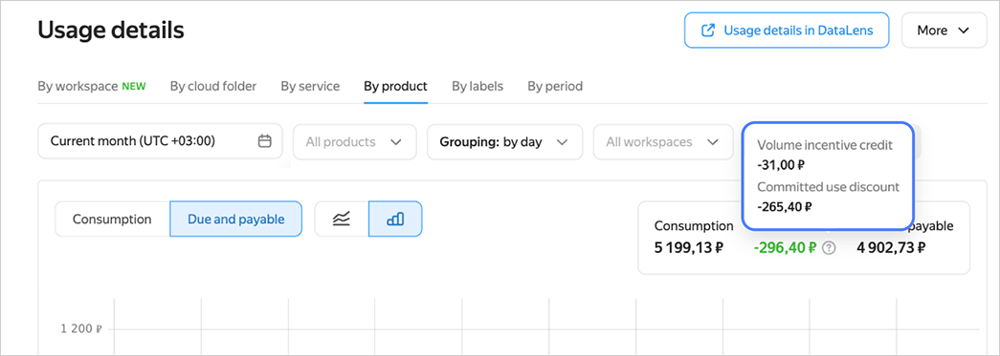
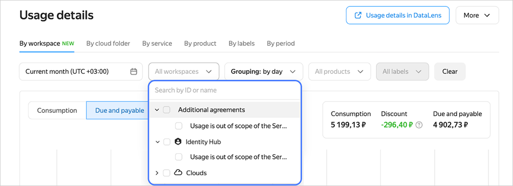
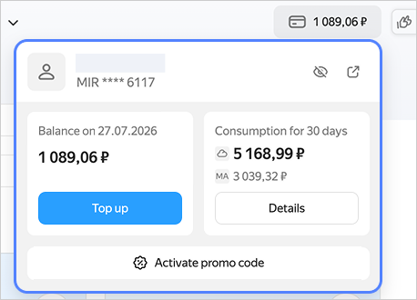
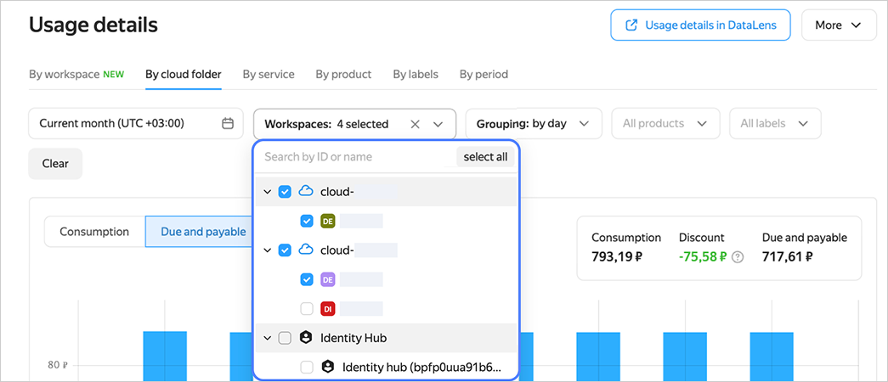
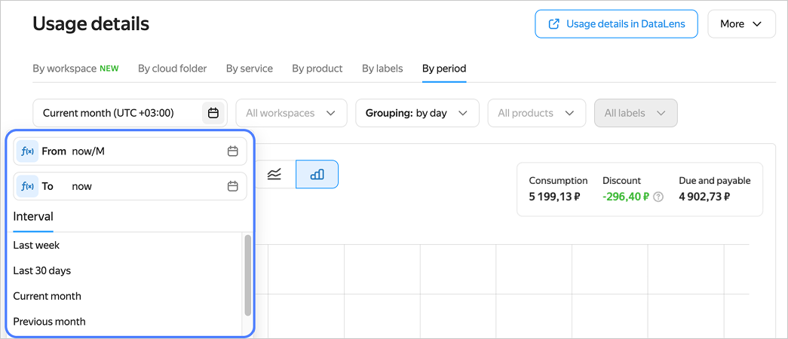

# {{ billing-name }} release notes



This article only covers changes in **Usage details**.



## Usage details {#usage-details}

### Q2 2026 {#q2-2026}

* Now you can view a detailed usage breakdown by [discounts](./operations/check-charges.md#discount).

    

* Upgraded the tab with cloud usage details to display usage details for workspaces. It enables you to [view](./operations/check-charges.md#instances) usage details across clouds, off-cloud consumption services, and additional agreements.

    

* Implemented [on-demand re-export](./operations/get-folder-report.md#additional-export) of detailed usage data. Now you can export historical data without creating a new scheduled export.
* Revised logic for displaying your committed volume of services. For more information, see [Displaying the committed volume of services](./operations/check-charges.md#cvos).
* Improved the display of the cost and usage summary card; updated the default filters.
* Revised the logic for displaying [usage details](./operations/check-charges.md#labels) by labels. Now selecting a label displays the cost of each resource associated with that label. If you select multiple labels assigned to the same resource, that resource’s cost may be duplicated.
* Added the ability to [view details](./operations/check-charges.md#console_1) via a widget in the management console. Added the `billing.usagerecords.admin` role to access the widget in the management console.

    

### Q1 2026 {#q1-2026}

* Now you can [view](./operations/check-charges.md) your usage details across multiple clouds and folders simultaneously.

    

* Now you can view usage details by [time period](./operations/check-charges.md#periods_1).

    

* Revised the logic for viewing usage details by [labels](../resource-manager/concepts/labels.md). Now usage details filtered by labels are sorted by label creation date, not resources.
* Now you can [export](./operations/get-folder-report.md) historical usage details to an {{ objstorage-name }} [bucket](../storage/concepts/bucket.md), including [encrypted](../storage/concepts/encryption.md) buckets.
* Added support for saving filter values in {{ billing-interface }} on every update.
