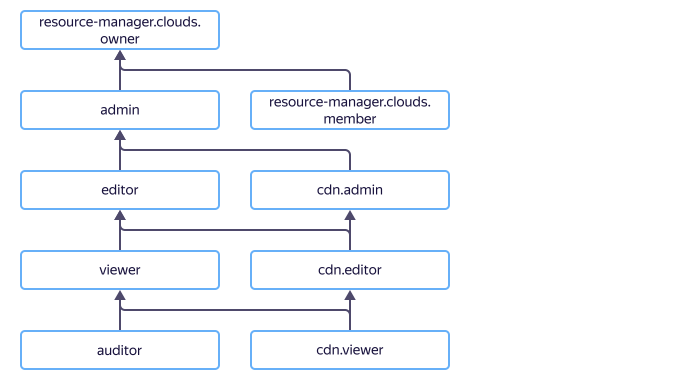

# Access management in {{ cdn-name }}

In this section, you'll learn:

* [What resources you can assign roles to](#resources).
* [What roles exist in the service](#roles-list).
* [What roles are required](#required-roles) for particular actions.



## What resources you can assign roles to {#resources}



## What roles exist in the service {#roles-list}

The diagram shows which roles are available in the service and how they inherit each other's permissions. For example, the `editor` role includes all `viewer` role permissions. A description of each role is given under the diagram.

Active roles in the service:

* Service roles:
    * 
    * 
    * 

* Primitive roles:
    * 
    * 
    * 

## What roles do I need {#required-roles}

The table below lists the roles needed to perform a given action. You can always assign a role granting more permissions than the role specified. For example, you can assign `editor` instead of `viewer`.

| Action | Required roles |
| -------- | -------- |
| **View data** |
| View information about any resource | `cdn.viewer` for this resource |
| **Manage CDN resources** |
| [Create a resource](../operations/resources/create-resource.md) | `cdn.editor` for the folder where the resources will be created |
| [Change a resource's basic settings](../operations/resources/configure-basics.md) | `cdn.editor` for the folder with CDN resources |
| [Disable a resource](../operations/resources/disable-resource.md) | `cdn.editor` for the folder with CDN resources |
| [Configure resource caching](../operations/resources/configure-caching.md) | `cdn.editor` for the folder with CDN resources |
| [Pre-fetch files to CDN servers](../operations/resources/prefetch-files.md) | `cdn.editor` for the folder with CDN resources |
| [Clear a resource cache](../operations/resources/purge-cache.md) | `cdn.editor` for the folder with CDN resources |
| [Configure HTTP Request and Response headers](../operations/resources/configure-headers.md) | `cdn.editor` for the folder with CDN resources |
| [Configure CORS responses to clients](../operations/resources/configure-cors.md) | `cdn.editor` for the folder with CDN resources |
| [Configure HTTP methods](../operations/resources/configure-http.md) | `cdn.editor` for the folder with CDN resources |
| [Enable file compression](../operations/resources/enable-compression.md) | `cdn.editor` for the folder with CDN resources |
| [Enable file segmentation](../operations/resources/enable-segmentation.md) | `cdn.editor` for the folder with CDN resources |
| **Manage origin groups** |
| [Create an origin group](../operations/origin-groups/create-group.md) | `cdn.editor` for the folder with an origin group |
| [Change an origin group](../operations/origin-groups/edit-group.md) | `cdn.editor` for the folder with an origin group |
| [Connect an origin group to a resource](../operations/origin-groups/bind-group-to-resource.md) | `cdn.editor` for the folder with the CDN resource |
| [Delete an origin group](../operations/origin-groups/delete-group.md) | `cdn.editor` for the folder with an origin group |
| **Manage paid features** |
| Origin shielding | `cdn.editor` for the folder with CDN resources |
| Exporting logs | `cdn.editor` for the folder with CDN resources |
| **Manage resource access** |
| [Assign](../../iam/operations/roles/grant.md), [revoke](../../iam/operations/roles/revoke.md), and view roles granted for the resource | `admin` for the resource |

#### What's next

* [How to assign a role](../../iam/operations/roles/grant.md).
* [How to revoke a role](../../iam/operations/roles/revoke.md).
* [Learn more about access management in {{ yandex-cloud }}](../../iam/concepts/access-control/index.md).
* [Learn more about role inheritance](../../resource-manager/concepts/resources-hierarchy.md#access-rights-inheritance).

