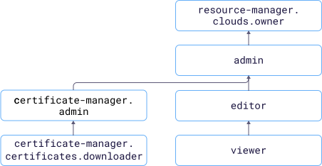

# Access management in {{ certificate-manager-name }}

In this section, you will learn:
* [What resources you can assign a role for](#resources).
* [What roles exist in the service](#roles-list).
* [What roles are required](#choosing-roles) for particular actions.



To assign a role for a resource, a user needs the `certificate-manager.admin` role or one of the following roles for that resource:



## Resources you can assign a role for {#resources}



You can assign a role for a [custom certificate](../concepts/imported-certificate.md) via the {{ yandex-cloud }} [CLI](../../cli/cli-ref/certificate-manager/cli-ref/certificate/add-access-binding.md) or [API](../api-ref/authentication.md).

## Roles existing in this service {#roles-list}



### Service roles {#service-roles}

#### certificate-manager.auditor {#certificate-manager-auditor}



#### certificate-manager.viewer {#certificate-manager-viewer}



#### certificate-manager.editor {#certificate-manager.editor}



#### certificate-manager.admin {#certificate-manager-admin}



#### certificate-manager.certificates.downloader {#certificate-manager-certificates-downloader}



### Primitive roles {#primitive-roles}





## What roles do I need {#choosing-roles}

The table below lists the roles required to perform a particular action. You can always assign a role offering more permissions than the one specified. For example, you can assign the `editor` role instead of `viewer`.

Action | Methods | Required roles
----- | ----- | -----
**Certificate Manager** | | 
Getting lists of certificates | `list` | `viewer` for folder
Get certificate details | `get` | `viewer` for certificate or folder
[Adding](../operations/managed/cert-create.md) a Let's Encrypt certificate | `requestNew` | `editor` for folder
[Updating](../operations/managed/cert-modify.md) and [deleting](../operations/managed/cert-delete.md) a Let's Encrypt certificate | `update`, `delete` | `editor` for certificate or folder
[Adding](../operations/import/cert-create.md) a custom certificate | `create` | `editor` for folder
[Renewing](../operations/import/cert-update.md), [updating](../operations/import/cert-modify.md), or [deleting](../operations/import/cert-delete.md) a custom certificate | `update`, `delete` | `editor` for certificate or folder
Getting the contents of a [custom certificate](../operations/import/cert-get-content.md) or [Let's Encrypt certificate](../operations/managed/cert-get-content.md) | `get-content` | `certificate-manager.certificates.downloader` for certificate or folder
**IAM** | |
[Assigning a role](../../iam/operations/roles/grant.md), [revoking a role](../../iam/operations/roles/revoke.md), and viewing the roles assigned for a folder or cloud | `setAccessBinding`, `updateAccessBindings`, `listAccessBindings` | `admin` or `certificate-manager.admin` for certificate or folder 

#### What's next {what-is-next}

* [How to assign a role](../../iam/operations/roles/grant.md).
* [How to revoke a role](../../iam/operations/roles/revoke.md).
* [Learn more about access management in {{ yandex-cloud }}](../../iam/concepts/access-control/index.md).
* [Learn more about inheriting roles](../../resource-manager/concepts/resources-hierarchy.md#access-rights-inheritance).
