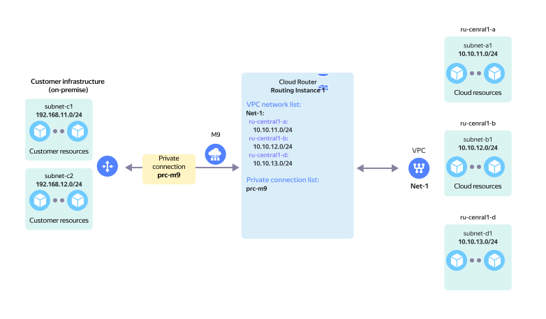

# On-prem without redundancy and 1 VPC

Non-reserved on-prem connection via a single {{ interconnect-name }} [private connection](../../interconnect/concepts/priv-con.md) to a single `RI` with a single [VPC cloud network](../../vpc/concepts/network.md).

The network topology is presented on the diagram in the following configuration:

* `On-Prem` client with two local subnets: `subnet-c1` and `subnet-c2`.
* On-prem network hardware connects to the {{ yandex-cloud }} network hardware via [{{ interconnect-name }}](../../interconnect/concepts/index.md).
* `prc-m9` [private connection](../../interconnect/concepts/priv-con.md) established via the `M9` [point of presence](../../interconnect/concepts/pops.md) connects to `RI` in {{ yandex-cloud }}.
* On the {{ yandex-cloud }} side, the `Net-1` virtual network comprised of three subnets, `subnet-a1`, `subnet-b1`, and `subnet-d1`, connects to `RI`.

This topology enables network connectivity between `On-Prem` subnets and `Net-1` VPC subnets.

