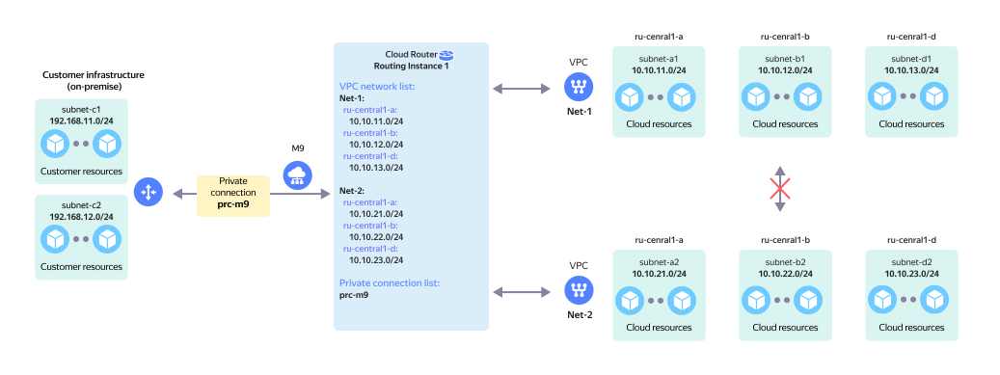

# On-prem without redundancy and multiple VPCs

Non-reserved on-prem connection via a single {{ interconnect-name }} [private connection](../../vpc/concepts/network.md) to a single `RI` with two or more [cloud networks](../../interconnect/concepts/priv-con.md) without network connectivity between them.

The network topology is presented on the diagram in the following configuration:

* `On-Prem` client with two local subnets: `subnet-c1` and `subnet-c2`.
* The on-prem network hardware is connected to the {{ yandex-cloud }} network hardware using [{{ interconnect-name }}](../../interconnect/concepts/index.md).
* The `prc-m9` [private connection](../../interconnect/concepts/priv-con.md) via the `M9` [point of presence](../../interconnect/concepts/pops.md) connects to `RI` in {{ yandex-cloud }}.
* Two virtual networks connect to `RI` on the {{ yandex-cloud }} side:
  * `Net-1` comprised of three subnets: `subnet-a1`, `subnet-b1`, and `subnet-d1`.
  * `Net-2` comprised of three subnets: `subnet-a2`, `subnet-b2`, and `subnet-d2`.

This topology enables network connectivity between:

* `On-Prem` subnets and `Net-1` VPC subnets `subnet-a1`, `subnet-b1`, and `subnet-d1`.
* `On-Prem` subnets and `Net-2` VPC subnets `subnet-a2`, `subnet-b2`, and `subnet-d2`.

This topology enables network connectivity between `Net-1` and `Net-2` virtual networks subnets.

